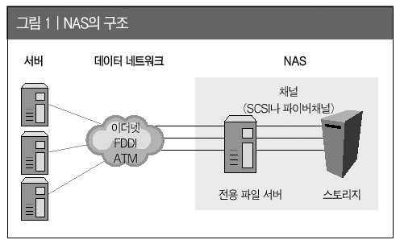

# NAS

NAS(Network-Attatched Storage) 네트워크 결합 스토리지는 네트워크로 연결된 하드를 말한다. 쉽게 말해 하드와 인터넷이 결합되어 서버의 형태로 내부, 외부에서 하드에 접속하여 데이터를 보관, 수정, 관리할 수 있는 하나의 서버이다.

NAS는 보통 소규모팀단위 or 개인이 많이 사용하며, 하나의 물리공간을 마련해 자료 공유를 목적으로 구성하게된다.

- 예) ep서버 1번기, 2번기에서 생성되는 EP파일을 NAS를 통해 외부에 공유

NAS는 말 그대로 네트워크믕을 통해 내부 또는 외부까지 공유되어야하므로, **고유한 주소**를 가져야한다. 고유한 주소란 IP가 고정되어 해당 NAS가 어느 IP에 있는지 확인할 수 있어야한다.

NAS의 속도는 CPU/RAM/HDD/인터페이스/인터넷 속도에 영향을 받는다.

- CPU와 RAM의 성능에 따라 다중 접속자가 발생해도 처리 속도, 전송속도가 떨어지지 않도록 할 수 있다. 
- HDD와 인터페이스는 실제 데이터 파일 업로드/다운로드시 속도에 영향을 준다.
- 인터넷 속도에 따라 외부접속속도가 좌우된다.

## 장점

1. 24시간 가동됨에도 전력 소모가 적다
2. 파일들을 한 공간에서 관리할 수 있다.
3. 한 공간에 저장된 파일을 여러명이 접속해 공유할 수 있다.
4. 외부에서도 접속이 가능하다.
5. PC뿐만 아니라 모바일기기 및 네트워크로 접속된 기기에서 NAS 접근이 가능하다.
6. 레이드로 묶어 하드디스크의 성능과 안정성을 향상시킬 수 있다.
7. 다양한 서비스와 기능을 지원한다.

## 참고

- [https://crone.tistory.com/82](https://crone.tistory.com/82)
- [나스의 모든것-NAS란](https://m.blog.naver.com/PostView.nhn?blogId=gineers&logNo=220732914364&proxyReferer=https:%2F%2Fwww.google.com%2F)

