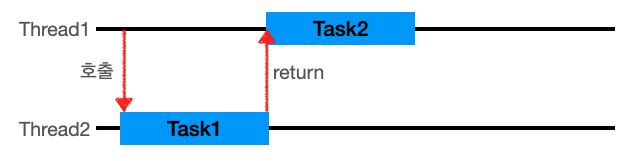
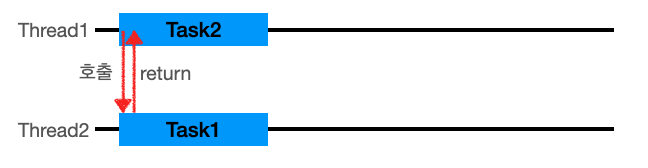

#  동기/비동기와 블록킹/논블록킹

## Synchronous/Asynchronous

### 동기(Synchronous)

- Syn(together) + chrono(time) : 동시에 일어나는

```
A --------------------> A
B --------------------> B
```

A와 B가 시작시간 또는 종료시간이 일치하면 동기이다.

- A, B 쓰레드가 **동시에 작업을 시작하면 동기**(CyclicBarrier)
- A, B가 **동시에 작업이 끝나면 동기**
- 메소드 **리턴시간와 결과를 전달받는 시간이 일치**하면 동기



- Task1이 끝나는 시간과 Task2가 시작하는 시간이 같으면 동기
  - 작업 요청을 했을 때 요청의 결과 값(return)을 직접 받는 것
  - 이때, 요청의 결과 값이 return값과 동일하다.
  - synchronized, BlockingQueue

### 비동기(Asynchronous)

- **A** + syn(together) + chrono(time) : 동시에 일어나지 않는

```
A --------------------> A
	B -----------> B
A --------------------> A
				B -----------> B
```

A와 B가 서로의 시작, 종료 시간과는 관계 없이 별도의 수행 시작/종료시간을 가지고 있는 경우



- Thread1이 Task1을 수행하고, Task1이 완료되길 기다리지 않고 Task2를 처리할 수 있다.
- 작업 요청시 요청의 결과값을 간접적으로 받는 것이며, 요청의 결과값이 return값과 다를 수 있다.
- Task1, Task2는 별도의 쓰레드에서 실행하게 된다.

## Blocking/Non-Blocking

직접 제어할 수 없는 대상을 상대하는 방법으로 즉, 다른 작업을 수행하는 주체를 어떻게 상대하는 지가 중요하다.

- 대상이 IO/멀티쓰레드 동기화 등 제한적이다.

### Blocking

자신의 작업을 하다가 다른 작업 주체가 하는 작업의 시작부터 끝까지 기다렸다가 다시 자신의 작업을 시작한다면 이는 블로킹이다.

- 호출된 함수가 자신의 작업을 모두 마칠 때까지 호출한 함수에게 제어권을 넘겨주지 않고 대기하게 만든다면 blocking

### Non-Blocking

다른 주체의 작업과 관계없이 자신의 작업을 계속한다면 이는 논블로킹이다.

- 호출된 함수가 바로 return해서 호출한 함수에게 제어권을 넘겨주고 호출한 함수가 다른 일을 할 수 있는 기회를 줄 수 있으면 non-blocking

## 동기/비동기와 블로킹/논블로킹의 조합


### Synchronous + Blocking

- 동기 : 두 개 이상의 작업의 시작시간, 종료시간이 같거나 시작과 동시에 종료할 것
- 블로킹 : 다른 작업을 하는 동안 자신의 작업을 일시정지할 것

위 두가지를 만족하는 예는 다음과 같다.

- JDBC를 이용해 DB에 쿼리 질의를 날린다.
- 메서드에서 다른 메서드를 호출하여 결과값을 즉시 받아온다.

### Asynchronous + Blocking

- 비동기 : 다른 작업과 시작, 종료 시간을 맞추지 말 것
- 블로킹 : 다른 작업의 주체가 작업하는동안 기다릴 것

비동기 + 블로킹 조합은 결국 다른 작업이 끝날 때까지 기다려야하므로 동기 + 블로킹과 비슷한 작업 효율이 나온다.

### Synchronous + Non-Blocking

- 동기 : 두 개 이상의 작업의 시작시간, 종료시간이 같거나 시작과 동시에 종료할 것
- 논블로킹 : 다른 작업의 주체가 작업하는동안 기다리지 말 것

이는 논블로킹으로 자신의 작업을 계속하고 있지만 다른 작업과의 동기를 위해서 계속해서 작업이 끝났는지 조회한다.

### Asynchronous + Non-Blocking

- 비동기 : 다른 작업과 시작, 종료 시간을 맞추지 말 것
- 논블로킹 : 다른 작업의 주체가 작업하는동안 기다리지 말 것

자신의 작업이 멈추지도 않고, 다른 주차게 하는 작업의 결과가 나왔을 때 콜백을 설정하기도 한다.
다른 주체에게 작업을 맡겨두고 자신이 하던 일을 계속할 수 잇으므로, 해야할 작업이 대규모이고 동기가 필요하지 않을 때 효과적이다.

- 대규모 사용자에게 푸시 메세지 전송
- 다양한 외부 API한번에 호출

### 아래 코드는 뭘까?

```java
ExecutorService es = Executors.newCachedThreadPool();

String res = es.submit(() -> "Hello Async").get();
```

- `es.submit(() -> "Hello Async")` : 비동기
  - 메소드 리턴 시간과 Callable의 실행 결과를 받는 시간이 일치하지 않음
  - Blocking/Non-Blocking은 고려 대상아님
- `.get()` : 동기/블록킹
  - 메소드 리턴 시간과 결과를 가져오는 시간이 일치
  - 다른 쓰레드 작업이 완료될 때까지 대기

## 참고

- [https://deveric.tistory.com/99](https://deveric.tistory.com/99)
- [스프링캠프 2017 [Day1 A2] : Async & Spring](https://youtu.be/HKlUvCv9hvA)