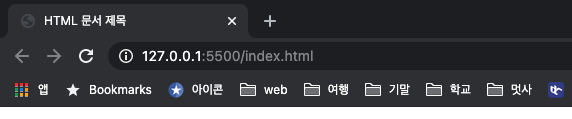

# HTML Basic

## HTML이란

* **HTML**\(**H**yper**T**ext **M**arkup **L**anguage\) : 웹에서 자유롭게 오갈 수 있는 웹문서를 만드는 언어.

* 웹표준 : 웹 사이트를 만들 때 지켜야 할 약속들을 정리한 것.

  * 일반 사용자는 장소와 브라우저에 상관없이 쉽게 웹사이트를 볼 수 있음.
  * 웹 개발자와 디자이너는 시간을 절약.

* HTML5 & CSS3\( [표준안명세](http://www.w3c.org/TR/html) \)

  * 최신 웹 표준에 맞는 웹사이트 제작
  * 앱 화면을 디자인을 위한 기초
  * 인터랙티브한 사이트를 만들 수 있음. \(사용자들의 동작에 곧바로 반응하는\)
  * 소스를 이해해 웹 사이트와 블로그 수정이 쉬움.

## 웹 브라우저와 웹 편집기
- 웹 브라우저 : 웹 사이트를 둘러볼 때 사용하는 프로그램, 웹 편집기로 작성한 웹 문서를 화면에 표시

| 브라우저 | 제조업체 | 특징 |
|--------|--------|
| 크롬 | 구글 | HTML5 표준에 가장 발 빠르게 대응하고 있어 최근에 가장 많이 사용|
| 파이어폭스 | 모질라 |  개발자들이 자주 사용하는 웹 브라우저 , 개발 도구와 부가 기능이 뛰어남|
| 인터넷 익스플로러 | 마이크로소프트 | 국내에서 많이 사용, HTML5에 대한 지원 취약, IE11이후 개발 되지 않고 있음.|
| 엣지 | 마이크로소프트| IE대신 HTML5를 지원하기 위해 새로 개발. 윈도우 10에서 기본으로 사용하는 웹 브라우지|

[[HTML5test.com](http://HTML5test.com)] : 웹 브라우저가 HTML5를 얼마나 지원하는지 알 수 있음.

- 웹 편집기 : 웹 문서를 작성하는 프로그램
	- 텍스트 편집기 [ 메모장 ]
	- 웹 편집기[ 노트패드++ , 에디트 플러스, 텍스트 메이트, 코다, 드림위버, 비주얼 스튜디오 코드 ] : 웹을 위한 전용 편집기
	- 통합개발환경(IDE)[ 비주얼 스튜디오 2015,  웹스톰, **서브라임 텍스트**] : 단순히 HTML만 사용하는 것이 아니라 자바스크립트, ASP.NET등 여러 언어들을 함께 사용.
	- 웹 기반 코드 편집기 : 웹 상에서 코드를 입력하고 결과를 바로 확인 할 수 있는 편집기
		- [Codepen](http://codepen.io/)
    	- [JSFiddle](http://jsfiddle.net/)
    	- [Liveweave](http://liveweave.com/)
    	- [Plunker](http://plnkr.co/)

## HTML 기본 문서 구조

**태그\(tag\)** : 마크업 할 때 사용하는 약속된 표기법  
1. `<`, `>`을 이용해 구분 ex\)`<p>`, ``  
2. 소문자로 쓴다.  
3. `<p>` 여는 태그와 `</p>`닫는 태그를 정확히 입력 cf\)``, `<br>`처럼 닫는 태그가 없는 경우도 있음.  
4. 적당히 들여쓴다. \(여러번 띄어쓰기를 해도 한 칸의 공백으로 인식\)  
5. 속성과 함께 사용할 수 있다.

```erb

<!-- src, width, heigth, alt가 속성 이다. -->
```

1. 포함관계를 명확히 한다.\(한 태그 안에 다른 태그를 포함 할 수 있음.\)

### HTML기본 구조

```erb
<!-- 현재 문서가 HTML5 언어로 작성된 웹문서라는 뜻-->
<!DOCTYPE html>
<!-- 웹문서의 시작과 끝을 나타내는 태그 -->
<html>
	<!-- 웹 브라우저가 웹문서를 해석하기 위해 필요한 정보 입력(웹 브라우저 화면에 표시되지 않음.) -->
  <head>
    	<!-- 문자 인코딩 및 문서 키워드, 요약 정보-->
    	<!-- title 태그가 오기 이전에 문자 인코딩 방식을 먼저 선언해주는 것이 좋다.-->
      <meta charset="utf-8">
      <title>HTML 문서 제목</title>
	</head>
  <!-- 실제 웹 브라우저 화면에 나타날 내용 -->
  <body>
      <h1>시간이란..</h1>
      <p>내일 죽을 것처럼 오늘을 살고<br>
      영원히 살 것처럼 내일을 꿈꾸어라.</p>
      
  </body>

</html>
<!-- html 태그 이외의 내용은 검색엔진에서 인식하지 않음. -->
```

* `<!DOCTYPE>` : 문서 유형을 지정

    * DOCTYPE(DTD, Document Type Definition)은 마크업 언어에서 문서 형식을 정의한다.
    * 웹 브라우저에 우리가 제공할  HTML 문서를 어떤 HTML 버전의 해석방식으로 구조화를 하면되는지 알려주며, HTML은 크기 1, 2, 3, 4, X-, 5 버전이 있다.
    * 현재 표준 모드는 HTML5이다.

    ```html
    <!-- HTML 5 -->
    <!DOCTYPE html>
    
    <!-- XHTML 1.0 Transitional -->
    <!DOCTYPE html PUBLIC "-//W3C//DTD XHTML 1.0 Transitional//EN" "http://www.w3.org/TR/xhtml1/DTD/xhtml1-transitional.dtd">
    ```

    

* `<html></html>` : 웹 문서 시작을 알림

  * html 태그 내부의 내용만 브라우저에서 인식하고, 검색엔진에서 사용할 수 있다.
  * lang은 어떤 언어를 사용하는 것인지 명시할 수 있으며, 검색 사이트에서 특정 언어로 제한해 검색할 때 대상이된다.
  *  [ISO 639-1 코드목록](https://ko.wikipedia.org/wiki/ISO_639-1_%EC%BD%94%EB%93%9C_%EB%AA%A9%EB%A1%9D)

  ```erb
  <html lang="ko">
  <!-- 한국어를 사용 할 것이라고 알릴 수 있음
     사용 언어를 명시하면 검색 사이트에서 특정 언어로 제한해 검색할 때 대상이 됨 -->
  ```

* `<head></head>` :  브라우저에게 정보를 주는 태그  
  \(화면에 보이지 않지만 웹 브라우저가 알아야 할 정보들을 모두 입력한다.\)

  * `<title></title>` : 문서 제목 \(즐겨찾기 추가시 title태그 안의 내용으로 추가되며, Tab상단에 타이틀로 노출된다.\)

    

  * `<meta>` : 문자 인코딩 및 문서 키워드, 요약 정보

    ```erb
    <meta name="description" content="여기에 사이트에 대한 짧은 설명" charset="인코딩 방식">
    ```

    - charset : 문자 인코딩되는 방식 설정
      - [Wikipedia 문자 인코딩](https://ko.wikipedia.org/wiki/%EB%AC%B8%EC%9E%90_%EC%9D%B8%EC%BD%94%EB%94%A9)
      - EUC-KR : 완성형 ex) 정 다 혜
      - UTF-8: 조합형 ex) ㅈ ㅓ ㅇ ㄷ ㅏ ㅎ ㅖ
    - content : `http-equiv`와 `name` 특성값을 담는다.
    - [mdn meta tag](https://developer.mozilla.org/ko/docs/Web/HTML/Element/meta)

    ```erb
    <!-- 문자 인코딩 설정 -->
    <meta charset="UTF-8" >
    <!-- 반응형 웹사이트를 위해 필요한 meta tag -->
    <meta name="viewport" content="width=device-width, initial-scale=1.0">
    <!-- 작성자 -->
    <meta name="author" content="dh0023">
    <!-- 사이트에 대한 간략한설명 -->
    <meta name="description" content="meta tag practice example">
    <!-- ie 브라우저를 지원하기 위해 필요한 경우 -->
    <meta http-equiv="X-UA-Compatible" content="IE=edge">     
    ```

  * `<link>` : 외부 문서 가져오는 태그

    ```erb
    <link href="외부 문서 파일 경로" rel="relationship" type="해당 외부 문서 타입">
    ```

    - href : 링크된 리소스의 절대/상대적 경로
    - hreflnag :링크된 리소스의 언어이며 언어가 다른 경우에만 사용하면 된다. 일반적으로는 생략
    - rel : 링크와 문서의 관계 ( stylesheet, icon 등)
    - [MDN link](https://developer.mozilla.org/ko/docs/Web/HTML/Element/link)

  * `<style>` : 내부 스타일 시트 정의 웹 문서 안에서 사용할 스타일

    * body 태그 내부에도 작성해도 무관하나, `<head></head>` 내부에서 정의하는 것이 좋다.

    ```erb
    <style>
      css 정보 
    </style>
    ```

  * mime type : [MDN MIME type](https://developer.mozilla.org/ko/docs/Web/HTTP/Basics_of_HTTP/MIME_types) 에서 명시적으로 type을 선언해줘야하는 경우에 종류를 확인할 수 있다.

  * `<base>` : 문서 안의 모든 상대 URL이 사용할 기준을 정하며, 문서에 하나의 `<base>` 요소만 존재한다.

    ```erb
    <base href="경로">
    ```

    * default값은 location.href이다. 
    * [MDN base element](https://developer.mozilla.org/ko/docs/Web/HTML/Element/base)

* `<body></body>` : 실제 브라우저에 표시될 내용

### 특수 문자 및 특수 기호 사용하기

| 화면표시 | 특수기호 | 화면표시 | 특수기호 |
| --- | --- | --- | --- |
| `&` | `&amp;` | 공백 한 칸 | `&nbsp;` |
| `<` | `&lt;` | `>` | `&gt;` |
| `"` | `&quot;` | `ㅣ` | `&#124;` |
| `(` | `&#40;` | `)` | `&#41;` |
| `,` | `&#44;` | `-` | `&#45;` |
|  |  | `'` | `&acute;` |

## 웹 문서 살펴 보기

**서버**컴퓨터에 웹 문서를 옮겨야 다른 사람이 볼 수 있다.  
[닷홈](http://dothome.co.kr)\[무료 호스팅 서비스\]

* FTP\(File Transfer Protocol\) : 서버와 클라이언트간에 파일을 주고 받을 수 있게 해주는 파일 전송 프로토콜 \[[FileZilla](https://filezilla-project.org/)\]

* 위지위그 편집기\(WYSIWYG: What You See Is What You Get, "보는 대로 얻는다"\)는 문서 편집 과정에서 화면에 포맷된 낱말, 문장이 출력물과 동일하게 나오는 방식을 말한다


## 참고

- [Do it! HTML5+CSS3 웹 표준의 정석](https://book.naver.com/bookdb/book_detail.nhn?bid=15975063)

- [HEROPY Tech - 한눈에 보는 HTML 요소 총정리](https://heropy.blog/2019/05/26/html-elements/)
- [MDN web docs](https://developer.mozilla.org/ko/)