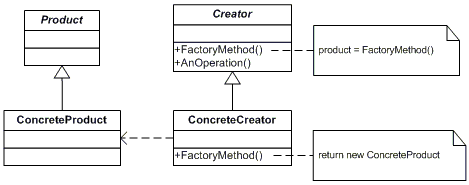

# Factory Method Pattern


팩토리 메소드 패턴은 Super Class코드에서는 SubClass에서 구현할 메소드를 호출해 필요한 타입의 Object를 가져와 사용하는 구조이다.

주로 인터페이스 타입으로 오브젝트를 반환하므로 Super Class에서는 SubClass에서 정확히 어떤 클래스의 오브젝트를 만들어 반환할지 알지 못한다.

```java
public interface Shape{
  void draw();
}
```

```java
public class Star extends Shape{
  @Override
  public void draw(){
    System.out.println("별 그리기");
  }
}
```

```java
public class Square extends Shape{
  @Override
  public void draw(){
    System.out.println("네모 그리기");
  }
}
```

```java
public class ShapeFactory{
  public Shape getShape(String shapeType){
    if(StringUtils.isEmpty(shapeType)){
      return null;
    }
    if(shapeType.equalsIgnoreCase("SQUARE")){
      return new Square();
    }else if(shapeType.equalsIgnoreCase("STAR")){
      return new Star();
    }
		return null;

  }
}
```

```java
public FactoryPatternTest{
  public static void main(String[] args){
    ShapeFactory shapeFactory = new ShapeFactory();
    
    Shape shape1 = shapeFactory.getShape("STAR");
    shape1.draw();
    
    Shape shape2 = shapeFactory.getShape("SQUARE");
    shape2.draw();

  }
}
```

즉, **서브 클래스에서 오브젝트 생성 방법 클래스를 결정할 수 있도록 미리 정의해둔 메소드를 팩토리 메소드라고 하며, 이 방식을 통해 오브젝트를 생성하는 방법을 팩토리 메소드 패턴**이라고 한다.


## 예제

Sub Class의 getConnection()을 통해 만들어진 Connection 종류가 달라질 수 있게 하는 것을 목적으로 하는 팩토리 메소드 패턴의 예시이다.

```java
package springbook.user.dao;

import java.sql.Connection;
import java.sql.DriverManager;
import java.sql.PreparedStatement;
import java.sql.ResultSet;
import java.sql.SQLException;

import springbook.user.domain.User;

public abstract class UserDao {
	public void add(User user) throws ClassNotFoundException, SQLException {
		Connection c = getConnection();

		PreparedStatement ps = c.prepareStatement(
			"insert into users(id, name, password) values(?,?,?)");
		ps.setString(1, user.getId());
		ps.setString(2, user.getName());
		ps.setString(3, user.getPassword());

		ps.executeUpdate();

		ps.close();
		c.close();
	}


	public User get(String id) throws ClassNotFoundException, SQLException {
		Connection c = getConnection();
		PreparedStatement ps = c
				.prepareStatement("select * from users where id = ?");
		ps.setString(1, id);

		ResultSet rs = ps.executeQuery();
		rs.next();
		User user = new User();
		user.setId(rs.getString("id"));
		user.setName(rs.getString("name"));
		user.setPassword(rs.getString("password"));

		rs.close();
		ps.close();
		c.close();

		return user;
	}

	abstract protected Connection getConnection() throws ClassNotFoundException, SQLException ;


	public static void main(String[] args) throws ClassNotFoundException, SQLException {
		UserDao dao = new NUserDao();

		User user = new User();
		user.setId("admin");
		user.setName("test1");
		user.setPassword("admintest");

		dao.add(user);
			
		System.out.println(user.getId() + " 등록 완료");
		
		User user2 = dao.get(user.getId());
		System.out.println(user2.getName());
		System.out.println(user2.getPassword());
			
		System.out.println(user2.getId() + " 호출 완료");
	}

}
```

```java
package springbook.user.dao;

import java.sql.Connection;
import java.sql.DriverManager;
import java.sql.SQLException;

public class DUserDao extends UserDao {
	protected Connection getConnection() throws ClassNotFoundException,
			SQLException {
		Class.forName("com.mysql.jdbc.Driver");
		Connection c = DriverManager.getConnection(
				"jdbc:mysql://localhost/springbook?characterEncoding=UTF-8",
				"DuserId", "DUserPassword");
		return c;
	}
}
```

```java
package springbook.user.dao;

import java.sql.Connection;
import java.sql.DriverManager;
import java.sql.SQLException;

public class NUserDao extends UserDao {
	protected Connection getConnection() throws ClassNotFoundException,
			SQLException {
		Class.forName("com.mysql.jdbc.Driver");
		Connection c = DriverManager.getConnection(
				"jdbc:mysql://localhost/springbook?characterEncoding=UTF-8",
				"NUserId", "NUserPassword");
		return c;
	}
}
```

NUserDao와 DUserDao가 Connection을 생성하는 방법이 다르므로, 팩토리 메소드 패턴으로 볼 수 있다.


## 참고

- [https://niceman.tistory.com/143?category=940951](https://niceman.tistory.com/143?category=940951)
- 토비의 스프링