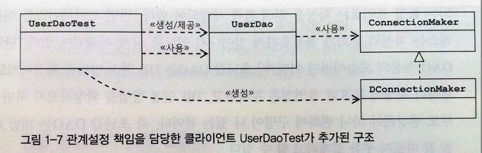

# Strategy Pattern

전략 패턴은 자신의 기능 맥락(context)에서 필요에 따라 변경이 필요한 알고리즘을 인터페이스를 통해 통째로 외부에 분리시키고, 이를 구현한 구체적인 알고리즘 클래스를 필요에 따라 바꿔서 사용할 수 있게 하는 디자인 패턴이다. 대체 가능한 전략이라고 보기때문에 전략 패턴이라 불린다.

_여기서 알고리즘이란 독립적인 책임으로 분리가 가능한 기능을 의미한다._

즉, 프로젝트에서 변경이 일어나지 않는 부분에서 변경이 발생하는 부분을 찾아 따로 캡슐화 한다고 보면된다.

## 예시



UserDao는 전략 패턴의 Context에 해당한다. Context는 자신의 기능을 수행하는데 필요한 기능중에서 변경 가능한 DB연결 알고리즘을 ConnectionMaker 인터페이스로 분리하여 정의했다. 그리고 이를 구현한 클래스에서 전략을 바꿔가면서 사용할 수 있도록 분리했다.

```java
public class UserDaoTest {
	public static void main(String[] args) throws ClassNotFoundException, SQLException{
		ConnectionMaker connectionMaker = new DConnectionMaker();
		
		UserDao dao = new UserDao(connectionMaker);
	}
}
```

```java
public class UserDao {
	
	private ConnectionMaker connectionMaker;
	
	public UserDao(ConnectionMaker connectionMaker) {
		this.connectionMaker = connectionMaker;
	}
	
	public void add(User user) throws ClassNotFoundException, SQLException {
		Connection c = connectionMaker.makeConnection();
		PreparedStatement ps = c.prepareStatement("insert into users(id, name, password) values(?,?,?)");
		ps.setString(1, user.getId());
		ps.setString(2, user.getName());
		ps.setString(3, user.getPassword());
		
		ps.executeUpdate();
		
		ps.close();
		c.close();
	}
	
	public User get(String id) throws ClassNotFoundException, SQLException {
		Connection c = connectionMaker.makeConnection();
		PreparedStatement ps = c.prepareStatement("select * from users where id = ?");
		ps.setString(1, id);
		
		ResultSet rs = ps.executeQuery();
		rs.next();
		
		User user = new User();
		user.setId(rs.getString("id"));
		user.setName(rs.getString("name"));
		user.setPassword(rs.getString("password"));
		
		rs.close();
		ps.close();
		c.close();
		
		return user;
	}

}
```

```java
public interface ConnectionMaker {
	public Connection makeConnection() throws ClassNotFoundException, SQLException;
}
```

```java
public class DConnectionMaker implements ConnectionMaker{

	@Override
	public Connection makeConnection() throws ClassNotFoundException, SQLException {
		// TODO Auto-generated method stub
		return null;
	}
}
```

Context(UserDao)를 사용하는 클라이언트(UserDaoTest)는 Context가 사용할 전략(DConnectionMaker)을 Context의 생성자를 통해 제공해주며 전략패턴을 잘 지키고 있는 예시이다.

여기서 보면 UserDao는 [개방 폐쇄 원칙(OPC)](../2020-03-21-SOLID) 을 잘 따르고 있으며, 결합도는 낮으며, 전략패턴을 적용한 것을 확인할 수 있다.


## 참고

- 토비의 스프링 1장
- [좋은 사람의 개발노트](https://niceman.tistory.com/133?category=940951#recentEntries)