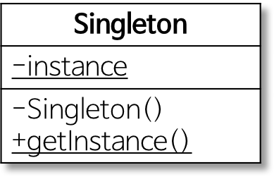

# Singleton Pattern

애플리케이션이 시작될 때 어떤 클래스가 **최초 한번만** 메모리를 할당하고(static) 그 메모리에 인스턴스를 만들어 사용하는 디자인 패턴이다.

생성자가 여러번 호출되더라도 실제로 생성되는 객체는 하나이며, 최초 생성 이후 호출된 생성자는 최오에 생성한 객체를 반환한다.

즉, **인스턴스를 하나만 만들어 사용하기위한 패턴**이다.

> 하나의 인스턴스만을 생성하는 책임이 있으며, `getInstance()` 메서드를 통해 모든 클라이언트에게 동일한 인스턴스를 반환하는 작업을 수행한다.

#### 왜 싱글톤을 사용할까?

1. 고정된 메모리 영역을 사용하면서 메모리 낭비를 방지할 수 있다.
2. 전역 인스턴스이기 때문에 다른 클래스의 인스턴스들이 데이터를 공유하기 쉽다. (DataBase Connection Pool처럼 공통퇸 객체를 여러개 생성해 사용해야하는 상황에서 많이 사용)
3. 두 번째 이용시부터는 객체 로딩 시간이 줄어 성능이 좋아진다.

#### 문제점

멀티 쓰레드 환경에서 인스턴스가 1개 이상 생성되는 경우가 발생할 수 있다. 이러한 문제는 1. 정적 변수에 인스턴스를 만들어 바로 초기화하는 방법 (Eager Initialization) 2. 인스턴스를 만드는 메서드에 동기화하는 방법 (Thread-Safe Initialization) 으로 해결할 수 있다.

#### 참조 페이지

- [https://jeong-pro.tistory.com/86](https://jeong-pro.tistory.com/86)
- [https://asfirstalways.tistory.com/335](https://asfirstalways.tistory.com/335)
- [https://gmlwjd9405.github.io/2018/07/06/singleton-pattern.html](https://gmlwjd9405.github.io/2018/07/06/singleton-pattern.html)