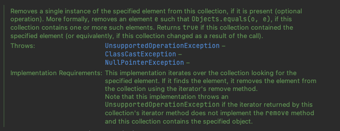
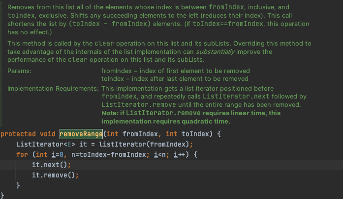

# ITEM 19 : 상속을 고려해 설계하고 문서화해라

**상속용 클래스는 재정의할 수 있는 메서드들을 내부적으로 어떻게 이용하는지 문서로 남겨야한다.** 재정의 할 수 있는 메서드(`public`과 `protected`중 `final`이 아닌 모든 메서드)를 호출할 수 있는 모든 상황을 문서로 남겨야한다.

`@implSpec` 태그(java 8부터 사용)는 "Implementation Requirements" 그 메서드의 내부 동작 방식을 설명하는 곳이다.



```java
    /**
     * {@inheritDoc}
     *
     * @implSpec
     * This implementation iterates over the collection looking for the
     * specified element.  If it finds the element, it removes the element
     * from the collection using the iterator's remove method.
     *
     * <p>Note that this implementation throws an
     * {@code UnsupportedOperationException} if the iterator returned by this
     * collection's iterator method does not implement the {@code remove}
     * method and this collection contains the specified object.
     *
     * @throws UnsupportedOperationException {@inheritDoc}
     * @throws ClassCastException            {@inheritDoc}
     * @throws NullPointerException          {@inheritDoc}
     */
    public boolean remove(Object o) {
        Iterator<E> it = iterator();
        if (o==null) {
            while (it.hasNext()) {
                if (it.next()==null) {
                    it.remove();
                    return true;
                }
            }
        } else {
            while (it.hasNext()) {
                if (o.equals(it.next())) {
                    it.remove();
                    return true;
                }
            }
        }
        return false;
    }
```

이처럼 내부 매커니즘을 문서로 남기는 것만이 상속을 위한 설계의 전부는 아니며, 효율적인 하위 클래스를 큰 어려움 없이 만들 수 있게 하려면 **클래스의 내부 동작 과정 중간에 끼어들 수 있는 hook(훅)을 잘 선별하여 `protected` 메서드 형태로 공개해야할 수 도 있다.** 



위는 `AbstractList`의 `removeRange()` 메서드이다. `List` 구현체의 최종 사용자는 `removeRange()`메서드에 관심이 없지만, 해당 메서드를 제공한 이유는 단지 하위 클래스에서 부분 리스트의 `clear()` 메서드를 고성능으로 만들기 쉽게 하기 위해서이다. `removeRange()` 메서드가 없다면 하위 클래스에서 `clear()` 메서드 호출시 제거할 원소 수의 제곱에 비례해 성능이 느려지거나 부분리스트의 메커니즘을 밑바닥부터 새로 구현해야 했을 것이다.

`protected` 메서드 하나하나가 내부 구현에 해당하므로 그 수는 가능한 적어야하며, 한편으로는 너무 적게 노출해서 상속으로 얻는 이점마저 없애지 않도록 주의해야한다.


**상속용 클래스를 시험하는 방법은 직접 하위 클래스를 만들어보는 것이 유일하다.** 하위 클래스를 직접 구현해보면 꼭 필요한 `protected` 멤버와 필요하지 않는 `protected` 멤버를 알 수 있다.  상속용으로 설계한 클래스는 배포 전에 반드시 하위 클래스를 만들어 검증해야한다.


**상속용 클래스의 생성자는 직접적으로든 간접적으로든 재정의 가능한 메서드를 호출해서는 안된다.** `private`, `final`, `static` 메서드는 재정의가 불가능하므로 생성자에서 안심하고 호출해도 된다.

```java
public class Super{
  
    // 잘못된 예 : 생성자가 재정의 가능한 메서드 호출
    public Super(){
       overrideMe();
    }
  
    public void overrideMe(){
      
    }
}
```

```java
public final class Sub extends Super {
    private final Instant instant;
    Sub() {
       instant = Instant.now();
    }
  
    @Override public void overrideMe(){
        System.out.println(instant);
    }
}
```

위와 같이 상위 클래스의 생성자가 재정의 가능한 메서드를 호출하면, 하위 클래스 생성자 보다 먼저 실행되므로, 하위 클래스에서 재정의한 메서드가 하위 클래스의 생성자보다 먼저 호출된다. 이때 재정의한 하위 클래스 메서드가 하위 클래스 생성자에서 초기화하는 값에 의존한다면, 의도한 대로 동작하지 않을 것이다.


**상속용 클래스에서 `Cloneable`, `Serializable`을 구현할지 정해야한다면, `clone`과 `readObject` 모두 직간접적으로 재정의 가능한 메서드를 호출해서는 안된다.** `readObject`는 하위 클래스의 상태가 역직렬화되기 전에 재정의한 메서드 부터 호출하게 되며, `clone`의 경우 하위 클래스의 `clone` 메서드가 복제본의 상태를 수정하기 전에 재정의한 메서드를 호출한다. 특히, `clone`이 잘못되면 복제본 뿐만아니라 원본 객체에도 피해를 줄 수 있다. `Serializable` 을 구현한 상속용 클래스가 `readResolve`나 `writeReplace`를 갖는다면 이 메서드들은 `private`가 아닌 `protected`로 선언해야한다. `private`로 선언하면 하위 클래스에서 무시되기 때문이다.

**상속용으로 설계되지 않은 클래스는 상속을 금지해야한다.** 상속을 금지하는 방법 중 첫번째는 final 클래스를 선언하는 방법이다. 두번째는 모든 생성자를 `private`나 `package-private`로 선언하고 public 정적 팩터리를 만들어주는 방법이다. ([item 17](https://github.com/dh00023/TIL/blob/master/Java/effective_java/2021-02-11-minimize-mutability.md)에서 구현방법 설명)

