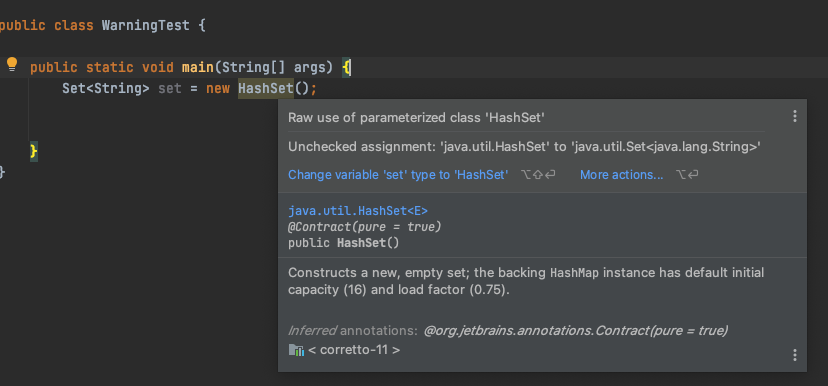

# ITEM 27: 비검사 경고를 제거해라

제네릭을 사용하느 경우에 수많은 컴파일러 경고를 볼 수 있다. 비검사 형변환 경고, 비검사 메서드 호출 경고, 비검사 매개변수화 가변인수 타입 경고, 비검사 변환 경고 등이다.

```java
Set<String> set = new HashSet();
```

다음과 같이 코드를 잘못 작성하는 경우에 아래 경고문구를 볼 수 있다.



컴파일러가 알려준 대로 수정하면 경고가 사라지지만, 자바7 부터 지원하는 `<>` 다이아몬드 연산자만으로 해결할 수 있다.

```java
Set<String> set = new HashSet<>();
```

최대한 모든 비검사 경고를 제거한다면, 코드의 타입 안정성을 높일 수 있다. 즉, 런타임시 `ClassCastException` 이 발생할 일이 없으며, 의도한대로 잘 동작하게 될 것이다.

### @SuppressWarnings("unchecked")

만약 경고를 제거할 수 없지만 타입이 안전하다고 확신할 수 있으면 `@SuppressWarnings("unchecked")` 어노테이션을 붙여 경고를 숨길 수 있다.

하지만, 타입안전성을 검증하지 않은 채 경고를 숨기게 되면, 그 코드는 경고 없이 컴파일되지만, 런타임에는 여전히 `ClassCastException` 오류가 발생할 수 있다. 그렇다고 안전하다고 검증된 타입을 경고문구를 숨기지 않고 둔다면, 진짜 문제를 알리는 새로운 경고가 나와도 알아차리기 힘들 수 있기때문에 검증된 타입은 오류문구를 숨기는 것이 좋다.

 `@SuppressWarnings("unchecked")` 어노테이션은 개별 지역변수 선언부터 클래스 전체까지 어떠한 선언에도 달 수 있다. 하지만 **가능한 한 좁은 범위에 적용**하는 것이 좋다. 보통은 변수 선언, 아주 짧은 메서드, 혹은 생성자에 붙이며, 심각한 경고를 놓치게 될 수 있으니, 절대로 클래스 전체에 적용해서는 안된다.

한줄이 넘는 메서드나 생성자에 달린 `@SuppressWarnings` 어노테이션은 지역변수 선언쪽으로 옮기는 것이 좋다.

```java
    public <T> T[] toArray(T[] a) {
        if (a.length < size) {
          	// 생성한 배열과 매개변수로 받은 배열의 타입이 모두 T[]로 같으므로 올바른 형변환
            @SuppressWarnings("unchecked") T[] result = (T[]) Arrays.copyOf(elements, size, a.getClass());
            return result;
        }
        System.arraycopy(elements, 0, a, 0, size);
        if (a.length > size) {
            a[size] = null;
        }
        return a;
    }
```

위 코드는 컴파일도 깔끔하게 되며, 비검사 경고를 숨기는 범위도 최소화 했다.

`@SuppressWarnings("unchecked")` 를 사용할때면 **반드시 그 경고를 무시해도 안전한 이유를 주석**으로 남겨야한다.

