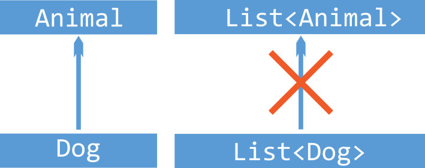
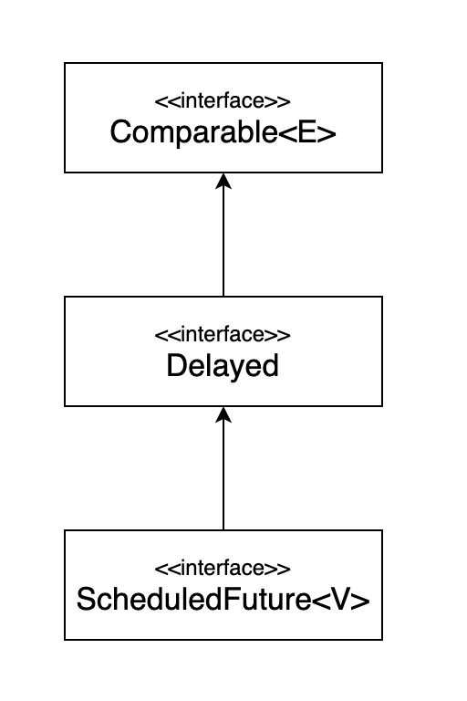

# ITEM31 : 한정적 와일드카드를 사용해 API 유연성을 높여라

- [Generic#Wildcards](https://github.com/dh00023/TIL/blob/master/Java/%EB%AC%B8%EB%B2%95/java-generic.md#wildcards-%EC%99%80%EC%9D%BC%EB%93%9C%EC%B9%B4%EB%93%9C)

- 관련 용어

  | 한글                     | 영문                    | 예                                 |
  | ------------------------ | ----------------------- | ---------------------------------- |
  | 매개변수화 타입          | parameterized type      | `List<String>`                     |
  | 실제 타입 매개변수       | actual type parameter   | `String`                           |
  | 제네릭 타입              | generic type            | `List<E>`                          |
  | 정규 타입 매개변수       | formal type parameter   | `E`                                |
  | 비한정적 와일드카드 타입 | unbounded wildcard type | `List<?>`                          |
  | 로 타입                  | raw type                | `List`                             |
  | 한정적 타입 매개변수     | bounded type parameter  | `<E extends Number>`               |
  | 재귀 타입 한정           | recursive type bound    | `<T extends Comparable<T>>`        |
  | 한정적 와일드카드 타입   | bounded wildcard type   | `List<? extends Number>`           |
  | 제네릭 메서드            | generic method          | `static <E> List<E> asList(E[] a)` |
  | 타입 토큰                | type token              | `String.class`                     |

시작전, 위 개념에 대한 이해가 있어야 이해하기 쉬우며, 일부 겹치는 내용도 있다.

------



제네릭 매개변수화 타입(parameterized type)은 불공변이기 때문에 서로 다른 타입이다. 
아래 예시를 살펴보자.

```java
public void pushAll(Iterable<E> src) {
  for (E e : src) {
    push(e);
  }
}

public static void main(String[] args) {
  Stack<Number> stack = new Stack<>();
  Iterable<Integer> integers = ...;
  stack.pushAll(integers); // compile error
}
```

`Number`와 `Integer`는 서로 상속관계가 있지만 `Iterable<Integer>`는 `Iterable<Number>`의 하위 타입이 아니며, 아무런 관계가 없기 때문에 컴파일 오류가 발생한다.
이러한 경우 상한 경계 와일드카드(upper bounded wildcard)를 이용해서 해당 문제를 해결할 수 있다.

```java
public void pushAll(Iterable<? extends E> src) {
  for (E e : src) {
    push(e);
  }
}
```

다음은 스택 안에 있는 원소를 모두 `Object`용 컬렉션으로 옮기는 예제이다.

```java
public void popAll(Collection<E> dst) {
  while (!isEmpty()) {
    dst.add(pop()); // compile error 
  }
}

public static void main(String[] args) {
  Stack<Number> stack = new Stack<>();
  Collection<Object> objects = ...;
  stack.popAll(objects); // compile error
}
```

`Collection<Object>`는 `Collection<Number>`와 아무 상하관계가 없으므로, 컴파일 오류가 발생한다.
이러한 경우 하한 경계 와일드카드(lower bounded wildcard)를 사용해 해결할 수 있다.

```java
public void popAll(Collection<? super E> dst) {
  while (!isEmpty()) {
    dst.add(pop());
  }
}
```

즉, 와일드카드는 다음과 같은 관계를 갖고 있다고 볼 수 있다.


### PECS

어떤 와일드 카드를 사용해야하는지 기억하는데 있어서 `PECS` 공식을 외워두면 도움이 될 것 이다.

**PECS : producer - extends, consumer-super**

즉, 매개변수화 타입 `T`가 생산자인 경우 상한 경계 와일드 카드(`<? extends E>`)를 사용하고, 소비자이면 하한 경계 와일드카드(`<? super E>`)를 사용하라는 것이다.

추가로 예를 한개 더 살펴 볼 것이다.

```java
public static <E extends Comparable<E>> E max(List<E> c) {
  if (c.isEmpty()) {
    throw new IllegalArgumentException("collection is empty");
  }
  E result = null;
  
  for (E e : c) {
    if (result == null || e.compareTo(result) > 0) {
      result = Objects.requireNonNull(e);
    }
  }

  return result;
}
```

 [ITEM30]()에서 살펴본 예를 와일드카드 타입을 사용해 다듬어 볼 것이다.

```java
public static <E extends Comparable<? super E>> E max(List<? extends E> c) {
  if (c.isEmpty()) {
    throw new IllegalArgumentException("collection is empty");
  }
  E result = null;
  
  for (E e : c) {
    if (result == null || e.compareTo(result) > 0) {
      result = Objects.requireNonNull(e);
    }
  }

  return result;
}
```

입력 배개변수는 `E` 인스턴스를 생성하므로 `List<? extends E>`로 변경해주었고, `Comparable`은 언제나 소비자 역할이므로, `Comparable<? super E>`로 변경해주었다. 

> `Comparable`와 `Comparator`는 모두 소비자이다.

와일드카드 타입으로 변경하기전의 `max()` 메서드는 `List<ScheduledFuture<?>> scheduledFutures = ...;` 리스트를 처리할 수 없었으며, 와일드카드 적용후에 오류없이 실행되는 것을 확인할 수 있다.


`ScheduledFuture`는 `ScheduledFuture` 인스턴스뿜 아니라 `Delayed` 인스턴스와도 비교할 수 있기때문에 수정전 `max()` 메서드에서 오류가 나는 것을 확인할 수 있다. 다시말해 `Comparable`을 직접 구현하지 않고, 직접 구현한 다른 타입(`Delayed`)를 확장한 타입을 지원하기 위해서 와일드카드가 필요한 것이다.

추가적으로 **메서드 선언에 타입 매개변수가 한 번만 나오면 와일드카드로 대체**하는 것이 좋다.

### private static helper 메서드

컴파일러는 어떠한 경우에, 와일드카드의 타입을 추론한다. 예를들어, `List<?>` 리스트가 정의되어있을때, 컴파일러는 코드에서 특정 타입을 추론한다. 이러한 시나리오를 와일드카드 캡처라고 한다.

 **"capture of"** 오류 문구를 제외하고는 와일드카드 캡처를 신경쓰지 않아도 된다.

```java
public static void swap(List<?> list, int i, int j){
    list.set(i, list.set(j, list.get(i)));
};
```

`swap()` 메서드에서 `List.set(int, E)`를 호출할때 컴파일러는 `List`에 삽입되는 객체의 유형을 확인할 수 없기 때문에 오류를 발생시킨다. 이러한 유형의 오류가 발생하면 일반적으로 **컴파일러는 변수에 잘못된 타입의 값을 할당하고 있다고 믿는다는 것을 의미**한다. 
이 오류는 형변환이나 리스트의 로 타입을 사용하지 않고 private static helper 메서드로 해결할 수 있다.

```java
public static void swap(List<?> list, int i, int j){
    swapHelper(list, i, j);
};


// Helper method created so that the wildcard can be captured
// through type inference.
public static <E> void swapHelper(List<E> list, int i, int j){
  list.set(i, list.set(j, list.get(i)));
};
```

helper 메서드 덕분에 컴파일러는 `E`가 캡쳐 변수인 `CAP#1` 임을 추론할 수 있다. 즉, list에서 꺼낸 값의 타입은 항상 `E`이고, `E` 타입의 값이라면 리스트에 추가해도 안전하다는 것을 컴파일러는 알 수 있다. 일반적으로 helper 메서드는 `originalMethodNameHelper`로 지정된다.

