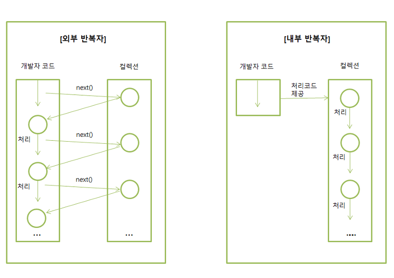
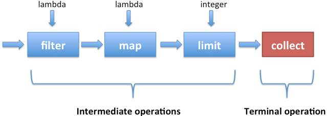
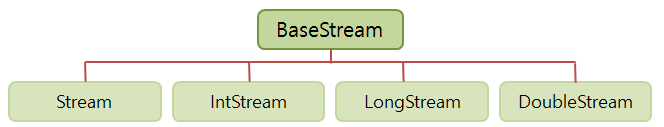
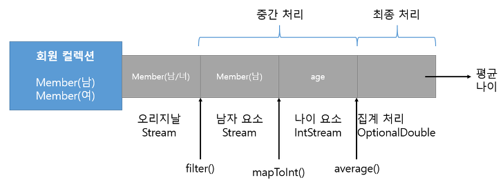
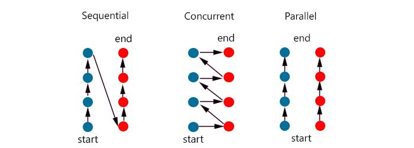
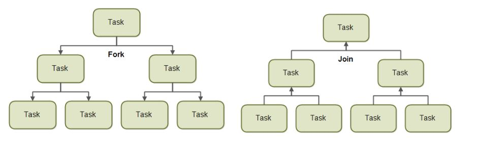

# Stream

Stream은 Java8부터 추가된 **Collection의 저장 요소를 하나씩 참조해서 Lambda식으로 처리할 수 있도록 해주는 반복자**이다.

Stream은 Iterator와 비슷한 역할을 하는 반복자 이지만 다음과 같은 특징을 가진다.

- 람다식으로 요소 처리 코드를 제공한다.

```java
List<User> list = Arrays.asList(
	new User("Teddy", "testid", "testtest"),
	new User("faker", "hideOnBush", "testtest")
);		
		
Stream<User> stream = list.stream();
stream.forEach(s->{
	String name = s.getName();
	String id = s.getId();
	System.out.println(name + " : " + id);
});
```

- 내부 반복자를 사용해 병렬 처리가 쉽다.



외부 반복자(external iterator)는 개발자가 코드로 직접 Collection의 요소를 반복해서 가져오는 패턴을 말한다. for문, Iterator를 이용하는 whlie문 모두 외부 반복자를 이용하는 것이다.

```java
class Driver {
    public static void main(String[] args) {
      List<Integer> list = Arrays.asList(1,2,3,4,5,6);
      Iterator<Integer> iter = list.iterator();

      // 순서대로 1 2 3 4 5 6 출력
      while (iter.hasNext()) {
        System.out.println(iter.next());
      }
    }
}
```

**내부 반복자(internal iterator)는 Collection 내부에서 요소들을 반복시키고, 개발자는 요소당 처리해야할 코드만 제공하는 패턴**을 말한다. 
내부 반복자를 사용해 개발자는 요소 처리 코드에만 집중할 수 있으며, 내부 반복자는 **병렬 작업을 할 수 있도록 도와주기 때문에 효율적으로 요소를 반복**시킬 수 있다.
스트림을 이용하면 코드도 간결해지지만, 요소의 병렬 처리가 Collecton 내부에서 처리되는것이 더 좋은 효과를 가져온다.

```java
class Driver {
    public static void main(String[] args) {
      List<Integer> list = Arrays.asList(1,2,3,4,5,6);
      // Integer 데이터를 갖는 Stream 생성
      Stream<Integer> stream = list.stream();

      // forEach()를 사용해서 1 2 3 4 5 6 출력
      stream.forEach((Integer i) -> { System.out.println(i); });
    }
}
```

```java
public class PracticeExample{
  public static void main(String[] args){
		List<String> list = Arrays.asList("Faker", "Teddy", "Effort", "Wolf", "Bang", "Clid");
		Stream<String> stream = list.parallelStream(); // parallesStream : 병렬처리
		stream.forEach(PracticeExample :: print);
  }
  public static void print(String str) {
		System.out.println(str + Thread.currentThread().getName());
	}
}
```

```
Wolfmain
FakerForkJoinPool.commonPool-worker-3
TeddyForkJoinPool.commonPool-worker-1
ClidForkJoinPool.commonPool-worker-2
BangForkJoinPool.commonPool-worker-3
Effortmain
```

다음과 같이 병렬처리 되는 것을 확인할 수 있다.

- 스트림은 **중간 처리와 최종 처리**를 할 수 있다.
  - **중간 처리 : 매핑, 필터링, 정렬**
  - **최종 처리 : 반복, 카운팅, 평균, 총합 등의 집계 처리**



```java
List<Student> sList = Arrays.asList(
				new Student("Faker", 50),
				new Student("Teddy", 30),
				new Student("Effort", 10));
		
double avg = sList.stream()
						.mapToInt(Student::getScore)	// 중간처리
						.average()										// 최종처리
						.getAsDouble();
System.out.println(avg);
```

## 스트림 종류



`BaseStream` 인터페이스에는 모든 스트림에서 사용할 수 있는 공통 메소드들이 정의 되어있으며, 직접 사용되지는 않는다.

| 리턴 타입                                                 | 메소드                                                       | 소스       |
| --------------------------------------------------------- | ------------------------------------------------------------ | ---------- |
| Stream\<T\>                                               | java.util.Collection.stream()<br/>java.util.Collection.parallelStream() | Collection |
| Stream\<T\><br/>IntStream<br/>LongStream<br/>DoubleStream | Arrays.stream(T[]) Stream.of(T[])<br/>Arrays.stream(int[]) IntStream.of(int[])<br/>Arrays.stream(long[]) LongStream.of(long[])<br/>Arrays.stream(double[]) DoubleStream.of(double[]) | 배열       |
| IntStream                                                 | IntStream.range(int, int)<br/>IntStream.rangeClosed(int, int) | int 범위   |
| LongStream                                                | LongStream.range(long, long)<br/>LongStream.rangeClosed(long, long) | long 범위  |
| Stream\<Path\>                                            | Files.find(Path, int, BiPredicate, FileVisitOption)<br/>Files.list(Path) | 디렉토리   |
| Stream\<String\>                                          | Files.lines(Path, Charset)<br/>Files.list(Path)              | 파일       |
| DoubleStream<br/>IntStream<br/>LongStream                 | Random.doubles()<br/>Random.ints()<br/>Random.longs()        | 랜덤수     |

### IntStream

```java
IntStream stream = IntStream.rangeClosed(1,100); // 1<= a <=100 
stream.forEach(a -> sum += a);
System.out.println(sum); // 5050
```

rangeClosed는 두번째 인자를 포함하며, range는 두번째 인자를 포함하지 않는다.

### File Stream

```java
Path path = Paths.get("...");
Stream<String> stream;

stream = Files.lines(path, Charset.defaultCharset());
stream.forEach(System.out :: println); // s->System.out.println(s)와 같다.

File file = path.toFile();
FileReader fileReader = new FileReader(file);
BufferedReader br = new BufferedReader(fileReader);
stream = br.lines();
stream.forEach(System.out :: println);
```

## Pipeline

**대량의 데이터를 가공해 축소**하는 것을 일반적으로 `Reduction`이라고 한다. 
데이터의 합계, 평균값, 카운팅, 최대, 최소값 등이 대표적인 리덕션의 결과물이라고 볼 수 있다. 
이때 결과물로 바로 집계할 수 없는 경우에는 중간처리(필터링, 매핑, 정렬, 그룹핑)이 필요하다.

파이프라인은 여러개의 스트림이 연결되어 있는 구조를 말하며, **최종처리를 제외하고는 모두 중간 처리 스트림**이다.


중간 스트림이 생성될 때 **요소들이 바로 처리되는 것이 아닌, 최종 처리가 시작되기 전까지 중간처리는 지연(lazy)되며, 최종 처리가 시작되면 중간 스트림에서 처리를 시작**한다.



```java
Stream<Member> mfStream = list.stream();
Stream<Member> mStream = mfStream.filter(m->m.getSex() == Member.MALE);
IntStream ageStream = mStream.mapToInt(Member::getAge());
Double ageAvg = ageStream.average().getAsDouble();
```

```java
double ageAvg = list.stream()
  									.filter(m->m.getSex() == Member.MALE) // 중간처리
  									.mapToInt(Member::getAge())						// 중간처리
  									.average()														// 최종처리
  									.getAsDouble();
```

[Java Platform SE8](https://docs.oracle.com/javase/8/docs/api/java/util/stream/package-summary.html#Reduction) 에서 중간처리, 최정처리 관련 메소드 예시를 살펴볼 수 있다. 

**리턴타입이 스트림이라면 중간 처리 메소드**이고, **기본타입 이거나 `OptionalXXX`라면 최종 처리 메소드**이다.

### Optional Class

`Optional` 클래스는 저장하는 값의 타입만 다를 뿐 제공하는 기능은 거의 동일하다.
 `Optional` 클래스는 단순히 집계 값만 저장하는 것이 아니라, 집계 값이 존재하지 않을 경우 디폴트 값을 설정할 수 있고, 집계 값을 처리하는 `Consumer`도 등록할 수 있다.

| 리턴타입                      | 메소드(매개 변수)                                            | 설명                                        |
| ----------------------------- | ------------------------------------------------------------ | ------------------------------------------- |
| boolean                       | isPresent()                                                  | 값이 저장되어 있는지 여부                   |
| T<br/>double<br/>int<br/>long | orElse(T)<br/>orElse(double)<br/>orElse(int)<br/>orElse(long) | 값이 저장되어 있지 않을 경우 디폴트 값 지정 |
| void                          | ifPresent(Consumer)<br/>ifPresent(DoubleConsumer)<br/>ifPresent(IntConsumer)<br/>ifPresent(LongConsumer) | 값이 저장되어 있을 경우 Consumer에서 처리   |

```java
double avg = list.stream()
  								.mapToInt(Integer::intValue)
  								.average()
  								.orElse(0.0); // 값이 저장되지 않을 경우 defulat 0.0

list.stream()
  .mapToInt(Integer::intValue)
  .average()
  .ifPresent(a -> System.out.println(a)); // 값이 존재하면 출력
```

### reduce

reduce는 **스트림의 모든 원소들을 하나의 결과**로 합친다. 

| 인터페이스   | 리턴 타입      | 메소드(매개 변수)                                   |
| ------------ | -------------- | --------------------------------------------------- |
| Stream       | Optional\<T\>  | reduce(BinaryOperator\<T\> accumulator)             |
|              | T              | reduce(T identity, BinaryOperator\<T\> accumulator) |
| IntStream    | OptionalInt    | reduce(IntBinaryOperator op)                        |
|              | int            | reduce(int identity, IntBinaryOperator op)          |
| LongStream   | OptionalLong   | reduce(LongBinaryOperator op)                       |
|              | long           | reduce(long  identity, LongBinaryOperator op)       |
| DoubleStream | OptionalDouble | reduce(DoubleBinaryOperator op)                     |
|              | double         | reduce(double identity, DoubleBinaryOperator op)    |


```java
int sum = sutentList.stream()
  									.map(Student :: getScore)
  									.reduce((a,b) -> a+b)
  									.get();
```

학생들의 성적 총점을 구하는 예시이다. 여기서 스트림에 요소가 없을 경우에 `NoSuchElementException`이 발생한다.

```java
int sum = sutentList.stream()
  									.map(Student :: getScore)
  									.reduce(0, (a,b) -> a+b); // default 0
```

identity(디폴트 값)을 주어, 스트림에 요소가 없을 경우에는 0을 리턴하는 예시이다.

```java
persons.stream()
			 .reduce(0, (sum, p) -> sum += p.age, (sum1, sum2) -> sum1 + sum2);
```

다음은 3개의 매개변수를 받은 예시이다. 

```java
Integer ageSum = persons
    .parallelStream()
    .reduce(0,
        (sum, p) -> {
            System.out.format("accumulator: sum=%s; person=%s\n", sum, p);
            return sum += p.age;
        },
        (sum1, sum2) -> {
            System.out.format("combiner: sum1=%s; sum2=%s\n", sum1, sum2);
            return sum1 + sum2;
        });

// accumulator: sum=0; person=Pamela
// accumulator: sum=0; person=David
// accumulator: sum=0; person=Max
// accumulator: sum=0; person=Peter
// combiner: sum1=18; sum2=23
// combiner: sum1=23; sum2=12
// combiner: sum1=41; sum2=35
```

다음과 같이 병렬로 처리를 하면 어떻게 실행되는지 확인할 수 있다.

### Collect

collect 메소드는 필요한 요소만 `Collection`으로 담을 수 있고, 요소들을 그룹핑한 후 집계할 수 있다.

| 리턴타입 | 메소드(매개 변수)                   | 인터페이스 |
| -------- | ----------------------------------- | ---------- |
| R        | collect(Collector<T,A,R> collertor) | Stream     |

매개값인 Collector는 **어떤 요소를 어떤 Collection에 수집할 것인지를 결정**한다. Collectors 구현 객체는 아래 Collectors 클래스의 다양한 정적 메소드를 이용해서 얻을 수 있다.

| 리턴 타입                           | 정적 메소드                                                  | 설명                                                         |
| ----------------------------------- | ------------------------------------------------------------ | ------------------------------------------------------------ |
| Collector<T, ?, List\<T\>>          | toList()                                                     | T를 List에 저장                                              |
| Collector<T, ?, Set\<T\>>           | toSet()                                                      | T를 Set에 저장                                               |
| Collector<T, ?, Collection\<T\>>    | toCollection(Supplier<Collection\<T\>>)                      | T를 Supplier가 제공한 Collection에 저장                      |
| Collertor<T, ?, Map<K,U>>           | toMap(<br/> Function<T,K> keyMapper, <br/>Function<T,U> valueMapper) | T를 K와 U로 매핑해 K를 키로, U를 값으로 Map에 저장           |
| Collector<T, ?, ConcurrentMap<K,U>> | toConcurrentMap(<br/>Function<T,K> keyMapper, <br/>Function<T,U> valueMapper) | T를 K와 U로 매핑해 K를 키로, U를 값으로 ConcurrentMap에 저장 |

```java
List<Student> sList = Arrays.asList(
				new Student("Faker", 50, "a"),
				new Student("Teddy", 30, "b"),
				new Student("Effort", 10, "c"));
		
Map<String, Student> map = new HashMap<String,Student>();
map = sList.stream()
  				 .collect(Collectors.toMap(Student::getName, Function.identity(),
										(o1, o2) -> o1, HashMap::new));
```

다음과 같이 구현할 수 있다.

collect는 단순히 요소를 수집하는 기능 외에 Collection의 요소를 그룹핑해서 Map 객체를 생성하는 기능도 제공한다.

| 리턴 타입                                   | 정적메소드                                                   | 설명                                                         |
| ------------------------------------------- | ------------------------------------------------------------ | ------------------------------------------------------------ |
| Collertor<T, ?, Map<K,List\<T\>>>           | groupingBy(Function<T,K> classfier)                          | T를 K로 매핑하고 K키에 저장된 List에 T를 저장한 Map 생성     |
| Collertor<T, ?, ConcurrentMap<K,List\<T\>>> | groupingByConcurrent(Function<T,K> classfier)                |                                                              |
| Collertor<T, ?, Map<K, D>>                  | groupingBy(<br/>Function<T,K> classfier,<br/>Collector<T,A,D> collector) | T를 K에 매핑하고 K키에 저장된 D객체에 T를 누적한 Map 생성    |
| Collertor<T, ?, ConcurrentMap<K, D>>        | groupingByConcurrent(<br/>Function<T,K> classfier,<br/>Collector<T,A,D> collector) |                                                              |
| Collertor<T, ?, Map<K, D>>                  | groupingBy(<br/>Function<T,K> classfier,<br/>Supplier<Map<K,D>> mapFactory,<br/>Collector<T,A,D> collector) | T를 K로 매핑하고 Supplier가 제공하는 Map에서 K키에 저장된 D객체에 T를 누적 |
| Collertor<T, ?, ConcurrentMap<K, D>>        | groupingBy(<br/>Function<T,K> classfier,<br/>Supplier<ConcurrentMap<K,D>> mapFactory,<br/>Collector<T,A,D> collector) |                                                              |

```java
Map<String, List<Student>> mapByGrade = sList.stream()
				.collect(Collectors.groupingBy(Student::getGrade));
```

다음 예제는 성적별로 해당 Student List를 구할 수 있다.

```java
Map<Student.Sex, Double> mapBySex = totalList,stream()
  .collect(
  	Collectors.groupingBy(
      Student :: getSex,
      Collectors.averagingDouble(Student :: getScore)
    )
	);
```

다음은 성별로 평균 점수를 저장한 Map을 구현한 예제이다. 위의 예제 처럼 그룹핑 후에 매핑이나 집계(평균, 카운팅, 연결, 최대, 최소, 합계)를 할 수 있다.

### 병렬 처리

병렬 처리란 멀티 코어 CPU 환경에서 하나의 작업을 분할해서 각각의 코어가 병렬적으로 처리하는 것을 말하며, 작업 처리 시간을 줄이기 위해 사용한다.  Java8부터 병렬 스트림을 제공하고 있다.

멀티 쓰레드는 동시성(Concurrency)와 병렬성(Parallelism)으로 실행되고 있다.



- 동시성 : 멀티 스레드가 번갈아가며 실행하는 성질
- 병렬성 : 멀티 코어를 이용해 동시에 실행하는 성질
  - 데이터 병렬성 : 전체 데이터를 쪼개어 서브 데이터들로 만들고 이 데이터들을 병렬 처리해 작업을 빨리 끝내는 것(parallelStream)
  - 작업 병렬성 : 서로 다른 작업을 병렬 처리하는 것(Web Server : 각각 브라우저에서 요청한 내용을 개별 스레드에서 병렬로 처리)

싱글 코어 CPU를 이용한 멀티 작업은 병렬적으로 실행되는 것처럼 보이지만, 번갈아가며 실행하는 동시성 작업이다.

#### ForkJoin Framework

병렬 스트림은 요소들을 병렬 처리하기 위해 ForkJoin Framework를 사용한다.



- Fork 단계 : 전체 데이터를 서브 데이터로 분리
- 서브 데이터를 멀티 코어에서 병렬로 처리
- Join 단계 : 서브 데이터 결과를 결합해 최종 결과


ForkJoin 프레임워크는 ExecutorService의 구현 객체인 ForkJoinPool을 사용해서 작업 스레드를 관리한다.

병렬 처리를 위해 코드에서 포크조인 프레임워크를 직접 사용할 수 있지만, 병렬 스트림을 이용할 경우 백그라운드에서 사용되기때문에 쉽게 병렬 처리를 할 수 있다.

| 메소드           | 인터페이스                                                   | 리턴타입                                             |
| ---------------- | ------------------------------------------------------------ | ---------------------------------------------------- |
| parallelStream() | java.util.Collection                                         | Stream                                               |
| parallel()       | java.util.Stream.Stream<br/>java.util.Stream.IntStream<br/>java.util.Stream.LongStream<br/>java.util.Stream.DoubleStream | Stream<br/>IntStream<br/>LongStream<br/>DoubleStream |

스트림 병렬 처리가 스트림 순차 처리보다 항상 실행 성능이 좋다고 판단해서는 안된다.

- 요소의 수와 요소당 처리 시간 : 병렬 처리는 스레드풀 생성, 스레드 생성이라는 추가비용이 발생하기 때문에 Collection에 요소수가 적고 요소당 처리 시간이 짧으면 순차 처리가 오히려 병렬 처리보다 빠를 수 있다.
- 스트림 소스의 종류 : 배열(ArrayList)은 인덱스로 요소를 관리하기 때문에 Fork 단계에서 요소를 쉽게 분리할 수 있어 병렬 처리 시간이 절약된다. 반면에 HashSet, TreeSet, LinkedList는 요소 분리가 쉽지 않아 상대적으로 병렬 처리가 늦다.
- 코어(Core) 수 : 싱글 코어 CPU일 경우에는 순차 처리가 더 빠르다. 병렬 스트림을 사용할 경우 스레드 수만 증가하고 동시성 작업으로 처리되기 때문에 좋지 못한 결과를 준다. 코어의 수가 많을수록 병렬 작업 처리속도는 빨라진다.

## 참고

- [WRAITHKIM의 지식공방 - JAVA 8 스트림 튜토리얼](https://wraithkim.wordpress.com/2017/04/13/java-8-스트림-튜토리얼/)

