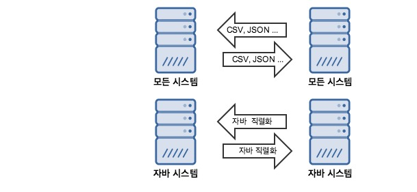

# 자바 직렬화

##  직렬화란?

Serializeable이란 자바 시스템 내부에서 사용되는 객체 또는 데이터를 외부의 자바 시스템에서도 사용할 수 있도록 **byte 형태로 데이터 변환하는 기술과 byte로 변환된 데이터를 다시 객체로 변환하는 기술**을 합쳐서 말한다.

시스템 적으로 말하면, JVM(Java Virtual Machine)의 메모리에 상주(힙/스택)되어 있는 객체 데이터를 바이트 형태로 변환하는 기술과 직렬화된 바이트 형태의 데이터를 객체로 변환해서 JVM으로 상주시키는 형태를 말한다.

> 이전에 Django에서는 python 기본 데이터 유형을, JSON, XML 형태로 변환하기 위해 사용했었다. [Django restframework serializers](https://github.com/dh00023/TIL/blob/master/django/rest_framework/2019-04-19-serializers.md)

조금 더 자세히 살펴보면,

- 대부분 OS의 프로세스 구현은 서로 다른 가상메모리주소공간(VAS)를 갖기 때문에 Object 타입의 참조값 데이터 인스턴스를 전달할 수 없다.(전달하더라도, 서로 다른 메모리 공간에서 전달된 참조값이므로 무의미) 때문에 서로 다른 메모리 공간 사이의 데이터를 전달하기 위해서 메모리 공간의 주소값이 아닌 Byte 형태로 직렬화된 객체 데이터를 전달해 사용하는 쪽에서 역직렬화하여 사용할 수 있다.
- Java 클래스는 객체 안에 객체가 존재할 수 있다. 객체 A안에 들어있는 객체 B를 직렬화하면, 객체 B자체의 데이터를 Primitive type(Byte type)의 데이터로 변환한다. 직렬화된 데이터는 모두 Primitive 타입의 데이터 묶음이며, 파일 저장이나 네트워크 전송 시 파싱할 수 있는 유의미한 데이터가 되는 것이다.
- JSON, CSV 등의 포맷은 직렬화/역직렬화 시에 특정 라이브러리를 도입하면 쉽게 개발이 가능하며, 구조가 복잡해지면 직접 매핑해줘야한다.

### 직렬화 조건

1. `Java.io.Serializable` 인터페이스를 상속 받은 객체와 Primitive 타입의 데이터
   - 기본자료형(Primitive Type)은 정해진 Byte 변수
2. 객체의 멤버들 중 Serializable 인터페이스가 구현되지 않은 것이 존재하면 안된다.
3. `transient` 가 선언된 멤버는 전송하지 않는다.
   - `transient`선언시 직렬화 대상에서 제외됨

## 왜 사용할까?



**자바 직렬화 형태의 데이터 교환은 자바 시스템 간의 데이터 교환을 위해 존재한다.**

### 장점

- 자바 시스템에서의 개발에 최적화 되어있다. 복잡한 데이터 구조의 클래스 객체일지라도, 직렬화의 기본만 지키면 큰 작업 없이 직렬화/역직렬화가 가능하다.
- 데이터 타입이 자동으로 맞춰지기 때문에 관련 부분을 크게 신경쓰지 않아도 된다.

## 언제 어디서 사용해야할까?

-  **JVM의 메모리에서만 상주되어있는 객체를 그대로 영속화(Persistence)가 필요할 때 사용된다.** 
  - **시스템이 종료되더라도 없어지지 않는 장점**을 가지며, 영속화된 데이터이기 때문에 네트워크로 전송이 가능하다.

- Servlet Session
  - Servlet 기반 WAS(톰캣, 웹로직 등)들은 대부분 세션의 자바 직렬화를 지원하고 있다. 단순히 세션을 서블릿 메모리 위에서 운용한다면, 직렬화가 필요하지 않지만, 파일로 저장하거나 세션 클러스터링, DB 저장하는 옵션등을 선택하면 세션 자체가 직렬화되어 전달된다. 즉, **세션에 필요한 객체는 `java.io.Serializable` 인터페이스를 구현**하는 것을 추천한다.

- Cache
  - 자바 시스템에서 퍼포먼스를 위해 캐시(Ehcache, Redis, Memcached) 라이브러리를 많이 사용한다. 캐시할 부분을 자바 직렬화된 데이터를 저장해서 사용된다. 자바 직렬 화만 이용해서만 캐시를 적용하지 않지만, 가장 간편하기 때문에 많이 사용한다.

- Remote Method Inovation
  - RMI는 원격 시스템 간의 메세지 교환을 위해서 사용하는 기술이다. 보통 원격 시스템과 통신을 위해 IP와 포트를 이용해 소켓통신을 하지만, RMI는 그 부분으 ㄹ추상화해 원격에 있는 시스템의 메서드를 로컬 시스템의 메서드인 것처럼 호출할 수 있다. 원격 시스템의 메서드를 호출할 때 전달하는 메세지를 자동으로 직렬화하여 사용하고, 전달받은 원격 시스템에서 해당 메세지를 역직렬화하여 사용한다.
- **객체가 세션에 저장하지 않는 단순한 데이터 집합이고, 컨트롤러에서 생성되어 뷰에서 소멸하는 데이터의 전달체라면 객체 직렬화는 고려하지 않아도된다**.
- 세션 관리를 스토리지나 네트워크 자원을 이용한다면 객체 직렬화를 해야하며, 메모리에서만 관리한다면 객체 직렬화를 할 필요가 없다.

## 예시

```java
import java.io.Serializable;

import lombok.Data;

@Entity
@Getter
@Setter
@toString
public class AllnItem implements Serializable {
	private static final long serialVersionUID = 4140042043347990835L;

	private String chnlId;
	private String salestrNo;
	private String itemId;
	private String siteNo;
  private String applyYn;
}

```

```java
AllnItem allnItem = new AllnItem("0000000","1234", "1000000001", "1001", "Y");
byte[] selializedAllnItem;
try (ByteArrayOutputStream baos = new ByteArrayOutputStream()) {
    try (ObjectOutputStream oos = new ObjectOutputStream(baos)) {
        oos.writeObject(allnItem);

        // 직렬화된 AllnItem 객체
        selializedAllnItem = baos.toByteArray();
    }
}
```

```java
try (ByteArrayInputStream bais = new ByteArrayInputStream(selializedAllnItem)) {
    try (ObjectInputStream ois = new ObjectInputStream(bais)) {

        // 역직렬화된 AllnItem 객체를 읽어온다.
        Object obj = ois.readObject();
        AllnItem allnItem = (AllnItem) obj;
    }
}
```

## serialVersionUID

Java 직렬화 대상 객체는 동일한 `serialVersionUID` 를 가지고 있어야한다. 하지만, 직접 선언하지 않더라도, 내부적으로 클래스의 구조 정보를 이용해 자동으로 생성된 해쉬값이 할당된다. 그러므로 클래스의 멤버 변수가 추가되거나 삭제되면 `serialVersionUID` 값이 달라지게 되는데, 기존 `serialVersionUID` 가 변경되면 `java.io.InvalidCalssException` 이 발생하게된다.

```java
private static final long serialVersionUID = 1L;
```

즉, 위와 같이 직접 관리를 해야 클래스가 변경되어도 문제없이 직렬화/역직렬화가 가능하다.

이때, `serialVersionUID`가 같다고 문제없이 직렬화/역직렬화를 할 수 있는 것은 아니다. 클래스의 멤버 변수 타입이 같아야하며, 멤버 변수를 제거하거나 변수명을 바꾸면 예외는 발생하지 않지만 데이터는 누락된다.


## 직렬화 사용시 주의사항

- 특별한 문제가 없으면 `serialVersionUID` 값은 직접 관리한다.
- **외부(DB, 캐시서버, NoSQL 서버)에 장기간 저장될 정보는 자바 직렬화사용을 지양**해야한다. 역직렬화 대상 클래스가 언제 변경이 일어날지 모르는 환경에서 긴 시간동안 외부에 존재했던 직렬화된 데이터는 Garbage가 될 가능성이 높다.
- 자주 변경되는 데이터를 자바 직렬화를 사용하지 말자
- 개발자가 직접 컨트롤 가능한 클래스의 객체가 아닌 경우에는 직렬화를 지양해야한다. 개발자가 직접 컨트롤하기 힘든 객체란 라이브러리, 프레임 워크에서 제공하는 클래스 객체를 말한다.<br>이러한 객체가 직접 `serialVersionUID` 를 갖고 있기도해, 개발시 편의상 직렬화 하여 DB또는 캐시에 바로 저장한다면 그로 인해 많은 문제가 야기된다.
  - 프레임워크/라이브러리 버전업을 하면서 `serialVersionUID` 변경

즉, 변경에 취약하므로 자바 직렬화 사용시에는 자주 변경되는 클래스의 객체는 사용 안하는 것이 좋다. **역직렬화가 되지 않을 때 예외처리는 기본적으로 필요하다.**


### 용량 문제

자바 직렬화시 기본적으로 타입에 대한 정보 등 클래스의 메타정보도 가지고 있어 상대적으로 다른 포맷에 비해 용량에 대한 문제가 있다. 특히 클래스의 구조가 거대해질 수록 용량차이가 발생하게 된다.

- 우하한 형제들 기술블로그 예제 코드

  ```java
   		String base64Member = "rO0ABXNyABp3b293YWhhbi5ibG9nLmV4YW0xLk1lbWJlcgAAAAAAAAABAgAESQADYWdlSQAEYWdlMkwABWVtYWlsdAASTGphdmEvbGFuZy9TdHJpbmc7TAAEbmFtZXEAfgABeHAAAAAZAAAAAHQAFmRlbGl2ZXJ5a2ltQGJhZW1pbi5jb210AAnquYDrsLDrr7w=";
      byte[] serializedMember = Base64.getDecoder().decode(base64Member);
      System.out.printf("serializedMember (byte size = %s) \n", serializedMember.length);
      try (ByteArrayInputStream bais = new ByteArrayInputStream(serializedMember)) {
          try (ObjectInputStream ois = new ObjectInputStream(bais)) {
              // 역직렬화된 Member 객체를 읽어온다.
              Object objectMember = ois.readObject();
              Member member = (Member) objectMember;
              // JSON으로 직렬화 했을 때 용량 체크
              String memberJson = objectMapper.writeValueAsString(member);
              System.out.println(memberJson);
              System.out.printf("json (byte size = %s)\n", memberJson.getBytes("utf-8").length);
          }
      }
  ```

  ```java
  serializedMember (byte size = 146)         
  {"name":"김배민","email":"deliverykim@baemin.com","age":25}
  json (byte size = 62) 
  ```

간단한 데이터이지만 JSON으로 직렬화 했을때 보다 두배 이상의 용량 크기가 차이나는 것을 볼 수 있다. 직렬화된 데이터를 메모리 서버(Redis, Memcached)에 저장하는 형태를 가진 시스템에서 더욱 두드러진다. 메모리 서버 특성상 메모리 용량이 크지 않기 때문에 핵심만 요약해 사용하는 형태가 효율적이다.

스프링 프레임워크에서 기본적으로 지원하는 캐시 모듈(Spring Data Redis, Spring Session) 중 외부 시스템에 저장하는 형태에서 기본적으로 자바 직렬화 형태로 제공되기 때문에 이부분은 꼭 주의해야한다.

### 호환성

자바 직렬화를 이용해 외부 데이터를 저장하면, 자바에서만 읽을 수 있는 점이 가장 아쉬운 점이다. JSON 형태로 저장되어있다면, 다른 언어에서도 조작이 가능하다.


## 참고

- [자바 직렬화, 그것이 알고싶다. 훑어보기편](https://woowabros.github.io/experience/2017/10/17/java-serialize.html)
- [자바 직렬화, 그것이 알고싶다. 실무편](https://woowabros.github.io/experience/2017/10/17/java-serialize2.html)
- [Integerous DevLog - Java Serialization 개념 정리](https://ryan-han.com/post/java/serialization/)

