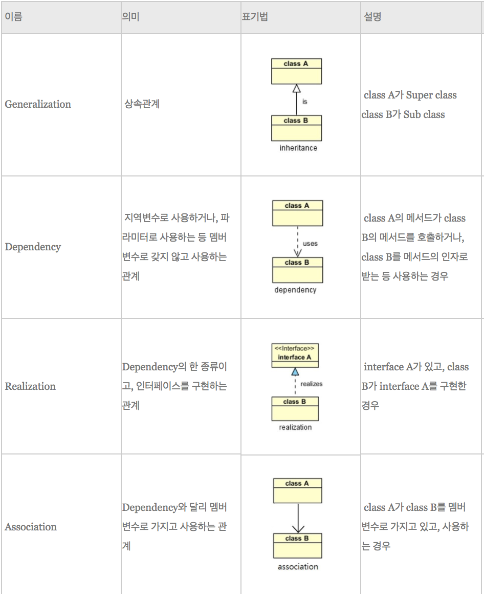
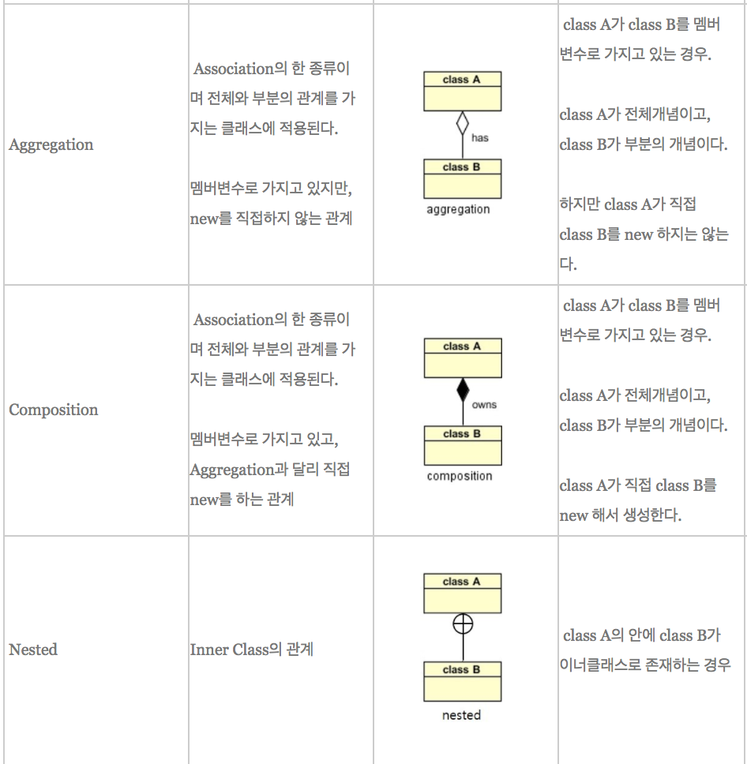

# Java UML

## UML(Unified Modeling Language)

: 모델을 만드는 표준언어,  [객체 지향](https://ko.wikipedia.org/wiki/%EA%B0%9D%EC%B2%B4_%EC%A7%80%ED%96%A5) 소프트웨어 집약 시스템을 개발할 때 산출물을 명세화, 시각화, 문서화할 때 사용한다.

## Class Diagram

 클래스 다이어그램은 구조 다이어그램에 해당한다. ( 구조 다이어그램은 시스템의 개념, 관계 등의 측면에서 요소들을 나타내고 각 요소들의 정적인 면을 보기 위한 것 ) 클래스 다이어그램은 클래스 **내부의 정적인 내용**이나 **클래스 사이의 관계**를 표기하는 다이어그램으로 시스템의 일부 또는 전체의 구조를 나타낼 수 있습니다. 클래스 다이어그램은 의존 관계를 명확히 보게 해주며, 순환 의존이 발생하는 지점을 찾아내서 어떻게 이 순환 고리를 깨는 것이 가장 좋은지 결정할 수 있게 해줍니다.

### 1. Generalization

부모 클래스와 자식 클래스간의 상속관계를 나타낸다. 자식 클래스가 주체가 되어 부모 클래스를   Generalization하는 것을 말한다.

### 2. Realization

인터페이스와 구현관계로, 인터페이스의 명세, 정의만 있는 메서드를 오버라이딩 하여 실제 기능으로 구현하는 것을 의미한다. 

### 3. Dependency

일반적으로 가장 많이 사용되는 관계로서, 한 클래스가 다른 클래스를 참조하는 것을 말한다.

참조의 형태는 메서드 내에서 대상 클래스의 **객체 생성, 객체 사용, 메서드 호출, 객체 리턴, 매개변수로 해당 객체를 받는 것** 등을 말하며 해당 객체의 참조를 계속 유지하지는 않습니다. 즉, 일시적으로 사용하는 경우에 성립되는 관계이다.
- ⑴다른 객체를 파라미터로 받아서 그 메서드를 사용한다.
- ⑵객체의 메서드 안에서 다른 객체를 생성해서 리턴한다.

### 4. Association

association은 보통 다른 객체의 참조를 가지는 필드를 의미한다.
- 단방향: 클래스간의 관계가 "->" 이렇게 구현이 되며, 화살표의 대상은 자신을 가리키는 클래스의 존재여부를 알지 못한다. 
- 양방향: 클래스간의 관계가 "-" 로 구현되며 서로 연관이 되어있다.

출처: http://hongjinhyeon.tistory.com/25 [생각대로 살지 않으면 사는대로 생각한다.]

### 5. Aggregation

전체와 부분을 나타낸다. 집합의 의미를 내포하고 있다. Aggregation은 전체 클래스가 부분 클래스를 new하지 않고 **외부에서 주입**받는다. 

### 6. Composition

 Aggregation과 비슷하게 whole(전체)와 part(부분)의 집합 관계를 나타내지만 개념적으로 Aggregation보다 더 강한 집합을 의미한다. Composition은 전체가 부분 클래스를 직접 **new** 하여 사용한다.

여기서 강한 집합이란 **부분(part)이 전체(whole)에 종속적**이어서 part가 whole의 소유입니다. 반면 Aggregation은 **부분(part)이 전체(whole)에 대해 독립적**이어서 whole이 part를 빌려 쓰는 것과 비슷합니다. 이러한 의미 때문에 Aggregation과는 다르게 명확하게 나타나는 점이 있습니다.

- 첫 번째, part를 가지는 whole 인스턴스가 part 인스턴스의 전체 수명을 책임진다.
  - whole 인스턴스가 part 인스턴스를 생성
  - whole 인스턴스가 소멸되면 part 인스턴스도 함께 소멸
  - whole 인스턴스가 복사되면 part 인스턴스도 함께 복사
- 두 번째, part에 해당하는 인스턴스는 공유 될 수 없다.

### 정리

### 참조링크

- http://infinitejava.tistory.com/61
- http://www.nextree.co.kr/p6753