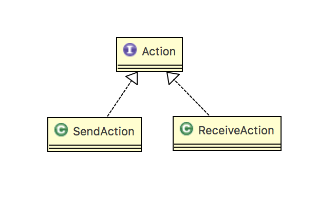

# 기본 API 클래스

자바에서 제공하는 API(Application Programming Interface)에 대해서 알아보자.

**API는 라이브러리(library)라고 부르기도 하는데, 프로그램 개발에 자주 사용되는 클래스 및 인터페이스의 모음을 말한다.** 이 API는  `<JDK설치경로>/jre/lib/rt.jar` 에 저장되어있다.

**[API 도큐먼트](http://docs.oracle.com/javase/8/docs/api/)**는 쉽게 **API를 찾아 이용할 수 있도록 문서화**한 것을 말한다.


## java.lang 패키지

자바 애플리케이션을 개발할 때 공통적으로 가장 많이 사용하는 패키지 중 하나이다. java.lang은 **자바 프로그램의 기본적인 클래스**를 담고 있는 패키지이다. 그렇기 때문에 import를 하지 않고 java.lang 속한 클래스와 인터페이스를 사용할 수 있다. *(ex) System과 String* 

| 클래스                                                       | 용도                                                         |
| ------------------------------------------------------------ | ------------------------------------------------------------ |
| Object                                                       | 자바 클래스의 최상위 클래스로 사용                           |
| System                                                       | - 표준 입력 장치(키보드)로부터 데이터를 입력받을 때 사용<br>- 표준 출력 장치(모니터)로 출력하기 위해 사용<br>- 자바 가상 기계를 종료시킬 때 사용<br>- 쓰레기 수집기를 실행 요청할 때 사용 |
| Class                                                        | 클래스를 메모리로 로딩할 때 사용                             |
| Math                                                         | 수학 함수를 이용할 때 사용                                   |
| Wrapper<br>(Byte, Short, Character, Integer, Float, Double, Boolean, Long) | - 기본 타입의 데이터를 갖는 객체를 만들 때 사용<br>- 문자열을 기본 타입으로 변환할 때 사용<br>- 입력값 검사에 사용 |

### Object 클래스

클래스 선언시 `extends`키워드로 다른 클래스를 상속하지 않으면 암시적으로 java.lang.Object 클래스를 상속하게 된다. 즉, **자바의 모든 클래스는 Object 클래스의 자식이거나 자손 클래스**이다. **Object는 자바의 최상위 부모 클래스**에 해당된다.


#### 객체 비교(equals())

```java
public boolean equals(Object obj){...}
```

매개 타입이 Object이므로 모든 객체가 대입될 수 있음을 알 수 있다.(자동 타입 변환) 두 객체가 동일한 객체라면 true, 아니라면 false를 리턴한다. 여기서 equals는 논리적으로 동등하면 true를 리턴한다. 여기서 논리적으로 동등하다는 것은 같은 객체이건 다른 객체이건 **상관없이 객체가 저장하고 있는 데이터가 동일**함을 뜻한다. 이 메소드는 직접 사용되지 않고 하위 클래스에서 재정의하여 논리적으로 동등 비교할 때 이용된다.

equals() 메소드를 재정의할 때는 매개값(비교 객체)이 기준 객체와 동일한 타입의 객체인지 먼저 확인해야한다.(`instanceof`) 비교 객체가 다른 타입이라면 false를 리턴한다.

```java
public class Member{
    public String id;
    public Member(String id){
        this.id = id;
    }
    
    @Override
    public boolean equals(Object obj){
        if(obj instanceof Member){
            Member member = (Member)obj;
            if(id.equals(memeber.id)){
                return true;
            }
        }
        return false;
    }
}
```


#### 객체 해시코드(hashCode())

객체 해시코드란 **객체를 식별할 하나의 정수값**을 말한다. 객체의 메모리 번지를 이용해서 해시코드를 만들어 리턴하기 때문에 객체마다 다른 값을 가지고 있다. 논리적 동등 비교시 hashCode()를 오버라이딩 할 필요성이 있다.

- hashCod() 리턴값 비교
  - 같음 : equals() 리턴값 비교
    - 같음 : 동등 객체
    - 다름 : 다른 객체
  - 다름 : 다른 객체

#### 객체 문자 정보(toString())

객체의 **문자 정보를 리턴**한다. 객체의 문자 정보란 **객체를 문자열로 표현한 값**을 말한다. 기본적으로 Object 클래스의 toString()은 "클래스명@16진수해시코드"로 구성된 문자정보를 리턴한다.

```java
Object obj = new Object();
System.out.println(obj.toString());

//java.lang.Object@de6ced
```

이 리턴값은 별 값어치가 없는 정보이므로 Object 하위 클래스는 toString() 메소드를 재정의(오버라이딩) 하여 간결하고 유익한 정보를 리턴하도록 되어있다.

- java.util.Date : 현재 시스템의 날짜와 시간 정보를 리턴
- String : 저장하고 있는 문자열 리턴

#### 객체 복제(clone())

**객체 복제는 원본 객체의 필드값과 동일한 값을 가지는 새로운 객체를 생성하는 것을 말한다.** 객체를 복제하는 이유는 원본 객체를 안전하게 보호하기 위해서이다. 신뢰하지 않는 영역으로 원본 객체를 넘겨 작업할 경우 원본 객체의 데이터가 훼손될 수 있다. 그러므로 복제된 객체의 데이터가 훼손되더라도 원본 객체는 아무런 영향을 받지 않기 때문에 안전하게 데이터를 보호할 수 있게 된다.

- 얕은 복제(this clone) : 단순히 필드값을 복사해서 객체를 복제하는 것을 말한다.

  - 기본 타입 : 값 복사
  - 참조 타입 : 객체의 번지 복사

  

  Object의 clone()메소드는 자신과 동일한 필드값을 가진 얕은 복제된 객체를 리턴한다. 이 메소드로 복제를 하려면 원본 객체는 반드시 **`java.lang.Cloneable`**인터페이스를 가지고 있어야한다. 메소드 선언이 없음에도 불구하고 Cloneable 인터페이스를 명시적으로 구현하는 이유는 클래스 설계자가 복제를 허용한다는 의도적인 표시를 하기 위해서이다.

  Cloneable 인터페이스를 구현하지 않으면 `CloneNotSupportedException` 예외가 발생하여 복제가 실패된다. clone()은 예외처리가 필요한 메소드 이므로 `try-catch`구문이 필요하다.

  ```java
  try{
      Object obj = clone();
  }catch(CloneNotSupportedException e){}
  ```

  ```java
  public class Member implements Cloneable{
      public String id;
      public String name;
      public String passwd;
      public int age;
      public boolean adult;
      
      public Member(String id, String name, String passwd, int age, boolean adult){
          this.id = id;
          this.name = name;
          this.passwd = passwd;
          this.age = age;
          this.adult = adult;
      }
      
      public Member getMember(){
          Member cloned = null;
          try{
              cloned = (Member)clone();
              //clone()메소드의 리턴타입은 Object이므로 Member타입으로 casting
          }catch(CloneNotSupportedException e){}
          return cloned;
      }
  }
  ```

  ​


- 깊은 복제(deep clone) : 얕은 복제의 참조 타입 필드는 번지만 복제되기 때문에 원본 객체의 필드와 복제 객체의 필드는 같은 객체를 참조하게 된다. 만약 복제 객체에서 참조 객체를 변경하면 원본 객체도 변경된 객체를 가지게 된다. **깊은 복제란 참조하고 있는 객체도 복제하는 것을 말한다.**

  

  깊은 복제를 하려면 Object clone()메소드를 재정의해서 참조 객체를 복제하는 코드를 직접 작성해야한다.

  ```java
  public class Member implements Cloneable{
      public String name;
      public int age;
  	// 아래 두개 참조 타입 필드
      public int[] scores;
      public Car car;
      
      public Member(String name, int age,int[] scores, Car car){
          this.name = name;
          this.age = age;
          this.scores = scores;
  		this.car = car;
      }
      
      @Override
      protected Object clone() throws CloneNotSupportedException{
          Member cloned = (Member)super.clone();
          cloned.scores = Arrays.copyOf(this.scores, this.scores.length);
          cloned.car = new Car(this.car.model);
          return cloned;
      }
      
      public Member getMember(){
          Member cloned = null;
          try{
              cloned = (Member)clone();
              //clone()메소드의 리턴타입은 Object이므로 Member타입으로 casting
          }catch(CloneNotSupportedException e){
              e.printStackTrace();
          }
          return cloned;
      }
  }
  ```

#### 객체 소멸자(finalize())

참조하지 않는 배열이나 객체는 Garbage Collector가 힙 영역에서 자동으로 소멸시킨다. Garbage Collector는 객체를 소멸하기 직전에 마지막으로 객체의 소멸자(finalize())를 실행시킨다. finalize()는 기본적으로 실행 내용이 없다. 만약 객체가 소멸되기 전에 마지막으로 사용했던 자원(데이터 연결, 파일 등)을 닫고 싶거나, 중요한 데이터를 저장하고 싶다면 재정의를 할 수 있다.

```java
public class Counter{
    private int no;
    public Counter(int no){
        this.no = no;
    }
    
    @Override
    protected void finalize() throws Throwable{
        System.out.println(no + "번 객체의 finalize()가 실행됨")
    }
}
```

```java
public class FinalizeEx{
    public static void main(String[] args){
        Counter counter = null;
        for(int i=1;i<=50;i++){
            counter = new Counter(i);
            
            counter = null; //쓰레기로 만듬
            System.gc();	//Garbage Collector 실행 요청
        }
    }
}
```

실행 결과를 보면 무작위로 소멸시키는 것을 볼 수 있다. 그리고 전부 소멸시키는 것이 아니라 메모리 상태를 보고 일부만 소멸시킨다.( 메모리가 부족할 때, CPU가 한가할 때 JVM에 의해서 자동 실행)

finalize()메소드가 호출되는 시점은 명확하지 않다. 만약 프로그램 종료시 즉시 자원을 해제하거나 즉시 데이터를 최종 저장해야 한다면, 일반 메소드에서 작성하고 프로그램이 종료될 때 명시적으로 메소드를 호출하는 것이 좋다.

###System 클래스

자바 프로그램은 운영체제상에서 바로 실행되는 것이 아니라 JVM위에서 실행된다. 따라서 운영체제의 모든 기능을 자바 코드로 직접 접근하기 어렵다. 하지만 **java.lang.System** 클래스를 이용하면 **운영체제의 일부 기능을 이용**할 수 있다.

즉, 프로그램 종료, 키보드로 입력, 모니터로 출력, 메모리 정리, 현재시간 읽기, 시스템 프로퍼티 읽기, 환경 변수 읽기 등이 가능하다. System 클래스의 모든 필드와 메소드는 정적(static)으로 구성되어있다.


#### 프로그램 종료(exit())

경우에 따라서 강제적으로 JVM을 종료시킬 때 사용한다. 즉, 현재 실행하고 있는 프로세스를 강제 종료시키는 역할을 한다.

exit()메소드는 int 매개값을 지정하도록 되어있는데, 이 값을 **종료 상태값**이라고 한다. 일반적으로 정상 종료일 경우 0, 비정상 종료일 경우 0이외의 수를 준다.

```java
System.exit(0);
```

어떤 값을 주더라도 종료가 되는데, 만약 특정 값이 입력되었을 경우에만 종료하고 싶다면 자바의 보안 관리자를 직접 설정해서 종료 상태값을 확인하면된다.

System.exit()가 실행되면 보안 관리자의 `checkExit()` 메소드가 자동 호출되는데, 이 메소드에서 종료 상태값을 조사해서 특정 값이 입력되지 않으면 SecurityException을 발생시켜  예외처리를 할 수 있도록 해준다. checkExit()가 정상적으로 실행되면  JVM은 종료된다.

```java
//예제
System.setSecurityManager(new SecurityManager(){
    @Override
    public void checkExit(int status){
        if(status != 5){
            throw new SecurityException();
        }
    }
});
```

#### 쓰레기 수집기 실행(gc())

자바는 개발자가 메모리를 직접 코드로 관리하지 않고 JVM이 알아서 자동으로 관리한다. **JVM은 메모리가 부족할 때와 CPU가 한가할 때에 Garbage Collector를 실행시켜 사용하지 않는 객체를 자동 제거**한다. 

GC는 개발자가 직접 코드로 실행시킬 수 없고, JVM에게 가능한한 빨리 실행해달라고 요청할 수 있다. 이것이 System.gc()메소드이다.

즉, System.gc() 메소드가 호출되면 GC가 바로 실행되는 것은 아니고, JVM은 빠른 시간 내에 실행시키기 위해 노력한다.

```java
System.gc();
```

쓰레기가 생길 때마다 GC가 동작한다면 정작 수행되어야 할 프로그램의 속도가 떨어지기 때문에 성능 측면에서 좋지않다. 그리고 메모리가 충분하다면 굳이 GC를 실행할 필요가 없다.

```java
//예제
public class GcEx{
    public static void main(String[] args){
        Employee emp;
        
        emp = new Employee(1);
        emp = null; //쓰레기가됨
        emp = new Employee(2);
        emp = new Employee(3); // Employee(2)쓰레기
        
        System.out.println("emp가 최종적으로 참조하는 사원번호 : ");
        System.out.println(emp.eno);
        System.gc();
    }
}
class Employee{
	public int eno;
    public Employee(int eno){
        this.eno = eno;
        system.out.prinlnt("Employee"+eno+" 가 메모리에 생성됨");
    }
    // 소멸자
    public void finalize(){
        System.out.println("Employee"+eno+이 메모리에서 제거됨);
    }
}
```

#### 현재 시각 읽기(currentTimeMillis(), nanoTime())

컴퓨터의 시계로부터 현재 시간을 읽어서  밀리세컨드(1/1000초)단위와 나노세컨드(1/10^9초)단위의 long값을 리턴한다.

```java
long time = System.currentTimeMillis();
long time = System.nanoTime();
```

리턴 값은 주로 프로그램 실행 소요 시간 측정에 사용된다. 프로그램 시작 시 시간을 읽고, 프로그램이 끝날 때 시각을 읽어서 차이를 구하면 프로그램 실행 소요 시간이 나온다.

#### 시스템 프로퍼티 읽기(getProperty())

시스템 프로퍼티는 JVM이 시작될 때 자동 설정되는 시스템의 속성값을 말한다. 예를 들어 운영체제의 종류, 자바 프로그램을 실행시킨 사용자 아이디, JVM 버전 등등이 여기에 속한다. 시스템 프로퍼티는 키(key)와 값(value)로 구성되어있다.

| key            | 설명                        | value                |
| -------------- | --------------------------- | -------------------- |
| java.version   | 자바 버전                   | 1.8.0_20             |
| java.home      | 사용하는 JRE 파일 경로      | `<jdk 설치경로>/jre` |
| os.name        | 운영체제 이름               | Mac OS X             |
| file.separator | File separaotr("/" on UNIX) | null                 |
| user.name      | 사용자 이름                 | 사용자 계정          |
| user.home      | 사용자 홈 디렉토리          | /Users/사용자계정    |
| user.dir       | 사용자가 현재 작업중인 경로 | 작업중인 경로        |

시스템 프로퍼티를 읽어오기 위해서 `System.getProperty()`를 이용하면된다. 이 메소드는 키이름을 매개값으로 받고, 해당 키에 대한 값을 문자열로 리턴한다.

```java
String value = System.getProperty(String key);
```

System.getProperties()는 모든 (키, 값)쌍을 저장하고 Properties 객체를 리턴한다. 이 객체의 keySet() 메소드를 호출하면 키만으로 구성된 set객체를 얻을 수 있다.

```java
Properties props = System.getProperties();
Set keys = props.keySet();
```


#### 환경 변수 읽기(getenv())

대부분 운영체제는 실행되는 프로그램들에게 **유용한 정보를 제공할 목적으로 환경 변수(Environment Variable)를 제공**한다. 환경 변수는 프로그램상의 변수가 아니라 **운영체제에서 이름과 값으로 관리되는 문자열 정보**다. 환경변수는 운영체제가 설치될 때 기본적인 내용이 설정되고, 사용자가 직접 설정하거나 응용 프로그램이 설치될 때 자동적으로 추가 설정 되기도 한다.

```java
String value = System.getenv(String name);
```

```java
//예제
public class SystemEnvEx{
    public static void main(String[] args){
        String javaHome = System.getenv("JAVA_HOME");
        System.out.println(javaHome);
    }
}
```


### Class 클래스

클래스와 인터페이스의 메타 데이터(클래스 이름, 생성자 정보, 필드 정보, 메소드 정보)를 관리하는 클래스이다. 


#### Class 객체 얻기(getClass(), forName())

Object는 모든 클래스의 최상위 클래스이므로 모든 클래스에서 getClass() 메소드를 호출할 수 있다.

```java
Class c = obj.getClass();
```

getClass() 메소드는 해당 클래스로 객체를 생성했을 때만 사용할 수 있는데, 객체를 생성하기 전에 직접 Class 객체를 얻을 수도 있다. Class는 생성자를 감추고 있기 때문에 new연산자로 객체를 만들 수 없으며, 정적(static) 메소드인 forName()을 이용해야한다.

```java
try{
    Class c = Class.forName(String className);
}catch(ClassNotFoundException e){
}
```

forName() 메소드는 클래스 전체 이름(패키지가 포함된 이름)을 매개값으로 받고 Class 객체를 리턴한다.

```java
//예제
public class ClassEx{
    public static void main(String[] args){
        Car car = new Car();
        Class c = car.getClass();
        System.out.println(c.getName());
        System.out.println(c.getSimpleName());
        System.out.println(c.getPackage().getName();
        try{
            Class c2 = Class.forName("sec06.exam_class.Car");
            System.out.println(c2.getName());
            System.out.println(c2.getSimpleName());
            System.out.println(c.getPackage().getName());
        }catch(ClassNotFoundException e){
            e.printStackTrace();
        }
    }
}
```


#### Reflection(getDeclaredConstructors(), getDeclaredFields(), getDeclaredMethods())

Reflection은 Class 객체를 이용해 클래스의 생성자, 필드, 메소드 정보를 알아내는 것을 말한다.

```java
Constructor[] constructors = c.getDeclaredConstructors();
Field fields = c.getDeclaredFields();
Method[] methods = c.getDeclaredMethods();
```

각각 Constructor 배열, Field 배열, Method 배열을 리턴한다. Constructor, Field, Method 클래스는 모두 `java.lang.reflect` 패키지에 소속되어 있다. 여기서 getDeclaredFields()와 getDeclaredMethods()는 클래스에 선언된 멤버만 가져오고 상속된 멤버는 가져오지 않는다. 상속된 멤버도 가져오고 싶다면 getFields(), getMethods()를 이용해야한다. 단, public 멤버만 가져온다.

```java
//예제
public class ReflectEx{
    public static void main(String[] args){
        Class c = Class.forName("sec06.exam_reflect.Car");
        
        System.out.println("클래스이름"+c.getName());
        System.out.println("생성자 정보");
        Constructor constructors = c.getDeclaredConstructors();
        for(Constructor constructor : constructors){
            System.out.println(constructor.getName()+"(");
            Class[] params = constructors.getParameterTypes();
            printParameters(params);
            System.out.println(")");
        }
        System.out.println("필드 정보");
        Field[] fields = c.getDeclaredFields();
        for(Field f: fields){
            System.out.println(f.getType().getSimpleNmae()+" "+ f.getName());
        }
        System.out.println("메소드 정보");
        Method[] methods = c.getDeclaredMethods();
        for(Method m : methods){
            System.out.println(m.getName()+"(");
            Class[] params = m.getParameterTypes();
            printParameters(params);
            System.out.println(")");
        }
        private static void printParameters(Class[] params){
            for(int i=0;i<params.length;i++){
                System.out.print(params[i].getName());
                if(i<params.length-1){
                    System.out.print(", ");
                }
            }
        }
    }
}
```

실행 결과는 Car 클래스가 가지고 있는 전체 멤버들이 모두 출력된다.


#### 동적 객체 생성(newInstance())

Class 객체를 이용하면 **new 연산자를 사용하지 않아도 동적으로 객체를 생성**할 수 있다. 이 방법은 런타임 시에 클래스 이름이 결정되는 경우에 매우 유용하게 사용된다.

```java
try{
    Class c = Class.forName("런타임 시 결정되는 클래스 이름");
    Object obj = c.newInstance();
}catch(ClassNotFoundException e){
}catch(InstantiationException e){
}catch(IllegalAccessException e){
}
```

newInstance() 메소드는 기본 생성자를 호출해서 객체를 생성하기 때문에 반드시 클래스에 기본 생성자가 존재해야한다. 만약 매개변수가 있는 생성자를 호출하고 싶으면 Constructor 객체를얻어 newInstance()메소드를 호출하면된다.

InstantiationException은 해당 클래스가 추상 클래스이거나 인터페이스일 경우에 발생하고, IllegalAccessException은 클래스나 생성자가 접근 제한자로 인해 접근할 수 없는 경우에 발생한다.

newInstance() 메소드의 리턴 타입은 Object이므로 원래 클래스 타입으로 변환해야만 메소드를 사용할 수 있다. 하지만 클래스 타입을 모르는 상태이므로 강제 타입 변환을 할 수 없다. 이 문제를 해결하기 위해서 인터페이스가 필요하다.



```java
public interface Action {
	public void execute();
}
```

```java
public class ReceiveAction implements Action {
	@Override
	public void execute() {
		System.out.println("데이터를 받습니다..");
		
	}
}
```

```java
public class SendAction implements Action {
	@Override
	public void execute() {
		System.out.println("데이터를 보냅니다.");
	}
}
```

```java
public class Main {
	public static void main(String[] args) {
		try {
//			Class c = Class.forName("SendAction");
			Class c = Class.forName("ReceiveAction");
			Action action = (Action)c.newInstance();
			action.execute();
		}catch(ClassNotFoundException e){
			e.printStackTrace();
		}catch(InstantiationException e){
			e.printStackTrace();
		}catch(IllegalAccessException e){
			e.printStackTrace();
		}
	}
}
```

forName()메소드 매개값으로 주어진 클래스의 execute()가 실행되는 것을 알 수 있다.


### Wrapper(포장) 클래스

**자바는 기본 타입**(byte, char, short, int ,long, float, double, boolean)의 **값을 갖는 객체**를 생성할 수 있다. 이런 객체를 **Wrapper 객체**라 한다. 그 이유는 기본 타입의 값을 내부에 두고 포장하기 때문이다. 포장 객체의 특징은 포장하고 있는 기본 타입 값은 외부에서 변경할 수 없다. 만약 내부 값을 변경하고 싶다면 새로운 포장 객체를 만들어야한다.

| 기본타입 | 포장클래스 |
| -------- | ---------- |
| byte     | Byte       |
| char     | Character  |
| short    | Short      |
| int      | Integer    |
| float    | Float      |
| double   | Double     |
| boolean  | Boolean    |

#### Boxing과 Unboxing

기본 타입의 값을 포장 객체로 만드는 과정을 Boxing이라고 하고, 반대로 포장 객체에서 기본 타입의 값을 얻어내는 과정을 Unboxing이라고 한다.

| 기본 타입의 값을 줄 경우             | 문자열을 줄 경우                   |
| ------------------------------------ | ---------------------------------- |
| Byte obj = new Byte(10);             | Byte obj = new Byte("10");         |
| Character obj = new Character('가'); | 없음                               |
| Short obj = new Short(100);          | Short obj = new Short("100");      |
| Integer obj = new Integer(1000);     | Integer obj = new Integer("1000"); |
| Long obj = new Long(10000);          | Long obj = new Long("10000");      |
| Float obj = new Float(2.5F);         | Float obj = new Float("2.5F");     |
| Double obj = new Double(3.5);        | Double obj = new Double("3.5");    |
| Boolean obj = new Boolean(true);     | Boolean obj = new Boolean("true"); |

위의 표는 boxing하는 방법을 보여준다. 생성자를 이용하지 않아도 다음과 같이 valueOf()메소드를 사용할 수도 있다.

```java
Integer obj = Integer.valueOf(1000);
Integer obj = Integer.valueOf("1000");
```

이렇게 boxing된 포장 객체에서 다시 기본 타입의 값을 얻어 내기 위해서는 "기본타입명 + Value()"메소드를 호출하면된다.

```java
byte num=obj.byteValue();
char ch=obj.charValue();
...
```


```java
//예제
//boxing
Integer obj1 = new Integer(100);
Integer obj2 = new Integer(200);
Integer obj3 = Integer.valueOf("300");

//unboxing
int value1 = obj1.intValue();
int value2 = obj2.intValue();
int value3 = obj3.intValue();
```

#### 자동 boxing & unboxing

기본 타입 값을 직접 boxing, unboxing하지 않아도 자동으로 boxing과 unboxing이 일어나는 경우가 있다. 

자동 boxing은 포장 클래스 타입에 기본값이 대입될 경우이다.

```java
Integer obj = 100;
```

자동 unboxing은 기본 타입에 포장 객체가 대입될 경우에 발생한다.

```java
Integer obj = new Integer(200);
int value = obj;
```


#### 문자열을 기본 타입 값으로 변환

포장 클래스의 주요 용도는 기본 타입의 값을 박싱해서 포장 객체로 만드는 것이지만, **문자열을 기본 타입 값으로 변환**할 때도 많이 사용된다. 대부분의 포장 클래스에는 "parse+기본타입" 명으로 되어있는 정적(static) 메소드가 잇다. 이 메소드는 문자열을 매개값으로 받아 기본 타입 값으로 변환한다.

```java
byte num = Byte.parseByte("10");
short num = Short.parseShort("10");
// int, long, float, double, boolean
```


#### 포장 값 비교

포장 객체는 내부의 값을 비교하기 위해 `==`와 `!=` 연산자를 사용할 수 없다. 이 연산자는 내부의 값을 비교하는 것이 아니라 포장 객체의 참조를 비교하기 때문이다.

```java
Integer obj1 = 300;
Integer obj2 = 300;
System.out.println(obj1==obj2);
//=>false
```

내부의 값만 비교하려면 Unboxing한 값을 얻어 비교해야한다. 그러나 boxing된 값이 다음 표에 나와 있는 값이라면 `==`와 `!=` 연산자로 내부의 값을 바로 비교할 수 있다. 그 이외에는 unboxing한 후에 비교해야한다.

| 타입             | 값의 범위     |
| ---------------- | ------------- |
| boolean          | true,false    |
| char             | \u0000~\u007f |
| byte, short, int | -128~127      |

포장 객체에 정확히 어떤 값이 저장될지 모르는 상황이면 비교 연산자(`==`,`!=`)는 사용하지 않는 것이 좋다. 직접 내부 값을 unboxing해서 비교하거나 equals() 메소드로 내부 값을 비교하는 것이 좋다.


## java.util 패키지

자바 애플리케이션을 개발할 때 공통적으로 가장 많이 사용하는 패키지 중 하나이다. java.util 패키지는 자바 프로그램 개발에 **조미료 같은 역할**을 하는 클래스를 담고 있다. 대부분을 컬렉션 클래스들이 차지하고 있다.

| 클래스          | 용도                                          |
| --------------- | --------------------------------------------- |
| Arrays          | 배열을 조작(비교, 복사, 정렬, 찾기)할 때 사용 |
| Calendar        | 운영체제의 날짜와 시간을 얻을 때 사용         |
| Date            | 날짜와  시간 정보를 저장하는 클래스           |
| Objects         | 객체 비교, null 여부 등을 조사할 때 사용      |
| StringTokenizer | 특정 문자로 구분된 문자열을 뽑아낼 때 사용    |
| Random          | 난수를 얻을 때 사용                           |

### Objects 클래스

Object와 유사한 이름을 가진 Objects 클래스는 **객체 비교, 해시코드 생성, null 여부, 객체 문자열 리턴** 등의 연산을 수행하는 정적 메소드로 구성된  **Object의 유틸리티 클래스**이다.

| 리턴타입 | 메소드(매개변수)                                          | 설명                                                         |
| -------- | --------------------------------------------------------- | ------------------------------------------------------------ |
| int      | `compare(T a, T b, Comparator<T> c)`                      | 두 객체 a와 b를 Comparator를 사용해서 비교                   |
| boolean  | deepEquals(Object a, Object b)                            | 두 객체의 깊은 비교(배열의 항목까지 비교)                    |
| boolean  | equals(Object a,Object b)                                 | 두 객체의 얕은 비교(번지만 비교)                             |
| int      | hash(Object… values)                                      | 매개값이 저장된 배열의 해시코드 생성                         |
| int      | hashCode(Object c)                                        | 객체의 해시코드 생성                                         |
| boolean  | isNull(Objec obj)                                         | 객체가 null인지 조사                                         |
| boolean  | nonNull(Objec obj)                                        | 객체가 null이 아닌지 조사                                    |
| T        | requireNonNull(T obj)                                     | 객체가 null인 경우 예외 발생                                 |
| T        | requireNonNull(T obj, String message)                     | 객체가 null인 경우 예외 발생(주어진 예외 메시지 포함)        |
| T        | `requireNonNull(T obj, Supplier<String> messageSupplier)` | 객체가 null인 경우 예외 발생(람다식이 만든  예외 메시지 포함) |
| String   | toString(Object o)                                        | 객체의 toString() 리턴값 리턴                                |
| String   | toString(Object o, String nullDefault)                    | 객체의 toString() 리턴값 리턴, 첫 번째 매개값이 null일 경우 두번째 매개값 리턴 |

#### 객체 비교(`compare(T a, T b, Comparator<T> c)`)

두 객체를 비교자(Comparator)로 비교해서 int값을 리턴한다. `java.util.Comparator<T>`는 제네릭 인터페이스 타입으로 두 객체를 비교하는 `compare(T a, T b)` 메소드가 정의되어 있다. 제네릭은 이후 [13. 제네릭](./java13.md)에서 학습한다. T는 비교할 객체 타입이다.

**a가 b보다 작으면 음수, 같으면 0, 크면 양수**를 리턴하도록 구현 클래스를 만들어야한다.

```java
public interface Comparator<T>{
    int compare(T a, T b);
}
```

```java
// 예제
class StudentComparator implements Comparator<Student>{
    @Override
    public int compare(Student a, Student b){
        if(a.sno<b.sno)return -1;
        else if(a.sno==b.sno)return 0;
        else return 1;
        // return Integer.compare(a.sno,b.sno)로 간단하게 바꿀 수 있다.
    }
}
```

#### 동등 비교(equals()와 deepEquals())

| a        | b        | Objects.equlas(a,b)  |
| -------- | -------- | -------------------- |
| not null | not null | a.eqauls(b)의 리턴값 |
| null     | not null | false                |
| not null | null     | false                |
| null     | null     | true                 |

**특이한 점은 a와 b가 둘다 null일 경우 true를 리턴**한다는 점이다.

| a                   | b                   | Objects.deepEqulas(a,b)       |
| ------------------- | ------------------- | ----------------------------- |
| not null(not array) | not null(not array) | a.eqauls(b)의 리턴값          |
| not null(array)     | not null(array)     | Arrays.deepEqauls(b)의 리턴값 |
| null                | not null            | false                         |
| not null            | null                | false                         |
| null                | null                | true                          |

#### 해시코드 생성(hash(), hashCode())

매개값으로 주어진 값들을 이용해서 해시 코드를 생성한다. 주어진 매개값들로 배열을 생성하고 `Arrays.hashCode(Object[])`를 호출해 해시코드를 얻고 이 값을 리턴한다. 이 메소드는 클래스가 `hashCode()`를 재정의할 때 리턴값을 생성하기 위해 사용하면 좋다.

클래스가 여러 가지 필드를 가지고 있을 때 이 필드들로 부터 해시코드를 생성하게 되면 동일한 필드값을 가지는 객체는 동일한 해시코드를 가질 수 있다.

```java
@Override
public int hashCode(){
    return Objects.hash(field1,field2,field3);
}
```

`Objects.hashCode(Object o)`는 매개값으로 주어진 객체의 해시코드를 리턴하기 때문에 `o.hashCode()`의 리턴값과 동일하다. 차이점은 null이면 0을 리턴한다.

```java
//예시
public class HashCodeEx{
    public static void main(String[] args){
        Student s1 = new Student(1,"홍길동");
        Student s2 = new Student(1,"홍길동");
        System.out.println(s1.hashCode());
        System.out.println(Objects.hashCode(s2));
        //=> 54151054
        //=> 54151054
    }
    static class Student{
        int sno;
        String name;
        Student(int sno, String name){
            this.sno = sno;
            this.name = name;
        }
        @Override
        public int hashCode(){
            return Objects.hahs(sno,name);
        }
    }
}
```

#### 널 여부 조사(isNull(), nonNull(), requireNonNull())

isNull()은 매개값이 null인 경우 true를 리턴한다. 반대로 nonNull()은 매개값이 not null인 경우 true를 리턴한다. requireNonNull은 다음 세가지로 오버라이딩 되어있다.

| 리턴타입 | 메소드(매개변수)                                           | 설명                                                         |
| -------- | ---------------------------------------------------------- | ------------------------------------------------------------ |
| T        | requireNonNull(T obj)                                      | not null→obj<br>null→NullPointerException                    |
| T        | requireNonNull(T obj, String message)                      | not null→obj<br>null→NullPointerException(message)           |
| T        | `requireNonNull(T obj, Supplier<String>  messageSupplier)` | not null→obj<br>null→NullPointerException(msgSupplier.get()) |

```java
//예제
public class NullEx{
    public static void main(String[] args){
        String str1 = "홍길동";
        String str2 = null;
        
        System.out.println(Objects.requireNonNull(str1));
        //=>홍길동
        
        try{
            String name = Objects.requireNonNull(str2);
        }catch(Exception e){
            System.out.println(e.getMessage());
        }
        //=> null
        try{
            String name = Objects.requireNonNull(str2,"이름이 없습니다.");
        }catch(Exception e){
            System.out.println(e.getMessage());
        }
        //=>이름이 없습니다.
        try{
            String name = Objects.requireNonNull(str2,()->"이름이 없습니다.");
            //람다식
        }catch(Exception e){
            System.out.println(e.getMessage());
        }
        //=>이름이 없습니다.
    }
}
```

#### 객체 문자 정보(toString())

객체의 문자 정보를 리턴한다. 두 가지로 오버로딩 되어있다.

| 리턴 타입 | 메소드(매개 변수)                      | 설명                                      |
| --------- | -------------------------------------- | ----------------------------------------- |
| String    | toString(Object o)                     | not null→o.toString()<br>null→"null"      |
| String    | toString(Object o, String nullDefault) | not null→o.toString()<br>null→nullDefault |

```java
//예제
public class ToStringEx{
    public static void main(String[] args){
        String str1 = "홍길동";
        String str2 = null;
        
        System.out.println(Objects.toString(str1));
        System.out.println(Objects.toString(str2));
        System.out.println(Objects.toString(str2,"이름이 없습니다."));
        //=>홍길동
        //=>null
        //=>이름이 없습니다.
    }
}
```


### StringTokenizer 클래스

문자열이 **특정 구분자(delimiter)로 연결**되어 있을 경우, **구분자를 기준으로 부분 문자열을 분리**하기 위해서는 String 의 split()메소드를 이용하거나, StringTokenizer 클래스를 이용할 수 있다.

차이점은 split은 **정규표현식**으로 구분하고, StringTokenizer는 **문자로 구분**한다.

#### split() 메소드

```java
String[] res = "문자열".split("정규표현식");
```

위와 같이 정규표현식을 구분자로 해서 문자열을 분리한 후, 배열에 저장하고 리턴한다.

```
자바&java,루비-ruby
```

다음 문자열을 `&`, `,`, `-` 를 제외하고 따로 뽑아내고 싶은 경우

```java
String PL = "자바&java,루비-ruby".split("&|,|-");
//=> ["자바","java","루비","ruby"]
```

#### StringTokenzier 클래스

문자열이 한 종류의 구분자로 연결되어 있을 경우에 사용하면 손쉽게 문자열을 분리해 낼 수 있다.

```java
StringTokenzier str = new StringTokenzier("문자열","구분자");
```

전체 토큰수, 남아 있는 토큰 여부를 확인 할 수 있다.

| 메소드  |                 | 설명                            |
| ------- | --------------- | ------------------------------- |
| int     | countTokens()   | 꺼내지 않고 남아 있는 토큰의 수 |
| boolean | hasMoreTokens() | 남아 있는 토큰이 있는지 확인    |
| String  | nextToken()     | 토큰을 하나씩 꺼내옴            |

StringTokenzier 객체에서 더이상 가져올 토큰이 없다면 nextToken()은 NoSuchElementException 예외를 발생시킨다.

```java
String text = "자바,java,루비,ruby";

//방법1 : 전체 토큰 수를 얻어 for문 실행
StringTokenzier str = new StringTokenzier(text,",");
int count = str.countTokens();
for(int i=0;i<count;i++){
    String token = str.nextToken();
   	System.out.println(token);
}

//방법2 : 남아 있는 토큰을 확인하고, while문 루핑
str = new StringTokenzier(text,",");
while(str.hasMoreTokens()){
    String token = str.nextToken();
   	System.out.println(token);
}
```


### Arrays 클래스

배열의 복사, 항목 정렬, 항목 검색과 같은 배열 조작을 할 수 있다. 단순한 배열 복사는 `System.arraycopy()` 메소드를 사용할 수 있으나 Arrays클래스는 추가적인 긴응을 제공해준다.

| 리턴타입  | 메소드 이름                                 | 설명                                                         |
| --------- | ------------------------------------------- | ------------------------------------------------------------ |
| int       | binarySearch(배열, 찾는값)                  | 전체 배열 항목에서 찾는 값이 있는 인덱스 리턴                |
| 타겟 배열 | copyOf(원본배열, 복사할길이)                | 원본 배열의 0번 인덱스에서 복사할 길이만큼 복사한 배열 리턴, 복사할 길이는 원본 배열의 길이보다 커도 되며, 타겟 배열의 길이가된다. |
| 타겟 배열 | copyOfRange(원본배열, 시작인덱스, 끝인덱스) | 원본 배열의 시작 인덱스에서 끝 인덱스까지 복사한 배열 리턴   |
| boolean   | deepEquals(배열,배열)                       | 두 배열의 깊은 비교(중첩 배열의 항목까지 비교)               |
| boolean   | equals(배열,배열)                           | 두 배열의 얕은 비교(중첩 배열의 항목은 비교하지 않음)        |
| void      | fill(배열, 값)                              | 전체 배열 항목에 동일한 값을 저장                            |
| void      | fill(배열, 시작인덱스,끝인덱스, 값)         | 시작 인덱스부터 끝 인덱스까지의 항목에만 동일한 값을 저장    |
| void      | sort(배열)                                  | 배열의 전체 항목을 오름차순으로 정렬                         |
| String    | toString(배열)                              | "[값1,값2,…]" 와 같은 문자열 리턴                            |

#### 배열 복사

- 방법1,2 

```java
char[] arr1 = {'J','A','V','A'};
char[] arr2 = Arrays.copyOf(arr1, arr1.length);
//=> ["J","A","V","A"]
char[] arr3 = Arrays.copyOfRange(arr1,1,3);
//여기서 시작인덱스는 포함되지만 끝 인덱스는 포함하지 않는다.
//=> [A","V"]
```

- 방법3

단순히 배열을 복사할 목적이라면 System.arraycopy() 메소드를 이용할 수 있다.

```java
System.arraycopy(Object src, int srcPos, Object dest, int destPos, int length);
// 차례대로 원본배열, 원본시작인덱스, 타겟배열, 타겟시작인덱스, 복사개수이다.
```

```java
//예제
char[] arr1 = {'J','A','V','A'};

//방법1
char[] arr2 = Arrays.copyOf(arr1, arr1.length);
//방법2
char[] arr3 = Arrays.copyOfRange(arr1,0,arr1.length);
//방법3
char arr4 = new char[arr1.length]
System.arraycopy(arr1,0,arr4,0,arr1.length);
```


#### 배열 항목 비교

equals()는 1차 항목의 값만 비교하고, deepEquals()는 1차 항목이 서로 다른 배열을 참조할 경우 중첩된 배열의 항목까지 비교한다.

```java
int[][] origin = {{1,2},{3,4}};

//얕은 복제
int[][] clone1 = Arrays.copyOf(origin,origin.length);
System.out.println("배열 번지 비교"+origin.equals(clone1));
//=>false
System.out.println("1차 배열 항목값 비교"+Arrays.deepEquals(clone1));
//=>true
System.out.println("중첩 배열 항목값 비교"+Arrays.deepEquals(clone1));
//=>true

//깊은 복제
int[][] clone2 = Arrays.copyOf(origin, origin.length);
clone2[0]=Arrays.copyOf(origin[0],origin[0].length);
clone2[1]=Arrays.copyOf(origin[1],origin[1].length);
System.out.println("배열 번지 비교"+origin.equals(clone2));
//=>false
System.out.println("1차 배열 항목값 비교"+Arrays.deepEquals(clone2));
//=>false
System.out.println("중첩 배열 항목값 비교"+Arrays.deepEquals(clone2));
//=>true
```


#### 배열 항목 정렬

기본 타입 또는 String 배열은 Arrays.sort()메소드의 매개값으로 지정해주면 자동으로 오름차순으로 정렬이 된다. 사용자 정의 클래스 타입일 경우에는 클래스가 Comparable 인터페이스를 구현하고 있어야 정렬이된다.

```java
public class Member implements Comparable<Memeber>{
    String name;
    Memeber(String name){
        this.name = name;
    }
    @Override
    public int compareTo(Member o){
        return name.comapareTo(o.name);
    }
}
```

`Comparable<Member>` 는 Member 타입만 비교하기 위해 제네릭`<>`을 사용했다. compareTo() 메소드는 비교값을 리턴하도록 오버라이딩했다. compareTo()메소드는 오름차순인 경우 자신이 매개값보다 낮을 경우 음수, 같은 경우 0 , 높을 경우 양수를 리턴하면된다. 반대로 내림차순일 때는 오름차순의 반대로 리턴하면된다.

```java
int[] scores={99,97,98};

Arrays.sort(scores);

Member m1 = new Member("유재석");
Member m2 = new Member("강호동");
Member m3 = new Member("전현무");
Member[] members = {m1,m2,m3};
Arrays.sort(members);
```


####  배열 항목 검색

배열 항목에서 특정 값이 위치한 인덱스를 얻는 것을 배열 검색이라고 한다. 배열 항목을 검색하려면 먼저 Arrays.sort()메소드로 항목들을 오름차순으로 정렬한 후, Arrays.binarySearch()메소드로 항목을 찾아야한다.

```java
int[] scores={99,97,98};

Arrays.sort(scores);
int index = Arrays.binarySearch(scores,99);
//=>2
Member m1 = new Member("유재석");
Member m2 = new Member("강호동");
Member m3 = new Member("전현무");
Member[] members = {m1,m2,m3};
Arrays.sort(members);
index = Arrays.binarySearch(members,m1);
//=>1
```