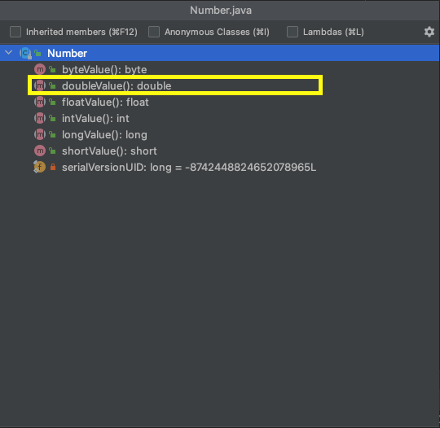

# Generic

시작하기에 앞서 관련 용어를 정리해 둘것이다. 

| 한글                     | 영어                    | 예                                 |
| ------------------------ | ----------------------- | ---------------------------------- |
| 매개변수화 타입          | parameterized type      | `List<String>`                     |
| 실제 타입 매개변수       | actual type parameter   | `String`                           |
| 제네릭 타입              | generic type            | `List<E>`                          |
| 정규 타입 매개변수       | formal type parameter   | `E`                                |
| 비한정적 와일드카드 타입 | unbounded wildcard type | `List<?>`                          |
| 로 타입                  | raw type                | `List`                             |
| 한정적 타입 매개변수     | bounded type parameter  | `<E extends Number>`               |
| 재귀 타입 한정           | recursive type bound    | `<T extends Comparable<T>>`        |
| 한정적 와일드카드 타입   | bounded wildcard type   | `List<? extends Number>`           |
| 제네릭 메서드            | generic method          | `static <E> List<E> asList(E[] a)` |
| 타입 토큰                | type token              | `String.class`                     |

------

## Generic이란 무엇일까?

JDK 1.5에 처음 도입되었으며, 제네릭은 **클래스 내부에서 사용할 데이터 타입을 외부에서 지정하는 기법**을 의미한다.(*생활코딩* )

```java
public class Fruit<T> {
  	public T fruit;
}
```

```java
Fruit<Apple> apple = new Fruit<>();
Fruit<Banana> apple = new Fruit<>();
```

위의 예제를 보면 `Fruit` 인스턴스를 생성할 때, `Apple`, `Banana` 를 넣어 타입을 지정하고 있다.
즉, 클래스를 정의 할 때는 어떤 타입이 들어올지 확정하지 않고, 인스턴스를 생성할 떄 데이터 타입을 지정하는 기능이다.

## 왜 제네릭을 사용할까?

Generic은 클래스와 인터페이스, 메서드를 정의할 때 타입을 파라미터로 사용할 수 있게 한다. 
Generic 타입을 이용함으로써 잘못된 타입이 사용될 수 있는 문제를 컴파일 과정에서 제거할 수 있게되었다. 
타입 파라미터는 코드 작성 시 구체적인 타입으로 대체되어 다양한 코드를 생성하도록 해준다.

### 컴파일 시 강한 타입 체크를 할 수 있다.

컴파일 언어의 기본은 모든 에러는 컴파일이 발생할 수 있도록 하는 것이 좋다.(오류는 빨리 발견할 수록 좋다.)
런타임은 실제로 애플리케이션이 동작하고 있는 상황이기 때문에 런타임에 발생하는 에러는 항상 심각한 문제를 초래할 수 있기 때문이다.

```java
public class GenericTest {

    @Test
    void runtimeExceptionTest() {
        Person person = new Person("파트너");
        Assertions.assertThrows(ClassCastException.class, () -> {
            Employee employee = (Employee) person.info;
        });
    }

    static class Employee {
        public int rank;
        Employee(int rank){ this.rank = rank; }
    }

    static class Person {
        public Object info;
        Person(Object info){ this.info = info; }
    }
}
```

```
java.lang.ClassCastException: class java.lang.String cannot be cast to class ...
```

위는 성공적으로 컴파일되지만, 런타임시 `ClassCastException` 이 발생하는 것을 보여주는 예제이다. 이때 Generic Type을 사용해 컴파일 타임에 오류를 발견할 수 있도록 할 수 있다.

```java
public class GenericTest {

    @Test
    void compileTimeExceptionTest() {
        Person<Employee> person = new Person<>(new Employee(10));
        Employee employee = person.info;
        Assertions.assertEquals(10, employee.rank);

        // 컴파일 오류 발생
        // java: incompatible types: java.lang.String cannot be converted to int
        Person<Employee> person2 = new Person<>(new Employee("파트너"));
    }

    static class Employee {
        public int rank;
        Employee(int rank){ this.rank = rank; }
    }

    static class Person<T> {
        public T info;
        Person(T info){ this.info = info; }
    }
}
```

Generic type으로 변경 후에는 `java: incompatible types: java.lang.String cannot be converted to int` 컴파일 오류가 발생하는 것을 확인할 수 있다.

즉, 컴파일 단계에서 오류 검출이 가능하며, 타입 안정성을 추구할 수 있게된다.

### 타입 변환(casting)을 제거한다.

```java
// generic이 아닌경우
List list = new ArrayList();
list.add("hello");
String str = (String)list.get(0); // 타입 변환이 필요

// generic
List<String> list = new ArrayList<String>();
list.add("hello");
String str = list.get(0); // 타입 변환을 하지 않음
```


## Generic Type

Generic Type은 **타입을 파라미터로 가지는 클래스(`class<T>`)와 인터페이스(`interface<T>`)**를 말한다.

```java
public class 클래스명<T> {...}
public interface 인터페이스명<T> {...}
```

 타입 파라미터는 변수명과 동일한 규칙으로 작성될 수 있지만, **일반적으로 대문자 한글자**로 표현한다. Generic Type을 실제 코드에서 사용하려면 타입 파라미터에 구체적인 타입을 지정해야한다.

```java
public class Box {
    private Object obj;

    public void set(Object object){ this.obj = object; }
    public Object get(){ return obj; }
}
```

위의 코드에서  클래스 필드 타입을 Object로 선언한 이유는 필드에 모든 종류의 객체를 저장하고 싶어서이다.
 **Object는 모든 자바 클래스의 최상위 조상(부모) 클래스이다.** 자식 객체는 부모타입에 대입할 수 있기 때문에 모든 자바 객체는 Object타입으로 자동 타입변환되어 저장된다.

```java
Box box = new Box();
box.set("안녕");                      // String 타입을 Object타입으로 자동타입 변환
String str = (String) box.get();    // Object 타입을 String타입으로 강제 타입 변환
```

다음과 같이 get으로 가져오기위해서는 강제 타입 변환이 필요하다.

Object 타입을 사용하면 모든 종류의 자바 객체를 저장할 수 있다는 장점은 있지만, 저장할 때와 읽어올 때 타입 변환이 발생하며, 잦은 타입 변환은 전체 프로그램 성능에 좋지 못한 결과를 가져올 수 있다.

<b style="color: orange;">Generic을 통해서 타입변환이 발생하지 않도록 할 수 있다.</b>

```java
public class Box<T>{
    private T t;
    public void set(T t){this.t = t;}
    public T get(){ return t; }
}
```

```java
Box<String> box = new Box<String>();
```

여기서 T는 클래스로 **객체를 생성할 때 구체적인  타입으로 변경**된다. 그렇기 때문에 저장할 때와 읽어올 때 타입 변환이 발생하지 않는다. 이와 같이 generic은 클래스 설계시 구체적은 타입을 명시하지 않고, 타입 파라미터로 대체했다가 실제 클래스가 사용될 때 구체적인 타입을 지정함으로써 타입 변환을 최소화시킨다.

### 타입 파라미터 

타입 파라미터의 이름은 짓기 나름이지만, **일반적으로 대문자 한글자**로 표현
보편적으로 자주 사용하는 타입 매개변수는 다음과 같다.

| 타입 매개변수 | 의미                |
| ------------- | ------------------- |
| `E`           | Element             |
| `K`           | Key                 |
| `N`           | Number              |
| `T`           | Type                |
| `V`           | Value               |
| `S`,`U`,`V`   | 2nd, 3rd, 4th types |

#### 다이아몬드 `<>`

제네릭 타입 변수 선언과 객체 생성을 동시에 할 때 타입 파라미터에 구체적인 타입을 지정하는 코드가 중복될 수 있다. 
그렇기 때문에 자바7에서 부터는 `<>` (다이아몬드연산자)를 제공한다. 자바 컴파일러는 타입 파라미터 부분에 `<>`연산자를 사용하면 타입 파라미터를 유추해서 자동으로 설정해준다.

```java
// java7이후
Box<String> box = new Box<>();
```

### 다중 타입 파라미터(Multiple Type Parameters)

Generic Type은 **두 개 이상**의 멀티 타입 파라미터를 사용할 수 있다. 이 경우 각 타입 파라미터를 콤마로 구분한다.

```java
public class Product<T, M>{
    private T kind;
    private M model;
    
    public T getKind(){ return this.kind; }
    public M getModel(){ return this.model; }
    
    public void setKind(T kind){ this.kind = kind; }
    public void setMode(M model){ this.model = model; }
}
```

```java
public class ProductEx{
    public static void main(String[] args){
        Product<TV, String> prd1 = new Product<TV,String>();
        prd1.setKind(new TV());
        prd1.setModel("삼성TV");
        TV tv = prd1.getKind();
        String tvModel = prd1.getModel();

				Product<Car, String> carPrd = new Product<Car,String>();
        carPrd.setKind(new Car());
        carPrd.setModel("디젤");
        Car car = carPrd.getKind();
        String carModel = car.getModel();
    }
}
```

### Raw Types

Raw type은 타입 파라미터가 없는 제네릭 타입을 의미한다.

```java
public class Box<T> {
    public void set(T t) { /* ... */ }
    // ...
}
```

```java
// Box는 Generic type이지만 타입 파라미터 없이 생성
Box rawBox = new Box();
```

Raw type은 Java가 제네릭을 도입하기전(JDK 5.0) 이전 기존 코드와의 호환성을 보장하기 위해서 제공하고 있는 것이다. 

```java
Box rawBox = new Box();
Box<String> stringBox = new Box<>();
Box rawBox = stringBox; // OK
```

하지만, raw type을 paratmeterized type으로 설정하면 경고문구를 볼 수 있다.

```java
Box rawBox = new Box();           // rawBox is a raw type of Box<T>
Box<Integer> intBox = rawBox;     // warning: unchecked conversion
```

또한, raw type을 사용해, 제네릭 타입의 제네릭 메서드를 호출하는 경우에도 경고가 표시된다.

```java
Box<String> stringBox = new Box<>();
Box rawBox = stringBox;
rawBox.set(8);  // warning: unchecked invocation to set(T)
```

위 경고는 raw type이 generic type 검사를 생략해 안전하지 않은 코드가 런타임시에 발견될 수도 있다는 경고 문구이다. 그러므로, raw type은 최대한 사용하지 않는 것이 좋으며, 자세한 내용은 **[effective java - ITEM 26]**에서 확인할 수 있다.

- [effective java - ITEM 26 : 로 타입은 사용하지 마라](https://github.com/dh00023/TIL/blob/master/Java/effective_java/2021-05-19-generic-dont-use-raw-type.md)

## Generic Method

- 일반 클래스의 메서드에서 타입 매개변수를 사용해 정의 가능
- 제네릭 메서드에서 타입 매개변수 범위는 메서드 내부로 제한된다.
- 제네릭 클래스의 생성자에서도 사용 가능

**Generic Method는 매개타입과 리턴 타입으로 타입 파라미터**를 갖는 메소드이다.

```java
public <타입파라미터, ...> 리턴타입 메소드명(매개변수, ...){...}
```

```java
public <T> Box<T> boxing(T t){...}
```

타입 매개변수 `<T>` 는 반드시 메서드의 **수식자(`public`, `static`)와 반환형 사이에 위치**되어야한다.

Generic 메소드는 다음과 같이 호출될 수 있다.

```java
//명시적으로 구체적 타입을 지정
리턴타입 변수 = <구체적타입> 메소드명(매개값);
Box<Integer> box = <Integer>boxing(100);

//매개값을 보고 구체적 타입을 추정
리턴타입 변수 = 메소드명(매개값);
Box<Integer> box = boxing(100);
```

```java
public class Util {
    public static <K, V> boolean compare(Pair<K, V> p1, Pair<K, V> p2) {
        return p1.getKey().equals(p2.getKey()) &&
               p1.getValue().equals(p2.getValue());
    }
}

public class Pair<K, V> {

    private K key;
    private V value;

    public Pair(K key, V value) {
        this.key = key;
        this.value = value;
    }

    public void setKey(K key) { this.key = key; }
    public void setValue(V value) { this.value = value; }
    public K getKey()   { return key; }
    public V getValue() { return value; }
}
```

```java
Pair<Integer, String> p1 = new Pair<>(1, "apple");
Pair<Integer, String> p2 = new Pair<>(2, "pear");
boolean same = Util.<Integer, String>compare(p1, p2);
```

`Util.<Integer, String>compare(p1, p2)` 과 같이 타입을 명시적으로 썼지만, 다음과 같이 생략해도 컴파일러가 유추할 수 있다.

```java
boolean same = Util.compare(p1, p2);
```

## 제한된 타입 파라미터(`<T extends 최상위타입>`)

타입 파라미터에 지정되는 구체적인 타입을 제한할 필요가 종종 있다. 숫자를 연산하는 제네릭 메소드의 매개값으로는 `Number`타입 또는 그 하위 클래스 타입(`Integer`, `Double`, `Long`, `Short`, ...) 의 인스턴스만 가져야한다. 이러한 이유로 제한된 타입 파라미터가 필요한 경우가 있다.

```java
public <T extends 상위타입> 리턴타입 메소드(매개변수, ...){...}
```

 상위 타입은 클래스뿐만 인터페이스도 가능하다. 하지만 인터페이스라고 해서 implements를 사용하지 않는다.( `extends` 사용)

- 타입 파라미터의 구체적 타입 : 상위타입, 상위타입의 하위 또는 구현클래스
- `{}` 안에서의 타입 파라미터 변수 : **상위 타입의 멤버(필드, 메서드로 제한)**

```java
public <T extends Number> int compare(T t1, T t2){
    double v1 = t1.doubleValue();
    double v2 = t2.doubleValue();
    return Double.compare(v1,v2);
}
```

```java
public class Util{
    public static <T extends Number> int compare(T t1, T t2){
        double v1 = t1.doubleValue(); 
        double v2 = t2.doubleValue();
        return Double.compare(v1,v2);
    }
}
```

```java
public class Example{
    public static void main(String[] args){
        //String str = Util.compare("a","b"); Number타입이 아니므로 오류
        int result = Util.compare(10,20);
        int result2 = Util.compare(10.5,20);
    }
}
```

여기서 주의할 점은 함수 내에서 타입 파라미터 변수로 사용한 것은 상위 타입의 멤버(필드, 메서드)로 제한된다는 점이다. 
`doubleValue()`는 `Number` 클래스의 메서드이기때문에 사용할 수 있는 것이다.




### Muliple Bounds

제한된 타입 파라미터를 여러개로 설정할 수 있다.

```java
<T extends B1 & B2 & B3>
```

```java
Class A { /* ... */ }
interface B { /* ... */ }
interface C { /* ... */ }
```

```java
class D <T extends A & B & C> { /* ... */ }
```

여기서 `D` 클래스의 타입파라미터는 `A`, `B`, `C` 모든 유형의 하위 클래스여야하며, 이중 한개가 클래스인 경우 반드시 먼저 선언되어야한다.

```java
class D <T extends B & A & C> { /* ... */ }
```

위와 같이 `A` 가 클래스이지만, 인터페이스인 `B` 보다 늦게 선언된다면 컴파일 오류가 발생한다.

### Generic Method와 Bounded Type Parameter

제한된 타입 파라미터(Bounded Type Parameter)는 제네릭 알고리즘을 구현할때 핵심이된다.

```java
// 두번째 인자(elem)보다 큰 값이 anArray에 몇개가 있는지 세는 메서드
public static <T> int countGreaterThan(T[] anArray, T elem) {
    int count = 0;
    for (T e : anArray)
        if (e > elem)  // compiler error
            ++count;
    return count;
}
```

위 메서드는 컴파일 오류가 발생한다.

```java
java: bad operand types for binary operator '>'
  first type:  T
  second type: T
```

`>` 연산자는 기본형(`int`, `short`, `double`, `long` ...)에만 동작이 허용되기 때문이다. 즉, `>` 연산자는 객체간 비교에 사용할 수 없으며, `Comparable` 인터페이스를 사용해 해당 오류를 해결할 수 있다.

```java
public interface Comparable<T> {
    public int compareTo(T o);
}
```

```java
public static <T extends Comparable<T>> int countGreaterThan(T[] anArray, T elem) {
    int count = 0;
    for (T e : anArray)
        if (e.compareTo(elem) > 0)
            ++count;
    return count;
}

```

`Comparable` 인터페이스로 제한된 타입을 사용해 객체를 비교할 수 있다.

## Generics, Inheritance, Subtypes

```java
Object someObject = new Object();
Integer someInteger = new Integer(10);
someObject = someInteger;   // OK
```

타입간 호환이된다면, 특정 타입의 객체를 다른 타입에 할당이 가능하다. `Object` 는 `Integer`의 상위 클래스이기 때문에 할당이 가능하다.
객체지향 이론에서는 이러한 경우를 **"is a"** 관계라고 부른다. "Integer is a Object" 이므로 Object에 Integer가 할당이 가능한 것이다.

```java
public void someMethod(Number n) { /* ... */ }

someMethod(new Integer(10));   // OK
someMethod(new Double(10.1));   // OK
```

 또한, "Integer is a Number" 이므로 위 예제 코드 또한 잘 작동하는 것을 볼 수 있다.

이러한 규칙은 제네릭에서도 똑같이 적용된다. 제네릭 타입 호출시, 타입 인자가 "is a" 관계라면 타입 인자로 전달할 수 있는 것이다.

```java
Box<Number> box = new Box<Number>();
box.add(new Integer(10));   // OK
box.add(new Double(10.1));  // OK
```

여기서 주의해야할 부분이 있다.

```java
public void boxTest(Box<Number> n) { /* ... */ }
```

`boxTest()` 메서드의 인자로 어떤 타입을 받을 수 있을까?
대부분 `Box<Integer>` 와 `Box<Double>` 이 전달 가능할거라고 생각할 것이다. 하지만, `Box<Integer>`와 `Box<Double>` 은 `Box<Number>` 의 서브타입이 아니기 때문에 인자값으로 전달 할 수 없다.


### Generic Classes and Subtyping

제네릭 클래스 상속 또는 제네릭 인터페이스 구현시, 두 클래스간 "is a" 관계를 만들 수 있다.


예를 들어, `Collection` 클래스를 사용할 때, `ArrayList<E>` 는 `List<E>` 를 구현하고,  `List<E>`는 `Collection<E>` 를 상속 받고 있는 것을 볼 수 있다.

```java
public class ArrayList<E> extends AbstractList<E>
        implements List<E>, RandomAccess, Cloneable, java.io.Serializable
```

```java
public interface List<E> extends Collection<E> {
```

그러므로,  `ArrayList<String>` 은 `List<String>` 와 `Collection<String>` 의 하위 타입으로 "is a"관계가 성립하게 되는 것이다.

```java
interface PayloadList<E,P> extends List<E> {
  void setPayload(int index, P val);
  ...
}
```

`List<E>` 인터페이스를 상속받는 `PayloadList`가 다음과 같이 정의되었을 때, `PayloadList` 는 다음과 같은 서브타입 관계가 형성될 수 있는걸 볼 수 있다.


## Type Inference(타입 추론)

타입추론은 컴파일러가 각 메서드 호출과 해당 선언을 검토하고 호출을 적용할 수 있게 하는 인수를 결정하는 능력이다. 추론 알고리즘은 인수의 유형과 결과가 할당되거나 반환되는 유형을 결정하고, 가장 구체적인 타입을 찾기 위해 노력한다.

### Type Inference and Generic Methods

```java
public class BoxDemo {

  public static <U> void addBox(U u, List<Box<U>> boxes) {
    Box<U> box = new Box<>();
    box.set(u);
    boxes.add(box);
  }

  public static <U> void outputBoxes(List<Box<U>> boxes) {
    int counter = 0;
    for (Box<U> box: boxes) {
      U boxContents = box.get();
      System.out.println("Box #" + counter + " contains [" +
             boxContents.toString() + "]");
      counter++;
    }
  }

  public static void main(String[] args) {
    ArrayList<Box<Integer>> listOfIntegerBoxes = new ArrayList<>();
    BoxDemo.<Integer>addBox(Integer.valueOf(10), listOfIntegerBoxes);
    BoxDemo.addBox(Integer.valueOf(20), listOfIntegerBoxes);
    BoxDemo.addBox(Integer.valueOf(30), listOfIntegerBoxes);
    BoxDemo.outputBoxes(listOfIntegerBoxes);
  }
}
```

```
Box #0 contains [10]
Box #1 contains [20]
Box #2 contains [30]
```

위 예제에서 제네릭 메서드 `addBox()` 는 타입 매개변수(`U`)가 선언되어있다. 일반적으로 컴파일러는 해당 제네릭 메서드를 호출하는 곳을 보고 타입 파라미터를 추론할 수 있다.
제네릭 메서드 `addBox` 를 호출할 때, 구체적인 타입 매개변수를 주지 않아도 컴파일러가 자동으로 값을 추론할 수 있다.

```java
BoxDemo.addBox(Integer.valueOf(20), listOfIntegerBoxes);
```

그러므로, 대부분 타입을 구체적으로 선언하지 않고도 사용할 수 있는 것이다.

### Type Inference and Instantiation of Generic Classes

제네릭 클래스를 생성자를 통해 객체를 생성할 때 타입 인자 대신 `<>` 다이아몬드 연산자를 사용하면, 컴파일러는 타입인자를 유추할 수 있다.

```java
Map<String, List<String>> myMap = new HashMap<String, List<String>>();
```

제네릭 클래스의 생성자에 타입 매개변수화한 생성자 대신 아래처럼 `<>` 만 사용하여 선언할 수 있다.

```java
Map<String, List<String>> myMap = new HashMap<>();
```

하지만,  `<>` 연산자를 선언하지 않으면,  raw 타입이므로 타입추론을 하지 않기때문에 주의해야한다

```java
Map<String, List<String>> myMap = new HashMap(); // raw type
```

### Type Inference and Generic Constructors of Generic and Non-Generic Classes

제네릭 클래스와 비제네릭 클래스(non-generic) 모두  제네릭 생성자를 선언할 수 있다.

```java
class MyClass<X> {
  <T> MyClass(T t) {
    // ...
  }
}
```

```java
new MyClass<Integer>("");
```

위 코드는 매개변수화된 타입 `MyClass`의 인스턴스를 생성한다. 제네릭 클래스인  `MyClass`의의 형식 매개변수 `X`에 대해 `Integer` 타입을 명시적으로 지정하고 있다. 이 제네릭 클래스의 생성자는 형식 매개 변수 `T`를 포함하고 있으며, 컴파일러는 이 제네릭 클래스(`MyClass`)의 생성자의 파라미터 타입이 `String`인 것을 추론할 수 있다.
자바 SE 7 이전의 컴파일러는 제네릭 메서드와 유사한 제네릭 생성자의 실제 타입 파라미터를 추론할 수 있으며, 자바  SE7 이상 컴파일러는 `<>` 다이아몬드 연산자를 사용하면, 제네릭 클래스의 실제 타입 파라미터를 추론할 수 있다.

```java
MyClass<Integer> myObject = new MyClass<>(""); // JavaSE7 이후
```

위 예시에서 컴파일러는 제네릭 클래스 `MyClass<X>`의 타입 파라미터가 `Integer` 임을 추론할 수 있고, 이 제네릭 클래스의 생성자의 타입 파라미터  `T`가 `String` 임을 추론할 수 있다.

### Target Types

타겟 타입 표현식은 자바 컴파일러가 예상하는 데이터 타입이다.

```java
@SuppressWarnings("unchecked")
public static final <T> List<T> emptyList() {
		return (List<T>) EMPTY_LIST;
}
```

```java
List<String> list = Collections.emptyList();
```

위 선언문은 리턴타입을 `List<String>` 타입으로 받고 있기때문에  `List<String>` 를 예상할 수 있다. 이 데이터 타입을 바로 target type이라 한다.
`emptyList()` 메서드가 `List<T>` 를 반환하기때문에 컴파일러는 `T`가 `String` 이라고 추론할 수 있다.

```java
List<String> list = Collections.<String>emptyList();
```

물론 위와 같이 `T` 타입을 명시 할 수 있지만, 문맥상 `String` 인것이 명백하기 때문에 적어주지 않아도 된다.
명시적으로 타입을 선언해줘야하는 경우를 살펴보자.(Type witness)

```java
void processStringList(List<String> stringList) {
    // process stringList
}
```

```java
processStringList(Collections.emptyList());
```

위 예제는 Java SE7에서 컴파일 되지 않으며, `List<Object> cannot be converted to List<String>` 오류가 발생한다.
컴파일러는 ` T`의 타입 인자가 필요하지만, 아무것도 주어지지 않았기 때문에 `Object`를 타입 인자로 갖게된다. `Collections.emptyList()` 는 `List<Object>` 객체를 반환하기때문에 컴파일 오류를 발생시키는 것이다.
Java SE7에서는 반드시 타입값을 명시해야한다.

```java
processStringList(Collections.<String>emptyList());
```

하지만, Java SE8 이상부터는 타겟 타입을 결정할 떄 메서드의 인자 값도 살피도록 확장되었으므로, 명시해줄 필요가 없어졌다. 즉, `Collections.emptyList()` 의 반환 값인  `List<T>`가 `List<String>` 인게 추론이 가능해졌기 때문에 Java SE8부터는 아래 예시도 컴파일 된다.

```java
List<String> list = Collections.emptyList();
```


## Wildcards (와일드카드)

제네릭에서 unkwon타입을 표현하는 **`?`를 일반적으로 와일드카드**라고 부른다.
와일드카드는 파라미터, 필드, 직역변수 타입, 리턴타입 등 다양한 상황에서 쓰이며, 제네릭 메서드 호출, 제네릭 클래스 인스턴스 생성, 상위 타입(super type)의 타입 인자로는 사용되지 않는다.

| 코드                   | 종류                                              | 설명                                                         |
| ---------------------- | ------------------------------------------------- | ------------------------------------------------------------ |
| `<?>`                  | Unbounded wildcards<br />비한정적 와일드 카드     | 제한 없음<br />(타입 파라미터를 대치하는 구체적 타입으로 모든 클래스나 인터페이스 타입이 올 수 있다.) |
| `<? extends 상위타입>` | Upper Bounded Wildcards<br />상한 경계 와일드카드 | 상위 클래스 제한<br />(타입 파라미터를 대치하는 구체적 타입으로 상위 타입이나 하위 타입만 올 수 있다.) |
| `<? super 하위타입>`   | Lower Bounded Wildcards<br />하한 경계 와일드카드 | 하위 클래스 제한<br />(타입 파라미터를 대치하는 구체적 타입으로 하위 타입이나 상위타입이 올 수 있다.) |

### Unbounded Wildcards

`List<?>` 와 같이 `?` 의 형태로 정의되며, 비한정적 와일드카드 타입이 사용될 수 있는 시나리오는 다음과 같다.

1. Object 클래스에서 제공되는 기능을 사용하여 구현할 수 있는 메서드를 작성하는 경우
2. **타입 파라미터에 의존적이지 않은 일반 클래스의 메소드를 사용하는 경우**( ex) `List.clear`, `List.size`, `Class<?>`)

```java
public static void printList(List<Object> list) {
    for (Object elem : list)
        System.out.println(elem + " ");
    System.out.println();
}
```

위 메서드의 목표는 어떠한 타입의 리스트가 오더라도 그 요소를 출력하는 것이다. 하지만, 위 예제는 한가지 문제점이 있다.

```java
List<Integer> li = Arrays.asList(1, 2, 3);
List<String>  ls = Arrays.asList("one", "two", "three");
printList(li);
printList(ls);
```

```
java: incompatible types: java.util.List<java.lang.Integer> cannot be converted to java.util.List<java.lang.Object>
```

 `List<Object>` 외의  `List<Integer>`, `List<String>`, `List<Double>`의 출력은 `java: incompatible types:` 컴파일 오류가 발생하며 실패한다. 왜나하면 `List<Object>`의 하위타입이 아니기 때문이다.

```java
public static void printList(List<?> list) {
    for (Object elem: list)
        System.out.print(elem + " ");
    System.out.println();
}
```

비한정적 와일드카드 타입을 사용한다면, 성공적으로 출력되는 것을 알 수 있다. 왜나하면, 어떠한 타입 A가 와도 `List<A>`는 `List<?>`의 하위 타입이기 때문이다.

```java
List<Integer> li = Arrays.asList(1, 2, 3);
List<String>  ls = Arrays.asList("one", "two", "three");
printList(li);
printList(ls);
```

비한정적 와일드카드 `List<?>` 에서 가져온 원소는 `Object` 타입이다.

```java
public static void get(List<?> list) {
  Object obj = list.get(0);
  Integer integer = list.get(0); // compile error
}
```

비한정적 와일드 카드는 어떠한 타입이 와도 읽을 수 있도록, 모든 타입의 공통 조상인 `Object` 로 받는다.

여기서 주의할 점은 `List<Object>` 와 `List<?>`이 같지 않으며,  `List<Object>`에는 `Object` 의 하위 타입은 모두 넣을 수 있지만, `List<?>` 에는 오직 `null`만 넣을 수 있다. 
왜나하면 비경계 와일드 카드의 원소가 어떠한 타입이 들어오는 지 알 수 없으므로, 타입 안정성을 지키기 위해 `null`만 추가할 수 있다.

```java
List<?> list = new ArrayList<>();
list.add(null); // 가능
list.add("test"); // 컴파일 오류 
```

만약 다음과 같이 모든 타입을 넣을 수 있게 한다면, `List<Integer>`에 `Double`을 추가하는 모순 발생하게 된다. 이는 제네릭의 타입 안정성을 위반하게 되며, `null` 만 추가할 수 있도록 했다.

```java
public static void main(String[] args) {
  List<Integer> ints = new ArrayList<>();
  addDouble(ints);
}

private static void addDouble(List<?> ints){
  ints.add(3.14); // List<Integer>에 Double을 추가하는 모순 발생
}
```

- [effective java ITEM 26 : 로 타입은 사용하지 마라#비한정적 와일드카드 타입](https://github.com/dh00023/TIL/blob/master/Java/effective_java/2021-05-19-generic-dont-use-raw-type.md#%EB%B9%84%ED%95%9C%EC%A0%95%EC%A0%81-%EC%99%80%EC%9D%BC%EB%93%9C%EC%B9%B4%EB%93%9C-%ED%83%80%EC%9E%85unbounded-wildcard-type)

### Upper Bounded Wildcards

상한 경계 와일드 카드를 사용해 변수에 대한 제한을 완화할 수 있다. 예를 들어, `List<Integer>`, `List<Double>`, `List<Number>` 에서만 동작하는 메서드를 원할 때 상한 경계 와일드 카드를 사용하면된다.

```java
List<? extends Number>
```

`List<Number>` 는 오직 `List<Number>` 만 올 수 있으므로, `Number` 및 `Number`의 하위클래스가 모두 올 수 있는 `List<? extends Number>` 보다 더 제한적이다.

즉, `<? extends T>`는 T의 하위 타입만 올 수 있다.

#### `<? extends T>`에서  Get한 원소는 `T` 이다.

상한 경계 와일드 카드의 원소는 `T` 혹은 `T`의 하위 클래스이며, 원소들의 최고 공통 조상인 `T`로 읽으면 어떤 타입이 오든 `T`로 읽을 수 있다.

```java
public static void printList(List<? extends Number> list) {
    for (Number elem : list) {
        System.out.println(elem);
    }
}
```

여기서 만약 하위 타입인 `Integer`로 하면 컴파일 오류가 발생한다. 왜냐하면,  `Double`은 `Number`로 값이 들어오게 되면, `Integer`로 타입을 변환할 수 없기 때문이다.

```java
public static void printList(List<? extends Number> list) {
    for (Integer elem : list) { //compile error
        System.out.println(elem); 
    }
}
```

#### `List<? extends T>` 에는 null만 삽입할 수 있다.

상한경계 와일드카드의 원소가 어떤 타입인지 알 수 없기 때문에 `null` 만 삽입할 수 있다.

```java
List<Integer> ints = new ArrayList<>();

List<? extends Number> numbers = ints;

numbers.add(Double.valueOf(3.14)); // compile error
```

### Lower Bounded Wildcards

`<? super T>` 의 형태로, `List<? super T>` 와 같이 사용한다.
`T` 혹은 `T`의 상위 클래스만 인자로 올 수 있다.

#### `<? super T>`에서  Get한 원소는 `Object` 이다.

`T` 하한 경계 와일드카드의 원소는 `T`의 상위 클래스 중 어떠한 타입도 올 수 있다. 어떠한 타입이 와도 읽을 수 있도록, `T`들의 공통 조상인 `Object`로 받는다.
`List<Integer>`, `List<Double>`, `List<Number>`가 와도 모두 읽을 수 있다. 

```java
public static void printList(List<? super Integer> list) {
    for (Object elem : list) { 
        System.out.println(elem); 
    }
}
```

#### `List<? super T>` 에는 `T`의 하위 클래스만 삽입할 수 있다.

```java
List<? super Integer> ints = new ArrayList<>();
ints.add(new Integer());
ints.add(new Number()); // compile error
```

만약 ints가 `List<Integer>` 일 경우 `Number`는 `Integer`의 상위 클래스 이므로 원소를 추가할 수 없다.
`List<Integer>`, `List<Number>`, `List<Object>` 중 어떠한 리스트가 올지 ints는 알지 못한다. 하지만 그 중 어떠한 리스트가 오더라도, `Integer`의 하위 클래스는 원소로 추가할 수 있다.


```java
public class Couse<T>{
    private String name;
    private T[] students;
    
    public Course(String name, int capacity){
        this.name = name;
        // 타입 파라미터로 배열을 생성하려면 new T[n]형태가 아닌 (T[])(new T[n])의 형태로 생성해야한다.
        students = (T[])(new Object[capacity]);
    }
    
    public String getName(){ return name; }
    public T[] getStudents(){ return students; }
    public void add(T t){
        for(int i=0;i<students.length;i++){
            if(students[i] == null){
                students[i]=t;
                break;
            }
        }
    }
}
```

수강생이 될 수 있는 타입이 아래와 같다.

- Person
  - Worker
  - Student
    - HighStudent


- `Course<?>` : 수강생은 모든 타입(Person, Worker, Student, HightStudent)
- `Course<? extends Students>` :  수강생는 Student와 HighStudent만 가능
- `Course<? super Worker>` :  Worker, Person만 가능


## Generic Type의 상속과 구현

제네릭 타입도 부모 클래스가 될 수 있다.

```java
public class ChildProduct<T,M> extends Product<T,M>{...}
```

자식 제네릭 타입은 추가적으로 타입 파라미터를 가질 수 있다.

```java
public class ChildProduct<T,M,C> extends Product<T,M>{...}
```

제네릭 인터페이스를 구현한 클래스도 제네릭 타입이된다.

```java
public interface Storage<T>{
    public void add(T item, int index);
    public T get(int index);
}
```

```java
public class StorageImpl<T> implements Storage<T>{
    private T[] array;
    
    public StorageImpl(int capacity){
        this.array = (T[])(new Object[capacity]);
    }

    @Override
    public void add(T item, int index){
        array[index] = item;
    }
    
    @Override
    public T get(int index){
        return array[index];
    }
}
```


## 참고

- [[10분 테코톡] 🌱 시드의 제네릭](https://www.youtube.com/watch?v=Vv0PGUxOzq0)
- [https://docs.oracle.com/javase/tutorial/java/generics/capture.html](https://docs.oracle.com/javase/tutorial/java/generics/capture.html)
- [https://johnie.site/language/java/Generics/7/](https://johnie.site/language/java/Generics/7/)
- [https://jinbroing.tistory.com/228](https://jinbroing.tistory.com/228)
- [https://blog.naver.com/PostView.nhn?blogId=zzang9ha&logNo=222059024135](https://blog.naver.com/PostView.nhn?blogId=zzang9ha&logNo=222059024135)

