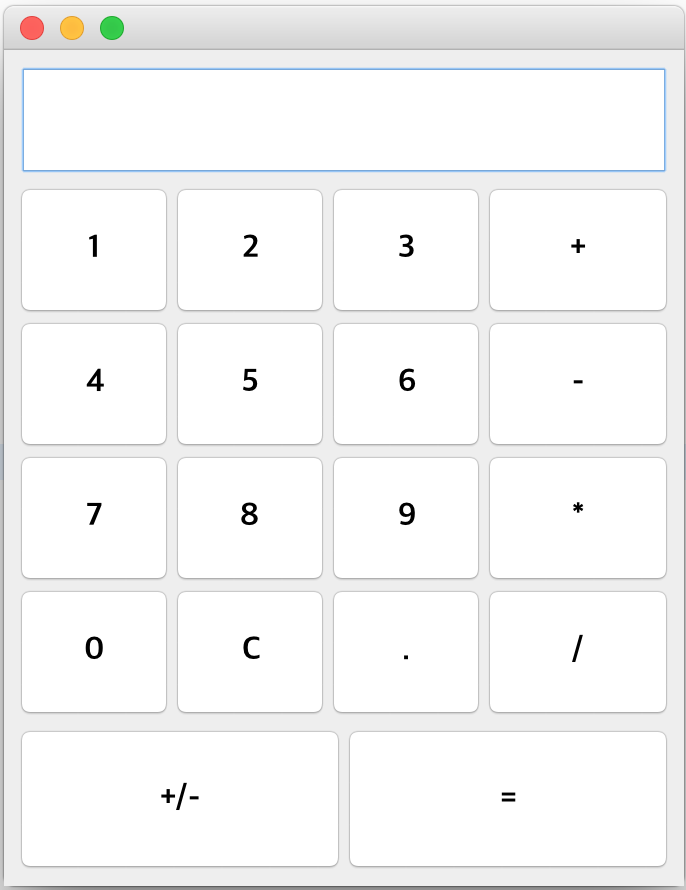

# Java GUI 실습 - 계산기(MVC)

```
/src
ㄴ/controller
	ㄴCal_controller.java
ㄴ/model
	ㄴCal_model.java
ㄴ/view
	ㄴCal_view.java
```

## Model

```java
package model;

public class Cal_model {
	private String op;
    private double firstValue;
    private double secondValue;
    private double result;
    private double text;
    
    public void calculate(String op, double first, double second) {
    		switch(op){
	        case "+" :
	            setResult(plus(first,second));
	            break;
	        case "-" :
	        		setResult(minus(first,second));
	            break;
	        case "*" :
        			setResult(multiply(first,second));
        			break;
	        case "/" : 
	        		setResult(divide(first,second));
	            break;
	        default:
	        		break;
	    }
    }
    
    
	public double plus(double first,double second) {

		return first+second;
    }
    public double minus(double first,double second) {
		return first-second;
    }
    public double multiply(double first,double second) {
		return first*second;
    }
    public double divide(double first,double second) {
		return first/second;
    }
	public String getOp() {
		return op;
	}
	public void setOp(String op) {
		this.op = op;
	}
	public double getFirstValue() {
		return firstValue;
	}
	public void setFirstValue(double firstValue) {
		this.firstValue = firstValue;
	}
	public double getSecondValue() {
		return secondValue;
	}
	public void setSecondValue(double secondValue) {
		this.secondValue = secondValue;
	}
	public double getResult() {
		return result;
	}
	public void setResult(double result) {
		this.result = result;
	}
	public double getText() {
		return text;
	}
	public void setText(double text) {
		this.text = text;
	}
}
```


## View




```java
package view;

import java.awt.Color;
import java.awt.Font;
import java.awt.GridLayout;
import java.awt.event.ActionEvent;
import java.awt.event.ActionListener;

import javax.swing.JButton;
import javax.swing.JFrame;
import javax.swing.JPanel;
import javax.swing.JTextField;

import model.Cal_model;

public class Cal_view extends JFrame {

	private JPanel panel,bottom,side;
	
	// 0~9까지 숫자 
	private JButton btnNum[] = new JButton[10];
	// clear, decimal, divide,equals,minus,multiply, plus,ponseg
	private JButton btnOp[] = new JButton[8];
	String operation[] = {"C",".","+","-","*","/","+/-","="};
	
	//보여지는곳
	private JTextField display = new JTextField();
	//소수점구현 
	private int decimalClick;
    
	
	    
	public Cal_view() {
		
		setDefaultCloseOperation(JFrame.EXIT_ON_CLOSE);
		setBounds(100, 100, 340, 440);
		getContentPane().setLayout(null);
		
		display.setFont(new Font("Apple SD Gothic Neo", 1, 30));
		display.setBounds(6,6,328,58);
		display.setBackground(Color.WHITE);
		getContentPane().add(display);
	
		
		
		panel = new JPanel();
		panel.setBounds(6, 66, 235, 271);
		getContentPane().add(panel);
		panel.setLayout(new GridLayout(4,3));
		
		bottom = new JPanel();
		bottom.setBounds(6, 338, 328, 74);
		getContentPane().add(bottom);
		bottom.setLayout(new GridLayout(1,2));
		
		side = new JPanel();
		side.setBounds(240, 66, 94, 271);
		getContentPane().add(side);
		side.setLayout(new GridLayout(4,1));
		
		for(int i=0;i<10;i++) {
			btnNum[i] = new JButton(""+i);
	    		btnNum[i].setFont(new Font("Apple SD Gothic Neo", 1, 16));
	    		if(i!=0)panel.add(btnNum[i]);
	    		
	    }
		panel.add(btnNum[0]);
	    
	    for(int i=0;i<8;i++) {
	    		btnOp[i] = new JButton(operation[i]);
	    		btnOp[i].setFont(new Font("Apple SD Gothic Neo", 1, 16));
    		
	    		if(i<2) {
	    			panel.add(btnOp[i]);
	    		}else if(i<6) {
	    			side.add(btnOp[i]);
	    		}else {
	    			bottom.add(btnOp[i]);
	    		}
	    		
	    }
	}
	
	public Cal_view(Cal_model model) {
		this();
		
		for(int i=0;i<10;i++) {
			numberAction(model, btnNum[i],i);
	    }
		btnOp[0].addActionListener(new ActionListener() {
			public void actionPerformed(ActionEvent e) {
				display.setText("");
		        decimalClick=0;
			}
		});
		
		btnOp[1].addActionListener(new ActionListener() {
			public void actionPerformed(ActionEvent e) {
				if(decimalClick==0){
		            display.setText(display.getText()+btnOp[1].getText());
		            decimalClick=1;
		        }
			}
		});
		
		
		for(int i=2;i<6;i++) {
			opAction(model, btnOp[i],i);
			decimalClick = 0;
	    }
		
		btnOp[6].addActionListener(new ActionListener() {
			public void actionPerformed(ActionEvent e) {
				double plusminus = (Double.parseDouble(String.valueOf(display.getText())));
		        plusminus = plusminus*(-1);
		        display.setText(String.valueOf(plusminus));
			}
		});
		
		btnOp[7].addActionListener(new ActionListener() {
			public void actionPerformed(ActionEvent e) {
				model.setSecondValue((Double.parseDouble(String.valueOf(display.getText()))));
				model.calculate(model.getOp(), model.getFirstValue(), model.getSecondValue());
				display.setText((String.valueOf(model.getResult())));
				
			}
		});				
	}
	
	public void numberAction(Cal_model model, JButton btnNum, int i) {
		btnNum.addActionListener(new ActionListener() {
			public void actionPerformed(ActionEvent e) {
				display.setText(display.getText()+btnNum.getText());
			}
		});
	}
	public void opAction(Cal_model model, JButton btnOp, int i) {
		btnOp.addActionListener(new ActionListener() {
			public void actionPerformed(ActionEvent e) {
				model.setFirstValue((Double.parseDouble(String.valueOf(display.getText()))));
				model.setOp(operation[i]);
				display.setText("");
			}
		});
	}	    
}
```


## Controller

```java
package controller;

import model.Cal_model;
import view.Cal_view;

public class Cal_controller {

	public static void main(String[] args) {
		// TODO Auto-generated method stub
		Cal_model m = new Cal_model();
		Cal_view  v= new Cal_view(m);
		v.setVisible(true);
	}
}
```

