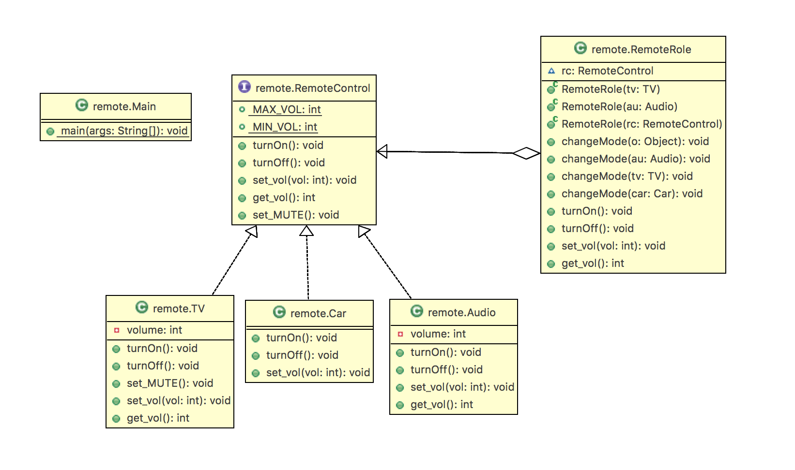

# 인터페이스 실습 - Remote

리모컨 하나로 TV, 전등, 자동차를 모두 켜고 꺼보자.



- RemoteControl : 인터페이스
  - `turnOn()`, `turnOff()`, `set_vol(int vol)` : 추상 메서드
  - `get_vol(`, `set_MUTE()` : default 메서드
    - 디폴트 메소드는 인터페이스에 선언되지만 사실 **객체가 가지고 있는 인스턴스 메소드라고 생각**해야한다.
    - `{}`까지 있다고 생각하면된다.

```java
package remote;

public interface RemoteControl {
	public static int MAX_VOL = 10;
    public static int MIN_VOL = 0;

    public void turnOn();

    public void turnOff();

    public void set_vol(int vol);
    
    public default int get_vol(){
		return 0;
	}
   
    public default void set_MUTE(){
    	
    	System.out.println("");
    	
    }

}
```

- TV : RemoteControl과 **Realization**(인터페이스와 구현의 관계)하고 있다.

```java
package remote;
public class TV implements RemoteControl {

	private int volume;
	@Override	
	public void turnOn() {
		// TODO Auto-generated method stub
		System.out.println("TV를 켭니다.");
	}

	@Override
	public void turnOff() {
		// TODO Auto-generated method stub
		System.out.println("TV를 끕니다.");
	}

	@Override
	public void set_MUTE() {
		// TODO Auto-generated method stub
		
		System.out.println("TV 음소거를 합니다.");
	}

	@Override
	public void set_vol(int vol) {
		// TODO Auto-generated method stub
		this.volume = vol;
	}
    
	@Override
	public int get_vol() {
		// TODO Auto-generated method stub
		return this.volume;
	}
}
```

- Car : RemoteControl과 **Realization**(인터페이스와 구현의 관계)하고 있다.

```java
package remote;

public class Car implements RemoteControl {

	@Override
	public void turnOn() {
		// TODO Auto-generated method stub
		System.out.println("시동을 켭니다.");
	}

	@Override
	public void turnOff() {
		// TODO Auto-generated method stub
		System.out.println("시동을 끕니다.");
	}

	@Override
	public void set_vol(int vol) {
		// TODO Auto-generated method stub
	}
}
```

- Audio : RemoteControl과 **Realization**(인터페이스와 구현의 관계)하고 있다.

```java
package remote;

public class Audio implements RemoteControl {

	private int volume;
	@Override	
	public void turnOn() {
		// TODO Auto-generated method stub
		System.out.println("AUDIO를 켭니다.");
	}

	@Override
	public void turnOff() {
		// TODO Auto-generated method stub
		System.out.println("AUDIO를 끕니다.");
	}

	@Override
	public void set_vol(int vol) {
		// TODO Auto-generated method stub
		this.volume = vol;
	}
	
    @Override
	public int get_vol() {
		// TODO Auto-generated method stub
		return this.volume;
	}
}
```

- RemoteRole : 모든 변수들을 리모컨 하나로 제어

```java
package remote;

public class RemoteRole implements RemoteControl {

	RemoteControl rc = null;
	
	public RemoteRole(TV tv){
		this.rc = tv;
	}
	
	public RemoteRole(Audio au){
		this.rc=au;		
	}
	public RemoteRole(RemoteControl rc){
		this.rc= rc;		
	}
	
	public void changeMode(Object o){
		
		if(o instanceof Audio){
			System.out.println("Audio Mode·");
			this.rc = (Audio) o;
		}
		else if (o instanceof TV){ 
			System.out.println("TV Mode");
			this.rc = (TV) o;
		}		
		else System.out.println("자동차 Mode");
	}
	
	public void changeMode(Audio au){
		System.out.println("Audio Mode로 변경합니다.");
		this.rc = au;
	} 
	
	public void changeMode(TV tv){
		
		System.out.println("TV Mode로 변경합니다.");
		this.rc = tv;
	} 
	
	public void changeMode(Car car){
		
		System.out.println("Car Mode로 변경합니다.");
		this.rc = car;
	} 

	@Override
	public void turnOn() {
		// TODO Auto-generated method stub
		this.rc.turnOn();
	}

	@Override
	public void turnOff() {
		// TODO Auto-generated method stub
		this.rc.turnOff();
	}

	@Override
	public void set_vol(int vol) {
		// TODO Auto-generated method stub
		this.rc.set_vol(vol);
	}
    
    @Override
	public int get_vol() {
		// TODO Auto-generated method stub
		return this.rc.get_vol();
	}	
}
```

- Main()
  - RemoteRole이 RemoteControl을 implements하지 않았기 때문에 `my_rc.rc.get_vol()`로 접근할 수 있다.
  - 그래서 불편함을 없애기 위해서 RemoteRole이 rc를 갖고 있으면서 RemoteControl을 구현하도록 했다.

```java
package remote;

public class Main {
	public static void main(String[] args) {
		// TODO Auto-generated method stub
		RemoteControl mr; 
		TV tv = 	new TV();
		Audio au = new Audio();
		Car  car = new Car();
		
		mr = tv; 
		mr.turnOn();
		mr.set_MUTE();
		mr.set_vol(3);
		System.out.println("---------------------------------");
	
		mr = au;
		mr.turnOn();
		mr.set_vol(5);
		mr.set_MUTE();		
		System.out.println(mr.get_vol());
		System.out.println("---------------------------------");
		
		
		RemoteRole my_rc = new RemoteRole(tv);
		
		//System.out.println(" tv  sound : " + my_rc.rc.get_vol()); 
		System.out.println("tv sound : " + my_rc.get_vol());
		
		System.out.println("---------------------------------");
		my_rc.changeMode(tv);
		my_rc.set_vol(9);
		System.out.println("tv sound : " + my_rc.get_vol());
		
		my_rc.changeMode(au);
		System.out.println("audio sound : " + my_rc.get_vol());
		
		my_rc.changeMode((Object) tv);
		my_rc.changeMode(car);
		my_rc.turnOn();

	}

}
```

- output

```
TV를 켭니다.
TV 음소거를 합니다.
---------------------------------
AUDIO를 켭니다.
5
---------------------------------
tv sound : 3
---------------------------------
TV Mode를 변경합니다.
tv sound : 9
Audio Mode를 변경합니다.
audio sound : 5
TV Mode
Car Mode를 변경합니다.
시동을 켭니다.
```