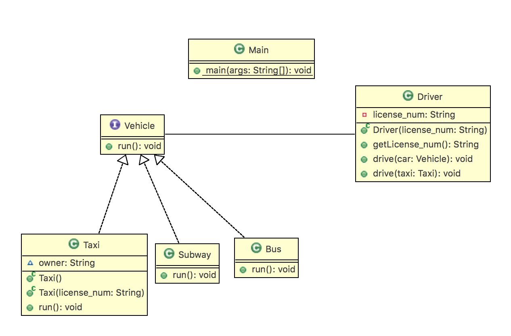

# 인터페이스 실습 - Vehicle

### UML



- Vehicle : "탈 수 있는" 인터페이스 정의
  - run()

```java
public interface Vehicle {

    public void run();

}
```

객체의 사용방법을 정의한 타입인 인터페이스 사용했다. 인터페이스는 **사용 방법이 동일한 클래스**를 만드는 기술이다.

인터페이스는 **상수, 메소드**만을 멤버로 가질 수 있다. 인터페이스는 객체를 생성할 수 없기 때문에 생성자를 가질 수 없다.

여기서`public void run()` 메소드는 추상 메소드로 리턴타입과 어떠한 매개값이 필요한지만 알려준다. 인터페이스에서 선언한 모든 메소드는 **public abstract**특성을 갖는다.


- Bus와 Subway는 Vehicle을 **Realization**(인터페이스와 구현의 관계)하고 있다.

```java
public class Subway implements Vehicle {
	@Override
    public void run() {
		System.out.println("==> Subway가 달립니다.");
	}
}
```

```java
public class Bus implements Vehicle {
	@Override
	public void run() {
		System.out.println("====> Bus가 달립니다.");
		
	}
}
```

인터페이스는 어떤 구현 객체를 대입하느냐에 따라 실행 결과가 달라진다.


- Taxi는 `owner: String`의 필드를 두어 공용택시인 경우와 개인택시(소유주만 운전할 수 있는)를 구분하였다.

```java
public class Taxi implements Vehicle {
	String owner;
	
	public Taxi() {
		this.owner = "public";
	}
	
	public Taxi(String license_num){
		this.owner = license_num;
	}
	
    @Override
	public void run() {
		System.out.println("====> Taxi [ " + this.owner+"] 가 달립니다.");
	}

}
```

생성자에서 공용택시인지, 개인택시인지 구분할 수 있도록 구현하였다.


- Driver 
  - 생성자에서 license_num이 없으면 생성이 불가능 하도록 만들었다.
  - dirve메소드는 drive(Vehicle car)와 drive(Taxi taxi)를 오버로딩하였다.
    - 오버로딩(Overloading) : 같은 이름의 메소드를 여러개 가지면서 매개변수의 유형과 개수가 다르도록 하는 기술

    - 오버라이딩(Overriding) : 상위 클래스가 가지고 있는 메소드를 하위 클래스가 재정의 해서 사용한다.

    - | 구분          | 오버로딩 | 오버라이딩 |
      | ------------- | -------- | ---------- |
      | 메소드이름    | 동일     | 동일       |
      | 매개변수 타입 | 다름     | 동일       |
      | 리턴 타입     | 상관없음 | 동일       |

```java
public class Driver {
    private String license_num;
    
    public Driver(String license_num) {
    		this.license_num = license_num;
    }

    public String getLicense_num() {
    		return this.license_num;
    }
    
    public void drive(Vehicle car){
    		System.out.println("운전사["+this.license_num+"] : "+car.getClass().getSimpleName());
    		car.run();
    }
    
    public void drive(Taxi taxi) {
	    	System.out.println("운전사["+this.license_num+"] : Taxi를 운전합니다. ");
	    	if(taxi.owner == "public"|| this.license_num==taxi.owner)taxi.run();
	    	else System.out.println("=====> 이 택시는 허가된 사람만 운전할 수 있습니다.");
	}

}
```

- Main

```java

public class Main {

	public static void main(String[] args) {
		// TODO Auto-generated method stub
		Bus b =new Bus();
		Taxi t = new Taxi();
		Subway s = new Subway();
		Taxi tt = new Taxi("2015-0001");
		
		Driver d = new Driver("2015-0001");
		Driver dd = new Driver("2015-0003");
		
		
		d.drive(b);
		d.drive(s);
		d.drive(t);		
		d.drive(tt);
		dd.drive(tt);
	}

}
```

```
운전사[2015-0001] : Bus
====> Bus가 달립니다.
운전사[2015-0001] : Subway
==> Subway가 달립니다.
운전사[2015-0001] : Taxi를 운전합니다. 
====> Taxi [ public] 가 달립니다.
운전사[2015-0001] : Taxi를 운전합니다. 
====> Taxi [ 2015-0001] 가 달립니다.
운전사[2015-0003] : Taxi를 운전합니다. 
=====> 이 택시는 허가된 사람만 운전할 수 있습니다.
```
