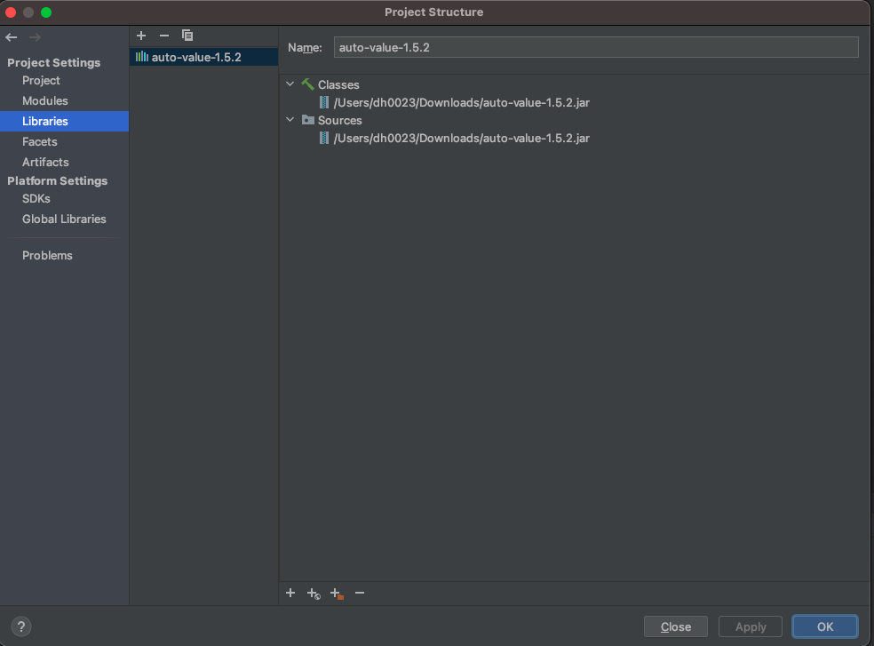
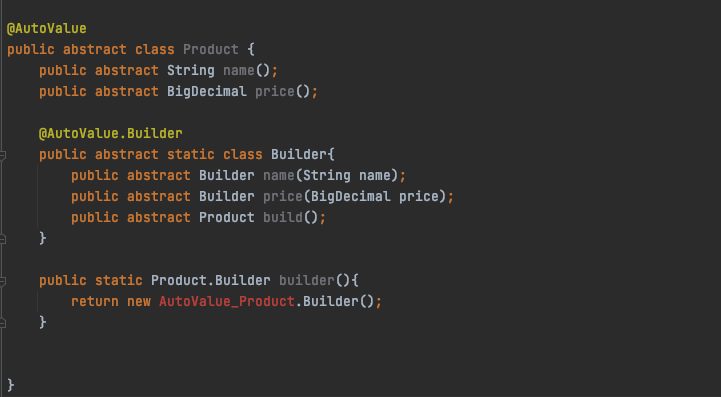
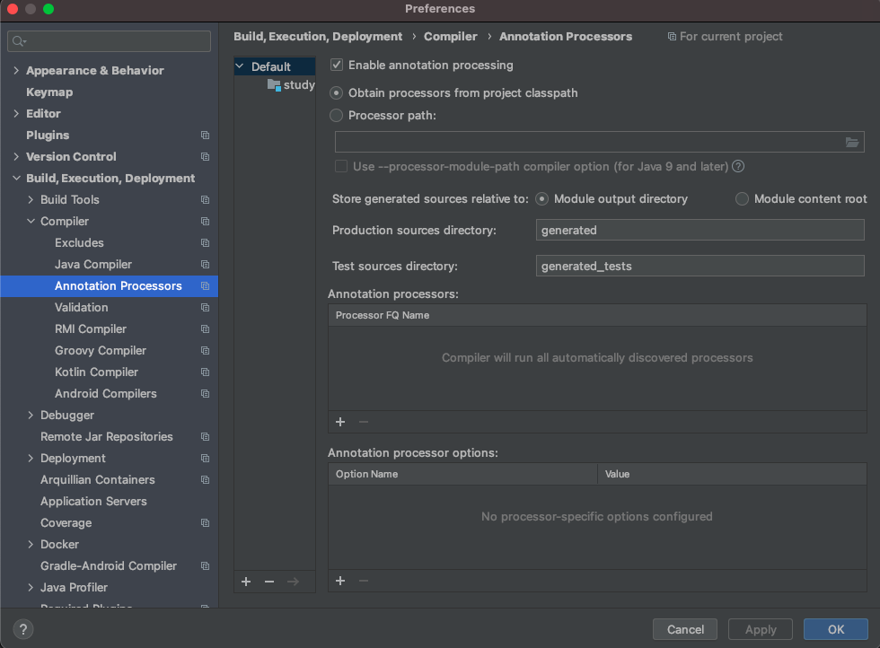
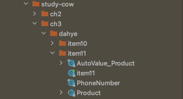
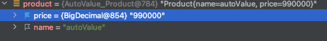

## AutoValue 적용해보기

AutoValue는 코드 자동 생성 라이브러리로 자바 코드를 줄일 수 있으며, AutoValue는 Reflection을 이용한 런타임 방식이 아닌 a**pt를 이용하여 컴파일 타임에 코드를 생성해주기 때문에 성능상에 불이익은 없다.**

[google AutoValue](https://mvnrepository.com/artifact/com.google.auto.value/auto-value/1.5.2)에서 jar파일을 다운로드 받을 수 있다.

만약 maven을 사용하는 경우에는 `pom.xml`에 dependency를 추가해주면 된다.

```xml
<dependencies>
    <dependency>
        <groupId>com.google.auto.value</groupId>
        <artifactId>auto-value</artifactId>
        <version>1.3</version>
    </dependency>
</dependencies>
```



다운로드 받은 jar파일은 intellij project settings > Libraries에 추가해주면 된다.

우선 `@AutoValue` 를 살펴보면, 내부에 예시와 함께 [AutoValue github](https://github.com/google/auto/tree/master/value) 주소를 알려주고 있다.

```java

/**
 * Specifies that <a href="https://github.com/google/auto/tree/master/value">AutoValue</a> should
 * generate an implementation class for the annotated abstract class, implementing the standard
 * {@link Object} methods like {@link Object#equals equals} to have conventional value semantics. A
 * simple example: <pre>
 *
 *   @AutoValue
 *   abstract class Person {
 *     static Person create(String name, int id) {
 *       return new AutoValue_Person(name, id);
 *     }
 *
 *     abstract String name();
 *     abstract int id();
 *   }</pre>
 *
 * @see <a href="https://github.com/google/auto/tree/master/value">AutoValue User's Guide</a>
 *
 * @author Éamonn McManus
 * @author Kevin Bourrillion
 */
@Retention(RetentionPolicy.CLASS)
@Target(ElementType.TYPE)
public @interface AutoValue {

  /**
   * Specifies that AutoValue should generate an implementation of the annotated class or interface,
   * to serve as a <i>builder</i> for the value-type class it is nested within. As a simple example,
   * here is an alternative way to write the {@code Person} class mentioned in the {@link AutoValue}
   * example: <pre>
   *
   *   @AutoValue
   *   abstract class Person {
   *     static Builder builder() {
   *       return new AutoValue_Person.Builder();
   *     }
   *
   *     abstract String name();
   *     abstract int id();
   *
   *     &#64;AutoValue.Builder
   *     interface Builder {
   *       Builder name(String x);
   *       Builder id(int x);
   *       Person build();
   *     }
   *   }</pre>
   *
   * @author Éamonn McManus
   */
  @Retention(RetentionPolicy.SOURCE)
  @Target(ElementType.TYPE)
  public @interface Builder {}

  /**
   * Specifies that AutoValue should copy any annotations from the annotated element to the
   * generated class. This annotation supports classes and methods.
   *
   * <p>The following annotations are excluded:
   *
   * <ol>
   * <li>AutoValue and its nested annotations;
   * <li>any annotation appearing in the {@link AutoValue.CopyAnnotations#exclude} field;
   * <li>any class annotation which is itself annotated with the
   *     {@link java.lang.annotation.Inherited} meta-annotation.
   * </ol>
   *
   * <p>When the <i>type</i> of an {@code @AutoValue} property method has annotations, those are
   * part of the type, so they are always copied to the implementation of the method.
   * {@code @CopyAnnotations} has no effect here. For example, suppose {@code @Confidential} is a
   * {@link java.lang.annotation.ElementType#TYPE_USE TYPE_USE} annotation: <pre>
   *
   *   &#64;AutoValue
   *   abstract class Person {
   *     static Person create(&#64;Confidential String name, int id) {
   *       return new AutoValue_Person(name, id);
   *     }
   *
   *     abstract &#64;Confidential String name();
   *     abstract int id();
   *   }</pre>
   *
   * Then the implementation of the {@code name()} method will also have return type
   * {@code @Confidential String}.
   *
   * @author Carmi Grushko
   */
  @Retention(RetentionPolicy.SOURCE)
  @Target({ElementType.TYPE, ElementType.METHOD})
  public @interface CopyAnnotations {
    Class<? extends Annotation>[] exclude() default {};
  }
}

```

가이드라인을 기준으로 클래스 한개를 생성해 볼 것이다.

```java
@AutoValue
public abstract class Product {
    public abstract String name();
    public abstract BigDecimal price();

    @AutoValue.Builder
    public abstract static class Builder{
        public abstract Builder name(String name);
        public abstract Builder price(BigDecimal price);
        public abstract Product build();
    }

    public static Product.Builder builder(){
        return new AutoValue_Product.Builder();
    }
}
```



AutoValue 어노테이션을 설정하지 않으면 다음과 같은 오류가 발생한다.



Compiler > Annotation Processors에서 Enable annotation processing을 체크해준다. 그리고 modules의 dependencies에 auto-value 라이브러리가 포함되어있지 않다면 별도로 추가해줘야한다.


모두 추가한 뒤에 project rebuild를 하면 AutoValue_Product가 생성된 것을 볼 수 있다.



다시 코드를 하나하나 집어볼 것이다.

 ```java
@AutoValue
public abstract class Product {
    public abstract String name();
    public abstract BigDecimal price();

    @AutoValue.Builder
    public abstract static class Builder{
        public abstract Builder name(String name);
        public abstract Builder price(BigDecimal price);
        public abstract Product build();
    }

    public static Product.Builder builder(){
        return new AutoValue_Product.Builder();
    }
}
 ```

- `@AutoValue` 를 사용하는 클래스는 abstract(추상) 클래스이며, 실제로 구현하는 클래스는 builder() 부분의 `AutoValue_Product` 이다.
- 안의 클래스 멤버 변수도 abstract 추상함수로 선언되어있는 것을 볼 수 있다. 다음과 같이 선언해주면  `AutoValue_Product` 클래스에 변수가 생성되는 것을 확인할 수 있다.

```java
import java.math.BigDecimal;

final class AutoValue_Product extends Product {
    private final String name;
    private final BigDecimal price;

    private AutoValue_Product(String name, BigDecimal price) {
        this.name = name;
        this.price = price;
    }

    public String name() {
        return this.name;
    }

    public BigDecimal price() {
        return this.price;
    }

    public String toString() {
        return "Product{name=" + this.name + ", price=" + this.price + "}";
    }

    public boolean equals(Object o) {
        if (o == this) {
            return true;
        } else if (!(o instanceof Product)) {
            return false;
        } else {
            Product that = (Product)o;
            return this.name.equals(that.name()) && this.price.equals(that.price());
        }
    }

    public int hashCode() {
        int h = 1;
        int h = h * 1000003;
        h ^= this.name.hashCode();
        h *= 1000003;
        h ^= this.price.hashCode();
        return h;
    }

    static final class Builder extends ch3.dahye.item11.Product.Builder {
        private String name;
        private BigDecimal price;

        Builder() {
        }

        public ch3.dahye.item11.Product.Builder name(String name) {
            if (name == null) {
                throw new NullPointerException("Null name");
            } else {
                this.name = name;
                return this;
            }
        }

        public ch3.dahye.item11.Product.Builder price(BigDecimal price) {
            if (price == null) {
                throw new NullPointerException("Null price");
            } else {
                this.price = price;
                return this;
            }
        }

        public Product build() {
            String missing = "";
            if (this.name == null) {
                missing = missing + " name";
            }

            if (this.price == null) {
                missing = missing + " price";
            }

            if (!missing.isEmpty()) {
                throw new IllegalStateException("Missing required properties:" + missing);
            } else {
                return new AutoValue_Product(this.name, this.price);
            }
        }
    }
}
```

```java
public class item11 {
    public static void main(String[] args) {
        Product product = Product.builder().price(new BigDecimal(990000)).name("autoValue").build();
        System.out.println(product); // Product{name=autoValue, price=990000}
    }
}
```



다음과 같이 Product 클래스를  builder로 생성하면, `AutoValue_Product` 인스턴스로 생성된 것을 볼 수 있다. AutoValue는 불변정보(Immutable)를 전달하는 클래스 인스턴스를 생성할때 사용할 수 있다. `AutoValue_Product`를 보면 `final` 클래스이면서 변수도 `final` 인 것을 볼 수 있다. 그러므로, `AutoValue`는 멤버 변수 값이 항상 바뀔 수 있는 인스턴스에서는 사용하면 안된다.

## 참조

- [https://blog.daum.net/creazier/15311105](https://blog.daum.net/creazier/15311105)
- [https://youtrack.jetbrains.com/issue/IDEA-119210](https://youtrack.jetbrains.com/issue/IDEA-119210)
- [https://m.blog.naver.com/PostView.nhn?blogId=alice_k106&logNo=220935029340&proxyReferer=https:%2F%2Fwww.google.com%2F](https://m.blog.naver.com/PostView.nhn?blogId=alice_k106&logNo=220935029340&proxyReferer=https:%2F%2Fwww.google.com%2F)
- [https://github.com/google/auto/tree/master/value](https://github.com/google/auto/tree/master/value)