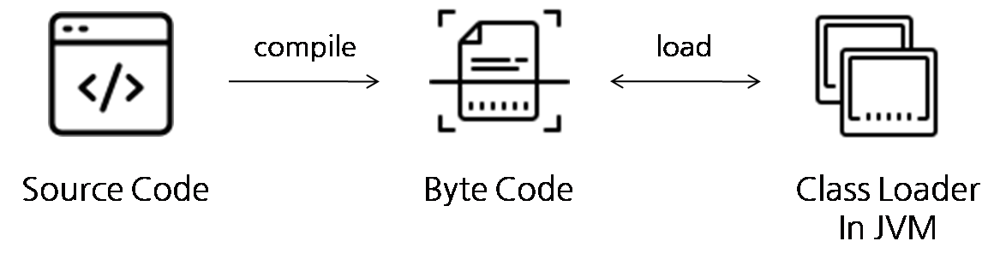

# @Retention

`@Retention` 어노테이션은 **어노테이션의 라이프 사이클을 설정**하는 것으로, 즉, 어노테이션이 언제까지 살아 있을지를 정하는 것이다.

```java
package java.lang.annotation;

/**
 * Indicates how long annotations with the annotated type are to
 * be retained.  If no Retention annotation is present on
 * an annotation type declaration, the retention policy defaults to
 * {@code RetentionPolicy.CLASS}.
 *
 * <p>A Retention meta-annotation has effect only if the
 * meta-annotated type is used directly for annotation.  It has no
 * effect if the meta-annotated type is used as a member type in
 * another annotation type.
 *
 * @author  Joshua Bloch
 * @since 1.5
 * @jls 9.6.4.2 @Retention
 */
@Documented
@Retention(RetentionPolicy.RUNTIME)
@Target(ElementType.ANNOTATION_TYPE)
public @interface Retention {
    /**
     * Returns the retention policy.
     * @return the retention policy
     */
    RetentionPolicy value();
}
```

## RetentionPolicy

`@Retention` 어노테이션의 속성으로, `SOURCE`, `CLASS`, `RUNTIME` 3가지 종류가 있다.



- `RetentionPolicy.SOURCE` : 소스코드(`.java`)까지 유지(컴파일 과정에서 어노테이션 정보 사라짐)
- `RetentionPolicy.CLASS` : 클래스파일(`.class`)까지 유지(런타임시 유지안됨)
- `RetentionPolicy.RUNTIME` : 런타임시점까지 유지 (Reflection API로 어노테이션 정보 조회 가능)

각 종류별로 예제를 보며, 자세히 살펴볼 것이다.

### RetentionPolicy.SOURCE

`RetentionPolicy.SOURCE` 를 메타 어노테이션으로 선언한 어노테이션중 lombok의 `@Getter`를 살펴볼 것이다.

- `Item.java` : lombok을 사용한 POJO 클래스

  ```java
  import lombok.Getter;
  import lombok.Setter;

  @Getter
  @Setter
  public class Item {
      private long Id;
      private String name;
  }

  ```

- `@Getter` 

  ```java
  package lombok;
  
  import java.lang.annotation.ElementType;
  import java.lang.annotation.Retention;
  import java.lang.annotation.RetentionPolicy;
  import java.lang.annotation.Target;
  
  @Target({ElementType.FIELD, ElementType.TYPE})
  @Retention(RetentionPolicy.SOURCE)
  public @interface Getter {
      AccessLevel value() default AccessLevel.PUBLIC;
  
      Getter.AnyAnnotation[] onMethod() default {};
  
      boolean lazy() default false;
  
      /** @deprecated */
      @Deprecated
      @Retention(RetentionPolicy.SOURCE)
      @Target({})
      public @interface AnyAnnotation {
      }
  }
  ```
  
  `@Getter` 어노테이션 내부에 `Retention(RetentionPolicy.SOURCE)` 메타 어노테이션이 붙어 있는 것을 볼 수 있다.
  여기서 `RetentionPolicy.SOURCE` 이므로 소스코드(`.java`)까지 어노테이션이 남아 있고, 컴파일 이후에는 사라질 것으로 예상할 수 있다.
  
- `Item.class` 

    ```java
    public class Item {
        private long Id;
        private String name;
    
        public Item() {
        }
    
        public long getId() {
            return this.Id;
        }
    
        public String getName() {
            return this.name;
        }
    
        public void setId(long Id) {
            this.Id = Id;
        }
    
        public void setName(String name) {
            this.name = name;
        }
    }
    ```

    클래스 파일을 디컴파일 했을 때, `@Getter`, `@Setter` 어노테이션은 사라진 것을 볼 수 있으며, 소스코드에 작성하지 않았던 getter, setter 메서드가 생성된 것을 확인할 수 있다.

### RetentionPolicy.RUNTIME

런타임에 어노테이션 정보를 뽑아 쓸수 있다는 의미로 즉, Reflection API 등을 사용하여 어노테이션 정보를 알수 있다.
스프링에서는 `@Controller`, `@Service`, `@Autowired`, `@Component` 등이 있다.

```java
package org.springframework.stereotype;

import java.lang.annotation.Documented;
import java.lang.annotation.ElementType;
import java.lang.annotation.Retention;
import java.lang.annotation.RetentionPolicy;
import java.lang.annotation.Target;

import org.springframework.core.annotation.AliasFor;

/**
 * Indicates that an annotated class is a "Service", originally defined by Domain-Driven
 * Design (Evans, 2003) as "an operation offered as an interface that stands alone in the
 * model, with no encapsulated state."
 *
 * <p>May also indicate that a class is a "Business Service Facade" (in the Core J2EE
 * patterns sense), or something similar. This annotation is a general-purpose stereotype
 * and individual teams may narrow their semantics and use as appropriate.
 *
 * <p>This annotation serves as a specialization of {@link Component @Component},
 * allowing for implementation classes to be autodetected through classpath scanning.
 *
 * @author Juergen Hoeller
 * @since 2.5
 * @see Component
 * @see Repository
 */
@Target({ElementType.TYPE})
@Retention(RetentionPolicy.RUNTIME)
@Documented
@Component
public @interface Service {

	/**
	 * The value may indicate a suggestion for a logical component name,
	 * to be turned into a Spring bean in case of an autodetected component.
	 * @return the suggested component name, if any (or empty String otherwise)
	 */
	@AliasFor(annotation = Component.class)
	String value() default "";

}
```

해당 어노테이션들은 스프링이 올라오는 실행 중인 시점에 컴포넌트 스캔이 가능해야하기 때문에 RUNTIME 정책이 필요한 것이다.
( 스프링도 내부적으로 Reflection 등을 활용하여 어노테이션이 붙은 클래스만 가져옴 )


### RetentionPolicy.CLASS

그렇다면, `CLASS` 정책은 왜 필요한걸까?
`class` 파일만 존재하는 라이브러리 같은 경우에도 타입체커, IDE 부가기능을 사용하기 위해서는 `CLASS` 정책이 필요하다.
`SOURCE` 정책으로 사용하면 컴파일된 라이브러리 jar 파일에는 어노테이션 정보가 남아있지 않기 때문이다.
혹은, 클래스 로딩시점에 추가행위(?)가 필요한 경우에도 사용할 수 있다.

- `@NonNull`

    ```java
    package lombok;
    
    import java.lang.annotation.Documented;
    import java.lang.annotation.ElementType;
    import java.lang.annotation.Retention;
    import java.lang.annotation.RetentionPolicy;
    import java.lang.annotation.Target;
    
    @Target({ElementType.FIELD, ElementType.METHOD, ElementType.PARAMETER, ElementType.LOCAL_VARIABLE, ElementType.TYPE_USE})
    @Retention(RetentionPolicy.CLASS)
    @Documented
    public @interface NonNull {
    }
    ```

## 참고

- [기본기를 쌓는 정아마추어 코딩블로그](https://jeong-pro.tistory.com/234 )
- [기본기를 쌓는 정아마추어 코딩블로그의 박종훈님 댓글](https://jeong-pro.tistory.com/234 )

