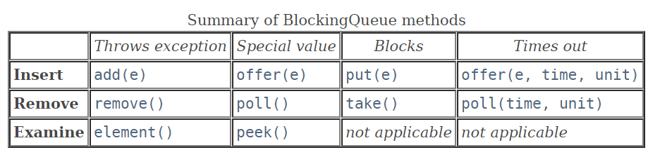
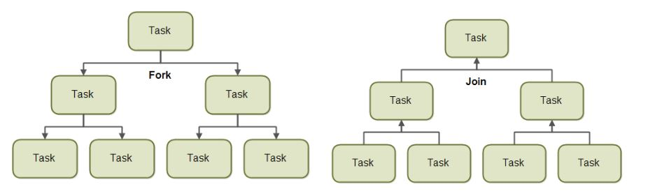
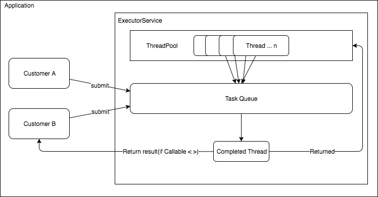
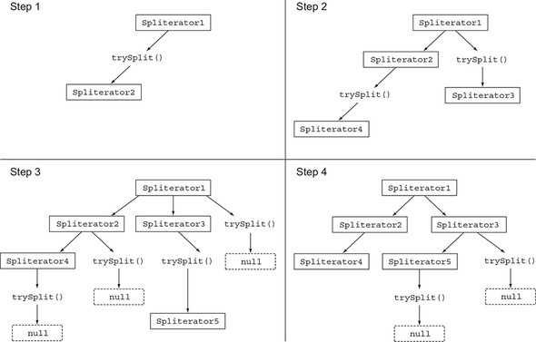
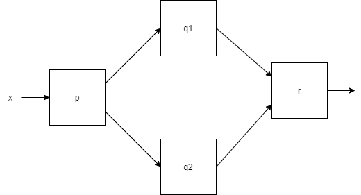

# Java 비동기

## Callable/Runnable

Thread는 Runnable과 Callable의 구현된 함수를 수행한다.

### Runnable

쓰레드 구현시 Runnable 인터페이스를 이용해서 생성할 수 있다.

- 어떤 객체도 반환하지 않음
- Exception을 발생시키지 않음

```java
@FunctionalInterface
public interface Runnable {
    public abstract void run();
}
```

인터페이스를 살펴보면 인자를 받지 않으며, 반환값도 없는 것을 확인할 수 있다.

```java
public class RunnableEx {

    
    static class TestRunnable implements Runnable {

        @Override
        public void run() {
            String result = "Called at " + LocalDate.now();
            System.out.println(result);
        }
    }

    public static void main(String[] args) {
        
        // Runnable 구현한 클래스로 구현
        TestRunnable runnable = new TestRunnable();
        Thread thread = new Thread(runnable);
        thread.start();

        // lambda로 구현
        Thread thread2 = new Thread( () -> {
            System.out.println("Runnable at " + LocalDate.now());
        });
        thread2.start();
    }
}
```

### Callable

```java
@FunctionalInterface
public interface Callable<V> {
    /**
     * Computes a result, or throws an exception if unable to do so.
     *
     * @return computed result
     * @throws Exception if unable to compute a result
     */
    V call() throws Exception;
}
```

Callable은 인자를 받지 않으며, 특정 타입(`V`) 객체를 반환한다. 또한 `Exception`을 발생시킬 수 있다.

```java
public class CallableEx {

    static class TestCallable implements Callable<String> {
        @Override
        public String call() throws Exception {
            String result = "Called at " + LocalDate.now();
            return result;
        }
    }

    public static void main(String[] args) throws ExecutionException, InterruptedException {
        TestCallable callable = new TestCallable();
        FutureTask futureTask = new FutureTask(callable);

        Thread thread = new Thread(futureTask);
        thread.start();

        System.out.println("result : " + futureTask.get());
    }
}

```

## Future/Executor(Java5)

### ExecutorService

```java
public interface ExecutorService extends Executor {

    void shutdown();

    List<Runnable> shutdownNow();

    boolean isShutdown();

    boolean isTerminated();

    boolean awaitTermination(long timeout, TimeUnit unit)
        throws InterruptedException;

    <T> Future<T> submit(Callable<T> task);
    
    <T> Future<T> submit(Runnable task, T result);

    Future<?> submit(Runnable task);

    <T> List<Future<T>> invokeAll(Collection<? extends Callable<T>> tasks)
        throws InterruptedException;

    <T> List<Future<T>> invokeAll(Collection<? extends Callable<T>> tasks,
                                  long timeout, TimeUnit unit)
        throws InterruptedException;

    <T> T invokeAny(Collection<? extends Callable<T>> tasks)
        throws InterruptedException, ExecutionException;

    <T> T invokeAny(Collection<? extends Callable<T>> tasks,
                    long timeout, TimeUnit unit)
        throws InterruptedException, ExecutionException, TimeoutException;
}
```

`ExecutorService`는 재사용이 가능한 ThreadPool로 `Executor` 인터페이스를 확장하여 Thread의 라이프사이클을 제어한다.
Thread의 라이프 사이클과 발생할 수 있는 여러 가지 사항들을 개발자들이 신경쓰지 않도록 편리하게 추상화 한 것이다.

`ExecutorServices`는 `Runnable`과 `Callable` 모두 실행할 수 있다.

`ExecutorService`에 Task를 지정해주면 ThreadPool을 이용하여 Task를 실행되며, Task는 큐로 관리된다.

#### 초기화

- new 키워드

  ```java
  ExecutorService es = new ThreadPoolExecutor(10, 10, 0L, TimeUnit.MILLISECONDS, new LinkedBlockingQueue());
  ```

  `ExecutorService` 를 구현한 구현체로 초기화 할 수 있다.

- `Excutors` 에서 제공하는 Factory Method

  ```java
  // 1. 10개 고정 사이즈의 ThreadPool 생성 
  ExecutorService executorService = Executors.newFixedThreadPool(10);
  // 2. 1개 고정 사이즈의 ThreadPool 생성
  ExecutorService executorService = Executors.newSingleThreadExecutor();
  // 3. 캐싱 ThreadPool 생성
  ExecutorService executorService = Executors.newCachedThreadPool();
  ```

  - CachedThreadPool : 일정시간동안 쓰레드가 사용이 되지 않으면 pool에서 제거
  
  - FixedThreadPool : 고정된 개수를 가진 쓰레드풀
  
  - SingleThreadExecutor :  한 개의 쓰레드로 작업을 처리하는 쓰레드풀
  
  - ScheduledThreadPool : 일정 시간 뒤에 실행되는 작업이나, 주기적으로 수행되는 작업이 있는 경우 사용
  
    ```java
    public class ScheduledExecutorServiceEx {
    
        public static void main(String[] args) {
            ScheduledExecutorService executorService = Executors.newScheduledThreadPool(1);
    
            work1();
    
            // work1 수행이 끝난 후 10초뒤에 work2를 개별 Task로 스케쥴
            executorService.schedule(ScheduledExecutorServiceEx::work2, 10, TimeUnit.SECONDS);
            executorService.shutdown();
        }
    
        public static void work1() {
            System.out.println("work1");
        }
    
        public static void work2() {
            System.out.println("work2");
        }
    }
    ```
  
    

#### 실행 메서드

| 메서드      | 설명                                                         | 예제                                                         |
| ----------- | ------------------------------------------------------------ | ------------------------------------------------------------ |
| execute()   | 반환 값이 없으며, Task의 실행 결과나 Task의 상태를 알 수 없다. | executorService.execute(runnableTask);                       |
| submit()    | Task를 할당하고 `Future` 타입의 결과값을 반환한다.<br />결과가 반환되어야 하므로 주로 Callable을 구현한 Task를 넘긴다. | Future future = executorService.submit(callableTask);        |
| invokeAny() | Task를 Collection에 넣어서 넘겨줄 수 있다.<br />이때, 실행에 성공한 Task 중 하나의 결과값을 반환한다. | String result = executorService.invokeAny(callableTasks);    |
| invokeAll() | Task를 Collection에 넣어서 넘겨줄 수 있다.<br />이때, 모든 Task의 결과값을 반환한다. | List\<Future\> futures = executorService.invokeAll(callableTasks); |

#### 종료

실행 명령한 Task가 모두 수행되더라도 `ExecutorService`는 자동 종료되지 않는다. 앞으로 들어올 Task를 처리하기 위해 wait상태로 대기하고 있다. 종료하기 위해서는 `shutdown()`이나 `shutdownNow()`를 호출해줘야한다.

```java
// 실행중인 모든 Task가 수행되면 종료
// 더 이상 쓰레드 풀에 Task 추가하지 못함
executorService.shutdown();

// 실행중인 Thread를 모두 즉시 종료시킴
// 하지만 모든 Thread가 동시에 종료되는 것을 보장하지 않으며, 실행되지 않은 Task반환
List<Runnable> notExecutedTasks = executorService.shutDownNow();
```

#### 사용 예제

```java
public class CallableEx {

    static class TestCallable implements Callable<String> {

        @Override
        public String call() throws Exception {
            String result = "Called at " + LocalDateTime.now();
            return result;
        }
    }

    public static void main(String[] args) throws ExecutionException, InterruptedException {
        TestCallable callable = new TestCallable();
        
        ExecutorService executor = Executors.newSingleThreadExecutor();
        Future<String> future = executor.submit(callable);

        executor.submit(() -> {
            String threadName = Thread.currentThread().getName();
            System.out.println("Job2 " + threadName);
        });

        System.out.println("result : " + future.get());

        // 쓰레드 종료
        executor.shutdown();

        // 종료되지 않은 Task를 기다리고,
        // 특정시간 이후에도 완료되지 않으면 false return
        if (executor.awaitTermination(20, TimeUnit.SECONDS)) {
            System.out.println(LocalDateTime.now() + " All jobs are terminated");
        } else {
            System.out.println(LocalDateTime.now() + " some jobs are not terminated");

            // 모든 Task를 강제 종료
            executor.shutdownNow();
        }
    }
}
```

### Future

`Future`는 비동기 처리 결과를 알 수 있다.

- 작업중인 쓰레드 말고 별도 쓰레드를 생성해 작업을 수행
- 다른 쓰레드에서 수행한 작업물의 결과를 가져올 때 사용

```java
// ExecutorService
<T> Future<T> submit(Callable<T> task);
```

`ExecutorService`의 `submit()`은 Future객체를 반환하며,  메인쓰레드에서 쓰레드풀에서 처리한 결과를 알 수 있다.

```java
public interface Future<V> {
    boolean cancel(boolean mayInterruptIfRunning);

    boolean isCancelled();

    boolean isDone();

    V get() throws InterruptedException, ExecutionException;

    V get(long timeout, TimeUnit unit)
        throws InterruptedException, ExecutionException, TimeoutException;
}
```

- `get()`으로 결과 값을 가져올 수 있는데, `get()`은 결과 수행이 완료될때까지 기다리는 blocking 메소드이다.
  - 이때 timeout시간을 같이 전달해 특정 시간 내 응답이 없는 경우 다음 작업을 처리하도록 만들 수 있다.
- `isDone` :  해당 작업이 수행이 완료됐는지 확인이 가능
- `cancle(boolean)` : Task 취소
- `isCancelled()` : Task가 취소 되었는지 확인

```java
public class FutureEx {

    interface SuccessCallback{
        void onSuccess(String result);
    }

    interface ExceptionCallback{
        void onError(Throwable t);
    }

    public static class CallbackFutureTask extends FutureTask<String> {
        SuccessCallback sc;
        ExceptionCallback ec;
        public CallbackFutureTask(Callable<String> callable, SuccessCallback sc, ExceptionCallback ec) {
            super(callable);
            this.sc = Objects.requireNonNull(sc);
            this.ec = Objects.requireNonNull(ec);
        }

        @Override
        protected void done() {
            try {
                sc.onSuccess(get());
            } catch (InterruptedException e) {
                // 작업을 수행하지말고 종료해라
                Thread.currentThread().interrupt();
            } catch (ExecutionException e) {
                // 비동기 작업 수행중 예외 발생
                ec.onError(e.getCause());
            }
        }
    }

    public static void main(String[] args) throws ExecutionException, InterruptedException {
        // thread pool
        ExecutorService es = Executors.newCachedThreadPool();

        CallbackFutureTask future = new CallbackFutureTask(() -> {
            Thread.sleep(2000);
//            if(1 == 1) throw new RuntimeException("Async Error");

            log.info("Aysnc");
            return "COMPLETE";
        }       , s-> System.out.println("Result: " + s)
                , e-> System.out.println("Error : " + e.getMessage()));

        es.execute(future);

        System.out.println(future.isDone());
        Thread.sleep(2100);

        log.info("Exit");
        System.out.println(future.isDone());

        es.shutdown(); // 비동기 처리 완료되면 종료

    }
}

```

### FutureTask

```java
public class FutureTask<V> implements RunnableFuture<V> {
```

```java
public interface RunnableFuture<V> extends Runnable, Future<V> {
    /**
     * Sets this Future to the result of its computation
     * unless it has been cancelled.
     */
    void run();
}

```

FutureTask는 Future와 Runnable(1.6)의 구현체이다. 그러므로 `Executor`에 의해서 실행될 수 있다.

```java
        // thread pool
        ExecutorService es = Executors.newCachedThreadPool();
		
		FutureTask<String> future = new FutureTask<>((){
            @Override
            protected void done() {
                try {
                    get();
                } catch (InterruptedException e) {
                    e.printStackTrace();
                } catch (ExecutionException e) {
                    e.printStackTrace();
                }
            }
        };                                                     			es.execute(future);
```

## BlockingQueue(Java5)

- Thread-safe
  - Queue 메소드들은 내부적으로 `locks`혹은 동시성 제어를 사용해 원자성을 보장한다.
  - Bulk Collection Operations(`addAll()`, `containsAll()`, `retainAll()`, `remainAll()`)은 원자성을 보장하지 않으며, 원자성을 보장하기 위해서는 직접 구현해야한다.
- `null`을 허용하지 않는다.
  - `null` 값을 `add()`, `put()`, `offer()` 하면 `NullPointerException` 발생하므로 주의
  - `null`은 `pool` 이 실패한 경우 반환된다.
- 용량(capacity)에 제한을 둘 수 있다.
  - default : `Integer.MAX_VALUE`
- Collection 인터페이스를 제공한다.
  - `BlockingQueue`는 Producer-Consumer 패턴의 대기열 목적으로 디자인 되었다.
  - Collection 인터페이스를 지원하기 때문에 `remove()`와 같은 Collection 메소드를 사용할 수 있지만 매우 비효율 적이다.
- 데이터가 추가되지 않는 것을 나타내기 위한 `close()`, `shutdown()` 을 제공하지 않는다.
  - 일반적으로 producer가 특수한 end-of-stream 또는 poison 객체를 삽입하고 , consumer가 판단하는 패턴으로 목적에 맞춰서 구현해야한다.

```java
public interface BlockingQueue<E> extends Queue<E> {
    boolean add(E e);

    boolean offer(E e);

    void put(E e) throws InterruptedException;

    boolean offer(E e, long timeout, TimeUnit unit)
        throws InterruptedException;

    E take() throws InterruptedException;

    E poll(long timeout, TimeUnit unit)
        throws InterruptedException;

    int remainingCapacity();

    boolean remove(Object o);

    boolean contains(Object o);

    int drainTo(Collection<? super E> c, int maxElements);
}
```



- Throw exception : 해당 메소드를 즉시 사용할 수 없으면,  Exception 발생
- Special value : `null`이나 `boolean` 값을 반환
- Blocks : 해당 작업을 수행할 때까지 현재의 Thread가 무한 대기
- Times out : 주어진 시간만큼만 block

### 구현체

#### ArrayBlockingQueue

- `ArrayBlockingQueue`는 Array로 구현된 BlockingQueue이다. 
- Queue를 생성할 때 크기를 설정하며, 내부적으로 배열을 사용해 아이템 저장
  - 생성 후에는 크기 변경이 불가하다.
- 동시성에 안전하여, 멀티 쓰레드에서 synchronized없이 사용 가능
- 아이템을 꺼낼 때 비어있으면 추가될 때까지 기다리며, 아이템 추가시 Queue가 가득차 있으면 Exception이 발생하거나 일정 시간 기다릴 수 있다.
  - 꽉 찬경우 추가 block, 빈 경우 추출 block
- 선택적으로 공평성 정책을 두어 block 된 thread들을 순차적 대기열을 생성한다.
  - 대기열 처리에 대한 정확한 순서를 보장하지 않는다.

```java
       int capacity = 3;

        ArrayBlockingQueue<Integer> queue = new ArrayBlockingQueue<>(capacity);

        queue.add(1);

        System.out.println(queue);

        queue.add(2);
        queue.add(3);

        System.out.println(queue);

        // queue가 가득찬 경우에 IllegalStateException 발생
        try {
            queue.add(4);
        } catch (IllegalStateException e) {
            System.out.println(e.getMessage());
        }

        // queue가 가득찬 경우 여유 공간 0
        if (queue.remainingCapacity() == 0) {
            System.out.println("Queue is full");
        }

        // 아이템 가져오기
        Integer first = queue.take();
        System.out.println("take : " + first);


        boolean isSuccess = queue.offer(4);
        System.out.println("Success : " + isSuccess);
        // offer는 예외가 발생하지 않고 false return
        isSuccess = queue.offer(5);
        System.out.println("Success : " + isSuccess);

        // put : 공간이 생길때 까지 무한히 대기
//        queue.put(5);

        // poll : 아이템 가져올 때 일정 시간 대기
        // timeout 발생하면 null 반환
        Integer second = queue.poll(0, TimeUnit.MILLISECONDS);
        System.out.println(second);

```

- Executor & BlockingQueue 예제

```java
public class ParallelExcutorEx {

    private static class ParallelExcutorService {
        private final int maxCore = Runtime.getRuntime().availableProcessors();
        private final ExecutorService executor = Executors.newFixedThreadPool(maxCore);
        private final BlockingQueue<String> queue = new ArrayBlockingQueue<>(10);

        public ParallelExcutorService() {
        }

        public void submit(String job) {
            executor.submit(() -> {
                String threadName = Thread.currentThread().getName();
                System.out.println("finished " + job);
                String result = job + ", " + threadName;
                try {
                    queue.put(result);
                } catch (InterruptedException e) {
                    Thread.currentThread().interrupt();
                }
            });
        }

        public String take() {
            try {
                return queue.take();
            } catch (InterruptedException e) {
                Thread.currentThread().interrupt();
                throw new IllegalStateException(e);
            }
        }

        public void close() {
            List<Runnable> unfinishedTasks = executor.shutdownNow();
            if (!unfinishedTasks.isEmpty()) {
                System.out.println("Not all tasks finished before calling close: " + unfinishedTasks.size());
            }
        }
    }

    public static void main(String args[]) {
        ParallelExcutorService service = new ParallelExcutorService();
        service.submit("job1");
        service.submit("job2");
        service.submit("job3");
        service.submit("job4");

        for (int i = 0; i < 4; i++) {
            String result = service.take();
            System.out.println(result);
        }

        System.out.println("end");
        service.close();

    }
}
```

### LinkedBlockingQueue

```java
public class LinkedBlockingQueue<E> extends AbstractQueue<E>
        implements BlockingQueue<E>, java.io.Serializable {
```

- LinkedList 로 구현한 Queue
- capacity default : `Integer.MAX_VALUE`
- 용량을 초과하지 않는 한에서 node는 동적으로 삽입시마다 생성되며, 초과시 block
- 배열 기반 큐보다 동시성에서 높은 처리율(throughput)을 가진다.

### PriorityBlockingQueue

```java
public class PriorityBlockingQueue<E> extends AbstractQueue<E>
    implements BlockingQueue<E>, java.io.Serializable {
```

- `PriorityQueue`와 같은 정렬 방식을 가지는 용량 제한이 없는 Queue
- 입력 무제한으로 기본 설계가 되었으며, 추가 작업 수행중 실패되면 자원이 더 이상 없는 것이다. ( `OutOfMemoryError`)
- `null`, non-comparable 객체를 수용하지 않는다.
  - 정렬 불가능한 요소의 추가를 허용하지 않음

### SynchronousQueue

- Queue 내부로의 insert 작업이 다른 스레드의 remove 작업과 반드시 동시에 발생해야한다.  (서로 대칭되는 작업이 없을경우 생길때까지 대기)
- null 값을 수용하지 않는다.
- `remove()` 될 떄만 새로운 element를 추가할 수 있다.
- `poll()` 수행시 Queue에 삽입 시도한 쓰레드가 없으면 `null`을 반환한다.

### DelayQueue

```java
public class DelayQueue<E extends Delayed> extends AbstractQueue<E>
    implements BlockingQueue<E> {
```

- `Delayed`의 sub 객체만 `DelayQueue`의 인스턴스를 생성할 수 있다.
- 내부 배열 크기를 알아서 늘어나게 unbounded하게 설계되어 별도로 capacity를 지정하지 않고 인스턴스를 생성할 수 있다.

```java
public interface Delayed extends Comparable<Delayed> {
    long getDelay(TimeUnit unit);
}
```

`Delayed`는 주어진 시간 이후에 동작해야하는 객체를 나타내기 위해 설계되었으며, `compareTo()`와 `getDelay()` 메서드를 구현하여 구현체를 생성할 수 있다.

`DelayedQueue`는 시간 지연처리에 적합하다.

## ForkJoin Framework

병렬 스트림은 요소들을 병렬 처리하기 위해 ForkJoin Framework를 사용한다.



- Fork 단계 : 전체 데이터를 서브 데이터로 분리
- 서브 데이터를 멀티 코어에서 병렬로 처리
- Join 단계 : 서브 데이터 결과를 결합해 최종 결과



ForkJoin 프레임워크는 `ExecutorService`의 구현 객체인 `ForkJoinPool`을 사용해서 작업 스레드를 관리한다.

### RecursiveTask

스레드 풀을 이용하려면 `RecursiveTask`의 서브클래스를 만들어야한다.

```java
public abstract class RecursiveTask<V> extends ForkJoinTask<V> {
```
-  ForkJoinTask

```java
public abstract class ForkJoinTask<V> implements Future<V>, Serializable {
```

`RecursiveTask`는 `ForkJoinTask`를 상속하고 있으며, `fork()`, `join()` 메소드를 호출할 수 있으며, Task 분할 로직과 더 이상 분할 불가능한 경우 sub task의 결과를 생성할 로직을 추상메서드인 `compute()` 에 구현해야한다.

그러므로 대부분의 compute 메서드는 다음과 같은 의사코드 형식을 유지한다.

```java
// https://java-8-tips.readthedocs.io/en/stable/forkjoin.html
if(Task is small) { // Task가 충분히 작거나 더 이상 분할할 수 없으면
    Execute the task  // task 수행
} else {
    //Split the task into smaller chunks
    // task를 두 sub task로 분할
    ForkJoinTask first = getFirstHalfTask();
    first.fork(); // task 분할
    ForkJoinTask second = getSecondHalfTask();
    second.compute(); // 태스크가 다시 서브태스크로 분할되도록 재귀 호출
    first.join(); // task 합산
}
```

```java

public class CalculatorTask extends RecursiveTask<Long> {

    private final long[] numbers;
    private final int start;
    private final int end;
    public static final long THRESHOLD = 4; // 이 값 이하의 서브태스크는 더 이상 분할 할 수 없음

    public CalculatorTask(long[] numbers) {
        this(numbers, 0, numbers.length);
    }

    /**
     * 메인 task의 subTask를 재귀적으로 만들 떄 사용할 비공개 생성자
     * @param numbers
     * @param start
     * @param end
     */
    private CalculatorTask(long[] numbers, int start, int end) {
        this.numbers = numbers;
        this.start = start;
        this.end = end;
    }

    @Override
    protected Long compute() {
        int length = end - start; // task에서 더할 배열의 길이

        if(length <= THRESHOLD) {
            return computeSequentially(); // 기준 값과 같거나 작으면 순차적으로 결과를 계산
        }

        // 작업을 반으로 분할
        CalculatorTask leftTask = new CalculatorTask(numbers, start, start + length / 2);
        leftTask.fork();  //분할된 작업을 다른 스레드로 비동기 실행

        CalculatorTask rightTask = new CalculatorTask(numbers, start + length / 2, end);

        long rightResult = rightTask.compute(); // 현재 스레드에서 compute 재귀호출
        long leftResult = leftTask.join();  // 분할된 작업결과를 조인
        return rightResult + leftResult;  // 분할된 두 결과 값의 합
    }

    // 분할된 배열을 계산
    private long computeSequentially() {
        long sum = 0;
        for (int i = start; i < end; i++) {
            sum += numbers[i];
        }
        return sum;
    }
}

```

```java
long[] numbers = LongStream.rangeClosed(1, n).toArray();
ForkJoinTask<Long> task = new CalculatorTask(numbers);
long result = ForkJoinPool.invoke(task);
```

#### Fork/Join 프레임워크 제대로 사용하기

- `join()` 메서드를 task에 호출하면 task의 결과값이 나올 때까지 호출자를 블록시킨다. 그러므로 두 개의 sub task가 모두 시작된 다음에 `join()`을 호출해야한다.
- `RecursiveTask` 내에서는 `ForkJoinPool.invoke()` 메서드를 사용하면 안된다. 순차 코드에서 병렬 계산을 시작할 때만 `invoke()`를 사용해야한다.
- 두 개의 task모두에 `fork()` 메서드를 호출하는 것보다 한 쪽은 `fork()`, 다른 한 쪽은 `compute()`를 호출하는 것이 효율적이다.
  - 두 sub task중 한 개는 같은 스레드를 재사용할 수 있더 불필요한 Task를 할당하는 오버헤드를 줄일 수 있음
- Fork/Join 프레임워크에서 병렬 계산은 디버깅하기 어렵다.
- 멀티코어에서 Fork/Join 프레임워크을 사용하는 것이 순차 처리보다 항상 빠르지 않다. 병렬 처리로 성능을 개선하려면 독립적인 서브 태스크로 분할 할 수 있어야한다.

#### Work Stealing

Work Stealing 기법에서 `ForkJoinPool`의 모든 스레드를 거의 공정하게 분할한다.

```java
WorkQueue[] queues; 
final ForkJoinPool.WorkQueue workQueue; // work-stealing mechanics
```

`ForkJoinPool`에는 `WorkQueue`가 있으며, `WorkQueue`는 모든 스레드가 공유한다. 스레드는 자신의 작업수행 `WorkQueue`와 전체가 공유하는 `WorkQueue[]`를 가지고 작업을 수행하며, `fork()` 발생시 push한다.

각 스레드는 자신의 WorkQueue에서 pop하여 작업을 실행하고, 자신에게 할당된 작업이 없으면,`poll()` 메서드를 통해  다른 스레드 큐의 꼬리에서 작업을 훔쳐와 수행한다.모든 task가 작업이 완료될때까지 이 과정을 반복한다.

### Spliterator(Java8)

`Spliterator`는 분할할 수 있는 반복자로 병렬 작업에 특화되어있다.
Java8은 컬렉션 프레임워크에 포함된 모든 자료구조에 사용할 수 있는 default Spliterator 구현체를 제공한다.

```java
public interface Spliterator<T> {
    
    // 요소를 순차적으로 소비하면서 탐색해야 할 요소가 있으면 true 반환(Iterator 동작과 동일)
    boolean tryAdvance(Consumer<? super T> action);
    
    // 자신이 반환한 요소를 분할해 두번째 Spliterator 생성
    Spliterator<T> trySplit();

    // 탐색해야할 요소 수 정보
    long estimateSize();

    // Spliterator특성 정의
    int characteristics();
}
```



위 이미지 처럼 스트림을 여러 스트림으로 분할하는 과정은 재귀적으로 일어난다. Step3과 같이 `trySplit()` 이 null을 반환했다는 것은 더 이상 분할할 수 없음을 나타내며 모든 `trySplit()`이 null을 반환하면 종료된다. 여기서 분할 과정은 `characteristics()`에 정의한 특성에 영향을 받는다.

#### Spliterator 특성


| 특성       | 의미                                                         |
| ---------- | ------------------------------------------------------------ |
| ORDERED    | 리스트와 같이 요소에 정해진 순서가 있으므로 요소를 탐색하고 분할할 때 이 순서에 유의해야한다. |
| DISTINCT   | x, y 두 요소를 방문했을 때 `x.equals(y)`는 항상 false를 반환한다. |
| SORTED     | 탐색된 요소는 미리 정의된 정렬 순서를 따른다.                |
| SIZED      | 크기가 알려진 소스(ex. Set)로 Spliterator를 생성했으므로 `estimatedSize()`는 정확한 값을 반환한다. |
| NON-NULL   | 탐색하는 모든 요소는 null이 아니다.                          |
| IMMUTABLE  | 이 Spliterator는 불변이다.<br />요소를 탐색하는 동안 요소를 추가, 삭제, 수정할 수 없다. |
| CONCURRENT | 동기화 없이 Spliterator의 소스를 여러 스레드에서 동시에 수정할 수 있다. |
| SUBSIZED   | 이 Spliterator, 분할되는 모든 Spliterator는 SIZED특성을 갖는다. |

### 병렬 스트림

병렬 처리를 위해 코드에서 포크조인 프레임워크를 직접 사용할 수 있지만, 병렬 스트림을 이용할 경우 백그라운드에서 사용되기때문에 쉽게 병렬 처리를 할 수 있다.

**병렬 스트림이란 각각의 스레드에서 처리할 수 있도록 스트림 요소를 여러 청크로 분할한 스트림**이다. 병렬 스트림을 이용하면 모든 멀티코어 프로세서가 각각의 청크를 처리하도록 할당 할 수 있다.

```java
public static long parallelSum(long n) {
        return Stream.iterate(1L, i -> i + 1)
                .limit(n)
                .parallel()  // 순차 스트림을 병렬 스트림으로 변환
                .reduce(0L, Long::sum); // 스트림의 모든 숫자를 더함
    }
```

| 메소드           | 인터페이스                                                   | 리턴타입                                             |
| ---------------- | ------------------------------------------------------------ | ---------------------------------------------------- |
| parallelStream() | java.util.Collection                                         | Stream                                               |
| parallel()       | java.util.Stream.Stream<br/>java.util.Stream.IntStream<br/>java.util.Stream.LongStream<br/>java.util.Stream.DoubleStream | Stream<br/>IntStream<br/>LongStream<br/>DoubleStream |

병렬 스트림은 내부적으로 `ForkJoinPool`을 사용하며, 기본적으로 `ForkJoinPool`은 `Runtime.getRuntime().availableProcessors()`의 만큼의 스레드를 가진다. 

```java
System.setProperty("java.util.concureent.ForkJoinPool.common.parallelism", "15");
```

위와 같이 해당 값을 변경할 수는 있지만 전역 설정 코드이기 때문에 모든 병렬 스트림 연산에 영향을 주므로 기본값을 사용하는 것을 권장한다.

병렬화를 이용하면 순차나 반복 형식에 비해 성능이 좋아질 것이라 추측할 수 있다. 하지만 스트림 병렬 처리가 스트림 순차 처리보다 항상 실행 성능이 좋다고 판단해서는 안된다.

다음은 [JMH 라이브러리](https://github.com/melix/jmh-gradle-plugin)를 이용해 벤치마크를 수행보았다.

```java
@BenchmarkMode(Mode.AverageTime) // 벤치마크 대상 메서드를 실행하는데 걸린 평균 시간
@OutputTimeUnit(TimeUnit.MILLISECONDS) // 벤치마크 결과를 밀리초 단위로 출력
@Fork(value = 2, jvmArgs = {"-Xms4G", "-Xmx4G"}) // 4Gb의 힙공간을 제공한 환경에서 두 번 벤치마크 수행해 결과 신뢰성 확보
public class ParallelStreamBenchMark {

    private static final long N = 10_000_000L;

    @Benchmark // 벤치마크 대상 메서드
    public long sequentialSum() {
        return Stream.iterate(1L, i -> i + 1)
                .limit(N)
                .reduce(0L, Long::sum);
    }

    @Benchmark // 벤치마크 대상 메서드
    public long iterativeSum() {
        long result = 0;
        for (long i = 1L; i <= N; i++) {
            result += i;
        }
        return result;
    }
    @Benchmark
    public long parallelSum() {
        return Stream.iterate(1L, i -> i + 1)
                .limit(N)
                .parallel()  // 순차 스트림을 병렬 스트림으로 변환
                .reduce(0L, Long::sum);
    }

}
```

```
Benchmark                              Mode  Cnt   Score   Error  Units
ParallelStreamBenchMark.sequentialSum  avgt   10  56.014 ± 0.232  ms/op
ParallelStreamBenchMark.iterativeSum  avgt   10  3.351 ± 0.018  ms/op
ParallelStreamBenchMark.parallelSum    avgt   10  58.053 ± 0.899  ms/op
```

전통적인 for루프를 사용하면 저수준으로 동작할 뿐만아니라 기본값을 박싱하거나 언박싱할 필요도 없으므로 더 빠른 것을 볼 수 있다.

여기서 병렬 버전은 순차 버전에 비해 느린 결과가 나온 것을 확인 할 수 있다. 
위 코드에서는  

1. **반복 결과로 박싱된 객체가 만들어지므로 숫자를 더하기 위해 언박싱을 해야한다.** 
2. **반복 잡업은 병렬로 수행할 수 있는 독립 단위로 나누기가 어렵다.**
   - iterate연산은 본질적으로 순차적이므로 청크로 분할하기 어렵다.
   - 리듀싱 과정을 시작하는 시점에 전체 숫자 리스트가 준비되지 않아 스트림을 병렬로 처리할 수 있도록 청크를 분할할 수 없으므로, 스레드를 할당하는 오버헤드만 발생했다.

멀티코어 프로세서를 활용해서 효과적으로 연산을 병렬로 실행하기 위해서 `LongStream.rangeClosed`메서드로 구현해봤다.

```java
    @Benchmark
    public long rangedSum() {
        return LongStream.rangeClosed(1, N)
                .reduce(0L, Long::sum);
    }

    @Benchmark
    public long parallelRangedSum() {
        return LongStream.rangeClosed(1, N)
                .parallel()
                .reduce(0L, Long::sum);
    }
```

- `LongStream.rangeClosed`는 기본형 long을 직접 사용하여 박싱/언박싱 오버헤드가 사라진다.
- `LongStream.rangeClosed`는 쉽게 청크로 분할할 수 있는 숫자 범위를 생산한다.

```
Benchmark                                  Mode  Cnt  Score   Error  Units
ParallelStreamBenchMark.parallelRangedSum  avgt   10  0.486 ± 0.001  ms/op
ParallelStreamBenchMark.rangedSum          avgt   10  3.339 ± 0.006  ms/op
```

오버헤드를 줄여주고, 청크로 쉽게 분할이 되니 기존보다 훨씬 빨라진 것을 보여준다. 올바른 자료구조를 선택해야 병렬 실행도 최적의 성능을 발휘할 수 있다.

#### 병렬 스트림 효과적으로 사용하기

- 확신이 서지 않으면 적절한 벤치마크로 성능을 직접 측정하는 것이 좋다.
- 박싱/언박싱은 성능을 크게 저하시킬 수 있는 요소다.
  - `IntStream`, `LongStream`, `DoubleStream` 등 박싱 동작을 피할 수 있는 기본형 특화 스트림을 제공해주고 있다.
- `limit` , `findFirst` 처럼 요소의 순서에 의존하는 연산을 병렬 스트림에서 수행하면 순차 스트림에서보다 성능이 좋지않다.
- 스트림의 특성과 파이프라인의 중간 연산이 스트림의 특성을 어떻게 바꾸는지에 따라 분해 과정의 성능이 달라질 수 있다.
- 요소의 수와 요소당 처리 시간 : 병렬 처리는 스레드풀 생성, 스레드 생성이라는 추가비용이 발생하기 때문에 Collection에 요소수가 적고 요소당 처리 시간이 짧으면 순차 처리가 오히려 병렬 처리보다 빠를 수 있다.
- 스트림 소스의 종류 : 배열(`ArrayList`)은 인덱스로 요소를 관리하기 때문에 Fork 단계에서 요소를 쉽게 분리할 수 있어 병렬 처리 시간이 절약된다. 반면에 LinkedList는 요소 분리가 쉽지 않아 상대적으로 병렬 처리가 늦다. ( `HashSet`, `TreeSet` 은 나쁘지 않음)
  - 커스텀 `Spliterator`를 구현해 분해 과정을 제어할 수 있다.
- 코어(Core) 수 : 싱글 코어 CPU일 경우에는 순차 처리가 더 빠르다. 병렬 스트림을 사용할 경우 스레드 수만 증가하고 동시성 작업으로 처리되기 때문에 좋지 못한 결과를 준다. 코어의 수가 많을수록 병렬 작업 처리속도는 빨라진다.

## 동시성 모델

### 박스와 채널 모델



박스와 채널 모델 기법은 동시성 모델을 가장 잘 설계하고 개념화할 수 있는 기법이다. 
박스와 채널 모델을 이용하면 생각과 코드를 구조화할 수 있으며, 시스템 구현의 추상화 수준을 높일 수 있다.
박스로 원하는 연산을 표현하면 계산을 손으로 코딩한 결과보다 더 효율적이며, 병렬성을 직접 프로그래밍하는 관점을 콤비네이터를 이용해 내부적으로 작업을 처리하는 관점으로 바꿔준다.

## CompletableFuture(Java8)

```java
public class CompletableFuture<T> implements Future<T>, CompletionStage<T> {
// ...
    public T get() throws InterruptedException, ExecutionException {
        Object r;
        if ((r = result) == null)
            r = waitingGet(true);
        return (T) reportGet(r);
    }

    @SuppressWarnings("unchecked")
    public T get(long timeout, TimeUnit unit)
        throws InterruptedException, ExecutionException, TimeoutException {
        long nanos = unit.toNanos(timeout);
        Object r;
        if ((r = result) == null)
            r = timedGet(nanos);
        return (T) reportGet(r);
    }
// ...
    public CompletableFuture<T> exceptionally(
        Function<Throwable, ? extends T> fn) {
        return uniExceptionallyStage(null, fn);
    }

    public CompletableFuture<T> exceptionallyAsync(
        Function<Throwable, ? extends T> fn) {
        return uniExceptionallyStage(defaultExecutor(), fn);
    }

    public CompletableFuture<T> exceptionallyAsync(
        Function<Throwable, ? extends T> fn, Executor executor) {
        return uniExceptionallyStage(screenExecutor(executor), fn);
    }

    public CompletableFuture<T> exceptionallyCompose(
        Function<Throwable, ? extends CompletionStage<T>> fn) {
        return uniComposeExceptionallyStage(null, fn);
    }

    public CompletableFuture<T> exceptionallyComposeAsync(
        Function<Throwable, ? extends CompletionStage<T>> fn) {
        return uniComposeExceptionallyStage(defaultExecutor(), fn);
    }

    public CompletableFuture<T> exceptionallyComposeAsync(
        Function<Throwable, ? extends CompletionStage<T>> fn,
        Executor executor) {
        return uniComposeExceptionallyStage(screenExecutor(executor), fn);
    }
    //...
}
```

`Future`를 구현한 `CompletableFuture`에서는 런타임 `get()` 메서드 예외를 처리할 수 있는 기능을 제공하고, 예외에서 회복할 수 있도록 `exceptionally()` 와 같은 메서드도 제공한다.

리액티브 형식의 비동기 API에서는 return대신 기존 콜백이 호출되므로 예외 발생시 실행될 추가 콜백을 만들어 인터페이스를 바꿔줘야한다.

콜백이 여러개인 경우 따로 제공하는 것보다 한 객체로 해당 메서드를 감싸는 것이 좋다.

### CompletableFuture와 Combinators를 이용한 동시성

자바8부터 `CompletableFuture`를 이용해 `Future`를 조합할 수 있는 기능이 추가됐다. 일반적으로 `Future`는  `get()`으로 실행 결과를 얻을 수 있는 `Callble`로 만들어진다. 
하지만 `CompletableFuture`는

-  실행할 코드 없이 `Future`를 생성할 수 있도록 허용
-  `complete()` 메서드는 나중에 어떤 값을 이용해 다른 스레드가 이를 완료하고, `get()`으로 값을 얻을 수 있게 허용

```java
    public <U,V> CompletableFuture<V> thenCombine(
        CompletionStage<? extends U> other,
        BiFunction<? super T,? super U,? extends V> fn) {
        return biApplyStage(null, other, fn);
    }
```

`CompletableFuture`의 `thenCombile()` 메서드를 사용해 두 연산의 결과를 더 효과적으로 계산할 수 있다.

```java
public class CFCombine {

    public static void main(String[] args) {
        ExecutorService executorService = Executors.newFixedThreadPool(10);

        int x = 1337;

        CompletableFuture<Integer> a = new CompletableFuture<>();
        CompletableFuture<Integer> b = new CompletableFuture<>();

        // Future a와 b를 알지 못하는 상태에서 두 연산이 끝났을때 thenCombile은 스레드 풀에서 실행된 연산을 만든다.
        // 즉, c는 다른 두 작업이 끝날 때까지는 스레드에서 실행되지 않는다.
        // 먼저 시작해서 블록되지 않음
        CompletableFuture<Integer> c = a.thenCombine(b,(y,z) -> y + z);

        executorService.submit(() -> a.complete(f(x)));
        executorService.submit(() -> b.complete(g(x)));

        System.out.println(c.get());
        executorService.shutdown();
    }
}
```

`thenCombine()` 메서드를 이용해 다른 두 연산이 끝난 다음에 c연산을 수행할 수 있다. c는 다른 두 작업이 끝날 때까지 스레드에서 실행되지 않으며, 먼저 실행되어 블록되지 않아 앞서 말한 문제점들을 해결할 수 있다.
만약 많은 수의 `Future`를 사용해야하는 경우에 `CompletableFuture`와 콤비네이터를 사용해 `get()`에서 블록하지 않아 병렬 실행의 효율성을 높이고 데드락은 피하는 최상의 해결책을 구현할 수 있다.

시스템이 커지고 각각의 많은 박스와 채널 다이어그램이 생기는 경우에는 많은 태스크가 `get()` 블럭 메서드를 호출해 `Future`가 끝나기를 기다리는 상태에 놓일 수 있으며, 이는 결과적으로 하드웨어의 병렬성을 제대로 활용하지 못하거나 데드락에 걸릴 수 있다.
이러한 문제를 `CompletableFuture`와 Combinators를 이용해 문제를 해결 할 수 있다.

## 리액티브 시스템

리액티브 시스템이란  런타임 환경이 변화에 대응하도록 전체 아키텍처가 설계된 프로그램이다.

### Reactive Manifesto

#### 반응성(responsive)

리액티브 시스템이 큰 작업을 처리하느라 **간단한 질의의 응답을 지연하지 않고 실시간으로 입력에 반응**하는 것.

#### 회복성(resilient)

**한 컴포넌트의 실패로 전체 시스템이 실패하지 않음을 의미**.
예를 들어 네트워크가 고장이 나도 이와 관계없는 질의에는 아무 영향이 없어야한다.

#### 탄력성(elastic)

시스템이 자신의 **작업 부하에 맞게 적응하며 작업을 효율적으로 처리**.
예를 들어 각 큐가 원활하게 처리될 수 있도록 다양한 소프트웨어 서비스와 관련된 작업자 스레드를 적절하게 재배치할 수 있다.

#### 메세지 주도(message-driven)

회복성과 탄력성을 지원하려면 약한 결합, 고립, 위치 투명성 등을 지원하도록 경계를 명확히 정의한다. 또한 **비동기 메시지를 전달해 컴포넌트 간 통신**이 이뤄진다.

여러가지 방법으로 위 속성을 구현할 수 있지만 `Flow` 관련 자바 인터페이스에서 제공하는 리액티브 프로그래밍 형식을 이용하는 것도 주요 방법 중 하나이다. 리액티브 프로그래밍은 메세지 주도 속성을 반영하고 있다.

## 리액티브 프로그래밍

> 프로그래밍은 데이터 스트림 및 변화의 전파와 관련된 선언적 프로그래밍 패러다임 - wiki

- 변화의 전파와 데이터 흐름 : 데이터가 변경될 떄마다 이벤트를 발생시켜 데이터를 지속적으로 전달
- 선언적 프로그래밍 : 실행할 동작을 구체적으로 명시하는 명령형 프로그램과 달리 선연형 프로그램은 단순히 목표를 선언

### Flow(Java9)

`Flow` 인터페이스에 발행(pub)-구독(sub) 모델을 적용해 리액티브 프로그래밍을 제공한다.

- **구독자**가 구독할 수 있는 **발행자**
- 여기서 연결을 **구독(subscription)**이라 한다.
- 구독을 이용해 메시지(이벤트)를 전송한다.

#### Publisher

```java
	@FunctionalInterface
    public static interface Publisher<T> {
        public void subscribe(Subscriber<? super T> subscriber);
    }

```

#### Subscriber

```java
    public static interface Subscriber<T> {

        public void onSubscribe(Subscription subscription);

        public void onNext(T item);

        public void onError(Throwable throwable);

        public void onComplete();
    }
```

스프레드 시트에서 C3는 `= C1 + C2` 공식을 포함하고 있으며, C1, C2의 값이 변경되면 C3도 변경되는 예로 구독자와 발행자를 구현해 볼 것이다.

```java
public class SimpleCell implements Publisher<Integer>, Subscriber<Integer> {
    private int value = 0;
    private String name;
    private List<Subscriber> subscribers = new ArrayList<>();

    public SimpleCell(String name) {
        this.name = name;
    }

    @Override
    public void subscribe(Subscriber<? super Integer> subscriber) {
        subscribers.add(subscriber);
    }

    public void subscribe(Consumer<? super Integer> onNext) {
        subscribers.add(new Subscriber<Integer>() {

            @Override
            public void onComplete() {
            }

            @Override
            public void onError(Throwable t) {
                t.printStackTrace();
            }

            @Override
            public void onNext(Integer val) {
                onNext.accept(val);
            }

            @Override
            public void onSubscribe(Subscription s) {
            }

        });
    }

    // 새로운 값이 있음을 모든 구독자에게 알리는 메서드
    private void notifyAllSubscribers() {
        subscribers.forEach(subscriber -> subscriber.onNext(this.value));
    }

    @Override
    public void onSubscribe(Subscription subscription) {
        System.out.println("onSubscribe");
    }

    @Override
    public void onNext(Integer newValue) {
        this.value = newValue;
        System.out.println(this.name + " : " + this.value);
        notifyAllSubscribers(); // 값이 갱신되었음을 모든 구독자에게 알림
    }


    @Override
    public void onError(Throwable throwable) {
        System.out.println("onError");
    }

    @Override
    public void onComplete() {
        System.out.println("onComplete");

    }
}
```

```java
public class ArithmeticCell extends SimpleCell{

    private int left;
    private int right;

    public ArithmeticCell(String name) {
        super(name);
    }

    public void setLeft(int left) {
        this.left = left;
        onNext(left + this.right);
    }

    public void setRight(int right) {
        this.right = right;
        onNext(right + this.left);
    }
}

```

```java
class ArithmeticCellTest {

    @Test
    void test1() {
        ArithmeticCell c3 = new ArithmeticCell("C3");
        ArithmeticCell c5 = new ArithmeticCell("C5");

        SimpleCell c1 = new SimpleCell("C1");
        SimpleCell c4 = new SimpleCell("C4");
        SimpleCell c2 = new SimpleCell("C2");

        c1.subscribe(c3::setLeft);
        c2.subscribe(c3::setRight);

        c3.subscribe(c5::setLeft);
        c4.subscribe(c5::setRight);

        c1.onNext(10);
        c2.onNext(20);
        c1.onNext(15);
        c4.onNext(1);
        c4.onNext(3);
    }

}
```

```
C1 : 10
C3 : 10
C5 : 10
C2 : 20
C3 : 30
C5 : 30
C1 : 15
C3 : 35
C5 : 35
C4 : 1
C5 : 36
C4 : 3
C5 : 38
```

데이터가 발행자(생산자)에서 구독자(소비자)로 흐름에 착안해 이를 **upstream** or **downstream**이라 부른다.
위 예제에서 newValue는 업스트림 `onNext()` 메서드로 전달되고 `notifyAllSubstribers()` 호출을 통해 다운스트림 `onNext()`로 전달된다.

#### Pressure

Pressure(압력)이란 뭘까?

예를 들어 모든 SMS 메시지를 폰으로 제공하는 발행자에 가입하는 상황이 있다. 처음에는 새 폰에서 가입이 잘 동작하지만 추 후에는 매 초마다 수천 개의 메세지가 `onNext()`로 전달되는 경우와 같은 상황을 압력이라 볼 수 있다.

#### Backpressure

Publisher에서 Subscriber로 정보를 전달할 때 정보의 흐름 속도를 backpressure(흐름 제어)로 Subscriber에서 Publisher로 정보를 요청해야 할 필요가 있을 수 있다.

```java
	public static interface Subscriber<T> {
        public void onSubscribe(Subscription subscription);
    //...
    }
```

Publisher는 여러 구독자를 가지고 있으므로 backpressure가 한 연결에만 영향을 미춰야한다. Publisher와 Subscriber사이에 채널이 연결되면 첫 이벤트로 `onSubscribe()`메서드가 호출된다.

```java
	public static interface Subscription {
        public void request(long n);

        public void cancel();
    }
```

`Subscription`은 `Publisher`와 `Subscriber`와  통신할 수 있는 메서드를 포함하고 있다.
여기서 콜백을 통한 역방향 소통에 주목해야한다. `Publisher`는 `Subscription` 객체를 만들어 `Subscriber`로 전달하면 `Subscriber`는 이를 이용해 `Publisher`에 정보를 보낼 수 있다.

실제 역압력의 간단한 형태를 살펴보자. 한번에 한 개의 이벤트를 처리하도록 발행-구독 연결을 구성하려면 다음과 같이 구현해야한다.

- `Subscriber`가 `onSubscribe`로 전달된 `Subscription` 구현 객체를 subscription 같은 필드에 로컬로 저장
- `Subscriber`가 수많은 이벤트를 받지 않도록 `onSubscribe`, `onNext`, `onError`의 마지막 동작에 `channel.request(1)`을 추가해 오직 한 이벤트만 요청
- 요청을 보낸 채널에만 `onNext`, `onError` 이벤트를 보내도록 한다.


## 참고

- [토비의 봄 TV 8회 스프링 리액티브 프로그래밍 (4) 자바와 스프링의 비동기 기술](https://www.youtube.com/watch?v=aSTuQiPB4Ns)
- [https://codechacha.com/ko/java-executors/](https://codechacha.com/ko/java-executors/)
- [https://yangbox.tistory.com/28](https://yangbox.tistory.com/28)
- [https://gunju-ko.github.io/java/2018/07/05/Future.html](https://gunju-ko.github.io/java/2018/07/05/Future.html)
- [https://jjaesang.github.io/java/2019/07/25/java-blockingqueue.html](https://jjaesang.github.io/java/2019/07/25/java-blockingqueue.html)
- [[Java\] BlockingQueue 의 종류와 용법](http://oniondev.egloos.com/558949)
- [Java 자료구조 파헤치기 #7 DelayQueue, LinkedBlockingQueue, PriorityBlockingQueue](https://sup2is.github.io/2019/09/16/delay-queue-linked-blocking-queue-priority-blocking-queue.html)
- [모던 자바 인 액션]()

