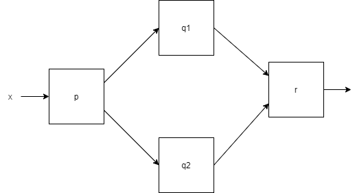

# CompletableFuture(Java8)

## 동시성 모델

### 박스와 채널 모델



박스와 채널 모델 기법은 동시성 모델을 가장 잘 설계하고 개념화할 수 있는 기법이다. 
박스와 채널 모델을 이용하면 생각과 코드를 구조화할 수 있으며, 시스템 구현의 추상화 수준을 높일 수 있다.
박스로 원하는 연산을 표현하면 계산을 손으로 코딩한 결과보다 더 효율적이며, 병렬성을 직접 프로그래밍하는 관점을 콤비네이터를 이용해 내부적으로 작업을 처리하는 관점으로 바꿔준다.

## [Future](./2022-01-02-async-future-executor.md#Future)

([Future](./2022-01-02-async-future-executor.md#Future)에 대한 자세한 내용은 앞 게시물 참고)

Java5부터 비동기 계산을 모델링하는데 `Future`를 이용할 수 있으며, `Future` 계산이 끝났을 때 결과에 접근할 수 있는 참조를 제공한다.

시간이 걸리는 작업을 `Future` 내부로 설정하면 호출자 스레드가 결과를 기다리는 동안 다른 유용한 작업을 수행할 수 있다.

`Future`는 시간이 오래걸리는 작업을 `Callable` 객체 내부로 감싼 다음 `ExecutorService`에 넘기면 된다.

`Future`는 저수준의 스레드에 비해 직관적으로 이해하기 쉽다는 장점이 있다.

#### 오래걸리는 작업 비동기로 실행하는 예

```java
// 스레드풀 생성
ExecutorService es = Executors.newCachedThreadPool();

// Callable executorService에 전달
Future<Double> future = es.submit(() -> {
    return doSomeLongComputation(); // 시간이 오래걸리는 작업 비동기로 수행
});

doSomethingElse();	// 비동기 작업 수행하는동안 다른 작업 진행

// 비동기 작업의 결과를 가져옴.
// 이떄 작업이 완료되지 않았으면 스레드 블록
Double result = future.get(1, TimeUnit.SECONDS);
```

### Future 제한

Future는 다양한 메서드를 제공하지만, 이 메서드만으로 간결한 동시 실행 코드를 구현하기 어렵다. 여러 개의 Future 결과가 있을 때, 의존성을 표현하기 어렵다.

예를 들어 '오래 걸리는 A 작업이 끝나면 그 결과를 B 작업으로 전달해라. B의 결과가 나오면 다른 질의의 결과와 B의 결과를 조합해라.' 와 같은 요구사항을 `Future`로 구현하기 어렵다.

- 두 개의 비동기 Task 결과를 하나로 합친다. 두 결과는 서로 독립적일 수도 의존할 수 도 있다.
- `Future` 집합이 실행하는 모든 Task의 완료를 기다린다.
- `Future` 집합에서 가장 빨리 완료되는 Task를 기다렸다가 결과를 얻는다.
  - 여러 Task가 다양한 방식으로 같은 결과를 구하는 상황
- 비동기 동작에 수동으로 결과를 제공한다.
- 결과를 기다리면서 블록되지 않고 Task가 완료됐다는 알림을 받은 다음에 `Future`의 결과로 원하는 추가동작을 수행할 수 있음.

위 선언형 기능을 이용할 수 있게 `CompletableFuture` 클래스를 Java8부터 제공해준다.

## CompletableFuture

```java
public class CompletableFuture<T> implements Future<T>, CompletionStage<T> {
```

`CompletableFuture`는 `Future`와 `CompletionStage`를 구현한 클래스이다.

-  `Future`이지만 직접 쓰레드를 생성하지 않고 async로 작업을 처리할 수 있음.

- 여러 `CompletableFuture`를 병렬로 처리하거나, 병합하여 처리할 수 있음. 

- Cancel, Error를 처리할 수 있는 방법을 제공

  - `exceptionally()` 

  - 런타임 `get()` 메서드 예외를 처리할 수 있는 기능을 제공

  - ```java
    // ...
        public T get() throws InterruptedException, ExecutionException {
            Object r;
            if ((r = result) == null)
                r = waitingGet(true);
            return (T) reportGet(r);
        }
    
    // ...
        public CompletableFuture<T> exceptionally(
            Function<Throwable, ? extends T> fn) {
            return uniExceptionallyStage(null, fn);
        }
    ```

리액티브 형식의 비동기 API에서는 return대신 기존 콜백이 호출되므로 예외 발생시 실행될 추가 콜백을 만들어 인터페이스를 바꿔줘야한다.

콜백이 여러개인 경우 따로 제공하는 것보다 한 객체로 해당 메서드를 감싸는 것이 좋다.

### 기본 구현 예제

```java
public class Shop {

    private String shopName;

    public Shop(String shopName) {
        this.shopName = shopName;
    }

    // DB를 이용해 가격 정보를 얻는 동시에 외부 서비스(프로모션 정보 등) 호출
    public double getPrice(String product) {
        return caclulatePrice(product);
    }

    public Future<Double> getPriceAsync(String product) {

        // 계산 결과를 포함할 CompletableFuture
        CompletableFuture<Double> future = new CompletableFuture<>();

        new Thread(() -> {
            try {
                // 다른 스레드에서 계산 수행
                double price = caclulatePrice(product);
                // 오래걸리는 계산이 완료되면 Future에 저장
                future.complete(price);
            } catch (Exception e) {
                // 문제 발생시 발생한 에러를 포함시켜 Futuer종료
                future.completeExceptionally(e);
            }

        }).start();

        // 계산 결과가 완료되길 기다리지 않고 반환
        return future;
    }

    public Future<Double> getPriceSupplyAsync(String product) {
        return CompletableFuture.supplyAsync(() -> caclulatePrice(product));
    }

    // 메서드 지연 구현
    private double caclulatePrice(String product) {
        Random random = new Random();
        delay();
        return random.nextDouble() * product.charAt(0) + product.charAt(1);
    }

    public static void delay() {
        try {
            Thread.sleep(1000L);
        } catch (InterruptedException e) {
            throw new RuntimeException(e);
        }
    }
}
```

별도 스레드에서 작업을 수행한 다음 계산이 완료되면 `complete()` 메서드를 호출해 결과값을 반환할 수 있으며, 예외 발생시 `completeExceptionally()`로 내부에서 발생한 예외를 전달 할 수 있다.

```java
class ShopTest {

    @Test
    void test() {
        Shop shop = new Shop("test1");

        Future<Double> future = shop.getPriceAsync("faker goods");

        System.out.println("다른 작업 수행");

        try {
            double price = future.get();
            System.out.println("Price : " + price);
        } catch (InterruptedException e) {
            e.printStackTrace();
        } catch (ExecutionException e) {
            e.printStackTrace();
        }
    }
}
```

```
다른 작업 수행
Price : 130.6716180974313
```

### cancle()에 의한 예외 처리

```java
public boolean cancel(boolean mayInterruptIfRunning) {
        boolean cancelled = (result == null) &&
            internalComplete(new AltResult(new CancellationException()));
        postComplete();
        return cancelled || isCancelled();
    }
    public boolean isCancelled() {
        Object r;
        return ((r = result) instanceof AltResult) &&
            (((AltResult)r).ex instanceof CancellationException);
    }
```

쓰레드에서 `cancle()`을 호출될 수 있다.
이때, `get()`에서 `CancellationException`이 발생하므로, 해당 예외처리가 필요하다.

```java
 CompletableFuture<String> future
                = new CompletableFuture<>();
        Executors.newCachedThreadPool().submit(() -> {
            Thread.sleep(2000);
            future.cancel(false);
            return null;
        });

        String result = null;
        try {
            result = future.get();
        } catch (CancellationException e) {
            e.printStackTrace();
            result = "Canceled!";
        }

        System.out.println(result);
```

```
java.util.concurrent.CancellationException
	at java.base/java.util.concurrent.CompletableFuture.cancel(CompletableFuture.java:2478)
	at async.FutureEx.lambda$main$4(FutureEx.java:91)
	at java.base/java.util.concurrent.FutureTask.run(FutureTask.java:264)
	at java.base/java.util.concurrent.ThreadPoolExecutor.runWorker(ThreadPoolExecutor.java:1136)
	at java.base/java.util.concurrent.ThreadPoolExecutor$Worker.run(ThreadPoolExecutor.java:635)
	at java.base/java.lang.Thread.run(Thread.java:833)
Canceled!
```

### supplyAsync()

직접 쓰레드를 생성하지 않고, 작업을 async로 처리할 수 있다.
인자로 전달된 람다는 다른 쓰레드에서 비동기적으로 처리된다.

```java
    public static <U> CompletableFuture<U> supplyAsync(Supplier<U> supplier) {
        return asyncSupplyStage(ASYNC_POOL, supplier);
    }

    public static <U> CompletableFuture<U> supplyAsync(Supplier<U> supplier,
                                                       Executor executor) {
        return asyncSupplyStage(screenExecutor(executor), supplier);
    }
```

`supplyAsync()`는 `Supplier`를 인수로 받아 `CompletableFuture`를 반환하는 팩토리 메서드이다.

`CompletableFuture`는 `Supplier`를 실행해 비동기적으로 결과를 생성하며, 이때 `ForkJoinPool`의 `Executor`중 하나가 해당 `Supplier`를 실행하며, 이때 두번째 인자로 `Executor`를 지정할 수도 있다.

```java
public Future<Double> getPriceAsyncBySupplyAsync(String product) {
        return CompletableFuture.supplyAsync(() -> caclulatePrice(product));
    }
```

### runAsync()

```java
    public static CompletableFuture<Void> runAsync(Runnable runnable) {
        return asyncRunStage(ASYNC_POOL, runnable);
    }

    public static CompletableFuture<Void> runAsync(Runnable runnable,
                                                   Executor executor) {
        return asyncRunStage(screenExecutor(executor), runnable);
    }
```

`supplyAsync()`와 다르게 `runAsync()`는 반환값이 `Void`로  없다.
결과가 완료될 때까지 `get()`은 블록되지만, `null`을 반환한다.

```java
CompletableFuture<Void> future
        = CompletableFuture.runAsync(() -> System.out.println("future example"));

log("get(): " + future.get());
```

 ```
 15:47:01.328 (ForkJoinPool.commonPool-worker-1) future example
 15:47:01.328 (main) get(): null
 ```

### Exception handling

작업을 처리하는 중에 Exception이 발생할 수 있으며, 이때 `handle()`으로 예외처리를 할 수 있다.

```java
CompletableFuture<String> future = CompletableFuture.supplyAsync(() -> {
	String name = null;
    if (name == null) {
    	throw new RuntimeException("Computation error!");
    }
    return "Hello, " + name;
}).handle((s, t) -> s != null ? s : "Hello, Stranger!");

System.out.println(future.get()); // Hello, Stranger!

```

### `thenApply()` 반환 값이 있는 작업 수행

`supplyAsync()`로 작업이 처리되면, **그 결과를 가지고 다른 작업을 수행하도록 구현**할 수 있다.

```java
    public <U> CompletableFuture<U> thenApply(
        Function<? super T,? extends U> fn) {
        return uniApplyStage(null, fn);
    }
```

인자와 리턴 값이 있는 람다를 수행하며, 여기서 인자는 `supplyAsync()`에서 리턴되는 값이다.

```java
CompletableFuture<String> future1
                = CompletableFuture.supplyAsync(() -> "Future1");

CompletableFuture<String> future2 = future1.thenApply(
                s -> s + " + Future2");

System.out.println("future1.get(): " + future1.get());
System.out.println("future2.get(): " + future2.get());
```

```java
future1.get(): Future1
future2.get(): Future1 + Future2
```

다음과 같이 한번에 정의할 수도 있다.

```java
CompletableFuture<String> future = CompletableFuture
                .supplyAsync(() -> "Future1")
                .thenApply(s -> s + " + Future2")
    			.thenApply(s -> s + " + Future3");
```

### thenAccept() 반환 값이 없는 작업 수행

```java
public CompletableFuture<Void> thenAccept(Consumer<? super T> action) {
        return uniAcceptStage(null, action);
}
```

인자는 있지만 반환값이 없는 람다를 처리할 수 있으며, 반환값이 없기 때문에 `CompletableFuture<Void>`를 반환한다.

```java
CompletableFuture<Void> nullFuture = CompletableFuture
                .supplyAsync(() -> "Future")
                .thenAccept(s -> System.out.println(s + " + Future2"));

System.out.println("nullFuture.get() : " + nullFuture.get());
```

```
Future + Future2
nullFuture.get() : null
```

`CompletableFuture`는 완료 즉시 응답하는것이 좋으므로 `thenAcceptAsync`는 사용하지 않는다. 오히려 `thenAcceptAsync()` 사용시 새로운 스레드를 이용할 때까지 기다려야하는 상황이 발생할 수 도 있다.

### thenCompose() 여러작업 순차적 수행

```java
public <U> CompletableFuture<U> thenCompose(Function<? super T, ? extends CompletionStage<U>> fn) {
    return uniComposeStage(null, fn);
}
```

chain처럼 두개의 `CompletableFuture`를 하나의 `CompletableFuture`로 만들어주는 역할을 한다.
첫번째 future의 결과가 반환되면 그 결과를 두번째 future에 전달하여 순차적으로 작업이 처리된다.

```java
CompletableFuture<String> completableFuture = CompletableFuture
                .supplyAsync(() -> "Future1")
                .thenCompose(s -> CompletableFuture.supplyAsync(() -> s + " + Future2"));
System.out.println(completableFuture.get());
```

```
Future1 + Future2
```

### thenCombine() 여러 작업 동시 수행

```java
    public <U,V> CompletableFuture<V> thenCombine(
        CompletionStage<? extends U> other,
        BiFunction<? super T,? super U,? extends V> fn) {
        return biApplyStage(null, other, fn);
    }
```

`thenCombine()`은 여러개의 `CompletableFuture`를 병렬로 처리되도록 하며, 모든 처리가 완료되고 그 결과를 하나로 합칠 수 있다.

```java
CompletableFuture<String> future1 = CompletableFuture
                .supplyAsync(() -> "Future1")
                .thenApplyAsync((s) -> {
                    System.out.println("Starting future1");
                    try {
                        Thread.sleep(2000);
                    } catch (InterruptedException e) {
                        e.printStackTrace();
                    }
                    return s + "!";
                });

CompletableFuture<String> future2 = CompletableFuture
                .supplyAsync(() -> "Future2")
                .thenApplyAsync((s) -> {
                    System.out.println("Starting future2");
                    try {
                        Thread.sleep(2000);
                    } catch (InterruptedException e) {
                        e.printStackTrace();
                    }
                    return s + "!";
                });

future1.thenCombine(future2, (s1, s2) -> s1 + " + " + s2)
                .thenAccept((s) -> System.out.println(s));
```

```
(ForkJoinPool.commonPool-worker-2) Starting future2
(ForkJoinPool.commonPool-worker-1) Starting future1
(ForkJoinPool.commonPool-worker-1) Future1! + Future2!
```

### anyOf()

여러개의 `CompletableFuture`중 빨리 처리되는 1개의 결과만 가져오는 메소드.

```java
CompletableFuture<String> future1 = CompletableFuture
                .supplyAsync(() -> {
                    System.out.println("starting future1");
                    return "Future1";
                });

CompletableFuture<String> future2 = CompletableFuture
                .supplyAsync(() -> {
                    System.out.println("starting future2");
                    return "Future2";
                });

CompletableFuture<String> future3 = CompletableFuture
                .supplyAsync(() -> {
                    System.out.println("starting future3");
                    return "Future3";
                });

CompletableFuture.anyOf(future1, future2, future3)
                .thenAccept(s -> System.out.println("Result: " + s));

```

```
starting future1
starting future2
starting future3
Result: Future1
```

### allOf()

모든 future의 결과를 받아서 처리하는 메소드.

```java
        CompletableFuture<String> future1 = CompletableFuture
                .supplyAsync(() -> "Future1");

        CompletableFuture<String> future2 = CompletableFuture
                .supplyAsync(() -> "Future2");

        CompletableFuture<String> future3 = CompletableFuture
                .supplyAsync(() -> "Future3");

        CompletableFuture<Void> combinedFuture
                = CompletableFuture.allOf(future1, future2, future3);

        System.out.println("get() : " + combinedFuture.get());
        System.out.println("future1.isDone() : " + future1.isDone());
        System.out.println("future2.isDone() : " + future2.isDone());
        System.out.println("future3.isDone() : " + future3.isDone());

        String combined = Stream.of(future1, future2, future3)
                .map(CompletableFuture::join)
                .collect(Collectors.joining(" + "));
        System.out.println("Combined: " + combined);
```

```
get() : null
future1.isDone() : true
future2.isDone() : true
future3.isDone() : true
Combined: Future1 + Future2 + Future3
```

Stream api를 사용하여 결과를 처리할 수 있다.

### Async method

메소드 뒤에 `Async()`로 끝나는 메소드들이 있다. 이 메소드는 동일한 쓰레드를 사용하지 않고 다른 쓰레드를 사용해 처리하고 싶을 때 사용하면된다.

### Non-blocking

위의 예제에 이어서, 상점들의 가격을 찾는 예제로 살펴볼 것이다.

```java
        List<Shop> shops = Arrays.asList(new Shop("test1")
                , new Shop("test2")
                ...
                , new Shop("test9")
                , new Shop("test10"));

        String product = "faker goods";
```

#### 순차 조회

```java
    public List<String> findPricesSequential(String product) {
        return shops.stream()
                .map(shop -> String.format("%s price is %.2f", shop.getShopName(), shop.getPrice(product)))
                .collect(Collectors.toList());
    }
```

#### 병렬 스트림

이를 병렬 스트림으로 병렬화 할수도 잇다.

```java
    public List<String> findPricesParallel(String product) {
        return shops.parallelStream()
                .map(shop -> String.format("%s price is %.2f", shop.getShopName(), shop.getPrice(product)))
                .collect(Collectors.toList());
    }
```

#### CompletableFuture로 비동기 호출

```java
    public List<String> findPricesFuture(String product) {
        List<CompletableFuture<String>> priceFutures = shops.stream()
                .map(shop -> CompletableFuture.supplyAsync(
                        () -> String.format("%s price is %.2f", shop.getShopName(), shop.getPrice(product))))
                .collect(Collectors.toList());

        return priceFutures.stream()
                .map(CompletableFuture::join)
                .collect(Collectors.toList());
    }
```

위에서 다룬 `supplyAsync` 메소드를 활용해 비동기 호출을 구현할 수 있다.

```
동기 : 10045
비동기 : 1012
CompletableFuture 비동기 : 2011
```

호출된 결과를 보면 `CompletableFuture` 비동기 처리가 동기 처리보다는 빠르지만 병렬 스트림보다 느린 것을 볼 수 있다.

#### CompletableFuture Custom Executor

 `CompletableFuture`는 병렬 스트림과 달리 다양한 `Executor`를 지정할 수 있다. `Executor`로 애플리케이션에 맞는 최적화된 설정을 만들 수 있다.

> 스레드 풀 크기 조정
>
> 스레드 풀이 너무 크면 CPU와 메모리 자원을 서로 경쟁하느라 낭비할 수 있으며, 
> 반면에 너무 작으면 CPU의 일부 코어는 활용되지 않을 수 있다.
>
> -   Nthread = Ncpu * Ucpu * (1+W/C)
>   - Ncpu : `Runtime.getRuntime().availableProcessors()`가 반환하는 코어 수
>   - Ucpu : 0과 1사이의 값을 갖는 CPU 활용 비율
>   - W : 대기시간
>   - C : 계산시간

Executor를 애플리케이션의 특성에 맞는 Executor를 구현하여 활용하면 더 나은 성능을 보일 수 있다.

```java
    Executor executor = Executors.newFixedThreadPool(Math.min(shops.size(), 10), new ThreadFactory() {
        @Override
        public Thread newThread(Runnable r) {
            Thread t = new Thread();
            t.setDaemon(true); // 프로그램 종료를 방해하지 않음
            return t;
        }
    });

    public List<String> findPricesFutureCustomExecutor(String product) {
        List<CompletableFuture<String>> priceFutures = shops.stream()
                .map(shop -> CompletableFuture.supplyAsync(
                        () -> String.format("%s price is %.2f", shop.getShopName(), shop.getPrice(product), executor)))
                .collect(Collectors.toList());

        return priceFutures.stream()
                .map(CompletableFuture::join)
                .collect(Collectors.toList());
    }
```

```
CompletableFuture 비동기 : 2011
CompletableFuture Custom Executor 비동기 : 2008
```

### CompletableFuture와 Combinators를 이용한 동시성

자바8부터 `CompletableFuture`를 이용해 `Future`를 조합할 수 있는 기능이 추가됐다. 일반적으로 `Future`는  `get()`으로 실행 결과를 얻을 수 있는 `Callble`로 만들어진다. 
하지만 `CompletableFuture`는

-  실행할 코드 없이 `Future`를 생성할 수 있도록 허용
-  `complete()` 메서드는 나중에 어떤 값을 이용해 다른 스레드가 이를 완료하고, `get()`으로 값을 얻을 수 있게 허용

```java
    public <U,V> CompletableFuture<V> thenCombine(
        CompletionStage<? extends U> other,
        BiFunction<? super T,? super U,? extends V> fn) {
        return biApplyStage(null, other, fn);
    }
```

`CompletableFuture`의 `thenCombile()` 메서드를 사용해 두 연산의 결과를 더 효과적으로 계산할 수 있다.

```java
public class CFCombine {

    public static void main(String[] args) {
        ExecutorService executorService = Executors.newFixedThreadPool(10);

        int x = 1337;

        CompletableFuture<Integer> a = new CompletableFuture<>();
        CompletableFuture<Integer> b = new CompletableFuture<>();

        // Future a와 b를 알지 못하는 상태에서 두 연산이 끝났을때 thenCombile은 스레드 풀에서 실행된 연산을 만든다.
        // 즉, c는 다른 두 작업이 끝날 때까지는 스레드에서 실행되지 않는다.
        // 먼저 시작해서 블록되지 않음
        CompletableFuture<Integer> c = a.thenCombine(b,(y,z) -> y + z);

        executorService.submit(() -> a.complete(f(x)));
        executorService.submit(() -> b.complete(g(x)));

        System.out.println(c.get());
        executorService.shutdown();
    }
}
```

`thenCombine()` 메서드를 이용해 다른 두 연산이 끝난 다음에 c연산을 수행할 수 있다. c는 다른 두 작업이 끝날 때까지 스레드에서 실행되지 않으며, 먼저 실행되어 블록되지 않아 앞서 말한 문제점들을 해결할 수 있다.
만약 많은 수의 `Future`를 사용해야하는 경우에 `CompletableFuture`와 콤비네이터를 사용해 `get()`에서 블록하지 않아 병렬 실행의 효율성을 높이고 데드락은 피하는 최상의 해결책을 구현할 수 있다.

시스템이 커지고 각각의 많은 박스와 채널 다이어그램이 생기는 경우에는 많은 태스크가 `get()` 블럭 메서드를 호출해 `Future`가 끝나기를 기다리는 상태에 놓일 수 있으며, 이는 결과적으로 하드웨어의 병렬성을 제대로 활용하지 못하거나 데드락에 걸릴 수 있다.
이러한 문제를 `CompletableFuture`와 Combinators를 이용해 문제를 해결 할 수 있다.

## 참고

-  [모던 자바 인 액션]()
- [https://codechacha.com/ko/java-completable-future/](https://codechacha.com/ko/java-completable-future/)


