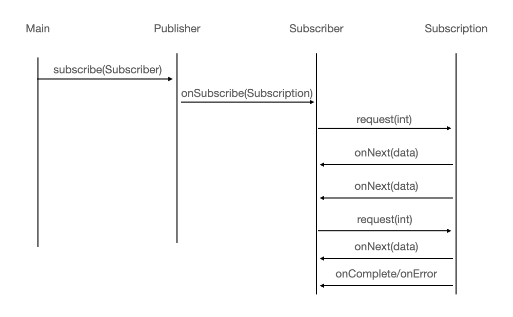

# 리액티브 프로그래밍

리액티브 프로그래밍에서는 다양한 시스템과 소스에서 들어오는 데이터 항목 스트림을 비동기적으로 처리하고 합친다. 한 개의 컴포넌트나 애플리케이션뿐 아니라 전체의 리액티브 시스템을 구성하는 여러 컴포넌트를 조절하는 데도 리액티브 기법을 사용할 수 있다.

여기서 리액티브 시스템이란 런타임 환경이 변화에 대응하도록 전체 아키텍처가 설계된 프로그램이다.

## [Reactive Manifesto](https://www.reactivemanifesto.org/ko)


### 반응성/응답성(responsive)

- 시스템은 **가능한 즉시 응답**해야한다.
- 반응성(응답성) 있는 시스템은 **일관성 있는 응답 시간을 유지해 일관된 서비스 품질을 제공**한다.
- 사용자가 기대치를 가질 수 있다.
- 반응성이 뒷받침되어야 사용성을 높일 수 있다.

리액티브 시스템이 큰 작업을 처리하느라 **간단한 질의의 응답을 지연하지 않고 실시간으로 입력에 반응**하는 것.

### 탄력성(resilient)

- 시스템에 장애가 발생해도 반응해야한다.(반응성 유지)
- 복제(replication), 봉쇄(containment), 격리(isolation), 위임(delegation)에 의해 이루어진다.
- 장애는 각 컴포넌트 내부로 억제되어 각 컴포넌트들을 서로 격리시켜, 하나의 컴포넌트에 장애가 발생하더라도 전체 시스템에 영향을 끼치지 못한다.
- 탄력성 없는 시스템은 장애가 발생할 경우 응답성을 잃게 된다.

**한 컴포넌트의 실패로 전체 시스템이 실패하지 않음을 의미**.
예를 들어 네트워크가 고장이 나도 이와 관계없는 질의에는 아무 영향이 없어야한다.

### 유연성(elastic)

- 리액티브 시스템은 작업량이 변하더라도 그 변화에 대응하고 응답성을 유지해야한다.
- 작업 부하가 발생하면 자동으로 관련 컴포넌트에 할당된 자원수를 늘려 대응하고, 줄어들면 자원을 감소시키면서 변화에 대응한다.
- 리액티브 시스템은 실시간 성능을 측정하는 도구를 제공하여 응답성 있고 예측 가능한 규모 확장 알고리즘을 지원한다.

시스템이 자신의 **작업 부하에 맞게 적응하며 작업을 효율적으로 처리**.
예를 들어 각 큐가 원활하게 처리될 수 있도록 다양한 소프트웨어 서비스와 관련된 작업자 스레드를 적절하게 재배치할 수 있다.

### 메세지 주도(message-driven)

- 리액티브 시스템은 **비동기 메시지 전달에 의존**해 구성요소 사이간 느슨한 결합, 격리, 위치 투명성을 지원하도록 경계를 명확히 정의한다.
- 비동기 메시지를 전달해 컴포넌트끼리 통신이 이루어지고, 이 덕분에 장애를 메시지로 처리하는 탄력성과 주고받은 메시지 양에 따라 적절하게 자원을 할당하는 유연성을 얻을 수 있다.

### 애플리케이션 수준의 리액티브

애플리케이션 수준 컴포넌트의 리액티브 프로그래밍의 주요 기능은 비동기로 작업을 수행할 수 잇다는 점이다. 이벤트 스트림을 블록하지 않고 비동기로 처리하는 것이 최신 멀티코어 CPU의 사용률을 극대화 할 수 있는 방법이며, 이를 달성하기 위해 리액티브 프레임워크와 라이브러리는 스레드를 `Future`, `Actor`, 일련의 콜백을 발생시키는 이벤트 루프 등과 공유하고 처리할 이벤트를 변환 관리한다.

이 기술은 개발자가 동기 블록, 경쟁조건, 데드락 같은 저수준의 멀티스레드 문제를 직접 처리할 필요가 없어지면서 비즈니스 요구사항을 구현하는데 더 집중할 수 있다.

**스레드를 다시 쪼개는 종류의 기술을 사용할 때는 메인 이벤트 루프안에서는 절대 동작을 블럭하지 않아야한다는 전제조건**이 따른다.

- 데이터베이스, 파일 시스템 접근, 작업완료까지 얼마나 걸릴지 예측이 힘든 원격 서비스 호출등 모든 I/O관련 동작이 블록 동작에 해당

[RxJava](https://github.com/ReactiveX/RxJava). [Akka](https://akka.io/) 같은 리액티브 프레임워크는 **별도로 지정된 스레드 풀에서 블록 동작을 실행**시켜 이 문제를 해결한다.

즉, 메인 풀의 모든 스레드는 방해받지 않고 실행되어, 모든 CPU코어가 최적의 상황에서 동작할 수 있다.

- CPU 관련 작업 : 실제로 할당된 CPU 코어 or 스레드를 100% 활용해 뭔가를 연산하느라 다른 일을 처리할 수 없어 블록
- I/O 관련 작업 : 사용자 입력과 같은 외부 응답을 기다리면서 CPU 코어 or 스레드가 처리할 일이 없이 블록되는 상황

CPU 관련 작업과 I/O 관련 작업을 분리하여 조금 더 정밀하게 풀의 크기 등을 설정할 수 있고, 작업 성능을 관찰할 수 있다.

리액티브 애플리케이션은 비교적 짧은 시간 동안만 유지되는 데이터 스트림에 기반한 연산을 수행하며, 부통 이벤트 주도로 분류된다.

### 리액티브 시스템

리액티브 시스템은 여러 애플리케이션이 한 개의 일관적이고 회복할 수 있는 플랫폼을 구성할 수 있게 해줄 뿐 아니라 애플리케이션 중 하나가 실패해도 전체 시스템은 계속 운영될 수 있도록 도와주는 소프트웨어 아키텍처이다.

리액티브 시스템은 애플리케이션을 조립하고 상호소통을 조절하며, 주요 속성으로 메시지 주도를 꼽을 수 있다.

메시지는 정의된 목적지 하나를 향하지만, 이벤트는 관련 이벤트를 관찰하도록 등록한 컴포넌트가 수신한다는 점이 다르다.

리액티브 아키텍처에서는 컴포넌트에서 발생한 장애를 고립시킴으로 문제가 주변의 다른 컴포넌트로 전파되면서 전체 시스템 장애로 이어지는 것을 막는다.

고립과 비결합이 탄력성(resilient)의 핵심이라면, 유연성(elastic)의 핵심은 위치 투명성이다.
위치 투명성은 리액티브 시스템의 모든 컴포턴트가 수신자의 위치에 상관없이 다른 모든 서비스와 통신할 수 있음을 의미한다.

위치 투명성 덕분에 시스템 복제가 가능하며, 현재 작업 부하에 따라 애플리케이션 확장이 가능하다.

## 리액티브 프로그래밍

> 리액티브 프로그래밍은 데이터 스트림 및 변화의 전파와 관련된 선언적 프로그래밍 패러다임 - wiki

- 변화의 전파와 데이터 흐름 : 데이터가 변경될 때마다 이벤트를 발생시켜 데이터를 지속적으로 전달
- 선언적 프로그래밍 : 실행할 동작을 구체적으로 명시하는 명령형 프로그램과 달리 선연형 프로그램은 단순히 목표를 선언

리액티브 프로그래밍은 리액티브 스트림을 사용하는 프로그래밍이다.

- 리액티브 스트림 : 잠재적으로 무한의 비동기 데이터를 순서대로 블록하지 않는 역압력을 전제해 처리하는 표준 기술
- 역압력(Backpressure)
  - 발행-구독 프로토콜에서 이벤트 스트림의 구독자는 발행자가 이벤트를 제공하는 속도보다 느린 속도로 이벤트를 소비하면서 문제가 발생하지 않도록 보장하는 장치
  - 부하가 발생한 컴포넌트가 완전 불능이 되거나 예상치 못한 방식으로 이벤트를 잃어버리는 등의 문제가 발생하지 않음
  - 업스트림 발행자에 다른 데이터를 받기전 기존의 데이터를 처리하는데 얼마나 걸리고, 지금 얼마나 많은 이벤트를 수신할 수 있는지 알릴 수 있어야된다.

역압력이나 제어 흐름 기법으로 데이터 수신자가 스레드를 블록하지 않고도 데이터 수신자가 처리할 수 없을 만큼 많은 데이터를 받는 일을 방지하는 프로토콜을 제공하여 다음과 같은 일이 발생하는 것을 방지할 수 있다.

- 비동기 작업이 실행되는동안 시스템에 암묵적으로 블록 API에 의해 역압력이 제공되는데, 그 작업이 완료될 때까지 다른 유용한 작업을 실행할 수 없어 많은 자원을 낭비하게 된다.
- 비동기 API를 이용하면 하드웨어 사용률을 극대화할 수 있지만, 느린 다운스트림 컴포넌트에 너무 큰 부하를 줄 가능성도 생긴다.

> 데이터가 발행자(생산자)에서 구독자(소비자)로 흐름에 착안해 이를 **upstream** or **downstream**이라 부른다.
>
> 발행자 -> 구독자 downstream, 구독자 -> 발행자 upstream

### [리액티브 스트림](https://www.reactive-streams.org/)

리액티브 스트림에서 모든 리액티브 스트림 구현이 제공해야되는 최소 기능 집합을 4개의 관련 인터페이스로 정의 했으며, 아래 클래스, 라이브러리에서 이 인터페이스를 구현하고 있다.

- `Flow`
- Akka 스트림
- 리액터
- RxJava
- Vert.x

### Flow(Java9)

- `java.util.concurrent.Flow`

여러가지 방법으로 리액티브 선언문 속성을 구현할 수 있지만 `Flow` 관련 자바 인터페이스에서 제공하는 리액티브 프로그래밍 형식을 이용하는 것도 주요 방법 중 하나이다. 리액티브 프로그래밍은 메세지 주도 속성을 반영하고 있다.

`Flow`는 정적 컴포넌트 하나를 포함하고 있으며, 인스턴스화할 수 없다.

리액티브 스트림 프로젝트의 표준에 따라 `Flow` 인터페이스에 발행(pub)-구독(sub) 모델을 지원할 수 있게 `Flow`는 중첩된 인터페이스 4개를 포함한다.

- `Publisher`  : **발행자**
- `Subscriber` : **구독자**
- `Subscription` : 여기서 연결 **구독**
- `Processor` 

- 발행자는 수많은 이벤트를 제공할 수 있지만, 구독자의 요구사항에 따라 역압력 기법에 의해 이벤트 제공 속도 제한됨
- 발행자는 자바의 함수형 인터페이스로 자신을 등록
- 구독자는 발행자가 발행한 이벤트의 리스너로 자신을 등록
- 구독은 발행자와 구독자 사이의 제어흐름, 역압력을 관리
- 구독을 이용해 메시지(이벤트)를 전송한다.

### Flow.Publisher

```java
	@FunctionalInterface
    public static interface Publisher<T> {
        public void subscribe(Subscriber<? super T> subscriber);
    }

```

### Flow.Subscriber

`Publisher`가 관련 이벤트 발행 시 호출할 수 있게 콜백 메서드 4개 정의

```java
    public static interface Subscriber<T> {

        public void onSubscribe(Subscription subscription);

        public void onNext(T item);

        public void onError(Throwable throwable);

        public void onComplete();
    }
```

이벤트는 다음 프로토콜에서 정의한 순서로 지정된 메서드 호출을 통해 발행되어야한다.

```
onSubscribe onNext* (onError | onComplete)?
```

- `onSubscribe()` 항상 처음 호출
- 이어서 `onNext()`가 여러번 호출될 수 있음
- 이벤트 스트림은 영원히 지속되거나 `onComplete()` 콜백을 통해 더 이상 데이터가 없고 종료됐음을 알릴 수 있음
- 장애 발생시 `onError()` 호출

### Flow.Subscription

```java
	public static interface Subscription {
        public void request(long n);
        public void cancel();
    }
```

`Subscriber`가 `Publisher`에 자신을 등록할 때 `onSubscribe(subscription)`를 호출해 `Subscription`을 전달한다.

- `request(n)` : 발행자(`Publisher`)에 주어진 개수의 이벤트를 처리할 준비가 되었음을 알림
- `cancel()` : 발행자(`Publisher`)에 구독 취소하여, 더 이상 이벤트를 받지 않음을 통지

### Flow.Processor

```java
public static interface Processor<T,R> extends Subscriber<T>, Publisher<R> {
}
```

`Processor`는 `Publisher`와 `Subscriber`를 상속 받을 뿐 아무 메서드도 추가하지 않는다.
`Processor`는 리액티브 스트림에서 처리하는 이벤트의 변환 단계를 나타낸다.

- `Processor`가 에러 수신하면 회복하거나 즉시 `onError` 신호로 모든 `Subscriber`에 에러 전파
- 마지막 `Subscriber`가 `Subscription`을 취소하면, `Processor`는 자신의 업스트림 `Subscription`도 취소하여 취소 신호 전파

### Flow 명세서

- `Publisher`는 반드시 `Subscription`의 `request(n)` 메서드에 정의된 개수 이하의 요소만 `Subscriber`에 전달해야한다.
- `onNext(data)`로 지정된 개수 이하의 요소를 전달할 수 있으며
- `onComplete`, `onError`를 호출해 `Subscription` 종료
  - 동작이 성공적으로 끝나면 `onComplete` 호출
  - 문제가 발생하면 `onError`를 호출
- `Subscriber`는 요소를 받아 처리할 수 있음을 `Publisher`에 알려 역압력을 행사할 수 있다.
- `onComplete`, `onError` 신호를 처리하는 상황에서 `Subscriber`는 `Publisher`, `Subscription`의 어떤 메서드도 호출할 수 없으며, `Subscription`이 취소되었다고 가정해야한다.
- `Subscriber`는 `Subscription.request()` 메서드 호출 없이도 언제든 종료 시그널을 받을 준비가 되어 있어야하며,
- `Subscription.cancle()` 호출된 이후에라도 한 개 이상의 `onNext()`를 받을 준비가 되어있어야된다.
- `Publisher`와 `Subscriber`는 정확하게 `Subscription`을 공유해야하며, 각각 고유한 역할을 수행하기 위해 `onSubscribe()`와 `onNext()`에서 `Subscriber`는 `request()`메서드를 동기적으로 호출할 수 있어야한다.
- `Subscription.cancle()` 는 여러번 호출해도 한 번 호출한 것과 같은 효과를 가져야하며, 여러 번 이 메서드를 호출해도 다른 추가 호출에 영향이 없도록 스레드에 안전해야한다.
- 이전에 취소된 가입이 영구적으로 적용되었다면, 이후의 기능에 영향을 주지 않을 가능성이 있어 같은 `Subscriber` 객체에 다시 가입하는 것에 예외발생을 강제하진 않는다.

### Flow API Lifecycle



여기서 `request()`로 역압력을 행사하고 있다.

### Flow API에서 구현을 제공하지 않는 이유

API 개발 당시 Akka, RxJava등 다양한 리액티브 스트림의 자바 코드 라이브러리가 이미 존재했기 때문이다.

같은 발행-구독 사상에 기반해 리액티브 프로그래밍을 구현했지만, 라이브러리는 각각 개발되었고, 서로 다른 이름규칙과 API를 사용했다.

그래서 Java9의 표준화 과정에서 `Flow`의 인터페이스를 기반으로 리액티브 개념을 구현하도록 진화했고, 이 표준화 작업으로 다양한 라이브러리가 쉽게 협력할 수 있게 됐다.

### 예제

스프레드 시트에서 C3는 `= C1 + C2` 공식을 포함하고 있으며, C1, C2의 값이 변경되면 C3도 변경되는 예로 구독자와 발행자를 구현해 볼 것이다.

```java
public class SimpleCell implements Publisher<Integer>, Subscriber<Integer> {
    private int value = 0;
    private String name;
    private List<Subscriber> subscribers = new ArrayList<>();

    public SimpleCell(String name) {
        this.name = name;
    }

    @Override
    public void subscribe(Subscriber<? super Integer> subscriber) {
        subscribers.add(subscriber);
    }

    public void subscribe(Consumer<? super Integer> onNext) {
        subscribers.add(new Subscriber<Integer>() {

            @Override
            public void onComplete() {
            }

            @Override
            public void onError(Throwable t) {
                t.printStackTrace();
            }

            @Override
            public void onNext(Integer val) {
                onNext.accept(val);
            }

            @Override
            public void onSubscribe(Subscription s) {
            }

        });
    }

    // 새로운 값이 있음을 모든 구독자에게 알리는 메서드
    private void notifyAllSubscribers() {
        subscribers.forEach(subscriber -> subscriber.onNext(this.value));
    }

    @Override
    public void onSubscribe(Subscription subscription) {
        System.out.println("onSubscribe");
    }

    @Override
    public void onNext(Integer newValue) {
        this.value = newValue;
        System.out.println(this.name + " : " + this.value);
        notifyAllSubscribers(); // 값이 갱신되었음을 모든 구독자에게 알림
    }


    @Override
    public void onError(Throwable throwable) {
        System.out.println("onError");
    }

    @Override
    public void onComplete() {
        System.out.println("onComplete");

    }
}
```

```java
public class ArithmeticCell extends SimpleCell{

    private int left;
    private int right;

    public ArithmeticCell(String name) {
        super(name);
    }

    public void setLeft(int left) {
        this.left = left;
        onNext(left + this.right);
    }

    public void setRight(int right) {
        this.right = right;
        onNext(right + this.left);
    }
}

```

```java
class ArithmeticCellTest {

    @Test
    void test1() {
        ArithmeticCell c3 = new ArithmeticCell("C3");
        ArithmeticCell c5 = new ArithmeticCell("C5");

        SimpleCell c1 = new SimpleCell("C1");
        SimpleCell c4 = new SimpleCell("C4");
        SimpleCell c2 = new SimpleCell("C2");

        c1.subscribe(c3::setLeft);
        c2.subscribe(c3::setRight);

        c3.subscribe(c5::setLeft);
        c4.subscribe(c5::setRight);

        c1.onNext(10);
        c2.onNext(20);
        c1.onNext(15);
        c4.onNext(1);
        c4.onNext(3);
    }

}
```

```
C1 : 10
C3 : 10
C5 : 10
C2 : 20
C3 : 30
C5 : 30
C1 : 15
C3 : 35
C5 : 35
C4 : 1
C5 : 36
C4 : 3
C5 : 38
```

데이터가 발행자(생산자)에서 구독자(소비자)로 흐름에 착안해 이를 **upstream** or **downstream**이라 부른다.
위 예제에서 newValue는 업스트림 `onNext()` 메서드로 전달되고 `notifyAllSubstribers()` 호출을 통해 다운스트림 `onNext()`로 전달된다.

### Pressure

Pressure(압력)이란 뭘까?

예를 들어 모든 SMS 메시지를 폰으로 제공하는 발행자에 가입하는 상황이 있다. 처음에는 새 폰에서 가입이 잘 동작하지만 추 후에는 매 초마다 수천 개의 메세지가 `onNext()`로 전달되는 경우와 같은 상황을 압력이라 볼 수 있다.

### Backpressure

Publisher에서 Subscriber로 정보를 전달할 때 정보의 흐름 속도를 backpressure(흐름 제어)로 Subscriber에서 Publisher로 정보를 요청해야 할 필요가 있을 수 있다.

```java
	public static interface Subscriber<T> {
        public void onSubscribe(Subscription subscription);
    //...
    }
```

Publisher는 여러 구독자를 가지고 있으므로 backpressure가 한 연결에만 영향을 미춰야한다. Publisher와 Subscriber사이에 채널이 연결되면 첫 이벤트로 `onSubscribe()`메서드가 호출된다.

```java
	public static interface Subscription {
        public void request(long n);

        public void cancel();
    }
```

`Subscription`은 `Publisher`와 `Subscriber`와  통신할 수 있는 메서드를 포함하고 있다.
여기서 콜백을 통한 역방향 소통에 주목해야한다. `Publisher`는 `Subscription` 객체를 만들어 `Subscriber`로 전달하면 `Subscriber`는 이를 이용해 `Publisher`에 정보를 보낼 수 있다.

실제 역압력의 간단한 형태를 살펴보자. 한번에 한 개의 이벤트를 처리하도록 발행-구독 연결을 구성하려면 다음과 같이 구현해야한다.

- `Subscriber`가 `onSubscribe`로 전달된 `Subscription` 구현 객체를 subscription 같은 필드에 로컬로 저장
- `Subscriber`가 수많은 이벤트를 받지 않도록 `onSubscribe`, `onNext`, `onError`의 마지막 동작에 `channel.request(1)`을 추가해 오직 한 이벤트만 요청
- 요청을 보낸 채널에만 `onNext`, `onError` 이벤트를 보내도록 한다.

## 참고

- [모던 자바 인 액션]()

