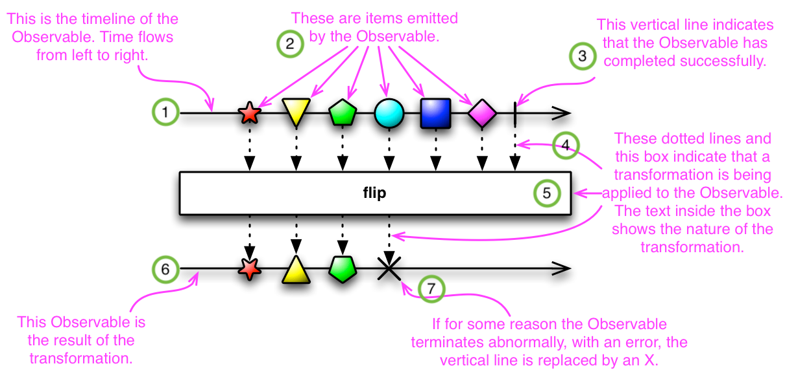
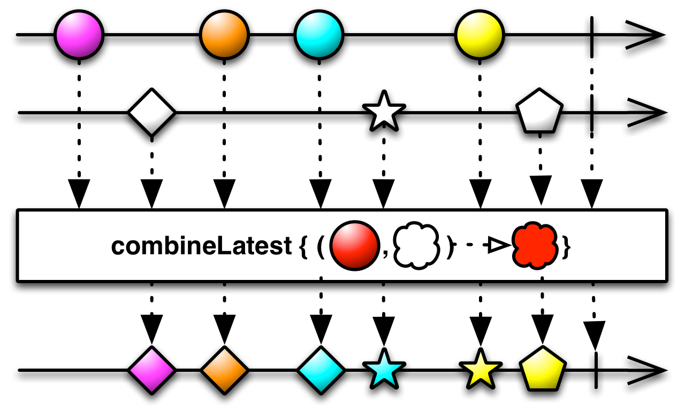
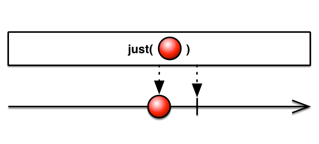
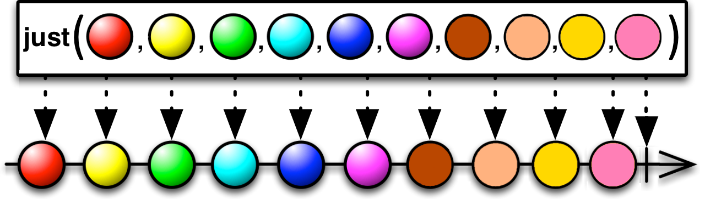

# [RxJava](https://github.com/ReactiveX/RxJava)(리액티브 라이브러리)

RxJava는 자바로 리액티브 애플리케이션을 구현하는데 사용하는 라이브러리로, Reactive Streams API와 `Flow`를 지원하도록 RxJava2.0버전이 개발되었다.

리액티브 프로그래밍은 비동기 연산을 필터링, 변환, 조합해 위 세가지 핵심이유를 해결할 수 있다. 따라서 RxJava는 `Observable`과 같은 데이터 소스와 `map()`, `filter()`, `reduce()`와 같은 리액티브 연산자를 제공한다.

## 마블 다이어그램

마블 다이어그램은 RxJava를 이해하는 핵심 도구들이다.



1. 실선 : `Observable`의 timeline이다. 시간순으로 데이터가 발행된는 것을 표현
2. items : `Observable`에서 발행하는 데이터이다. 시간 순으로 별, 역삼각형, 오각형, 원 등의 도형을 발행하며, 데이터 발행시에는 `onNext()` 가 호출된다.
3. `|` : 파이프는 `Observable`에서 데이터 발행을 완료했다는 의미로, 한번 완료된 이후에는 더 이상 데이터를 발행할 수 없다. 완료시 `onComplete()` 호출
4. 점선 화살표 : 각각 함수의 입력과 출력 데이터
5. 가운데 박스 : 함수
   - `flip()`은 입력값을 뒤집는 함수이다. 그래서 위 이미지에서 결과 값이 위아래 180도 회전하여 뒤집힌 것을 볼 수 있다.
6. 함수의 결과가 출력된 표시줄
7. X : 함수가 입력값 처리시 발생한 에러, 에러 발생시 `onError()` 알림 발생



`combineLatest()`는 첫번째 `Observable` 의 입력값과 두번째 `Observable`의 입력값이 모두 들어오면 두 결과를 조합한 것임을 마블 다이어그램을 통해 직관적으로 이해할 수 있다.

## dependency

```groo
implementation "io.reactivex.rxjava3:rxjava:3.x.y"
```

- `x`, `y` 최신 버전

## RxJava 요소 - `Observable`

- `io.reactivex.Observable` :  `Flow.Publisher` 구현체
  - 역압력 기능 포함하고 있지 않음
  - 단순한 프로그램, 마우스 움직임과 같은 사용자 인터페이스 이벤트에 적합
  - RxJava는 천 개 이하의 요소를 가진 스트림, 역압력을 적용하기 힘든 GUI 이벤트, 자주 발생하지 않는 종류의 이벤트에 역압력을 적용하지 말 것을 권장
- `io.reactivex.Flowable` : `Flow.Publisher` 구현체
  - 역압력기능이 있는 `Flow `를 포함
  - `Observable`과 차이점은 역압력 기능만 있음

### Observer

```java
public interface Observer<@NonNull T> {
    void onSubscribe(@NonNull Disposable d);

    void onNext(@NonNull T t);

    void onError(@NonNull Throwable e);

    void onComplete();
}
```


### Observable

Observable은 옵저버(Observer) 패턴을 구현한다. 옵저버 패턴은 객체의 상태 변화를 관찰하는 관찰자(옵저버) 목록을 객체에 등록한다. 그리고 상태 변화가 있을때마다 메서드를 호출하여 객체가 직접 목록의 각 옵저버에게 변화를 알려준다. 라이프 사이클은 존재하지 않으며 보통 단일 함수를 통해 변화만 알린다.
Observable은 관찰자(Observer)가 관찰하는 대상이라고 이해할 수 있다.

Observable 클래스에는 Observable을 생성하는 팩토리 함수, 중간 결과를 처리하는 함수, 디버그 및 예외처리 함수가 모두 포함되어있다. Observable 생성시에는 직접 인스턴스를 만들지 않고 정적 팩토리 함수를 호출한다.

| 팩토리 함수                                      | 함수                                                         |
| ------------------------------------------------ | ------------------------------------------------------------ |
| RxJava 1.x 기본 팩토리 함수                      | create(), just(), from()                                     |
| RxJava 2.x 추가 팩토리 함수 (from() 함수 세분화) | fromArray(), fromIterable(), fromCallable(), fromFuture(), fromPublisher() |
| 기타 팩토리 함수                                 | interval(), range(), timer(), defer() 등                     |

#### just()

`just()` 메소드는 인자로 넣은 데이터를 차례로 발행하기 위해 `Observable`을 생성하며, 실제 데이터 발행은 `subscribe()` 메서드를 호출해야 된다.



한개의 값도 넣을 수 있고,



최대 10개의 값을 넣을 수 있지만 모두 타입은 같아야한다.

```java
Observable.just(1, 2, 3, 4, 5)
		.subscribe(System.out::println);
```

### subscribe()와 Displosable

RxJava는 내가 동작시키기 원하는 것을 사전에 정의해둔 다음 실제 그것이 실행되는 시점을 조절할 수 있다.

`just()` 등의 함수로 데이터 흐름을 정의한후 `subscribe()`를 호출해야 실제로 데이터가 발행된다.

```java
Disposable subscribe();
Disposable subscribe(Consumer<? super T> onNext);
Disposable subscribe(Consumer<? super T> onNext, Consumer<? super java.lang.Throwable> onError);
Disposable subscribe(Consumer<? super T> onNext, Consumer<? super java.lang.Throwable> onError, Action onComplete);
Disposable subscribe(Consumer<? super T> onNext, Consumer<? super java.lang.Throwable> onError, Action onComplete, DisposableContainer container);
Disposable subscribe( Observer<? super T> observer);
```

|                                       |                                                              |
| ------------------------------------- | ------------------------------------------------------------ |
| subscribe()                           | `onError()` 이벤트 발생시에만 `OnErrorNotImplementedException`를 던진다.<br />`Observable`을 테스트하거나 디버깅할 때 활용 |
| subscribe(Consumer<? super T> onNext) | `onNext()` 이벤트 처리<br />정상 처리가 된 경우 `onNext()`만 실행되며, `onError()` 발생시 `OnErrorNotImplementedException` 예외 발생 |
| ...                                   | ...                                                          |

`Disposable` 는 구독 객체에 해당한다. 인터페이스는 2.0까지 아래 두개의 메서드만 있었으나, 3.0부터 더 다양한 메서드를 제공하고 있다.

```java
public interface Disposable {
    /**
     * Dispose the resource, the operation should be idempotent.
     */
    void dispose();

    /**
     * Returns true if this resource has been disposed.
     * @return true if this resource has been disposed
     */
    boolean isDisposed();
    
    // ... 3.0부터 fromRunnable(), fromFuture(), fromAction() 등등 다양한 메서드 제공
}
```

- `dispose()` : 더 이상 데이터를 발행하지 않도록 구독 해지하는 함수
  - `Observable`이 `onComplete()` 호출시 자동으로 `dispose()`를 호출해 관계를 끊는다.

```java
        Observable<String> source = Observable.just("RED", "GREEN", "YELLOW");
        Disposable d = source.subscribe(
                v -> System.out.println("onNext() : value : " + v)
                , err -> System.err.println("onError() : err : " + err.getMessage())
                , () -> System.out.println("onComplete()"));
        
        System.out.println("isDisposed() : " + d.isDisposed());
```

```
onNext() : value : RED
onNext() : value : GREEN
onNext() : value : YELLOW
onComplete()
isDisposed() : true
```

#### create()


#### Hot Observable

#### Cold Observable


## 참고

- [길은 가면, 뒤에 있다. - [RxJava] RxJava 프로그래밍(1) - 리액티브 프로그래밍](https://12bme.tistory.com/570)
