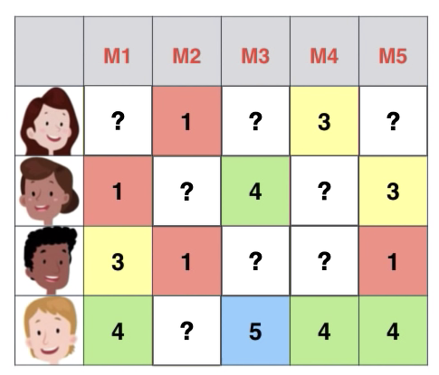
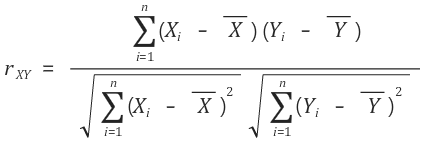
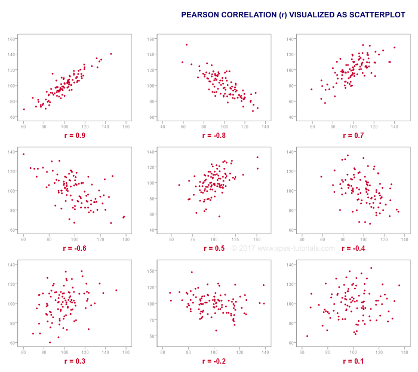

# Collaborative Filtering

Collaborativ Filtering은 많은 사용자들로부터 모은 취향 정보를 기반으로 하여 사용자의 취향을 예측하는 것을 말한다. 해당 방법을 자세히 다뤄볼 것이다.

사용자들이 남긴 평점 데이터를 기준으로 추천 데이터를 추출해 볼 것이다.

다음과 같이 X축 사용자, Y축 아이템으로 행렬로 표기가 가능하다. 각기 다른 사용자 4명이 5편의 영화(M1~M5)에 1~5점 사이의 평점을 남긴 것을 볼 수 있다. 

사용자가 평점을 남기지 않은 영화에 대해서는 ?로 남아있으며, Collaborative Filtering은 이렇게 주어진 평점 데이터만으로 아직 평점을 남기지 않은 영화(아이템)에 대한평점을 예측하는 기법이다. 

평점 데이터는 성격에 따라서 Explicit Dataset과 Implicit Dataset으로 구분 된다.

## Dataset

### Explicit Dataset

Explicit Dataset은 사용자가 아이템에 대하여 **선호와 비선호를 명확하게 구분해준 데이터**를 말한다. 예를 들어, 영화 평점 처럼 해당 영화가 좋은 경우에는 5점, 별로인 경우에는 1점을 매겨 명확하게 구분되는 데이터이다. 하지만 현실에서는 호불호가 명확한 데이터도 있는 반면, 명확하지 않은 데이터도 있다.

Explicit Dataset의 경우에는 ?에 해당하는 데이터들을 제외한 평점 데이터만으로 사용자의 선호도를 학습하여 추측한다.

### Implicit Dataset

Implicit Dataset은 호불호 구분 없이 사용자가 아이템을 얼마나 소비했는지 기록한 데이터 셋이다. 즉, **행동의 빈도수만 기록**한 데이터이다. 쇼핑몰의 클릭 로그를 예로 들 수 있다. 사용자가 클릭한 상품은 확실하게 선호하는 상품으로 간주할 수 있다.

어떤 아이템을 선호하는지는 알 수 있지만, 어떤 아이템을 비선호하는지 알지못하므로 Implicit Dataset은 ?에 해당하는 영역 역시 데이터로 포함하여 사용자의 선호도를 학습한다.

## Model

### Neighborhood Model

Neighborhood Model은 주어진 평점 데이터를 가지고 비슷한 사용자 혹은 아이템을 찾는다. 이때 주로 피어슨 유사도가 사용된다.

> [피어슨 상관계수 Pearson Correlation]([https://ko.wikipedia.org/wiki/%ED%94%BC%EC%96%B4%EC%8A%A8_%EC%83%81%EA%B4%80_%EA%B3%84%EC%88%98](https://ko.wikipedia.org/wiki/피어슨_상관_계수))
>
> 
>
> 피어슨 상관계수는 두 변수 X와 Y간의 선형 상관 관계를 계량화한 수치이다.
>
> 
>
> -1에서 1사이의 값을 가지며, -1과 1에 가까울 수록 상관관계가 큰 것을 의미한다.

#### User Based Model

사용자 기반 유사도는 **두 사용자가 얼마나 유사**한 항목(아이템)을 선호 했는지를 기준으로 한다. 

2번째 사용자와 4번째 사용자의 유사도를 파악해 볼 것이다. 두 사용자의 공통으로 매긴 영화 평점은 각각 (1,  4,  3), (4,  5,  4)인 것을 확인할 수 있다. 피어슨 상관계수를 계산해보면 결과는 다음과 같다.

| corr | 0        | 1        |
| ---- | -------- | -------- |
| 0    | 1.000000 | 0.755929 |
| 1    | .755929  | 1.000000 |

0.755929로 두 사용자는 어느정도 높은 상관관계를 갖는 것을 볼 수 있다.

#### Item Based Model

아이템 기반 유사도는 두 아이템이 얼마나 유사한지를 기준으로 한다. 예를 들어 영화 M1과 M5를 공통으로 평가한 사람은 3명이며, 각각 (1,3,4), (3,1,4) 이다.

| corr | 0        | 1        |
| ---- | -------- | -------- |
| 0    | 1.000000 | 0.142857 |
| 1    | 0.142857 | 1.000000 |

두 영화의 상관계수를 구해보면 0.142857로 낮은 상관관계를 갖는 것을 볼 수 있다.

#### Item Based vs User Based

아마존과 넷플릭스를 비롯한 서비스에서 대부분 **아이템 기반을 활용**한다고 알려져있다. 사용자가 아이템을 평가하는 순간, 다른 아이템을 추천할 수 있어야하는데, 매 평가시마다 유사도 정보를 업데이트 하는 것은 현실적으로 어려우며, 아이템 기반에서는 일정 기간마다 유사도를 업데이트 하는것으로 충분히 제공할 수 있다.

또한, 대부분 사용자에 비해 아이템 수가 적기때문에, 아이템 간의 관계 데이터가 발생할 확률이 높다.

이러한 Neighborhood 기법은 Explicit Dataset에 적합하다.

### Latent Factor Model

Latent Factor Model은 관찰된 데이터와 잠재되어 있는 데이터를 연결시키는 기법으로, 주어진 평점 데이터로 아직 알지 못하는 사용자와 아이템의 특성을 찾아내는 것이다.

Latent Factor Model은 **Matrix Factorization** 기법을 많이 사용한다. 이는 대규모 다차원 행렬을 차원 감소 기법으로 분해하는 과정에서 잠재 요인을 찾아내 뽑아내는 방법이다. 즉, 사용자-아이템 행렬을 **사용자-잠재요인**, **아이템-잠재요인** 행렬로 분해할 수 있다. 이 부분에 대해서는 [Matrix Factorization](./2020-05-11-matrixFactorization.md)에서 자세히 설명할 것이다.

Implicit Dataset의 경우에는 Latent Factor Model이 더 뛰어난 성능을 보인다.

## 참고

- [https://scvgoe.github.io/2017-02-01-%ED%98%91%EC%97%85-%ED%95%84%ED%84%B0%EB%A7%81-%EC%B6%94%EC%B2%9C-%EC%8B%9C%EC%8A%A4%ED%85%9C-(Collaborative-Filtering-Recommendation-System)/](https://scvgoe.github.io/2017-02-01-협업-필터링-추천-시스템-(Collaborative-Filtering-Recommendation-System)/)
- [https://yeomko.tistory.com/6?category=805638](https://yeomko.tistory.com/6?category=805638)
- [https://lsjsj92.tistory.com/564?category=853217](https://lsjsj92.tistory.com/564?category=853217)
- [https://gomguard.tistory.com/173](https://gomguard.tistory.com/173)