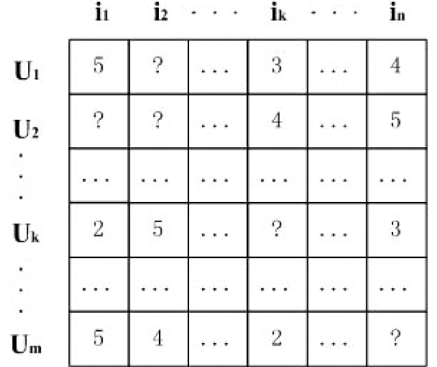
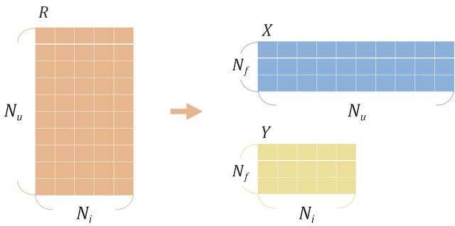
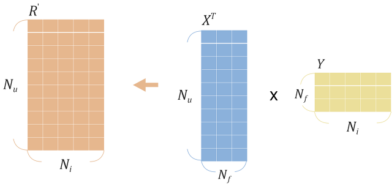
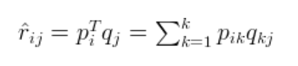

# Matrix Factorization

MF의 기본 아이디어는 위와 같이 ?부분들을 행렬 분해로 채워나간다는 것이다.

>R : original rating data Matrix
>
>Nu : number of users
>
>Ni : number of items
>
>Nf : dimention of latent factor
>
>X(P) : user latent factor matrix
>
>Y (Q): item latent factor matrix

R은 사용자가 아이템에 남긴 평점을 행렬로 나타낸 것이며, Nf는 Matrix Factorization 학습시에 정하는 임의의 차원 수 이다. Nf는 개발자가 조정가능 하며, 보통 50~200로 결정한다. X와 Y는 사용자와 아이템의 Latent Factor 행렬로, 우리가 학습시키고자 하는 대상이다.

R'는 분해된 행렬을 다시 곱하여 예측 평점 행렬을 계산한 것이다. Latent Factor Matrix가 적절하게 학습되었다면 R'과 R은 유사한 결과를 낼 것이라는 것을 예측할 수 있다.

여기서 X(P)와 Y(Q)의 요소들이 학습해야하는 변수라 할 수 있으며, 결과적으로 추론된 값을 predicted rating이라 하며, 수식은 아래와 같다.

여기서 Latent Facotr(잠재 요인)가 무엇인지 명확히 알 수 없다.

하지만 예를 들어 잠재 요인이 장르라면 다음과 같이 사용자-장르, 장르-아이템과 같이 분해할 수 있다.

이렇게 하는 방법이 추천 시스템에서 행렬 분해를 이용한 Collaborative Filtering이다. 행렬 분해로 잠재 요인을 추측 했을 때의 가장 큰 장점은 **저장 공간 절약**이다.

## 참고

- [https://lsjsj92.tistory.com/564?category=853217](https://lsjsj92.tistory.com/564?category=853217)
- [https://yamalab.tistory.com/92](https://yamalab.tistory.com/92)
- [https://yeomko.tistory.com/5?category=805638](https://yeomko.tistory.com/5?category=805638)