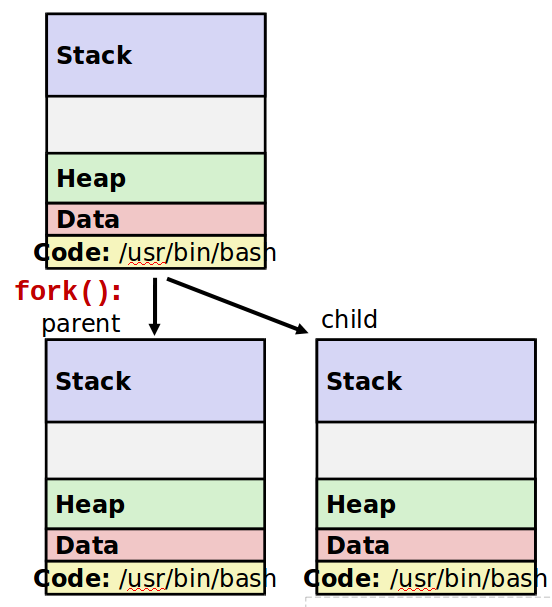

# 프로세스

## 프로세스란?

리눅스는 한번에 수백여개 이상의 프로그램을 저장하고, 동시에 수행할 수 있다. 여기서 프로그램이란 어떤 문제를 해결하기 위해 사용되는 명령어나 유틸리티의 집합으로, 프로그램을 설치하면 하드디스크에 저장되고, 특정한 목적을 위해 프로그램을 실행하면 메모리(보통 RAM)에 상주하게 된다.
이렇게 **실행중인 프로그램을 프로세스** 라고 하고, 실행시 PID(Process Identity)가 할당되어 관리된다.

프로세스는 다음과 같이 크게 두가지로 구분할 수 있다.

- 사용자의 입력에 관계없이 실행되는 백그라운드 프로세스
- 명령 입력 후 수행종료까지 기다려야하는 포어그라운드 프로세스

### 프로세스에 대한 다양한 정의

1. 실행(executing, running)중인 프로그램
2. PCB(Process Control Block)를 지닌 프로그램
    : 프로세스를 지원하고 관리하기 위한 정보들이 담긴 데이터 구조체로, 리눅스에서는 `task_struct`와 함께 구현
3. 프로그램 카운터(Program Counter)를 지닌 프로그램
4. 능동적 개체로, 순차적으로 수행하는 프로그램

### 프로세스 생성

하나의 프로세스가 다른 프로세스를 실행하기 위한 시스템 호출 방법에는 `fork`와 `exec`이 있다.



- `fork` : **새로운 프로세스를 위해 메모리를 할당받아 복사본 형태의 프로세스를 실행**하는 형태로, 기존의 프로세스는 그대로 실행되어 있다.
    새롭게 생성된 프로세스는 원래의 프로세스랑 똑같은 코드 기반으로 실행되며, **부모의 변수, 스택, 힙의 내용, PCB도 함께 복사**한다.
    PCB가 복사되기 때문에, 자식은 부모가 시작한 위치에서 동일하게 시작하게 된다.
    `fork` 된 자식 프로세스는 부모 프로세스가 종료되거나 부포 프로세스에서 `wait`, `waitpid` 함수를 호출하게 되면 종료가 된다.


- `exec` : **원래 프로세스를 새로운 프로세스로 대체하는 형태**로 호출
    프로세스의 메모리에 새로운 프로세스의 코드로 덮어씌워버린다.

즉, `fork` 는 새로운 프로세스를 위한 메모리를 할당하며, `exec` 은 새로운 메모리를 할당하지 않고, `exec`에 할당된 프로세스만 메모리에 남겨둔다.


리눅스가 부팅이 시작되면 커널이 `init` 프로세스(최초의 프로세스)를 발생시키고, `init`은 `PID` 1번을 할당받는다. 이후 시스템 운영에 필요한 데몬을 비롯한 비슷한 다른 프로세스들은 `fork` 방식으로 `init` 프로세스의 자식 프로세스로 생성하게 된다.

- 기존에 `init`이 PID인 루트 프로세스 였으나 이를 개선한 것이 `systemd` 이다.

    ```bash
    $ ps -p 1 ef
      PID TTY      STAT   TIME COMMAND
        1 ?        Ss   454:36 /usr/lib/systemd/systemd --switched-root --system --deserialize 21
    ```

```java
$ pstree -h
systemd─┬─NetworkManager───2*[{NetworkManager}]
        ├─ScvAgent───3*[{ScvAgent}]
        ├─ScvFTPTrack
        ├─ScvLog───2*[{ScvLog}]
        ├─ScvRP
        ├─ScvWatch───2*[{ScvWatch}]
        ├─abrt-dbus───2*[{abrt-dbus}]
        ├─abrt-watch-log
        ├─abrtd
        ├─2*[agetty]
        ├─amsHelper
        ├─bacula-fd───2*[{bacula-fd}]
```

`pstree` 명령으로 확인시 `systemd` 프로세스가 가장 왼쪽에 위치하고 있는데, 이는 모든 프로세스의 부모 프로세스임을 나타낸다. 
보통 명령어를 실행하면 `fork` 형태로 수행되며, 사용자가 로그인시 `bash` 프로세스를 할당받고, 명령어를 내리면 `fork` 형태로 수행된다.

```bash
$ ps -l
F S   UID   PID  PPID  C PRI  NI ADDR SZ WCHAN  TTY          TIME CMD
0 R  1001 33780 56800  0  80   0 - 34849 -      pts/1    00:00:00 ps
4 S  1001 56800 56799  0  80   0 - 29043 wait   pts/1    00:00:00 bash
```

`ps` 의 `PPID`가 `bash`의 `PID`인 것을 확인할 수 있다.

명령어 앞에 `exec`를 붙이면 기본 프로세스가 교체되면서 새로운 프로세스가 할당된다.

```bash
$ ps -l
  UID   PID  PPID        F CPU PRI NI       SZ    RSS WCHAN     S             ADDR TTY           TIME CMD
  501   491   487     4006   0  31  0  4298956   1416 -      S+                  0 ttys000    0:00.28 -zsh
  501 41990 41989     4006   0  31  0  4298956   3076 -      S                   0 ttys002    0:00.17 -zsh
$ zsh
$ ps -l                                                                                                                                 UID   PID  PPID        F CPU PRI NI       SZ    RSS WCHAN     S             ADDR TTY           TIME CMD
  501   491   487     4006   0  31  0  4298956   1916 -      S+                  0 ttys000    0:00.28 -zsh
  501 41990 41989     4006   0  31  0  4298956   3168 -      S                   0 ttys002    0:00.18 -zsh
  501 60938 41990     4006   0  31  0  4298956   4152 -      S                   0 ttys002    0:00.15 zsh
$ exec ps -l
  UID   PID  PPID        F CPU PRI NI       SZ    RSS WCHAN     S             ADDR TTY           TIME CMD
  501   491   487     4006   0  31  0  4298956   1844 -      S+                  0 ttys000    0:00.28 -zsh
  501 41990 41989     4006   0  31  0  4298956   3040 -      S                   0 ttys002    0:00.18 -zsh
```

즉, 리눅스는 `init` 프로세스를 중점으로 하여 이 프로세스가 `fork`되고, 다음에 `exec`을 불러서 시스템이 동작하는 것임을 알 수 있다.

### 종류

#### Foreground Process

**포어그라운드 프로세스는 셀에서 명령 실행후 해당 프로세스가 종료될 때까지 기다려야하는 경우**이다.

```bash
$ find / -name '*.txt' 2>/dev/null > test.txt

```

다음과 같이 실행된 프어그라운드 프로세스는 실제 화면에 출력되는 내용은 없고, 찾아진 결과를 `test.txt` 에 저장한다. 일정 시간이 지난 후 결과 확인은 `test.txt` 파일을 내용만 확인하면 되는데, 불필요하게 대기하게 된다. 이러한 경우 백그라운드 프로세스로 실행하면 된다.

#### Background Process

**백그라운드 프로세스는 눈에 보이지 않게 뒤에서 실행하는 방식**이다. 실행시키는 방법은 기존 프어그라운드 실행 명령 뒤에 `&`만 추가로 붙여서 실행하면 되며, 다중작업을 수행할 때 유용하다.

```bash
$ find / -name '*.txt' 2>/dev/null > test.txt
[1] 15757
```

### 멀티태스킹과 작업 전환

멀티태스킹은 동시에 하나 이상의 프로그램을 실행하는 것을 말한다. 사용자 입장에서 보면 다수의 프로그램들을 백그라운드 프로세스로 실행시킨 상태에서 추가로 포어그라운드 프로세스로 다른 작업을 수행할 수 있다. 사용자가 실행한 프로세스는 중간에 중지시킬 수 있으며, 백그라운드 프로세스를 포어그라운드 프로세스로 전환하거나 포어그라운드 프로세스를 백그라운드 프로세스로 전환할 수 있다.

#### 프로세스 전환

포어그라운드 프로세스를 백그라운드 프로세스로 전환하기 위해서는 작업중인 프로세스를 대기(suspend)시켜야 되며, `CTRL + z`를 누르면된다.
suspend는 메모리에 올라와서 작업중인 프로세스를 일시적으로 중지시키는 것을 말하며, 작업의 상태는 `jobs` 명령어로 확인할 수 있다.

```bash
$ find / -name '*.md' 2>/dev/null > test.txt
^Z
[1]  + 83008 suspended  find / -name '*.md' 2> /dev/null > test.txt
```

```bash
$ jobs
[1]  + suspended  find / -name '*.md' 2> /dev/null > test.txt
```

일시적으로 중단된 상태에서 `bg` 명령어를 입력하면 백그라운드 프로세스로 전환된다.

```bash
$ bg
[1]  + 83008 continued  find / -name '*.md' 2> /dev/null > test.txt
$ jobs
[1]  + running    find / -name '*.md' 2> /dev/null > test.txt
```

반대로 백그라운드 프로세스를 포어그라운드 프로세스로 전환하기 위해서는 `fg` 명령어를 사용하면된다.

```bash
$ find / -name '*.md' 2>/dev/null > test.txt &
[1] 86028
$ jobs
[1]  + running    find / -name '*.md' 2> /dev/null > test.txt
$ fg %1
[1]  + 86028 running    find / -name '*.md' 2> /dev/null > test.txt
```

만약 다수의 작업이 백그라운드로 수행중인 경우 `fg %작업번호` 명령으로 원하는 작업을 전환시킬 수 있다.

```bash
$ vi a.txt &
[1] 88418
[1]  + 88418 suspended (tty output)  vi a.txt
$ vi b.txt &
[2] 88682
[2]  + 88682 suspended (tty output)  vi b.txt
$ vi c.txt &
[3] 91159
[3]  + 91159 suspended (tty output)  vi c.txt
$ jobs
[1]    suspended (tty output)  vi a.txt
[2]  - suspended (tty output)  vi b.txt
[3]  + suspended (tty output)  vi c.txt
```

`jobs` 명령어 수행시 `+`와 `-` 기호가 표시되는 작업이 있으며, `+` 가 주로 처리되는 프로세스이다.
보통 사용자가 가장 늦게 실행한 프로세스에  `+`가 붙으며, 작업번호 없이 `fg` 명령어 수행시 `+` 가 붙어있는 작업이 포어그라운드 프로세스로 전환된다. `-`가 붙은 작업은 `+`가 붙은 작업의 다음 우선순위 작업이다.

### Signal

Signal은 **프로세스끼리 서로 통신할 때 사용**한다. 즉, **특정 프로세스가 다른 프로세스에게 메시지를 보낼 때 시그널을 이용**한다.

- 사용자가 인터럽트 키를 통해 발생시킨 시그널
- 프로세스가 발생하는 시그널
- 하드웨어가 발생하는 시그널

시그널은 매우 다양하게 발생하며, `kill -l` 명령어로 시그널 목록을 확인할 수 있다.

```bash
$ kill -l
 1) SIGHUP       2) SIGINT       3) SIGQUIT      4) SIGILL       5) SIGTRAP
 6) SIGABRT      7) SIGBUS       8) SIGFPE       9) SIGKILL     10) SIGUSR1
11) SIGSEGV     12) SIGUSR2     13) SIGPIPE     14) SIGALRM     15) SIGTERM
16) SIGSTKFLT   17) SIGCHLD     18) SIGCONT     19) SIGSTOP     20) SIGTSTP
21) SIGTTIN     22) SIGTTOU     23) SIGURG      24) SIGXCPU     25) SIGXFSZ
26) SIGVTALRM   27) SIGPROF     28) SIGWINCH    29) SIGIO       30) SIGPWR
31) SIGSYS      34) SIGRTMIN    35) SIGRTMIN+1  36) SIGRTMIN+2  37) SIGRTMIN+3
38) SIGRTMIN+4  39) SIGRTMIN+5  40) SIGRTMIN+6  41) SIGRTMIN+7  42) SIGRTMIN+8
43) SIGRTMIN+9  44) SIGRTMIN+10 45) SIGRTMIN+11 46) SIGRTMIN+12 47) SIGRTMIN+13
48) SIGRTMIN+14 49) SIGRTMIN+15 50) SIGRTMAX-14 51) SIGRTMAX-13 52) SIGRTMAX-12
53) SIGRTMAX-11 54) SIGRTMAX-10 55) SIGRTMAX-9  56) SIGRTMAX-8  57) SIGRTMAX-7
58) SIGRTMAX-6  59) SIGRTMAX-5  60) SIGRTMAX-4  61) SIGRTMAX-3  62) SIGRTMAX-2
63) SIGRTMAX-1  64) SIGRTMAX
```

| 번호 | 이름                | 설명                                                         |
| ---- | ------------------- | ------------------------------------------------------------ |
| 1    | SIGHUP<br />(HUP)   | Hangup의 약자로 로그아웃과 같이 터미널에서 접속이 끊겼을 떄 보내지는 시그널.<br />데몬 관련 환경 설정 파일을 변경하고 변화된 내용을 적용학 위해 재시작할 때 이 시그널 사용 |
| 2    | SIGINT<br />(INT)   | 키보드로부터 오는 인터럽트 시그널로 실행을 중지시킨다.<br />`CTRL + c` 명령어 입력시 보내지는 시그널 |
| 3    | SIGQUIT<br />(QUIT) | 키보드로부터 오는 실행 중지 시그널<br />`CTRL + \` 을 입력하는 경우 보내지는 시그널 |
| 9    | SIGKILL<br />(KILL) | 무조건 종료, 즉 프로세스를 강제 종료시키는 시그널            |
| 15   | SIGTERM<br />(TERM) | Terminate의 약자로 가능한 정상 종료시키는 시그널로 `kill` 명령의 기본 시그널 |
| 18   | SIGCONT<br />(CONT) | Continue 시그널로 `STOP` 시그널(19)에 의해서 정지된 프로세스를 다시 실행시킬 떄 사용 |
| 19   | SIGSTOP<br />(STOP) | 터미널에서 입력된 정지 시그널                                |
| 20   | SIGTSTP<br />(TSTP) | 실행 정지 후 다시 실행을 계속하기 위해 대기시키는 시그널<br />`CTRL + z` 입력시 보내지는 시그널 |

## [데몬](./2020-07-19-linux-daemon.md)

## 프로세스 관련 명령어

### ps(process status)

동작중인 프로세스의 상태를 출력해주는 명령이다.

#### 옵션

| 옵션          | 설명                                                         |
| ------------- | ------------------------------------------------------------ |
| a             | 터미널과 연관된 프로세스를 출력하는 옵션(BSD계열)            |
| -a            | 세션 리더(일반적인 로그인 셸)을 제외하고 터미널에 종속되지 않은 모든 프로세스 출력 |
| u             | 프로세스 소유자를 기준으로 출력                              |
| -u            | 특정 사용자의 프로세스 정보를 확인할 때 사용. 사용자를 지정하지 않으면 현재 사용자를 기준으로 정보 출력 |
| x             | 데몬 프로세스처럼 터미널에 종속되지 않는 프로세스를 출력한다. 보통 a 옵션과 결합해 모든 프로세스를 출력할때 사용한다. |
| l             | 프로세스 정보를 길게 보여주는 옵션으로 우선수누이와 관련된 PRI와 NI값을 확인할 수 있다. |
| e             | 해당 프로세스에 관련된 환경 변수 정보도 같이 출력한다.       |
| -e            | 모든 프로세스를 출력한다.(-A와 같음)                         |
| -A            | 모든 프로세스를 출력한다.(-e와 같음 System V 계열)           |
| f             | 프로세스간 상속관계를 트리구조로 보여준다.                   |
| -f            | 유닉스 스타일로 출력해주는 옵션으로 UID, PID, PPID 등이 함께 출력된다. |
| p             | 특정 PID를 지정할 때 사용한다.(BSD 계열)                     |
| -p            | 특정 PID를 지정할 때 사용한다.(SyS V 계열)                   |
| -C 프로세스명 | 지정한 프로세스만 보여준다.                                  |
| -o 값         | 출력 포맷을 지정하는 옵션이다. 값으로는 pid, tty, time, cmd 등을 지정할 수 있다. |

### 항목

| 항목    | 설명                                                         |
| ------- | ------------------------------------------------------------ |
| USER    | 프로세스 소유자 명(BSD 계열)                                 |
| UID     | 프로세스 소유자 명(System V)                                 |
| PID     | 프로세스 식별번호                                            |
| %CPU    | CPU 사용 비율 추정치(BSD)                                    |
| %MEM    | 메모리 사용 비율 추정치(BSD)                                 |
| VSZ     | K단위 또는 페이지 단위의 가상 메모리 사용량                  |
| RSS     | 실제 메모리 사용량(Resident Set Size)                        |
| TTY     | 프로세스와 연결된 터미널                                     |
| STAT    | 프로세스 상태코드                                            |
| START   | 프로세스 시작 시간                                           |
| TIME    | 총 CPU 사용 시간                                             |
| COMMAND | 프로세스 실행 명령                                           |
| STIME   | 프로세스가 시작된 시간(Sys V)                                |
| C, CP   | 짧은 기간동안 CPU 사용률                                     |
| F       | 프로세스 플래그(1: exec 호출 없이 fork된 경우 4: 슈퍼유저 사용자) |
| PPID    | 부모 프로세스의 PID                                          |
| PRI     | 실제 실행 우선순위                                           |
| NI      | nice 우선순위 번호                                           |

#### STAT 의 주요 값

| 값                   | 의미                                                         |
| -------------------- | ------------------------------------------------------------ |
| R(Running)           | 실행 중 혹은 실행 될 수 있는 상태                            |
| S(Sleeping)          | 인터럽트에 의한 sleep 상태 특정 이벤트가 종료되기를 기다림   |
| D(Disk wait)         | 디스크 I/O에 의해 대기하고 있는 상태                         |
| T(Traced of stopped) | 정지된 상태(suspend)                                         |
| Z(Zombie)            | 좀비 프로세스를 뜻하는데, 작업이 종료되었으나 부모 프로세스로 부터 회수되지 않아 메모리를 차지하고 있는 상태 |
| X                    | 죽어있는 상태를 뜻                                           |
| <                    | 우선순위가 인위적으로 높아진 상태                            |
| N(Nice)              | 다른 사용자에 의해 인위적으로 우선순위가 낮아진 상태         |
| L                    | 메모리 안에서 페이지가 잠금된 상태(real-time과 I/O에 의해 발생) |
| s                    | session Leader                                               |
| I                    | 멀티 쓰레드 상태(CLONE_THREAD)                               |
| +                    | 포어그라운드 프로세스 그룹                                   |

```bash
$ ps a 
  PID   TT  STAT      TIME COMMAND
72277 s000  Ss     0:00.05 /Applications/iTerm.app/Contents/MacOS/iTerm2 --serv
72278 s000  S      0:00.05 login -fp dh0023
72279 s000  S+     0:00.30 -zsh
79333 s001  Ss     0:00.09 /Applications/iTerm.app/Contents/MacOS/iTerm2 --serv
79338 s001  S      0:00.05 login -fp dh0023
79339 s001  S      0:00.16 -zsh
79814 s001  R+     0:00.00 ps aa
  497 s004  Ss     0:00.05 /Applications/iTerm.app/Contents/MacOS/iTerm2 --serv
  498 s004  S      0:00.04 login -fp dh0023
  499 s004  S+     0:00.29 -zsh
```

```bash
$ ps u
USER     PID  %CPU %MEM      VSZ    RSS   TT  STAT STARTED      TIME COMMAND
dh0023 79339   0.0  0.0  4298356   3784 s001  S     2:56PM   0:00.18 -zsh
dh0023 79333   0.0  0.1  4299336   9620 s001  Ss    2:56PM   0:00.09 /Applicati
dh0023 72279   0.0  0.1  4298416   4444 s000  S+    2:51PM   0:00.30 -zsh
dh0023 72277   0.0  0.1  4307528   9636 s000  Ss    2:51PM   0:00.05 /Applicati
dh0023   499   0.0  0.1  4298416   4264 s004  S+    1:19PM   0:00.29 -zsh
dh0023   497   0.0  0.1  4307528   7200 s004  Ss    1:19PM   0:00.05 /Applicati
```

```bash
$ ps x
  PID   TT  STAT      TIME COMMAND
  330   ??  S      0:00.10 /System/Library/Frameworks/LocalAuthentication.frame
  332   ??  S      0:03.11 /usr/sbin/cfprefsd agent
  334   ??  S      0:03.22 /usr/libexec/UserEventAgent (Aqua)
  336   ??  S      0:04.58 /usr/sbin/distnoted agent
  337   ??  S      0:00.36 /System/Library/PrivateFrameworks/CloudServices.fram
  338   ??  S      0:01.16 /usr/libexec/knowledge-agent
  339   ??  S      0:00.62 /usr/sbin/universalaccessd launchd -s
  340   ??  S      0:12.09 /usr/libexec/trustd --agent
```

```bash
$ ps l
  UID   PID  PPID CPU PRI NI      VSZ    RSS WCHAN  STAT   TT       TIME COMMAND
  501 72277   440   0  31  0  4307528   9636 -      Ss   s000    0:00.05 /Applications/iTerm.app/Contents/MacOS/iTerm2 --server login -fp dh0023
  501 72279 72278   0  31  0  4298416   4452 -      S+   s000    0:00.30 -zsh
  501 79333   440   0  31  0  4299336   9620 -      Ss   s001    0:00.09 /Applications/iTerm.app/Contents/MacOS/iTerm2 --server login -fp dh0023
  501 79339 79338   0  31  0  4298356   3792 -      S    s001    0:00.20 -zsh
  501   497   440   0  31  0  4307528   7200 -      Ss   s004    0:00.05 /Applications/iTerm.app/Contents/MacOS/iTerm2 --server login -fp dh0023
  501   499   498   0  31  0  4298416   4272 -      S+   s004    0:00.30 -zsh
```

```bash
$ ps -A # or ps -e
  PID TTY           TIME CMD
    1 ??         0:16.88 /sbin/launchd
  108 ??         0:01.30 /usr/sbin/syslogd
  109 ??         0:02.63 /usr/libexec/UserEventAgent (System)
  112 ??         0:00.22 /System/Library/PrivateFrameworks/Uninstall.framework/Resources/uninstalld
  113 ??         0:02.00 /usr/libexec/kextd
  114 ??         0:07.73 /System/Library/Frameworks/CoreServices.framework/Versions/A/Frameworks/FSEvents.framework/Versions/A/Support/fseventsd
  115 ??         0:00.24 /System/Library/PrivateFrameworks/MediaRemote.framework/Support/mediaremoted
  118 ??         0:02.69 /usr/sbin/systemstats --daemon
  119 ??         0:01.35 /usr/libexec/configd
  120 ??         0:06.63 /Applications/Pulse Secure.app/Contents/Plugins/JUNS/dsAccessService
  121 ??         0:00.03 endpointsecurityd
  122 ??         0:04.40 /System/Library/CoreServices/powerd.bundle/powerd
  126 ??         0:11.52 /usr/libexec/logd
  127 ??         0:00.09 /usr/libexec/keybagd -t 15
  ....
```

```bash
$ ps e
  PID   TT  STAT      TIME COMMAND
72277 s000  Ss     0:00.05 /Applications/iTerm.app/Contents/MacOS/iTerm2 --server login -fp dh0023 TERM_SESSION_ID=w0t1p0:345172BD-549A-48EC-93AD-2E2CBBE02E05 SSH_AUTH_SOCK=
72279 s000  S+     0:00.30 -zsh TERM_SESSION_ID=w0t1p0:345172BD-549A-48EC-93AD-2E2CBBE02E05 SSH_AUTH_SOCK=/private/tmp/com.apple.launchd.dH0358R97g/Listeners LC_TERMINAL_VER
79333 s001  Ss     0:00.09 /Applications/iTerm.app/Contents/MacOS/iTerm2 --server login -fp dh0023 TERM_SESSION_ID=w0t2p0:7340959C-1615-45BC-8246-B2E28DA74DED SSH_AUTH_SOCK=
79339 s001  S      0:00.21 -zsh TERM_SESSION_ID=w0t2p0:7340959C-1615-45BC-8246-B2E28DA74DED SSH_AUTH_SOCK=/private/tmp/com.apple.launchd.dH0358R97g/Listeners LC_TERMINAL_VER
  497 s004  Ss     0:00.05 /Applications/iTerm.app/Contents/MacOS/iTerm2 --server login -fp dh0023 TERM_SESSION_ID=w0t0p0:8FF1A37C-A8B1-4C5B-8637-3F97DACC452E SSH_AUTH_SOCK=
  499 s004  S+     0:00.30 -zsh TERM_SESSION_ID=w0t0p0:8FF1A37C-A8B1-4C5B-8637-3F97DACC452E SSH_AUTH_SOCK=/private/tmp/com.apple.launchd.dH0358R97g/Listeners LC_TERMINAL_VER
```


#### 실습

```bash
# 시스템에 동작중인 모든 프로세스를 소유자 정보와 함께 출력
$ ps aux                                     
USER               PID  %CPU %MEM      VSZ    RSS   TT  STAT STARTED      TIME COMMAND
dh0023             440   1.2  1.9  5339640 161920   ??  R     1:19PM   0:59.49 /Applications/iTerm.app/Contents/MacOS/iTerm2 -psn_0_118813
_hidd              167   0.5  0.1  4336612   8000   ??  Ss    1:19PM   0:53.62 /usr/libexec/hidd
_windowserver      223   0.3  1.1  7051560  95160   ??  Ss    1:19PM   8:28.02 /System/Library/PrivateFrameworks/SkyLight.framework/Resources/WindowServer -daemon
dh0023            5450   0.3  4.4  5321744 367220   ??  S     1:27PM   3:48.83 /Applications/Notion.app/Contents/Frameworks/Notion Helper (Renderer).app/Contents/MacOS/Notio
root               169   0.2  0.1  4337340   9040   ??  Ss    1:19PM   0:00.43 /usr/libexec/corebrightnessd --launchd
dh0023            5231   0.2  1.6  5340956 137288   ??  S     1:27PM   1:21.32 /Applications/KakaoTalk.app/Contents/MacOS/KakaoTalk
root               122   0.2  0.1  4335440   6624   ??  Ss    1:19PM   0:04.66 /System/Library/CoreServices/powerd.bundle/powerd
dh0023             472   0.1  0.8  4981764  69400   ??  S     1:19PM   0:09.99 /Applications/Sublime Text.app/Contents/MacOS/plugin_host 441 --auto-shell-env
dh0023             525   0.1  0.3  4411024  26352   ??  S     1:19PM   0:10.57 /Applications/Delfino/delfino.app/Contents/MacOS/delfino
```

```bash
# System V 계열 옵션으로 시스템에 동작중인 모든 프로세스를 출력 + 한페이지씩 화면에 출력
$ ps -ef |more                                                       
  UID   PID  PPID   C STIME   TTY           TIME CMD
    0     1     0   0  1:18PM ??         0:17.59 /sbin/launchd
    0   108     1   0  1:19PM ??         0:01.35 /usr/sbin/syslogd
    0   109     1   0  1:19PM ??         0:02.64 /usr/libexec/UserEventAgent (System)
    0   112     1   0  1:19PM ??         0:00.23 /System/Library/PrivateFrameworks/Uninstall.framework/Resources/uninstalld
    0   113     1   0  1:19PM ??         0:02.00 /usr/libexec/kextd
    0   114     1   0  1:19PM ??         0:07.95 /System/Library/Frameworks/CoreServices.framework/Versions/A/Frameworks/FSEvents.framework/Versions/A/Support/fseventsd
    0   115     1   0  1:19PM ??         0:00.24 /System/Library/PrivateFrameworks/MediaRemote.framework/Support/mediaremoted
    0   118     1   0  1:19PM ??         0:02.77 /usr/sbin/systemstats --daemon
    0   119     1   0  1:19PM ??         0:01.36 /usr/libexec/configd
    0   120     1   0  1:19PM ??         0:06.82 /Applications/Pulse Secure.app/Contents/Plugins/JUNS/dsAccessService
    0   121     1   0  1:19PM ??         0:00.03 endpointsecurityd
    0   122     1   0  1:19PM ??         0:04.74 /System/L
```

```bash
# 동작중인 프로세스 중에 sendmail 이라는 이름의 프로세스를 찾아서 출력
$ ps aux |grep sendmail
```

```bash
# PID가 5231인 프로세스의 명을 출력
$ ps -p 5231 -o comm                                                                                                                                 COMM
/Applications/KakaoTalk.app/Contents/MacOS/KakaoTalk
```

### pstree

프로세스 상태를 트리 구조로 출력해주는 명령이다.

```bash
$ pstree [option]
```

### top

동작중인 프로세스의 상태를 실시간으로 화면에 출력해주는 명령

프로세스의 상태, CPU, 메모리, 부하 상태도 확인할 수 있다.

```bash
$ top [option]
```

#### 옵션

| 옵션         | 의미                                           |
| ------------ | ---------------------------------------------- |
| -d 갱신 시간 | 갱신 시간을 설정(초단위)                       |
| -p(pid)      | 특정 PID 값을 갖는 프로세스 모니터링할 때 사용 |

#### 항목

| 항목    | 의미                                                        |
| ------- | ----------------------------------------------------------- |
| PID     | Process ID                                                  |
| USER    | 소유자                                                      |
| PR      | Priority 우선순위                                           |
| NI      | Nice Value(-20~19 사이의 값으로 낮을수록 우선순위가 높아짐) |
| VIRT    | 작업에 의해 사용된 총 가상 메모리양                         |
| RES     | 프로세스가 사용하는 실제 메모리양                           |
| SHR     | 프로세스가 사용하는 공유 메모리양                           |
| S       | 현재 프로세스 상태                                          |
| %CPU    | CPU 사용량                                                  |
| %MEM    | 메모리 사용량                                               |
| TIME+   | 프로세스가 시작하고 사용한 총 CPU 시간                      |
| COMMAND | 프로세스 실행 명령                                          |

#### top  실행 상태에서 명령

| 명령    | 설명                                                   |
| ------- | ------------------------------------------------------ |
| [SPACE] | 화면 갱신                                              |
| k       | kill 명령을 내린다. PID 값을 입력하면 종료 신호를 보냄 |
| i       | zombile, idle 프로세스 출력을 on/off                   |
| n, #    | 출력하는 프로세스 수 지정                              |
| q       | top을 종료                                             |
| r       | Nice 값 변경                                           |
| s       | 화면 갱신시간 변경                                     |
| F,f     | 보여줄 항목을 추가하거나 삭제                          |
| O, o    | 보여줄 항목 순서 변경                                  |
| I       | top의 맨 윗줄을 on/off한다.                            |
| m       | 메모리와 관련된 항목 on/off한다.                       |
| t       | 프로세스와 CPU 항목 on/off한다.                        |
| c       | Command line on/off한다.                               |
| M       | 프로세스 RSS값 지정                                    |
| T       | Time으로 값 정렬                                       |
| P       | $CPU 값으로 정렬                                       |
| W       | 바꾼 설정으로 저장                                     |
| h, ?    | 도움말 출력                                            |
|         |                                                        |


```bash
$ top
Processes: 391 total, 3 running, 388 sleeping, 1524 threads                                                                                                          15:31:59
Load Avg: 1.98, 1.91, 1.92  CPU usage: 11.98% user, 9.36% sys, 78.64% idle  SharedLibs: 254M resident, 73M data, 24M linkedit.
MemRegions: 55196 total, 3106M resident, 185M private, 1161M shared. PhysMem: 8001M used (1310M wired), 190M unused.
VM: 1944G vsize, 1991M framework vsize, 0(0) swapins, 0(0) swapouts. Networks: packets: 183314/180M in, 119708/17M out. Disks: 523418/6661M read, 233711/2098M written.

PID    COMMAND      %CPU TIME     #TH   #WQ  #PORT MEM    PURG   CMPRS  PGRP  PPID  STATE    BOOSTS          %CPU_ME %CPU_OTHRS UID  FAULTS   COW    MSGSENT   MSGRECV
440    iTerm2       30.3 01:22.79 14    11   410+  123M+  8364K- 7420K  440   1     sleeping *0[2891]        0.00389 1.34081    501  582435+  2339   435965+   75407+
223    WindowServer 20.9 09:36.78 9     4    1247+ 364M-  72M+   16M    223   1     sleeping *0[1]           1.35059 0.00389    88   813320+  34233  6754080+  2836712+
16469  top          13.2 00:00.89 1/1   0    25    3660K  0B     0B     16469 79339 running  *0[1]           0.00000 0.00000    0    6043+    119    255337+   127645+
0      kernel_task  4.8  04:53.93 174/4 0    0     168M+  0B     0B     0     0     running   0[0]           0.00000 0.00000    0    23897    0      15732351+ 14233318+
167    hidd         2.4  01:04.55 6/1   3/1  264   2832K  0B     40K    167   1     running  *0[1]           0.05842 0.00000    261  161386+  170    504904+   310846+
143    opendirector 0.4  00:18.91 9     8    1004  8076K  64K    96K    143   1     sleeping *0[1]           0.00000 0.15185    0    18002    180    159049+   80360+
459    bash         0.3  00:01.51 1     0    11    440K   0B     0B     459   440   sleeping *0[1]           0.00000 0.00000    501  132033+  86187+ 5761+     2879+
126    logd         0.3  00:14.27 4     3    1178  19M    0B     1980K  126   1     sleeping *0[1]           0.00000 0.00000    0    116474+  142    115144+   116959+
```

### kill

프로세스에 특정한 시그널을 보내는 명령어

보통 중지시킬 수 없는 프로세스를 종료시킬 때 많이 사용

```bash
$ kill [option] [signal] [PID or $Job_number]
```

| 옵션      | 설명               |
| --------- | ------------------ |
| -l        | 시그널 종류 출력   |
| -s signal | 시그널의 이름 지정 |

```bash
$ kill -l
HUP INT QUIT ILL TRAP ABRT EMT FPE KILL BUS SEGV SYS PIPE ALRM TERM URG STOP TSTP CONT CHLD TTIN TTOU IO XCPU XFSZ VTALRM PROF WINCH INFO USR1 USR2
```

#### 예시

```bash
# 프로세스 강제 종료(-9 KILL, SIGKILL)
$ kill -9 756 778 7700 

# 프로세스 재시작(HUP or -1)
$ kill -HUP 10118

# 작업번호로 프로세스 종료
$ kill %2

# 기본 종료 시그널인 TERM을 보내어 종료
$ kill -s SIGTERM 1702
```

### killall

같은 데몬의 여러 프로세스를 한번에 종료시킬 때 사용하는 명령어로, 프로세스 명을 사용한다.

```bash
$ killall [option] 프로세스명
```

| 옵션        | 설명                                                       |
| ----------- | ---------------------------------------------------------- |
| -l          | 시그널 종류 출력(--list)                                   |
| -w          | 시그널을 받은 프로세스들이 종료될 때까지 기다린다.(--wait) |
| -v          | 시그널 전송된 결과 출력(--verbose)                         |
| -s signal   | 시그널의 이름 지정(--signal)                               |
| -u 사용자명 | 특정 사용자의 프로세스를 지정할 때 사용(--user)            |

#### 예제

```bash
# Apache 웹 서버 데몬인 httpd를 모두 종료
$ killall httpd

# httpd 데몬을 재실행
$ killall -HUP httpd

# httpd 데몬에 9번(KILL, SIGKILL)을 전송하고, 전송결과 출력
$ killall -v -9 httpd

# example 사용자의 모든 프로세스 강제 종료
$ killall -u example
```

### jobs

**백그라운드로 실행**중인 프로세스나 현재 **중지**된 프로세스 목록 출력

```bash
$ jobs [option]
```

| 옵션 | 설명                 |
| ---- | -------------------- |
| -l   | PID 번호를 추가 출력 |

### fg

백그라운드 프로세스를 포어그라운드 프로세스로 전환하는 명령

```bash
$ fg [%Job_number]
$ fg [Job_number]
```

```bash
# 백그라운드로 수행중인 작업이 여러 개라면, 가장 최근에 수행한 작업(+기호가 붙어있는)을 포어그라운드로 전환
$ fg
```

### bg

포어그라운드 프로세스를 백그라운드 프로세스로 전환하는 명령
: 포어그라운드로 실행중인 프로세르에 `ctrl + z` 를 눌러 작업을 일시 중지 시킨 후 bg명령을 사용해서 백그라운드로 전환할 수 있다.

```bash
$ bg
```

### nice

프로세스의 우선순위를 변경하는 명령어로, NI값을 설정할 때 사용한다.
프로세스에 설정되어 있는 NI 기본값은 0이고, 지정 가능한 범위는 -20~19이며, 작을 수록 우선순위가 높다.
일반 사용자는 NI값을 증가시키는 것만 가능하며, root만 NI값을 감소시켜 우선순위를 높일 수 있다.

```bash
$ nice [option] 프로세스명
```

|옵션|설명|
|-------|-------|
|-n 값, - 값<br>--adjustment=값|프로세스에 설정된 NI값을 지정한 NI값과 증감한다. 값을 지정하지 않으면 기본 10이다.|

```bash
$ nice -10 bash
$ nice --adjustment=10 bash
$ nice -n 10 bash
```

### renice

실행중이 ㄴ프로세스의 우선순위를 변경할 때 사용하는 명령으로, PID, USER, 그룹 ID를 주로 사용한다.
renice는 주로 PID를 사용해 기존의 프로세스를 교체하여 조정하며, renice는 기존의 NI값에 상관없이 지정한 NI값이 바로 설정된다.

```bash
$ renice [option] NI PID
```

|옵션|설명|
|-------|-------|
|-p| PID 지정하는 옵션(--pid)|
|-u| 사용자 지정하는 옵션(--user)|
|-g| 프로세스 그룹 지정하는 옵션(--pgrp)|


### pgrep

프로세스 이름 기반으로 검색하는 명령으로 PID 값을 출력한다.

```bash
$ pgerp [option] [pattern]
```

|옵션|설명|
|-------|-------|
|-u| 특정 사용자가 실행중인 PID 출력|
|-U| 특정 UID가 실행중인 PID 출력|
|-g| 특정 그룹이 실행중인 PID 출력|
|-G| 특정 GID가 실행중인 PID 출력|
|-t| 특정 터미널에 실행중인 PID 출력|

### pkill

프로세스명을 사용해서 특정 프로세스에 시그널을 보내는 명령이다.
프로세스명과 사용자 및 그룹명 등으로 프로세스를 종료시킬 수 있다.

```bash
$ pkill [option] [pattern]
```

|옵션|설명|
|-------|-------|
|-u| 특정 사용자가 실행중인 PID|
|-U| 특정 UID가 실행중인 PID |
|-g| 특정 그룹이 실행중인 PID |
|-G| 특정 GID가 실행중인 PID |
|-t| 특정 터미널에 실행중인 PID |


```bash
$ pkill httpd
```


## 참조

- [리눅스 마스터 1급 정복하기](http://www.yes24.com/Product/Goods/19103870)
- [https://blackinkgj.github.io/fork_and_exec/](https://blackinkgj.github.io/fork_and_exec/)

