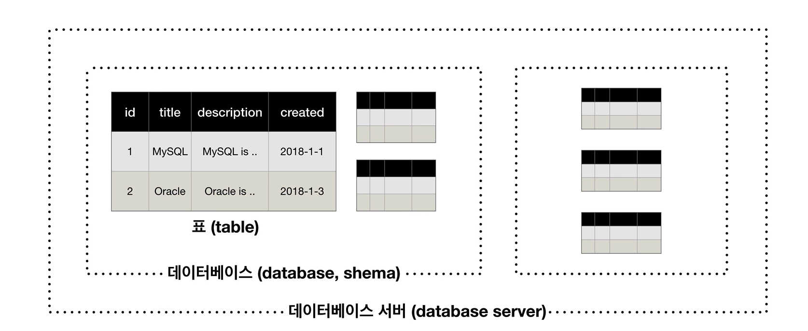

# MySQL의 구조

## 스키마(schema), 

| id   | title  | description   | created  |
| ---- | ------ | ------------- | -------- |
| 1    | MySQL  | MySQL is ..   | 2018-1-1 |
| 2    | Oracle | Oracle is ... | 2018-1-3 |

위와 같은 **표(table)**가 여러개 생성된다.

- 스키마(schema) : MySQL에서는 서로 연관된 **table들을 Grouping**한것을 데이터베이스(database)라고 한다.
- 데이터베이스 서버(database server) : 스키마들을 여러개 포함한 것




## Database(Schema) 실습하기

### 생성하기

```mysql
mysql> CREATE DATABASE opentutorials;

Query OK, 1 row affected (0.03 sec)
```

 

### 삭제하기

```mysql
DROP {DATABASE | SCHEMA} [IF EXISTS] db_name
```

```
mysql> DROP DATABASE opentutorials;
Query OK, 0 rows affected (0.04 sec)
```


### 보기

```mysql
SHOW {DATABASES | SCHEMAS}
    [LIKE 'pattern' | WHERE expr]
```

```mysql
mysql> show databases;
+--------------------+
| Database           |
+--------------------+
| information_schema |
| mysql              |
| opentutorials      |
| performance_schema |
| sys                |
+--------------------+
5 rows in set (0.01 sec)
```


### 사용하기

```
mysql> USE opentutorials;
Database changed
```


- [MySQL Document](https://dev.mysql.com/doc/refman/8.0/en/creating-database.html)

