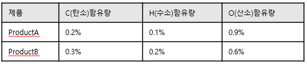
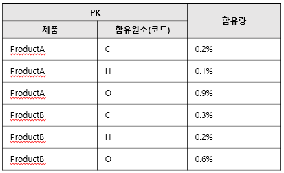
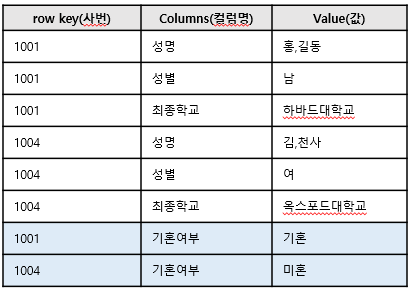

# NoSQL 이란?

 **Not Only SQL** 의 단어 뜻으로 SQL만을 사용하지 않는 데이터베이스 관리 시스템을 지칭하는 말이다. `

- 대부분 **cluster에서 실행할 목적으로 만들어졌기 때문에 관계형 모델을 사용하지 않는다**. 그러나 모든 NoSQL 데이터베이스가 cluster에서 실행되도록 맞춰진 것은 아니다. NoSQL 모델 중 하나인 그래프 데이터베이스는 관계형 데이터 베이스와 비슷한 분산 모델을 사용한다.
- 오픈소스이다.
- **스키마 없이 동작하며, 구조에 대한 정의를 변경할 필요 없이 데이터베이스 레코드에 자유롭게 필드를 추가**할 수 있다.

> cluster :  여러 대의 일반 워크스테이션을 네트워크로 연결하여 하나의 PC처럼 작동하게 하는 기술을 말한다.
>
> 출처: https://jw3461.tistory.com/6 [찍찍!! ]

기존에는 트랜잭션을 통한 안정적인 데이터 관리가 가장 중요한 이슈였기때문에 RDBMS를 사용했다. 하지만 데이터와 트래픽 양이 기하급수적으로 증가함에 따라 데이터를 처리하는데 필요한 비용이 증가했다.

NoSQL은 **데이터의 일관성을 약간 포기한 대신 여러 대의 컴퓨터에 데이터를 분산하여 저장하는 것**(scale-out : 수평적 확장)을 목표로 등장했다.

## 종류

- Key - Value
- Document
- Column-Family
- Graph

그래프 모델을 제외한 나머지 모델은 집합 지향(Aggregate-Oriented) 모델이다.

### Aggregate-Oriented 모델

집합이란 연산의 한 단위로 취급되는 연관된 객체들의 집합이다. Aggregate-Oriented Database는 여러 대으 ㅣ클러스터로 이루어진 시스템에서 사용하기 적합하다. 즉, 수평적 확장이 용이하다. 이는 RDBMS와는 달리 연관된 데이터들이 함께 움직이기 때문이다. 또한 메모리 내의 자료구조와 집합 간 데이터가 잘 일치하므로, RDBMS처럼 객체-관계 매핑 프레임워크가 필요하지 않다. 데이터의 검색도 key나 id를 사용하면 쉽게 찾을 수 있다.

Aggregate-Oriented 데이터베이스는 조인 연산이 불가능하다. 이를 보완하기 위해 MongoDB나 Cassandra 등의 데이터베이스에서는 MapReduce기능을 제공함으로써 조인과 유사한 연산을 가능하도록 설계했다.

#### Key-Value

Key-Value 저장소는 가장 단순한 형태의 NoSQL으로, 수평적 확장(scale-out)이 용이하다. Key-Value 쌍으로 저장되며, key는 value에 접근하기 위한 용도로 사용한다. value는 어떠한 형태의 데이터라도 담을 수 있다.

아주 간단한 API만을 제공하기 때문에 질의의 속도가 굉장히 빠른 편이다.

**종류**

- Memcached
- Riak
- Redis
- Amazone Dynamo DB
- LevelDB

#### RDBMS와 데이터 형태 비교

- RDBMS

### 

- Key-Value 모델

#### Document

Key-Value 모델에서 한층 진화한 모델로 생각할 수 있다. 데이터는 Key와 Document의 형태로 저장된다. (Document는 Value의 계층적 형태) 객체 지향의 객체와 유사하며, 이들은 하나의 단위로 취급되어 저장된다. 즉, 하나의 객체를 여러 개의 테이블에 나눠 저장할 필요가 없어진다.

**주요한 특징**

1. 객체-관계 매핑이 필요하지 않다. 객체를 Document 형태로 바로 저장 가능하기 때문이다.
2. 검색에 최적화 되어있다.
3. 사용이 번거럽고 SQL과 쿼리가 다르다.
4. JSON이나 xml 형태로 결과가 출력된다.

**종류**

- MongoDB
- CouchDB
- MarkLogic

<h4 id="columnFamily">Column-Family</h4>

앞선 두개의 모델은 값(Value or Document)을 이용해 필드를 결정했다면, Column 모델은 키에서 필드를 결정한다.

키는 ROW(키 값)와 Column-Family, Column-Name을 가진다. 연관된 데이터들은 같은 column-family안에 속해있으며, 각자의 column-name을 가진다. 

이러한 특징때문에 column-family 모델은 클러스터링이 쉽게 이뤄지며, timestamp가 존재해 값이 수정된 히스토리를 알 수 있다. 또한 값들은 일련의 바이너리 데이터로 존재하기 때문에 어떠한 형태의 데이터라도 저장할 수 있다. 위의 두 모델과는 다르게 Bolb단위의 쿼리가 불가능하며, Schema-less이긴 하지만 새로운 필드를 만드는데 드는 비용이 크기때문에 사실상 결정된 스키마를 변경하는 것이 어렵다. 또한 Keyspace나 table을 과도하게 생성할 경우 memory overflow가 발생할 수 있다.

**종류**

- Cassandra
- HBase
- Hypertable

#### RDBMS와 비교

- RDBMS

- 칼럼 패밀리(Column Family) 기본 모델

유연성을 적극 활용해 유사한 컬럼뿐만 아니라, 컬럼명이 columns 속성에 데이터로 저장되고, value에는 해당 컬럼의 값만 존재한다.

관계형 모델에서는 새로운 컬럼이 추가될때마다 테이블 구조를 변경해야하고, 특수한 경우에는 데이터도 새로 적재해야한다. Column-Family 모델은 신규 데이터를 위의 이미지 처럼 입력하기만 하면된다. 즉, 구조를 변경할 필요가 없으며, 기존 데이터를 수정할 필요도 없다.

Column Family DB가 사용하기에 더 유연하다. 하지만 단점은 **타 테이블과의 조인이 안된다는 점**이다. 관계형 데이터베이스의 최대 장점인 SQL 문으로 타 테이블과 조인하여 다양한 정보를 추출할 수 있다는 점인 반면 NoSQL DB는 이 처리가 불가능한 것이 단점이다. 그래서 NoSQL 데이터베이스에서는 조인이 필요한 데이터는 하나의 테이블에 중복으로 관리해 처리 속도를 향상 시킨다. **동일한 데이터들이 여러 테이블에 존재하게 되는데 이것을 관리하는 것이 NoSQL 데이터베이스에서는 가장 어려운 점이고 가장 중요한 특징이다.** 

### Graph 모델

그래프 모델은 집합 지향 모델보다는 관계형 모델에 가깝다. 실제 세계의 데이터를 관계와 함께 표현하기 위해 디자인된 모델로써, **데이터는 연속적인 노드, 관계, 특성의 형태로 저장된다.**

데이터 간의 관계가 탐색의 키일 경우에 적합하다. 예를 들어, 페이스북이나 트위터 같은 소셜네트워크에서 적합하고, 연관된 데이터를 추천해주는 추천 엔진이나 패턴 인식 등의 데이터 베이스로도 적합하다. 또한 Aggregate-Oriendted 모델과는 다르게 객체의 ACID 트랜잭션을 지원한다.

다만, 그래프 모델은 클러스터링에 적합하지 않으며, 질의어도 특화되어 있어 어렵다.

## RDMBS vs NoSQL

| Relational Database                | NoSQL                                     |
| ---------------------------------- | ----------------------------------------- |
| Scale-up - 서버 한대 중심으로 확장 | Scale-out - 여러대의 서버를 중심으로 확장 |
| 무결성                             | 유연성                                    |
| 데이터 중복 제거                   | 데이터 중복 허용                          |
| 트랜잭션                           | 빠른 쓰기, 읽기                           |

## 참조 페이지

- [https://namu.wiki/w/NoSQL](https://namu.wiki/w/NoSQL)
- [https://cionman.tistory.com/44](https://cionman.tistory.com/44)
- [https://12bme.tistory.com/323](https://12bme.tistory.com/323)

