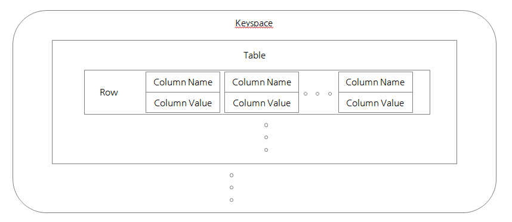
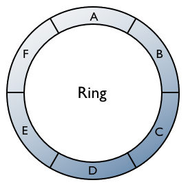
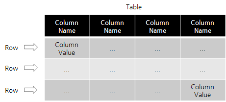

# Cassandra란

Cassandra는 [Column-Family](./2020-02-02-basic/#columnFamily) 모델 구조의 NoSQL이다. 

## Cassandra Data Structure



Cassandra는 최상위에 논리적 데이터 저장소인 Keysapce가 있고, 그 아래에 테이블이 존재한다. Table은 다수의 Row들로 구성되어 있으며, 각 Row는 Key-Value로 이루어진 column들로 구성된다.



Cassandra는 기본적으로 Ring 구조를 띠고 있다. 그리고, Ring을 구성하는 각 노드에 Data를 분산하여 저장한다. 데이터는 **Partition Key** 라고 부리는 데이터의 hash값을 기준으로 분산하게 된다.

처음 각 노드가 Ring에 참여하게되면, `conf/cassandra.yaml` 에 정의된 각 설정을 통해 각 노드마다 고유의 hash 값 범위를 부여 받는다. 그 후에, 외부에서 데이터 요청이 오면 해당 데이터의 partition key(row key)의 hash값을 계산하여 해당 데이터가 어느 노드에 저장되어 있는지 알고 접근할 수 있다. 이렇게 계산된 hash 값을 token이라 부른다.

CQL(Cassandra Query Language)에서의 Row와 Column은 실제 데이터가 저장되는 Cassandra Data Layer에서의 Row와 Column과 의미가 다르다. 



위의 그림에서 보듯이 CQL에서 Row와 Column은 RDMBS의 Tuple, Attribute와 유사하다는 것을 알 수 있다. 이렇게 구성된 CQL Table은 최소 1개 이상의 column을 primary key로 지정해야하며, primary key로 지정된 column들 중에서 partition key로 지정된 값으로 데이터를 분산하게 된다. 즉, 아래와 같은 결론을 내릴 수 있다.

1. Cassandra는 Row Key의 Hash 값을 이용하여 데이터를 분산한다.
2.  이때, Cassandra Data Layer에서의 Row key = CQL partition key의 value이다. (복수의 partition key라면 해당 Column value들과 `:`문자의 조합이다.)
3.  그리고, Cassandra Data Layer에서의 Column Name = CQL cluster key의 Column value와 primary key에 속하지 않은 Column Name들 및 `:` 문자의 조합이다.

### Keyspace 생성하기

```CQL
CREATE  KEYSPACE [IF NOT EXISTS] keyspace_name 
   WITH REPLICATION = { 
      'class' : 'SimpleStrategy', 'replication_factor' : N(숫자) } 
     | 'class' : 'NetworkTopologyStrategy', 
       'dc1_name' : N [, ...] 
   }
   [AND DURABLE_WRITES =  true|false] ;
```

- SimpleStrategy : 전체 클러스터에 동일한 replicatoin factor를 지정한다. 데이터 테스트용 이나 개발환경에서 사용한다.
- NetworkTopologyStrategy : 각각 데이터 센터별로 replication factor를 지정한다. 운영 환경 및 다중 DC test환경에서 사용한다.

```CQL
CREATE KEYSPACE test_keyspace WITH REPLICATION = { 'class' : 'SimpleStrategy', 'replication_factor':1 };
```

### Table 생성하기

```CQL
CREATE TABLE [ IF NOT EXISTS ] [keyspace_name.]table_name
  ( column_definition [ , ... ] | PRIMARY KEY (column_list) )
  [ WITH [ table_options ]
  [ [ AND ] CLUSTERING ORDER BY [ clustering_column_name order ] ]
  [ [ AND ] ID = 'table_hash_tag' ]
  [ [ AND ] COMPACT STORAGE ] ;
```


```cql
CREATE TABLE test_keyspace.test_table_ex1 ( 
    code text, 
    location text, 
    sequence text, 
    description text, 
    PRIMARY KEY (code, location)
);
```

 여기서 PRIMARY KEY로 code와 location을 설정했는데, CQL 문법에 따라 code는 partition key, location은 cluster key로 지정된다.

> cluster key : Cassandra Data Layer에서 Row 내부 Column들의 정렬을 담당하는 키

### Insert Into Table

```CQL
INSERT INTO [keyspace_name.] table_name (column_list) 
VALUES (column_values) 
[IF NOT EXISTS] 
[USING TTL seconds | TIMESTAMP epoch_in_microseconds] 

```

```CQL
INSERT INTO test_keyspace.test_table_ex1 (code, location, sequence, description ) VALUES ('N1', 'Seoul', 'first', 'AA');
INSERT INTO test_keyspace.test_table_ex1 (code, location, sequence, description ) VALUES ('N1', 'Gangnam', 'second', 'BB');
INSERT INTO test_keyspace.test_table_ex1 (code, location, sequence, description ) VALUES ('N2', 'Seongnam', 'third', 'CC');
INSERT INTO test_keyspace.test_table_ex1 (code, location, sequence, description ) VALUES ('N2', 'Pangyo', 'fourth', 'DD');
INSERT INTO test_keyspace.test_table_ex1 (code, location, sequence, description ) VALUES ('N2', 'Jungja', 'fifth', 'EE');
```

### SELECT * FROM

```CQL
SELECT * | select_expression | DISTINCT partition 
FROM [keyspace_name.] table_name 
[WHERE partition_value
   [AND clustering_filters 
   [AND static_filters]]] 
[ORDER BY PK_column_name ASC|DESC] 
[LIMIT N]
[ALLOW FILTERING]
```

```CQL
select * from test_keyspace.test_table_ex1;
```

```CQL
code | location | description | sequence
------+----------+-------------+----------
   N1 |  Gangnam |          BB |   second
   N1 |    Seoul |          AA |    first
   N2 |   Jungja |          EE |    fifth
   N2 |   Pangyo |          DD |   fourth
   N2 | Seongnam |          CC |    third
```

### USE KEYSPACE

```CQL
USE keyspace_name;
```


## 참조 페이지

- [https://docs.datastax.com/](https://docs.datastax.com/)
- [https://meetup.toast.com/posts/58](https://meetup.toast.com/posts/58)

