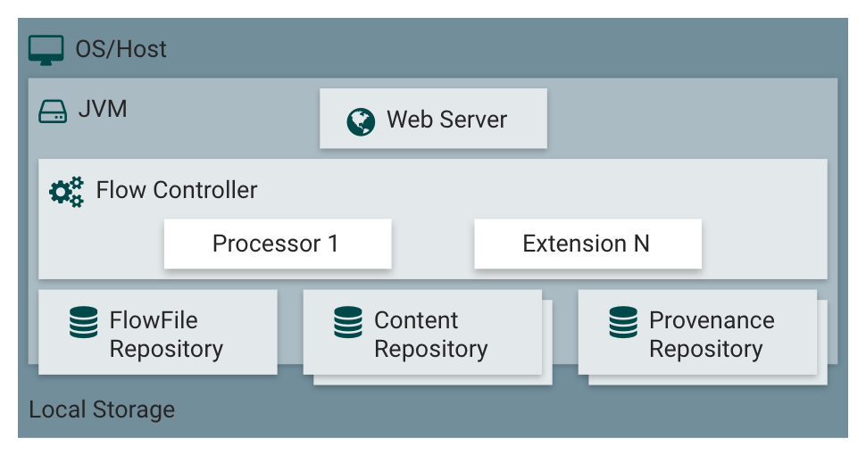

# NiFi

Apache NiFi는 **시스템 간 데이터 전달을 효율적으로 처리, 관리, 모니터링 하기 위한 최적의 시스템**이다.

- Dataflow를 쉽게 개발할 수 있고, 시스템 간의 데이터 이동과 내용을 볼 수 있는 UI를 제공
- 실시간 데이터 전송에 필요한 기능을 제공
- 강력한 자원과 권한 관리를 통해 Multi-tenant(여러 조직이 자원을 공유해 사용)를 지원
- 데이터가 어느 시스템으로부터 왔는지 추적 가능
- 오픈 소스
- 여러 NiFi 시스템 간 통신을 지원(site to site)

NiFi는 프로세서를 이용해 수집, 변형, 저장을 여러 단계에 걸쳐서 할 수 있다.

## 주요 용어

| NiFi               | FBP                | 설명                                                         |
| ------------------ | ------------------ | ------------------------------------------------------------ |
| FlowFile           | Information Packet | NiFi에서 데이터를 표현하는 객체로, Key/Value 형태의 데이터 속성(Attribute)와 데이터(Content)를 포함할 수 있다. 0바이트 이상의 데이터가 저장되며, FlowFile을 이용해 여러 시스템 간 데이터 이동이 가능하다 |
| FlowFile Processor | BlackBox           | FlowFile은 여러 단계에 걸쳐 속성이 추가되거나 변경할 때 사용하는 것이다. |
| Connection         | Bounded Buffer     | Processor 간의 연결을 말하며, NiFi의 Connection은 FlowFile의 대기열(queueing)뿐 아니라 라우팅, 처리량 제한, 우선순위 제어, 모니터링 등의 강력한 기능을 제공 |
| Flow Controller    | Scheduler          | Processor가 어느 간격 또는 시점에 실행하는지 스케줄링        |
| Process Group      | subnet             | 특정 업무, 기능 단위로 여러 Processor를 묶을 수 있으며, Input과 Output 포트를 제공해 Process Group간 데이터 이동이 가능 |

## 아키텍처

#### Web Server

NiFi는 UI를 웹 서비스를 통해 제공하며, 개발자 혹은 관리자는 이를 이용해 Dataflow 개발, 제어, 모니터링을 한다.

#### Flow Controller

Processor가 어느 간격 또는 시점에 실행하는지 스케줄링을 담당한다.

##### Extension

NiFI가 제공하는 기본 Processor들 이외에 개발자가 Process를 개발해 확장할 수 있다.

#### FlowFile Repository

Write-Ahead-Log로 FlowFile의 속성과 상태값을 저장하는 곳이다. 시스템 장애시 데이터가 유실되지 않도록 한다.

#### Content Repository

FlowFile의 데이터(Content)가 저장되며, 여러 디렉토리에 분석 저장이 가능하다. 이 떄문에 용량이 큰 데이터를 저장할 수 있으며, 단일 디스크의 처리량보다 많은 양을 처리할 수 있다.

#### Provenance Repository

데이터의 처리 단계별로 FlowFile 데이터를 보관하는 곳으로, 여러 디스크를 지원한다. 이때 각 데이터는 인덱스 되어 검색할 수 있다.

#### FlowFile, Processor

FlowFile은 Processor에 의해 생성되며, 속성 정보와 데이터가 들어있다.

#### Cluster Coordinator

각 NiFi 서버들의 정보(가동여부, 상태)를 관리하며, DataFlow의 추가, 수정, 삭제 등의 변경을 클러스터에 등록된 NiFi 노드들에 복제해준다.

#### Primary Node

Primary Node는 여러 노드에서 Processor가 실행되지 않고, 특정 단일 노드에서만 실행하고자 할때 사용하는 대표 노드이다. 

#### ZooKeeper Server

이러한 역할은 ZooKeeper Server에서 자동으로 선출되며, NiFi 1.0부터 Zero-Master Clustering이 적용되여 클러스터 내에 NiFi 노드들 중 한대가 자동으로 Cluster Coordinator와 Primary Node가 된다.

Cluster와 각 노드들은 같은 Dataflow를 가지고 있으며, 각 노드에서 중복되지 않은 데이터를 처리한다.

다음과 같이 클러스터 환경에서 데이터를 분산처리할 수 있다. 데이터 중복 조회를 막기 위해 Primary Node에서 ListHDFS를 실행한다.

ListHDFS는 HDFS의 특정 디렉토리 안의 파일을 조회하며, 파일 별로 FlowFile을 생성한다. 이렇게 생성된 FlowFile을 RPG(Remote Process Group)에 전달해 각 노드로 FlowFile을 분산하여 전달한다. FetchHDFS Processor를 이용해  HDFS 파일을 조회한다.

> HDFS : Hadoop Distributed File System
>
> 하둡의 대표적인 파일 시스템으로 범용 하드웨어로 구성된 클러스터에서 실행되며, 데이터 엑세스 패턴을 스트리밍 방식으로 지원해 매우 큰 파일을 저장할 수 있도록 설계된 시스템이다.

## 참고

- [https://www.popit.kr/apache-nifi-overview-and-install/](https://www.popit.kr/apache-nifi-overview-and-install/)
- [https://nifi.apache.org/docs.html](https://nifi.apache.org/docs.html)
- [https://628story.tistory.com/3](https://628story.tistory.com/3)