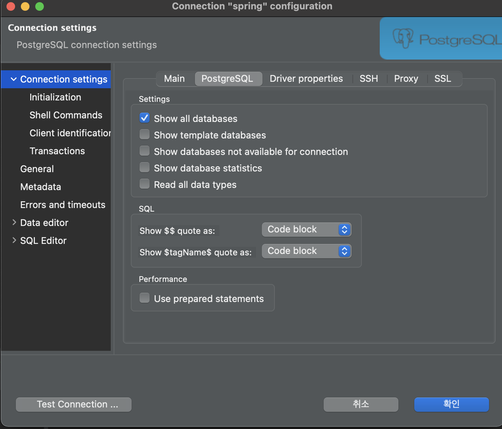

# PostgreSQL 시작하기

## Mac OS 설치하기

### [homebrew](https://brew.sh/index_ko)

설치전에 homebrew를 최신 버전으로 update해준다.

```sh
$ brew update
```

update를 완료하면, 설치하고자 하는 패키지가 존재하는지 검색해본다.

```sh
$ brew search postgresql
==> Formulae
postgresql ✔    postgresql@11   postgresql@13   postgresql@9.5  qt-postgresql
postgresql@10   postgresql@12   postgresql@9.4  postgresql@9.6  postgrest
```

원하는 버전의 postgresql을 설치해준다.

```sh
$ brew install postgresql
...
==> Installing postgresql
==> Pouring postgresql--14.1_1.arm64_monterey.bottle.tar.gz
==> /opt/homebrew/Cellar/postgresql/14.1_1/bin/initdb --locale=C -E UTF-8 /opt/h
==> Caveats
To migrate existing data from a previous major version of PostgreSQL run:
  brew postgresql-upgrade-database

This formula has created a default database cluster with:
  initdb --locale=C -E UTF-8 /opt/homebrew/var/postgres
For more details, read:
  https://www.postgresql.org/docs/14/app-initdb.html

To restart postgresql after an upgrade:
  brew services restart postgresql
Or, if you don't want/need a background service you can just run:
  /opt/homebrew/opt/postgresql/bin/postgres -D /opt/homebrew/var/postgres
==> Summary
🍺  /opt/homebrew/Cellar/postgresql/14.1_1: 3,304 files, 44.5MB
==> Running `brew cleanup postgresql`...
Disable this behaviour by setting HOMEBREW_NO_INSTALL_CLEANUP.
Hide these hints with HOMEBREW_NO_ENV_HINTS (see `man brew`).
==> Caveats
==> postgresql
To migrate existing data from a previous major version of PostgreSQL run:
  brew postgresql-upgrade-database

This formula has created a default database cluster with:
  initdb --locale=C -E UTF-8 /opt/homebrew/var/postgres
For more details, read:
  https://www.postgresql.org/docs/14/app-initdb.html

To restart postgresql after an upgrade:
  brew services restart postgresql
Or, if you don't want/need a background service you can just run:
  /opt/homebrew/opt/postgresql/bin/postgres -D /opt/homebrew/var/postgres
```

설치가 완료되면 사용법에 대해 알려주며, 설치 버전 확인을 통해 설치가 정상적으로 됐는지 확인한다.

```sh
$ postgres -V
postgres (PostgreSQL) 14.1
```

현재 기준 default 버전 14.1이 정상적으로 설치 된 것을 확인할 수 있다.

```sh
$ brew services start postgresql
==> Tapping homebrew/services
Cloning into '/opt/homebrew/Library/Taps/homebrew/homebrew-services'...
remote: Enumerating objects: 1616, done.
remote: Counting objects: 100% (495/495), done.
remote: Compressing objects: 100% (361/361), done.
remote: Total 1616 (delta 208), reused 337 (delta 122), pack-reused 1121
Receiving objects: 100% (1616/1616), 470.41 KiB | 6.92 MiB/s, done.
Resolving deltas: 100% (684/684), done.
Tapped 1 command (42 files, 599.2KB).
==> Successfully started `postgresql` (label: homebrew.mxcl.postgresql)
```

start명령어를 통해 postgresql을 시작할 수 있다.

## 시작하기

### 접속하기

```sh
$ psql postgres
psql (14.1)
Type "help" for help.

postgres=#
```

superuser로 접속하는 경우 `database명#`로 뜬다.

#### 특정 사용자로 특정 database 접속하기

```sh
$ psql spring -U test
psql (14.1)
Type "help" for help.

spring=>
```

다음과 같이 spring으로 뜨는 것을 확인할 수 있다. superuser가 아닌경우에는 `database명=>`로 뜬다. 

### 계정 조회 하기

[https://www.postgresql.org/docs/current/postgres-user.html](https://www.postgresql.org/docs/current/postgres-user.html)에 보면 설치시 자동으로 적합한 사용자 계정을 생성해준다고 되어있다.

```
19.1. The PostgreSQL User Account
As with any server daemon that is accessible to the outside world, it is advisable to run PostgreSQL under a separate user account. This user account should only own the data that is managed by the server, and should not be shared with other daemons. (For example, using the user nobody is a bad idea.) In particular, it is advisable that this user account not own the PostgreSQL executable files, to ensure that a compromised server process could not modify those executables.

Pre-packaged versions of PostgreSQL will typically create a suitable user account automatically during package installation.

To add a Unix user account to your system, look for a command useradd or adduser. The user name postgres is often used, and is assumed throughout this book, but you can use another name if you like.
```

```sh
postgres=# \du
                                   List of roles
 Role name |                         Attributes                         | Member of
-----------+------------------------------------------------------------+-----------
 dahyelele | Superuser, Create role, Create DB, Replication, Bypass RLS | {}
```

조회 명령어를 치면, 별도로 생성한적 없는 dahyelele(mac 계정명) superuser가 생성되어있는 것을 볼 수 있다.

### 계정 생성하기

```sh
postgres=# CREATE ROLE test WITH LOGIN PASSWORD 'test!';
```

### 권한 부여하기

- [부여 가능한 계정 권한](https://www.postgresql.org/docs/14/sql-alterrole.html)

```sh
postgres=# ALTER ROLE test CREATEDB;
```

사용자에게 어떤 권한을 줄지 입력하면 된다. 권한 부여 후 `\du`로 부여된 권한을 확인할 수 있다.

```sh
postgres=# \du
                                   List of roles
 Role name |                         Attributes                         | Member of
-----------+------------------------------------------------------------+-----------
 dahyelele | Superuser, Create role, Create DB, Replication, Bypass RLS | {}
 test      | No inheritance, Create DB                                  | {}
```

### DB 권한 부여하기

- [부여가능한 DB 권한 목록](https://www.postgresql.org/docs/14/sql-grant.html)

```sh
postgres=> GRANT ALL PRIVILEGES ON DATABASE spring TO test;
GRANT
```

### Database 리스트 조회

```sh
postgres=> \list
                              List of databases
   Name    |   Owner   | Encoding | Collate | Ctype |    Access privileges
-----------+-----------+----------+---------+-------+-------------------------
 postgres  | dahyelele | UTF8     | C       | C     |
 spring    | dahyelele | UTF8     | C       | C     | =Tc/dahyelele          +
           |           |          |         |       | dahyelele=CTc/dahyelele+
           |           |          |         |       | test=CTc/dahyelele
 template0 | dahyelele | UTF8     | C       | C     | =c/dahyelele           +
           |           |          |         |       | dahyelele=CTc/dahyelele
 template1 | dahyelele | UTF8     | C       | C     | =c/dahyelele           +
           |           |          |         |       | dahyelele=CTc/dahyelele
(4 rows)
```

### Database 연결하기

```sh
postgres=> \connect test
```

### Table 리스트 조회

```sh
postgres=> \dt
```

### Schema 생성

PostgreSQL에서는 Database -> Schema -> Table 개념이다. 그래서 Schema를 생성해준 후 테이블을 생성해주어야한다. 이때 권한이 있는 database로 연결한 후 스키마를 생성해야한다.

```sh
spring=> CREATE SCHEMA spring;
```

###  Schema 조회

```sh
spring=> \dn
  List of schemas
  Name  |   Owner
--------+-----------
 public | dahyelele
 spring | test
```

스키마 목록을 보면 test에 위에서 생성한 spring이 생성된 것을 확인할 수 있다.

## client

[DBeaver](https://dbeaver.io/download/)는 mysql, postgresql 등등 다양한 database접근을 제공해준다.


host, username, password등 사용할 계정 정보를 입력하여 시작할 수 있다.

이때 

다음과 같이 `show all databases`를 설정해주어야지 기존에 생성한 모든 database가 목록에 보인다. 


## 참고

- [https://www.postgresql.org/docs/14/](https://www.postgresql.org/docs/14/)

- [https://bono915.tistory.com/entry/Postgresql-DB-%EC%82%AC%EC%9A%A9%EC%9E%90-%EC%B6%94%EA%B0%80-%EB%B0%8F-Role-%EA%B6%8C%ED%95%9C-%EA%B4%80%EB%A6%AC](https://bono915.tistory.com/entry/Postgresql-DB-%EC%82%AC%EC%9A%A9%EC%9E%90-%EC%B6%94%EA%B0%80-%EB%B0%8F-Role-%EA%B6%8C%ED%95%9C-%EA%B4%80%EB%A6%AC)

- [https://medium.com/@parkopp/mac-%EC%9C%A0%EC%A0%80%EB%A5%BC-%EC%9C%84%ED%95%9C-postgresql-%EC%84%A4%EC%B9%98-%EB%B0%8F-%EC%9C%A0%EC%A0%80-%EB%8D%B0%EC%9D%B4%ED%84%B0%EB%B2%A0%EC%9D%B4%EC%8A%A4-%EC%84%A4%EC%A0%95%ED%95%98%EA%B8%B0-67f5b6e6753d](https://medium.com/@parkopp/mac-%EC%9C%A0%EC%A0%80%EB%A5%BC-%EC%9C%84%ED%95%9C-postgresql-%EC%84%A4%EC%B9%98-%EB%B0%8F-%EC%9C%A0%EC%A0%80-%EB%8D%B0%EC%9D%B4%ED%84%B0%EB%B2%A0%EC%9D%B4%EC%8A%A4-%EC%84%A4%EC%A0%95%ED%95%98%EA%B8%B0-67f5b6e6753d)