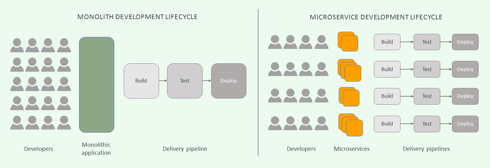
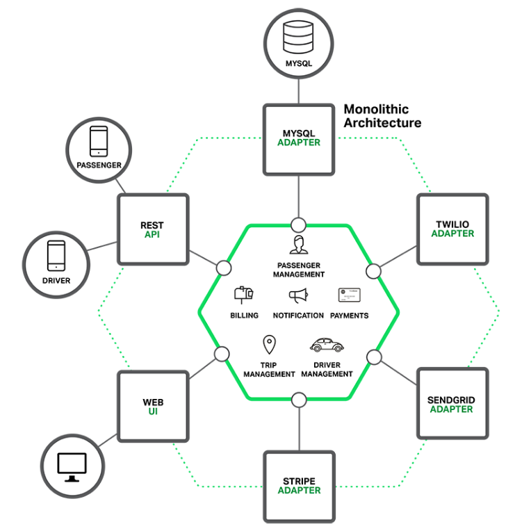
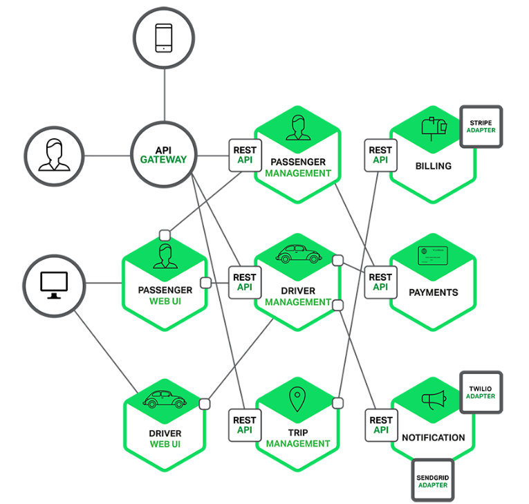

# Monolithic vs MSA(Micro Service Architecture)

## Monolithic Architecture

Monolithic 아키텍처는 **전체 어플리케이션을 하나의 통합된 패키지**로 개발/배포 하는 방식이다.
웹 개발을 예로들면, 웹 프로그램을 개발하기 위해서 모듈별로 개발을 하고, 개발이 완료된 웹 어플리케이션을 하나의 결과물로 패키징 하여 배포되는 형태를 말한다. 웹의 경우 WAR 파일로 빌드되어, WAS에 배포하는 형태이다.

- 장점

  - 어떤 기능(서비스)이든지 개발되어있는 환경이 같아서 복잡하지 않음.

  - 쉽게 고가용성 서버 환경을 구축 가능

  - End-to-End 테스트가 용이

Monolithic은 다음과 같은 장점이 있어 **단순한 아키텍처 구조와 개발의 용이하다.** 하지만, 규모가 커짐에 따라 복잡도도 증가한다.

- 단점
  - 하나의 모듈 수정 시 전체 애플리케이션 재 배포
  - 서버 기동, 빌드 및 배포 시간이 오래 걸림
  - 대량 트래픽, 복잡한 트랜잭션 처리 등 서비스 특성에 따른 적합한 기술 적용 및 시스템 구성 어려움
  - 많은 양의 코드로 유지보수가 어려움.

## Micro Service Architecture

MSA는 **독립된 각각의 모듈을 조립하여 만드는 하나의 서비스**를 위한 아키텍처이다. MSA는 단일 책임 원칙(Single Responsibility Principle; SRP)를 중시한다. 즉, 큰 문제를 작은 문제로 분해해 해결하며, 작게 나눠진 서비스가 서로에게 영향을 미치지 않고 독립적으로 역할을 수행하게 만드는 것이다.

즉, 비지니스 업무를 얼마나 알맞게 잘 나눠서 해결했는지가 중요하다.

- 장점
  - 개발 생산성 : 독립적인 개발팀들에 의해 개발가능, 각 서비스에 집중 가능
  - 배포 유연성 : 전체 프로그램을 다시 배포하지 않고도 업데이트가 가능.
  - 정교한 확장성 : 각 서비스에 적합한 기술을 선택하여 조합 가능, 서비스를 독립적으로 확장 가능
- 단점
  - 공유 자원 접근이 어려움. 
  - 배포와 실행이 복잡 ( 배포 자동화 과정 필요 )
  - 분산 시스템을 구현하기 어려움 : 독립적인 프로세스들을 유기적으로 동작할 수 있게 분산 네트워크 시스템이 필요함. 네트워크 레벨에서 다양한 상황별로 처리해야하는 어려움

## 참고

- [https://medium.com/webeveloper/microservice-architecture%EB%9E%80-ca9825087050](https://medium.com/webeveloper/microservice-architecture란-ca9825087050)

- [Jins' Dev Inside](https://jins-dev.tistory.com/entry/MicroService란-마이크로-서비스-아키텍처에-대하여?category=760149)
- [As I've always been](https://neos518.tistory.com/100 )

