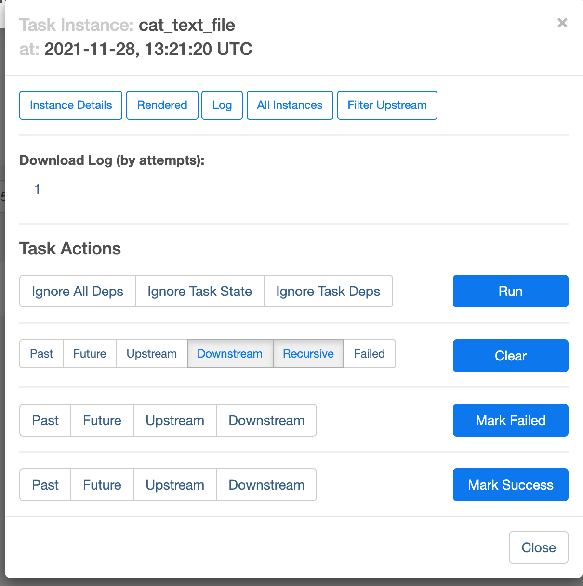

# Airflow 시작하기

## 가상환경 설정

- [virtualenv 설정하기](https://github.com/dh00023/TIL/blob/master/django/2019-02-17-install.md)에서 가이드 한대로 모든 환경설정은 완료되어있다고 가정하고 진행

```bash
$ pyenv virtualenv 3.7.2 airflow
```

airflow용 가상환경을 생성해준다. 생성이 완료되면 versions로 제대로 생성됐는지 확인이 가능하다.

```bash
$  pyenv versions
  system
* 3.7.2
  3.7.2/envs/airflow
  3.7.2/envs/cassandra
  3.7.2/envs/djangoVue
  3.7.2/envs/sample-env
  airflow
  cassandra
  djangoVue
  sample-env
```

가상환경 생성이 완료됐으면, 가상환경을 적용할 폴더로 이동해준다.

```bash
$ cd ~/Develop/airflow
```

폴더로 이동했으면, 현재 디렉토리를 airflow 가상환경을 사용할 것이라고 설정해준다.

```bash
$ pyenv activate airflow
```

가상 환경 설정 후 versions로 확인하여, 다음과 같이 `* airflow`로 설정되어있으면 완료된 것이다. 

```bash
$ pyenv versions
  system
  3.7.2
  3.7.2/envs/airflow
  3.7.2/envs/cassandra
  3.7.2/envs/djangoVue
  3.7.2/envs/sample-env
* airflow (set by PYENV_VERSION environment variable)
  cassandra
  djangoVue
  sample-env
```

## airflow 설치 및 시작하기

#### Install

```bash
$ pip3 install apache-airflow
```

설치가 완료되면, airflow를 실행하여 기본 설정을 할 것이다.

#### 환경 설정

일반적으로 Airflow의 Configuration파일은 `~/airflow`에 위치해 있으며 파일 이름은 `airflow.cfg`이다.

```bash
$ cat ~/airflow/airflow.cfg
[core]
# The folder where your airflow pipelines live, most likely a
# subfolder in a code repository. This path must be absolute.
dags_folder = /Users/username/airflow/dags

# Hostname by providing a path to a callable, which will resolve the hostname.
# The format is "package.function".
#
# For example, default value "socket.getfqdn" means that result from getfqdn() of "socket"
# package will be used as hostname.
#
# No argument should be required in the function specified.
# If using IP address as hostname is preferred, use value ``airflow.utils.net.get_host_ip_address``
hostname_callable = socket.getfqdn

# Default timezone in case supplied date times are naive
# can be utc (default), system, or any IANA timezone string (e.g. Europe/Amsterdam)
default_timezone = utc

# The executor class that airflow should use. Choices include
# ``SequentialExecutor``, ``LocalExecutor``, ``CeleryExecutor``, ``DaskExecutor``,
# ``KubernetesExecutor``, ``CeleryKubernetesExecutor`` or the
# full import path to the class when using a custom executor.
executor = SequentialExecutor

# The SqlAlchemy connection string to the metadata database.
# SqlAlchemy supports many different database engines.
# More information here:
# http://airflow.apache.org/docs/apache-airflow/stable/howto/set-up-database.html#database-uri
sql_alchemy_conn = sqlite:////Users/username/airflow/airflow.db

# The encoding for the databases
sql_engine_encoding = utf-8

# Collation for ``dag_id``, ``task_id``, ``key`` columns in case they have different encoding.
# By default this collation is the same as the database collation, however for ``mysql`` and ``mariadb``
# the default is ``utf8mb3_bin`` so that the index sizes of our index keys will not exceed
# the maximum size of allowed index when collation is set to ``utf8mb4`` variant
# (see https://github.com/apache/airflow/pull/17603#issuecomment-901121618).
# sql_engine_collation_for_ids =

# If SqlAlchemy should pool database connections.
sql_alchemy_pool_enabled = True

# The SqlAlchemy pool size is the maximum number of database connections
# in the pool. 0 indicates no limit.
sql_alchemy_pool_size = 5

# The maximum overflow size of the pool.
# When the number of checked-out connections reaches the size set in pool_size,
# additional connections will be returned up to this limit.
# When those additional connections are returned to the pool, they are disconnected and discarded.
# It follows then that the total number of simultaneous connections the pool will allow
# is pool_size + max_overflow,
# and the total number of "sleeping" connections the pool will allow is pool_size.
# max_overflow can be set to ``-1`` to indicate no overflow limit;
# no limit will be placed on the total number of concurrent connections. Defaults to ``10``.
sql_alchemy_max_overflow = 10

# The SqlAlchemy pool recycle is the number of seconds a connection
# can be idle in the pool before it is invalidated. This config does
# not apply to sqlite. If the number of DB connections is ever exceeded,
# a lower config value will allow the system to recover faster.
sql_alchemy_pool_recycle = 1800

# Check connection at the start of each connection pool checkout.
# Typically, this is a simple statement like "SELECT 1".
# More information here:
# https://docs.sqlalchemy.org/en/13/core/pooling.html#disconnect-handling-pessimistic
sql_alchemy_pool_pre_ping = True

# The schema to use for the metadata database.
# SqlAlchemy supports databases with the concept of multiple schemas.
sql_alchemy_schema =
...
```

- 샘플 숨기기

```bash
$ sed -i "103s/True/False/" ~/airflow/airflow.cfg
```


#### DB Init

```bash
$ airflow db init
```

#### Admin 계정 생성

```bash
$ airflow users create \
          --username ${username} \
          --firstname ${firstname} \
          --lastname ${lastname} \
          --role Admin \
          --email ${email}
```

사용자명, 이름, 역할, 이메일을 등록하여 생성하기를 누르면 비밀번호를 입력하라고 뜬다.

```bash
Password:
Repeat for confirmation:
[2021-11-28 21:18:59,004] {manager.py:214} INFO - Added user admin
User "admin" created with role "Admin"
```

비밀번호를 입력하고나면 계정이 생성된다.

#### airflow 실행하기

```bash
$ airflow webserver -p 8081
  ____________       _____________
 ____    |__( )_________  __/__  /________      __
____  /| |_  /__  ___/_  /_ __  /_  __ \_ | /| / /
___  ___ |  / _  /   _  __/ _  / / /_/ /_ |/ |/ /
 _/_/  |_/_/  /_/    /_/    /_/  \____/____/|__/
[2021-11-28 21:20:09,008] {dagbag.py:500} INFO - Filling up the DagBag from /dev/null
[2021-11-28 21:20:09,413] {manager.py:512} WARNING - Refused to delete permission view, assoc with role exists DAG Runs.can_create Admin
Running the Gunicorn Server with:
Workers: 4 sync
Host: 0.0.0.0:8081
Timeout: 120
Logfiles: - -
Access Logformat: 
=================================================================            
[2021-11-28 21:20:14 +0900] [44681] [INFO] Starting gunicorn 20.1.0
[2021-11-28 21:20:14 +0900] [44681] [INFO] Listening at: http://0.0.0.0:8081 (44681)
[2021-11-28 21:20:14 +0900] [44681] [INFO] Using worker: sync
[2021-11-28 21:20:14 +0900] [44686] [INFO] Booting worker with pid: 44686
[2021-11-28 21:20:14 +0900] [44687] [INFO] Booting worker with pid: 44687
[2021-11-28 21:20:14 +0900] [44688] [INFO] Booting worker with pid: 44688
[2021-11-28 21:20:14 +0900] [44689] [INFO] Booting worker with pid: 44689
[2021-11-28 21:20:17,633] {manager.py:512} WARNING - Refused to delete permission view, assoc with role exists DAG Runs.can_create Admin
[2021-11-28 21:20:17,639] {manager.py:512} WARNING - Refused to delete permission view, assoc with role exists DAG Runs.can_create Admin
[2021-11-28 21:20:17,703] {manager.py:512} WARNING - Refused to delete permission view, assoc with role exists DAG Runs.can_create Admin
[2021-11-28 21:20:17,712] {manager.py:512} WARNING - Refused to delete permission view, assoc with role exists DAG Runs.can_create Admin
```

[http://localhost:8081/](http://localhost:8081/) 에 접속하면 다음과 같이 로그인 화면이 뜬다.


위에서 생성한 admin 계정으로 로그인을 하면 다음과 같이 샘플 화면을 볼 수 있다.


## 개념

### DAG(Directed Acyclic Graphs)

작업의 관계를 방향성 비순환 그래프로 나타내며, DAG는 하나의 워크플로우라 생각하면된다.


DAG는 여러개의 Task를 포함하고 있는 구조로, 방향성 비순환 그래프이므로 작업간의 의존성 혹은 선후 관계가 생긴다고 할 수 있다.


#### 생성해보기

airflow 실행 후 dags 디렉토리를 생성해준다.

```bash
$ mkdir dags
```

그 다음에 해당 디렉토리를 `~/airflow/airflow.cfg` 파일내의 `dags_folder`로 지정해준다.

```
[core]
# The folder where your airflow pipelines live, most likely a
# subfolder in a code repository. This path must be absolute.
dags_folder = /Users/username/airflow/dags
```

가장 기본적인 `BashOperation`을 생성해볼 것이다. 

1. test.txt 파일 생성
2. test.txt 파일 내 텍스트 출력
3. test.txt 파일 삭제

```python
# bash_example.py
from airflow import models
from airflow.operators.bash_operator import BashOperator
from datetime import datetime, timedelta
 
default_args = {
        'owner': 'airflow',
        'depends_on_past': False,
        'start_date': datetime(2021, 11, 29)}

with models.DAG(
        dag_id='echo_test', description='echo_test',
        schedule_interval=None,
        default_args=default_args) as dag:
 
    text_file_path = '~/airflow/dags'
 
    #### create txt file  --> 텍스트 파일을 생성
    create_text_file_command = f'cd {text_file_path} && echo hello airflow > test.txt'
    create_text_file = BashOperator(
            task_id='create_text_file',
            bash_command=create_text_file_command,
            dag=dag)
 
    #### cat txt file  --> 텍스트 파일을 읽어오기
    read_text_file_command = f'cd {text_file_path} && cat test.txt'
    read_text_file = BashOperator(
            task_id='cat_text_file',
            bash_command=read_text_file_command,
            dag=dag)
 
    #### remove txt file  --> 텍스트 파일을 삭제
    remove_text_file_command = f'cd {text_file_path} && rm test.txt'
    remove_text_file = BashOperator(
            task_id='remove_text_file',
            bash_command=remove_text_file_command,
            dag=dag)
 
    #### Task를 이어주는 Operator
    create_text_file >> read_text_file >> remove_text_file
```

여기서  dag파일명은 아무렇게나 생성해도 되며 `dag_id`를 이용해 등록하기 때문에, `dag_id`를 제대로 등록해야한다.

dag등록후 `$ airflow schedular` 명령어를 수행해 스케쥴러를 등록한다.


다음과 같이 해당 dag를 활성화 시켜 준 후 제대로 workflow가 생성되었다면,  화살표방향 버튼을 클릭해 ` Trigger DAG`를 눌러 workflow를 실행해준다.


workflow가 수행되고 나면, 다음과 같이 success 초록색으로 그래프가 변경되며 해당 Task를 눌러 `Log` 버튼을 누르면 수행 로그 이력을 볼 수 있다.



```
*** Reading local file: /Users/dh0023/airflow/logs/echo_test/cat_text_file/2021-11-28T13:21:20.215571+00:00/1.log
[2021-11-28, 22:25:01 UTC] {taskinstance.py:1035} INFO - Dependencies all met for <TaskInstance: echo_test.cat_text_file manual__2021-11-28T13:21:20.215571+00:00 [queued]>
[2021-11-28, 22:25:01 UTC] {taskinstance.py:1035} INFO - Dependencies all met for <TaskInstance: echo_test.cat_text_file manual__2021-11-28T13:21:20.215571+00:00 [queued]>
[2021-11-28, 22:25:01 UTC] {taskinstance.py:1241} INFO - 
--------------------------------------------------------------------------------
[2021-11-28, 22:25:01 UTC] {taskinstance.py:1242} INFO - Starting attempt 1 of 2
[2021-11-28, 22:25:01 UTC] {taskinstance.py:1243} INFO - 
--------------------------------------------------------------------------------
[2021-11-28, 22:25:01 UTC] {taskinstance.py:1262} INFO - Executing <Task(BashOperator): cat_text_file> on 2021-11-28 13:21:20.215571+00:00
[2021-11-28, 22:25:01 UTC] {standard_task_runner.py:52} INFO - Started process 2187 to run task
[2021-11-28, 22:25:01 UTC] {standard_task_runner.py:76} INFO - Running: ['airflow', 'tasks', 'run', 'echo_test', 'cat_text_file', 'manual__2021-11-28T13:21:20.215571+00:00', '--job-id', '10', '--raw', '--subdir', 'DAGS_FOLDER/bash_example.py', '--cfg-path', '/var/folders/02/dsdr2ndd5jj8p8h5vpw3_n300000gn/T/tmp7pir08j6', '--error-file', '/var/folders/02/dsdr2ndd5jj8p8h5vpw3_n300000gn/T/tmp1kn_tt3p']
[2021-11-28, 22:25:01 UTC] {standard_task_runner.py:77} INFO - Job 10: Subtask cat_text_file
[2021-11-28, 22:25:01 UTC] {logging_mixin.py:109} INFO - Running <TaskInstance: echo_test.cat_text_file manual__2021-11-28T13:21:20.215571+00:00 [running]> on host 1.0.0.127.in-addr.arpa
[2021-11-28, 22:25:01 UTC] {taskinstance.py:1427} INFO - Exporting the following env vars:
AIRFLOW_CTX_DAG_OWNER=airflow
AIRFLOW_CTX_DAG_ID=echo_test
AIRFLOW_CTX_TASK_ID=cat_text_file
AIRFLOW_CTX_EXECUTION_DATE=2021-11-28T13:21:20.215571+00:00
AIRFLOW_CTX_DAG_RUN_ID=manual__2021-11-28T13:21:20.215571+00:00
[2021-11-28, 22:25:01 UTC] {subprocess.py:62} INFO - Tmp dir root location: 
 /var/folders/02/dsdr2ndd5jj8p8h5vpw3_n300000gn/T
[2021-11-28, 22:25:01 UTC] {subprocess.py:74} INFO - Running command: ['bash', '-c', 'cd ~/airflow/dags && cat test.txt']
[2021-11-28, 22:25:01 UTC] {subprocess.py:85} INFO - Output:
[2021-11-28, 22:25:01 UTC] {subprocess.py:89} INFO - hello airflow
[2021-11-28, 22:25:01 UTC] {subprocess.py:93} INFO - Command exited with return code 0
[2021-11-28, 22:25:01 UTC] {taskinstance.py:1270} INFO - Marking task as SUCCESS. dag_id=echo_test, task_id=cat_text_file, execution_date=20211128T132120, start_date=20211128T132501, end_date=20211128T132501
[2021-11-28, 22:25:01 UTC] {local_task_job.py:154} INFO - Task exited with return code 0
[2021-11-28, 22:25:01 UTC] {local_task_job.py:264} INFO - 1 downstream tasks scheduled from follow-on schedule check
```

간단한 예제만 우선 다뤄보았으며, 자세한 튜터리얼은 [https://airflow.apache.org/docs/apache-airflow/1.10.1](https://airflow.apache.org/docs/apache-airflow/1.10.1)를 참고하는 것이 좋다.

#### macros

- https://airflow.apache.org/docs/apache-airflow/stable/templates-ref.html


## 참고

- [https://blog.si-analytics.ai/59](https://blog.si-analytics.ai/59)
- [https://graspthegist.com/2018/11/26/airflow-part-1-2-bash/](https://graspthegist.com/2018/11/26/airflow-part-1-2-bash/)
- [https://airflow.apache.org/docs/apache-airflow/1.10.1](https://airflow.apache.org/docs/apache-airflow/1.10.1)

