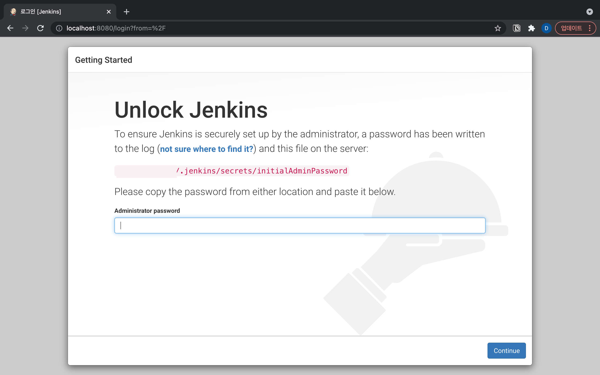
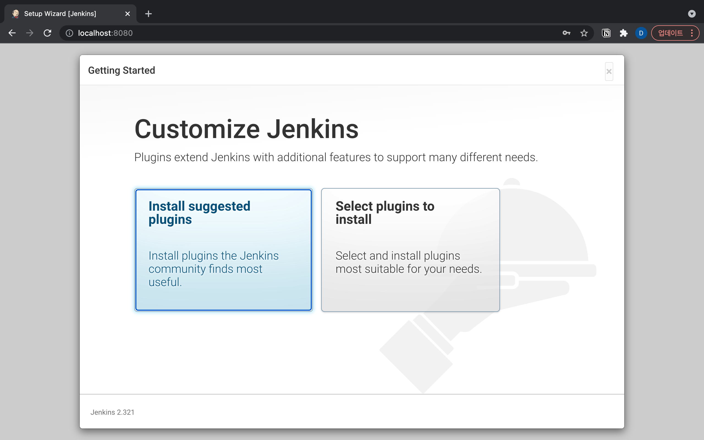
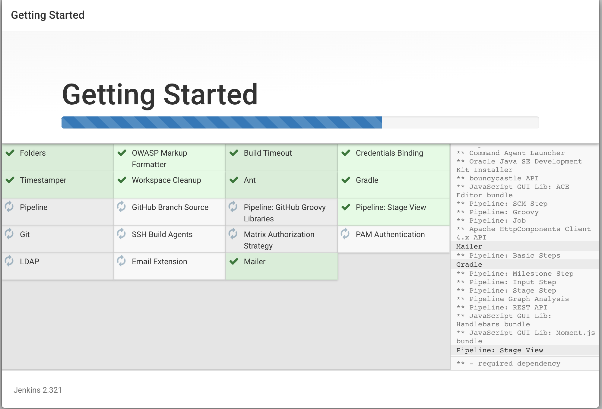
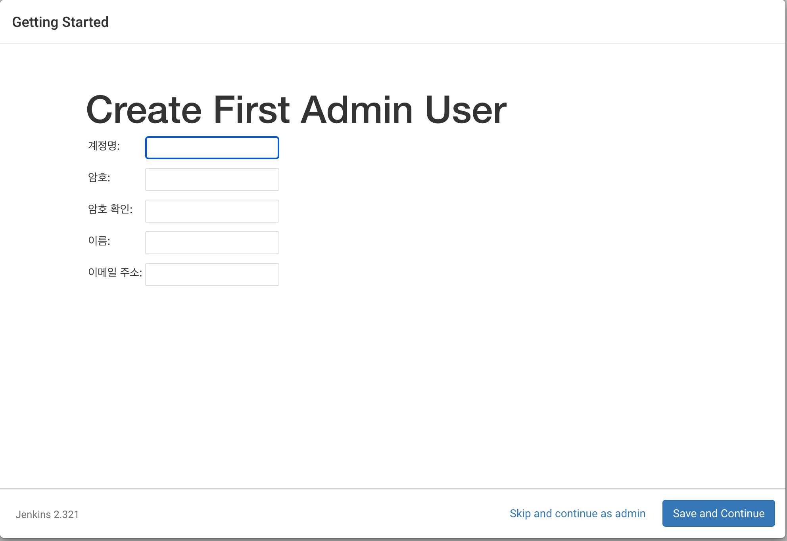
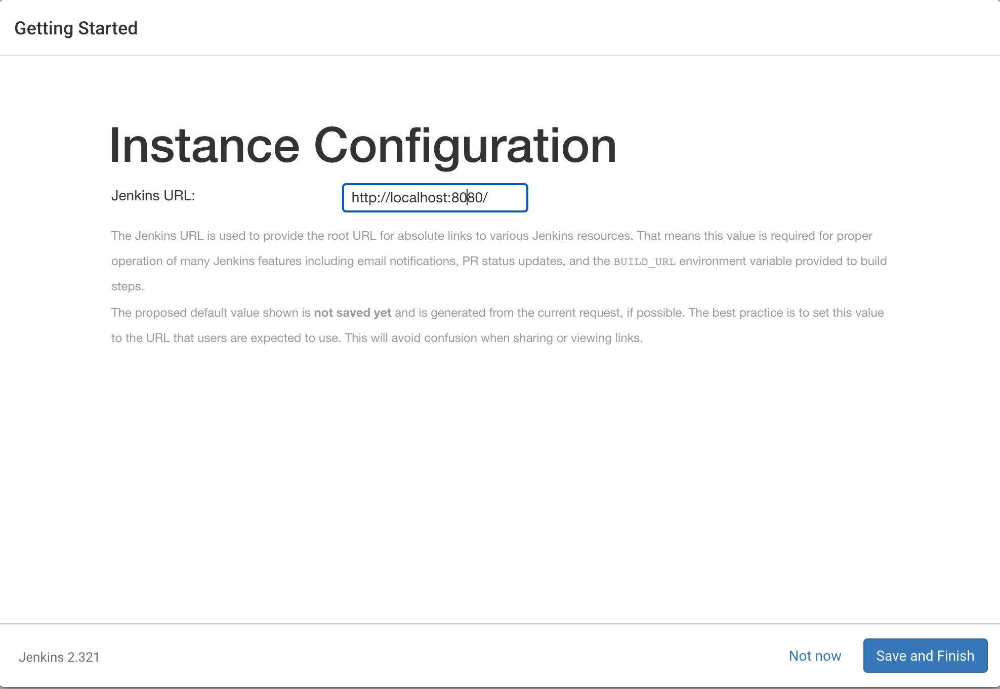
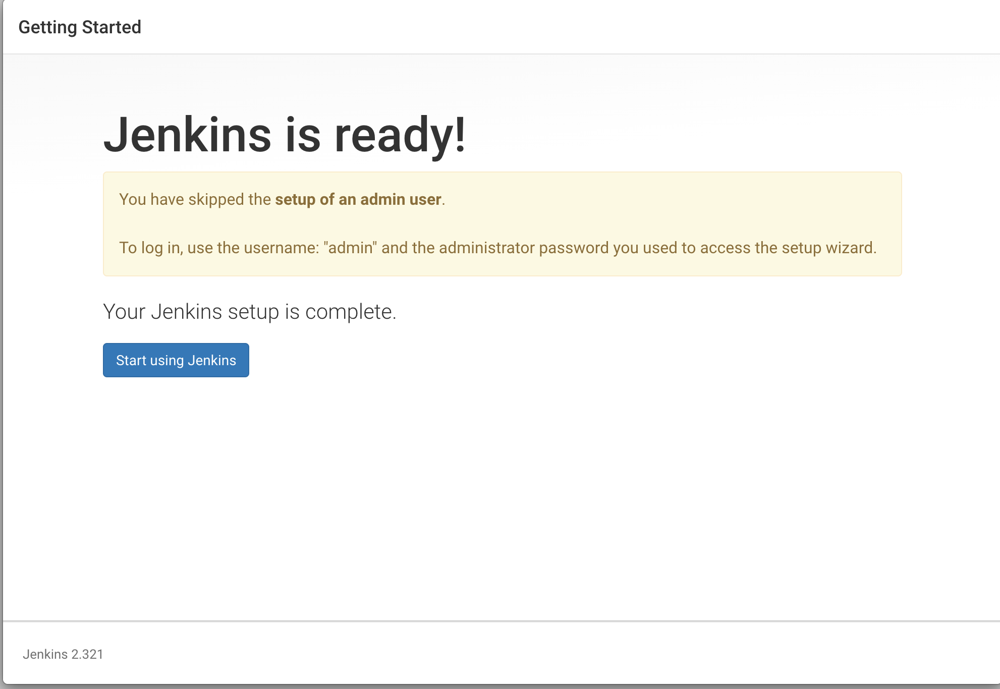
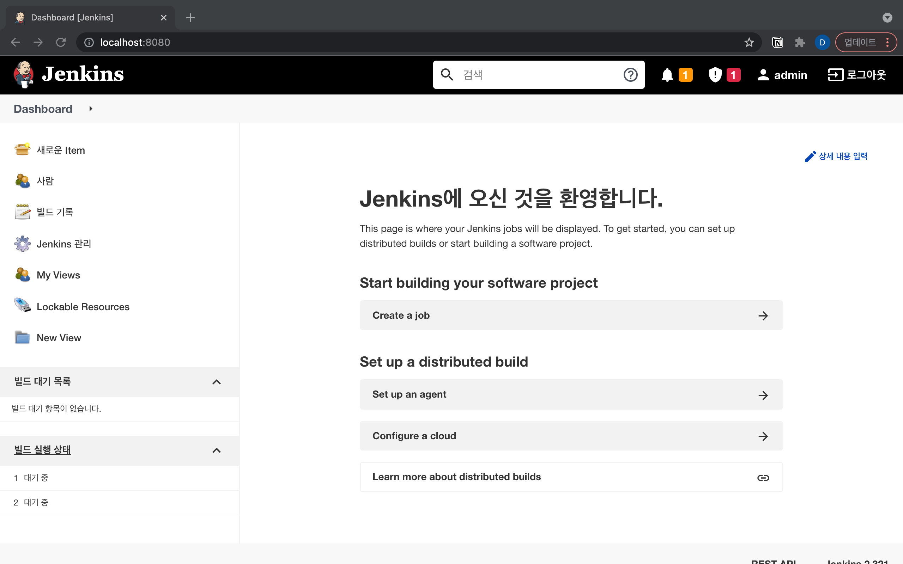

# Jenkins 로컬 환경 설정하기

## homebrew

### 설치하기

```bash
$ brew install jenkins
```

```
Updating Homebrew...
==> Auto-updated Homebrew!
Updated 3 taps (homebrew/cask-versions, homebrew/core and homebrew/cask).
==> New Formulae
cava
==> Updated Formulae
Updated 71 formulae.
==> Updated Casks
Updated 33 casks.

==> Downloading https://ghcr.io/v2/homebrew/core/jenkins/manifests/2.321
######################################################################## 100.0%
==> Downloading https://ghcr.io/v2/homebrew/core/jenkins/blobs/sha256:db3a6fba65069c5e9be3
==> Downloading from https://pkg-containers.githubusercontent.com/ghcr1/blobs/sha256:db3a6
######################################################################## 100.0%
==> Pouring jenkins--2.321.all.bottle.tar.gz
==> Caveats
Note: When using launchctl the port will be 8080.

To restart jenkins after an upgrade:
  brew services restart jenkins
Or, if you don't want/need a background service you can just run:
  /usr/local/opt/openjdk@11/bin/java -Dmail.smtp.starttls.enable=true -jar /usr/local/opt/jenkins/libexec/jenkins.war --httpListenAddress=127.0.0.1 --httpPort=8080
==> Summary
🍺  /usr/local/Cellar/jenkins/2.321: 8 files, 73.5MB
```

### 젠킨스 실행하기

```bash
$ brew services start jenkins
==> Successfully started `jenkins` (label: homebrew.mxcl.jenkins)
```

실행이 성공적으로 되고 나면, [http://localhost:8080](http://localhost:8080) 을 실행하면 젠킨스 웹 페이지가 나온다.



최초 실행시 관리자 비밀번호를 입력하라고 알려주며, 빨강색 경로의 파일에 비밀번호를 입력하면된다.



관리자 비밀번호를 입력하고 나면, 플러그인 설치 관련해서 나오며, 일반적인 설치를 위해 `Install suggested plugins`를 선택했다.



해당 플러그인이 모두 설치되고 나면, 어드민 계정 생성 화면이 나온다.



별도 생성없이 skip하고 넘어가게되면, URL 설정하는 부분이 나오며, 각자 맞게 설정해주면된다.





설정이 완료되고나서 `Start using Jenkins` 버튼을 클릭하면 welcome 페이지로 연결된다.



### 종료하기

```bash
$ brew services stop jenkins
Stopping `jenkins`... (might take a while)
==> Successfully stopped `jenkins` (label: homebrew.mxcl.jenkins)
```

