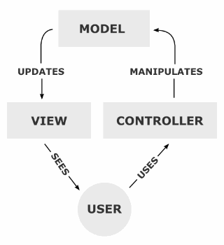

#  장고에 대해서

## Django란 무엇일까?

**장고(Django)**는 파이썬으로 작성된 오픈 소스 웹 애플리케이션 프레임워크로, MVC(모델 - 뷰 - 컨트롤러) 패턴을 따르고 있다.

### 웹 프레임워크(web framework)

>  웹 페이지를 개발하는 과정에서 겪는 어려움을 줄이는 것이 주 목적으로 통상 데이터베이스 연동, 템플릿 형태의 표준, 세션 관리, 코드 재사용 등의 기능을 포함하고 있다. -위키백과

즉, 프로그램 개발의 다양한 기능들을 통합적으로 제공해주는 것이다.

### MVC 패턴

MVC 패턴은 Model - View - Controller의 약자로 기능을 나눈 소프트웨어 개발 방법론이다.

- **M**odel : 모델은 어떤 동작을 수행하는 코드를 말한다. 어플리케이션이 **"무엇"** 을 할지 결정한다. 모델의 상태에 변화가 있을 때 컨트롤러와 뷰에 이를 통보한다. 
- **V**iew : 사용자가 **볼** 결과물을 생성하기 위해 모델로부터 정보를 얻어 온다.
- **C**ontroller : 모델에 명령을 보냄으로써 모델의 상태를 변경할 수 있다. 즉, 모델이 **"어떻게"** 처리할지 알려준다.

비지니스 로직과 인터페이스 요소를 분리시켜 서로 영향없이 개발할 수 있는 장점이 있다.

#### 장고 MTV 패턴

장고에서는 MVC기반의 MTV을 사용한다.

- Model - Model
- **View - Template** 
- **Controller - View**

Django는 Model - Template - View 로 이루어져있다. Django는 Controller 역할을 장고 프레임워크 자체에서 한다고 보고 있으며, MVC(Model - VIew - Controller)와 다른 차이를 MTV 패턴으로 설명하고 있다.

<h3 id="orm"> 객체 관계 매핑 ORM</h3>

 ORM은 **O**bject **R**elational **M**apping의 줄임말로, 객체(OOP)와 관계(관계형 데이터베이스)와의 설정이다. 

사용하는 Database 및 DB Connector 에 따라 달라질 수 있는 데이터 매핑 구조를 객체지향형태로 통일시켜, SQL 구조의 Database를 OOP 구조의 형태로 매핑시키려는 패러다임이다.

1. 객체와 관계형 데이터베이스의 데이터를 **자동으로 연결해주는 것**이다.
   - 객체 모델(클래스), 관계형 모델(테이블) 간의 불일치를 ORM을 통해 해결할 수 있다.
2. 객체를 통해 간접적으로 데이터베이스 데이터를 다룬다.

#### 장점

1. 객체 지향적인 코드로 더 **비즈니스 로직에 집중** 할 수 있다.
2. **재사용 및 유지보수**의 편리성이 증가
3. **DBMS에 대한 종속성 감소**

#### 단점

1. ORM으로만 서비스를 구현하기 어렵다.
2. 프로시저가 많은 시스템에서는 ORM의 객체 지향적인 장점을 활용하기 어렵다.

장고는 ORM기법에 따라 테이블을 하나의 클래스로 정의하고, 테이블의 컬럼은 클래스의 변수로 매핑한다.

### 우아한 URL 설계

장고에서는 우아한 URL 방식을 채택하여 URL을 직관적이고 쉽게 표현할 수 있다. 또한 정규 표현식을 사용하여 복잡한 URL도 표현할 수 있으며, 각 URL 형태를 파이썬 함수에 1:1로 연결할 수 있도록 되어있어 개발이 편리하며, 이해하기도 쉽다.

### 관리자 웹 인터페이스 제공

사용자관리, 사용자 그룹관리, 사용자 별 권한에 대한 것 뿐 아니라, 각각의 모델 객체에 대해서, 목록/추가/삭제/변경의 기능이 관리자 인터페이스에서 모두 제공한다. 데이터베이스, 웹 어플리케이션을 실험적으로 작성하기 좋다. 

### 자체 템플릿 시스템

 장고는 내부적으로 확장이 가능하고 디자인이 쉬운 강력한 템플릿 시스템을 갖고 있다. 이를 통해 화면 디자인과 로직에 대한 코딩을 분리하여 독립적으로 개발을 진행할 수 있다.( HTML과 같은 텍스트 언어를 쉽게 다룰 수 있다.) 

### 캐시 시스템

  장고의 캐시 시스템은 캐시용 페이지를 메모리, 데이터베이스 내부, 파일 시스템 중 아무 곳에나 저장할 수 있다. 또한 캐시 단위를 페이지에서부터 사이트 전체 또는 특정 뷰의 결과, 템플릿의 일부 영역만을 지정하여 저장해 둘 수도 있다.

#### 캐시를 사용하는 이유

  동적인 페이지를 만들기 위해서 데이터베이스 쿼리를 수행하고 템플릿을 해석하며, 관련 로직을 실행하서 페이지를 생성하는 일은 서버에 엄청난 부하를 주는 작업이다. 그래서 캐시 시스템을 사용하여 자주 이용되는 내용을 저장해 두었다가 재사용하는 것이 성능을 높여주는 방법이다.

### 다국어 지원

  장고는 동일한 소스코드를 다른 나라에서도 사용할 수 있도록 텍스트의 번역, 날짜/시간/숫자의 포맷, 타임존의 지정 등과 같은 다국어 환경을 제공한다. 

### 풍부한 개발 환경

 장고는 개발에 도움이 될 수 있는 여러 기능을 제공한다. 대표적으로 **테스트용 웹 서버**를 포함하고 있어서 개발 과정에서 아파치 등의 사용 웹 서버가 없어도 테스트를 진행할 수 있다. 또한 디버깅 모드를 사용할 경우에는 에러를 쉽게 파악하고 해결할 수 있도록 아주 상세한 메시지를 보여준다.

### 소스 변경사항 자동 반영

  장고에서는 `*.py` 파일의 변경 여부를 감시하고 있다가 변경이 되면 실행 파일에 변경 내역을 바로 반영한다. 그래서 장고 테스트용 웹 서버를 실행 중인 상태에서 소스 파일을 수정할 경우에도 웹 서버를 다시 시작할 필요 없이 자동으로 새로운 파일이 반영된다.

### Django 장단점

#### 장점

1. 비교적 쉽게 배울 수 있는 Python을 기반으로 한다.
2. 익히기 쉬운 만큼 개발속도가 빠르며, 코드 완성도를 높게 유지할 수 있다.
3. 웹 애플리케이션이 제공되어야하는 사용자 인증, 사용자 관리 등을 기본적으로 기능 구현이 되어 있다.(기본 모듈로 제공된다.)
4. 성공적인 도입 사례가 있다.(ex)Instagram
5. AWS, Google Cloud, Azure등에서 전폭적으로 초기 단계부터 지원한 프레임워크이다.
   - 개발 비용을 크게 절감시킬 수 있다.

#### 단점

1. 한글 문서가 많지않다.
2. typeless 언어의 약점은 그대로 보유하고 있다.
3. 서비스 성능은 다른 언어의 프레임워크(java, js) 보다 느리다.

## 참조 페이지

- [mvc 패턴](https://medium.com/@jang.wangsu/%EB%94%94%EC%9E%90%EC%9D%B8%ED%8C%A8%ED%84%B4-mvc-%ED%8C%A8%ED%84%B4%EC%9D%B4%EB%9E%80-1d74fac6e256)
- [ORM-(1)](https://jins-dev.tistory.com/entry/ORMObject-Relational-Mapping%EC%9D%B4%EB%9E%80-ORM-%ED%8C%A8%EB%9F%AC%EB%8B%A4%EC%9E%84%EC%9D%98-%EA%B0%9C%EB%85%90)
- [ORM-(2) ](https://gmlwjd9405.github.io/2019/02/01/orm.html)
- [django 특징](https://unifox.tistory.com/4)

