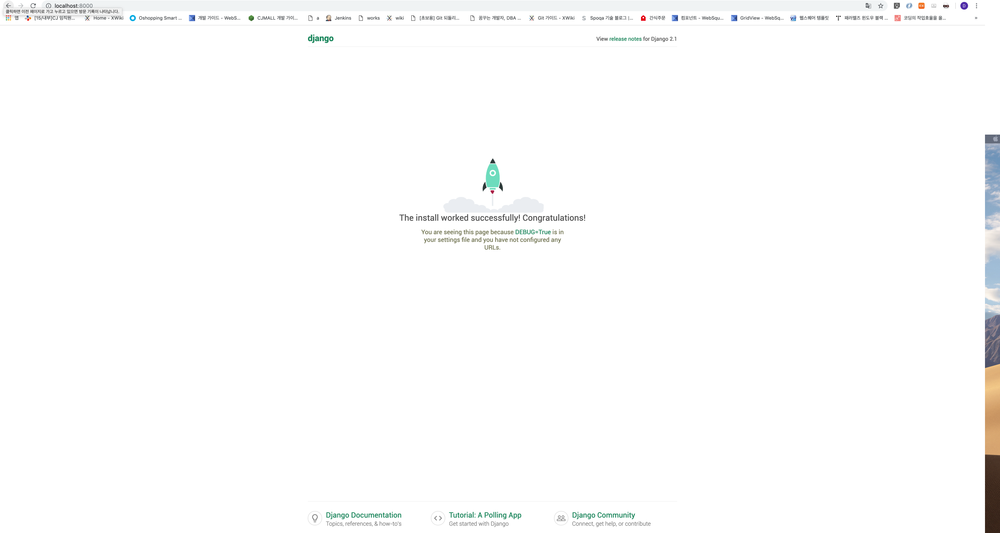

# Django 시작하기

## 프로젝트 만들기

```zsh
$ django-admin startproject <project_name>
```

이때 project명으로 설정 패키지 명이 결정되므로 startproject에 전달되는 프로젝트명으로 config를 사용할 것이다.

```bash
$ django-admin startproject config
```

프로젝트 생성후에는 폴더명을 프로젝트 명으로 변경해준다.

```bash
$ mv config <project_name>
```

### 기본 디렉토리 및 파일 구조

현재 디렉토리에 `<project_name>` 디렉토리와 아래의 파일들이 생성된다.

```
project_name/
├── db.sqlite3
├── manage.py
└── config
    ├── __init__.py
    ├── settings.py
    ├── urls.py
    └── wsgi.py
```

- `manage.py` : 사이트 관리를 도와주는 역할을 하는 스크립트이다. 다른 컴퓨터에서 다른 설치 작업없이 웹 서버를 시작할 수 있다.(추후에 관련 정보 update)
- `config/` : 디렉토리 내부에 프로젝트를 위한 실제 python 패키지들이 저장된다.
  - `config.urls` , `config.settings` 다음과 같이 프로젝트 내부 어디에서나 접근(import)할 수 있다.
- `config/__init__.py` : 해당 디렉토리가 패키지의 일부임을 알려주는 역할을 한다.

> python version 3.3 부터는 `__init__.py` 가 없어도 패키지로 인식이되지만, 하위 버전과 호환을 위해 생성하는 것이 안전하다.

- `config/settings.py` : 현재 Django 프로젝트의 환경/구성을 저장한다.(추후에 관련 정보 update)
- `config/urls.py` : 현재 Django 프로젝트의 URL선언을 저장한다. `urlresolver`가 사용하는 패턴 목록을 포함한다.(추후에 관련 정보 update)
- `config/wsgi.py` : 현재 프로젝트를 서비스하기 위한 WSGI config 설정파일이다.

> WSGI(Web Server Gateway Interface)
>
> 웹서버와 파이썬 웹 애플리케이션 개발환경 간의 인터페이스에 대한 규칙이다.

여기서 설치된 pip 패키지 목록을 `requirements.txt` 로 남겨두어 관리하는 것이 좋다.

```bash
$ pip freeze > requirements.txt
```

```
project
├── project_name
│   ├── config														# 장고프로젝트 설정 패키지
│   │   ├── __init__.py
│   │   ├── settings.py
│   │   ├── urls.py
│   │   └── wsgi.py
│   ├── db.sqlite3
│   └── manage.py
└── requirements.txt												# 설치할 pip 패키지 목록 파일
```

## 프로젝트 서버

### 서버 시작하기

```bash
$ python manage.py runserver
Performing system checks...

System check identified no issues (0 silenced).
March 05, 2019 - 16:21:39
Django version 2.1.7, using settings 'mysite.settings'
Starting development server at http://127.0.0.1:8000/
Quit the server with CONTROL-C.
```

runserver를 성공하면 `http://localhost:8000/` 또는 `http://127.0.0.1:8000/` 로 확인 할 수 있다.



#### 특정 포트로 서버 시작하기

```bash
$ python manage.py runserver 8080
```

### 서버 실행 종료하기

`control` + `C` 를 하면 종료된다. 

## 프로젝트 설정(settings.py)

### Timezone 설정

정확한 시간 설정을 위해서 [wiki timezone](https://en.wikipedia.org/wiki/List_of_tz_database_time_zones) 에서 찾아서 설정해준다.

```python
LANGUAGE_CODE = 'ko'
TIME_ZONE = 'Asia/Seoul'
```

### STATIC_ROOT 설정

```python
STATIC_URL = '/static/'
STATIC_ROOT = os.path.join(BASE_DIR, 'static')
```

`STATIC_URL` 설정 밑에 경로를 설정해준다.

### ALLOWED_HOSTS

```python
DEBUG = True
ALLOWED_HOSTS = []
```

다음과 같이 설정이 되어있을때는 `['localhost', '127.0.0.1', '[::1]']` 에 대해서 유효하다.

### INSTALLED_APPS

```python
INSTALLED_APPS = [
    'django.contrib.admin',
    'django.contrib.auth',
    'django.contrib.contenttypes',
    'django.contrib.sessions',
    'django.contrib.messages',
    'django.contrib.staticfiles',
]
```

- `django.contrib.admin` : 관리용 사이트
- `django.contrib.auth` : 인증 시스템
- `django.contrib.contenttypes` : 컨텐츠 타입을 위한 프레임 워크
- `django.contrib.sessions` : 세션 프레임워크
- `django.contrib.messages` : messaging 프레임워크
- `django.contrib.staticfiles` : 정적파일을 관리하는 프레임워크

## 데이터베이스

### migration

**migrate** 명령은 `settings.py` 의 **INSTALLED_APPS** 설정을 탐색하여, 데이터베이스 migrations에 따라 필요한 데이터베이스 테이블을 생성한다.

```bash
$ python manage.py migrate
Operations to perform:
  Apply all migrations: admin, auth, contenttypes, sessions
Running migrations:
  Applying contenttypes.0001_initial... OK
  Applying auth.0001_initial... OK
  Applying admin.0001_initial... OK
  Applying admin.0002_logentry_remove_auto_add... OK
  Applying admin.0003_logentry_add_action_flag_choices... OK
  Applying contenttypes.0002_remove_content_type_name... OK
  Applying auth.0002_alter_permission_name_max_length... OK
  Applying auth.0003_alter_user_email_max_length... OK
  Applying auth.0004_alter_user_username_opts... OK
  Applying auth.0005_alter_user_last_login_null... OK
  Applying auth.0006_require_contenttypes_0002... OK
  Applying auth.0007_alter_validators_add_error_messages... OK
  Applying auth.0008_alter_user_username_max_length... OK
  Applying auth.0009_alter_user_last_name_max_length... OK
  Applying sessions.0001_initial... OK

```
migrate하기 전에 불필요한 애플리케이션(INSTALLED_APPS)은 주석처리 또는 삭제해주면 생성되지않는다.

<h3 id="sqlite3error">ModuleNotFoundError</h3>
```python
....
  File "/Users/jeongdaye/.pyenv/versions/3.7.2/lib/python3.7/sqlite3/dbapi2.py", line 27, in <module>
    from _sqlite3 import *
ModuleNotFoundError: No module named '_sqlite3'
```

Migrate 실행시 다음과 같은 오류가 발생할 수 있다. 이러한 경우에는

```bash
$ CFLAGS="-I$(xcrun --show-sdk-path)/usr/include" pyenv install <version>
$ CFLAGS="-I$(xcrun --show-sdk-path)/usr/include" pyenv install 3.7.2
```

자기가 설정한 python version으로 다음 명령어를 실행해주면 된다.

## git 버전 관리

git으로 버전 관리시 git으로 관리되지 않을 파일 목록인 `.gitignore` 파일을 생성해 관리한다. 일반적으로 Django 프로젝트에서 사용하는 파일을 wget으로 사용해 웹에서 복사해와 사용할 것이다.

```bash
$ wget https://gist.githubusercontent.com/LeeHanYeong/8758517113be32dd2e885fef81c4a96e/raw/00727ac4af42834e6282df05c61606aa396d5b9c/.gitignore
```

## 참조페이지

- [`__init__.py` 란?](https://wikidocs.net/1418#9595init9595py)

- [WSGI란?](https://juliahwang.kr/network/2017/09/17/WSGI%EB%9E%80%EB%AC%B4%EC%97%87%EC%9D%B8%EA%B0%80.html)

- [ModuleNotFoundError](https://www.reddit.com/r/Python/comments/9tr1yd/cant_find_sqlite3_module_when_import_it_using/)

- [PyCharm과 pyenv를 사용한 Django 개발 환경 설정](https://lhy.kr/pyenv-python-development-environment-setting)

  