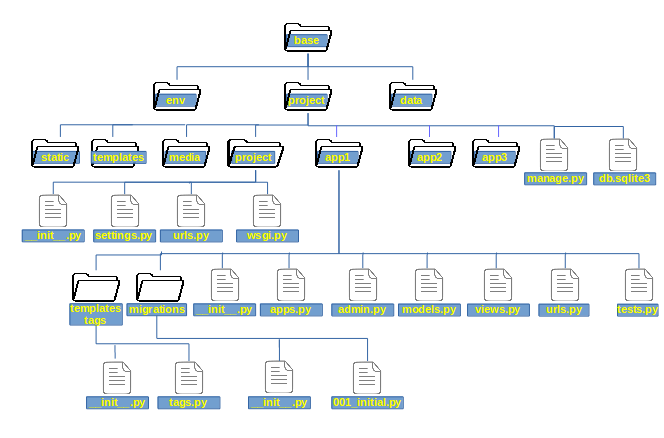

# Django App

## App 이란?



Django App은 Django에서 사용하는 **파이썬 패키지**이다. Django App은 자신의 모델, 뷰, 템플릿, URL 등을 독자적으로 가지고 있다. **App은 특정한 기능을 수행하는 웹 어플리케이션**을 말한다. **프로젝트는 이러한 app들과 각 설정을 모아둔 것**이다. 하나의 Django 프로젝트는 다수의 app을 포함할 수 있고, app은 다수의 project에 포함될 수 있다.

## App 생성하기

`manage.py` 파일이 있는 디렉토리에서 명령을 실행한다.

```bash
$ python ./manage.py startapp <app_name>
$ ./manage.py startapp <app_name>
```

### App 기본 디렉토리, 파일 구조

```
├── db.sqlite3
├── manage.py
├── mysite
│   ├── __init__.py
│   ├── settings.py
│   ├── urls.py
│   └── wsgi.py
└── app
    ├── __init__.py
    ├── admin.py
    ├── apps.py
    ├── migrations
    │   └── __init__.py
    ├── models.py
    ├── tests.py
    └── views.py
```

애플리케이션을 생성한 후에 `mysite/settings.py` 파일을 수정해 줘야한다.

### settings.py

```python
INSTALLED_APPS = [
    'django.contrib.admin',
    'django.contrib.auth',
    'django.contrib.contenttypes',
    'django.contrib.sessions',
    'django.contrib.messages',
    'django.contrib.staticfiles',
    'app',
]
```

생성한 app을 `INSTALLED_APPS`에 추가해준다.
