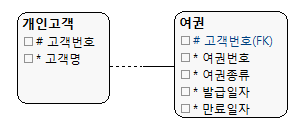
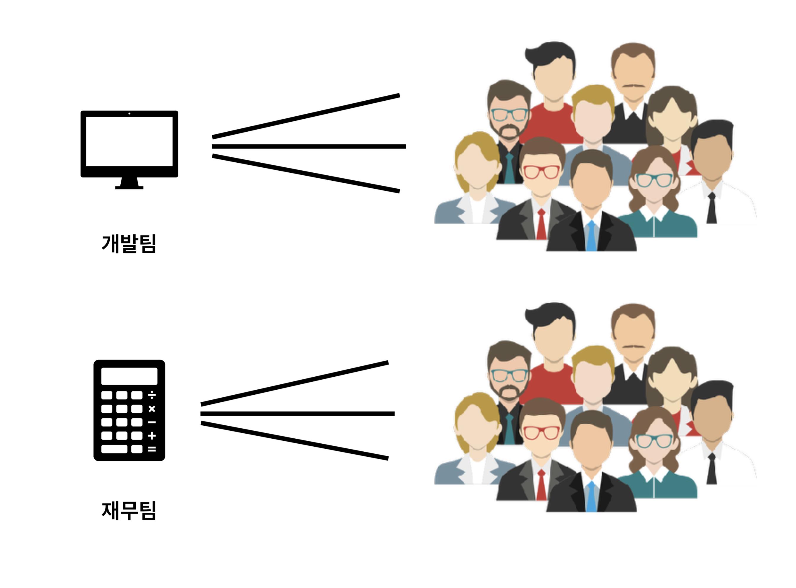

# Model

장고는 <a href="./2019-03-01-about.md/#orm">ORM</a>기법에 따라 테이블을 하나의 클래스로 정의하고, 테이블의 컬럼은 클래스의 변수로 매핑한다.

## 데이터베이스 설정

```python
# settings.py
# Database
# https://docs.djangoproject.com/en/2.1/ref/settings/#databases

DATABASES = {
    'default': {
        'ENGINE': 'django.db.backends.postgresql',
        'NAME': 'mydatabase',
        'USER': 'mydatabaseuser',
        'PASSWORD': 'mypassword',
        'HOST': '127.0.0.1',
        'PORT': '5432',
    }
}
```

기본적으로 sqlite3를 사용하고 있다. 만약에 다른 데이터베이스를 사용하고 싶다면 ENGINE의 뒷부분을 수정하면된다.

#### ENGINE

- `django.db.backends.mysql`
- `django.db.backends.oracle`
- `django.db.backends.postgresql`
- `django.db.backends.sqlite3`

#### NAME

여기서 name은 프로젝트 저장될 파일 명이다.

#### 사용자 설정

SQLite 를 데이터베이스로 사용하지 않는 경우 USER, PASSWORD, HOST를 추가 설정하여 사용할 수 있다.

[>> mysql 연동하기](./2019-03-16-mysql.md)

#### [공식문서 참조하기](https://docs.djangoproject.com/ko/2.1/ref/settings/#databases)

## 모델 만들기

각 모델은 `Django.db.models.Model` 클래스의 서브클래스로 표현된다. 각각의 모델은 여러개의 클래스 변수(모델의 데이터베이스 필드)를 가지고 있다.

```python
from django.db import models

class 모델명(models.Model):
	# 모델의 속성 지정하기
```

models는 생성한 모델이 장고 모델임을 의미한다. 장고는 생성된 model이 데이터베이스에 저장되어야한다고 알게된다. 

아래에서 간단한 예시를 살펴보자.

```python
from django.db import models

class Question(models.Model):
	question_text = models.CharField(max_length=200)
	pub_date = models.DateTimeField('date published')

class Choice(models.Model):
	question = models.ForeignKey(Question, on_delete=models.CASCADE)
	choice_text = models.CharField(max_length=200)
	votes = models.IntegerField(default=0)
```

설문조사 애플리케이션에 Question과 Choice 두개의 모델을 생성해보자. 이때 두개의 모델은 연관되어 있다.

### 속성(Field)

모델은 여러개의 속성을 가지고 있다. 속성을 정의하기 위해서는 각 필드마다 어떤 종류의 데이터 타입(텍스트, 숫자, 날짜, 다른 객체 참조 등)을 가지는지를 정해야한다. 

각 속성은 `Field` 클래스의 인스턴스로 표현된다.

| Field                                                        | 설명                                                         |
| ------------------------------------------------------------ | ------------------------------------------------------------ |
| AutoField(**options)                                         | id로 사용 가능한 자동으로 증가하는 IntegerField이다. 모델의 기본키 필드를 별도로 지정하지 않으면 자동으로 추가된다. |
| BooleanField(**options)                                      | true / false 필드이다. null값 허용이 필요하다면 **NullBooleanField** 를 사용하면된다. **Default 옵션을 정의하지 않으면 기본값은 None**이다. |
| CharField(max_length=None,**options)                         | 글자수가 제한된 텍스트를 정의<br>제목과 같이 짧은 문자열 정보를 저장할 때 사용한다.<br>`max_length` 필드의 최대길이는 필수 옵션이다. |
| DecimalField(max_digit=None, decimal_palces=None, **options) | 고정 소수로 Python의 Decimal 인스턴스로 나타난다.<br>`max_digits` 숫자에 허용되는 최대 자릿수이다.<br>`decimal_palces` 숫자와 함께 저장될 소수 자릿수이다.<br>DecimalField(…, max_digits=5, decimal_palces=2)  는 최대 999 소수점 2자리 이하이다. |
| IntegerField(**options)                                      | 정수 값                                                      |
| TextField(**options)                                         | 글자 수에 제한이 없는 긴 텍스트를 표현한다.                  |
| DateTimeField(auto_now=False, auto_now_add=False,**options)  | 날짜와 시간을 정의한다.<br>`auto_now` 는 객체가 저장될 때마다 매번 자동으로 현재시간이 설정된다.( 최근 수정 등 timestamp로써 유용하다.) `Model.save`가 호출될 때 자동으로 수정된다.<br> `auto_now_add` 객체가 처음 생성될 때 자동으로 현재시간이 설정된다. (생성의 timestamp로 유용) 만약 수정을 원한다면 `default=today` or `default=tiemzone.now` 를 사용하면된다. <br> 이 3개의 옵션은 같이 쓸 수 없으며, 만약 auto 옵션을 True로 설정하면 editable=False, blank=True 로 설정된다. |
| ForeignKey(**options)                                        | 다른 모델 참조키이다. <br> `models.ForeignKey(Question, on_delete=models.CASCADE)` 에서는 각각의 Choice가 하나의 Question에 관계된다는 것을 알려준다. |
| FilePathField(path=None, match=None, recursive=False, max_length=100, **options) | 파일 시스템에서 특정한 디렉터리에 파일이름으로 제한된다.<br> `path` 는 필수 인수로 절대 파일 시스템 경로이다.(`/home/images`)<br>`match` : 선택적 인수로 파일 이름을 필터링할 때 사용할 문자열로 된 정규표현식이다. 기본파일 이름에 적용된다. (`foo.*\.txt$`)<br>`recursive` : 선택적 인수로 path의 모든 서브 디렉터리가 포함되야하는지 여부를 지정(true/false)<br>`allow_files` or `allow_folders` : 선택적 인수로 지정된 위치에 파일 or 폴더를 포함할지 여부를 지정한다(true/false). 둘 중 한개는 반드시 True여야한다. |

## 모델 관계

### One-to-One

한 테이블의 하나의 레코드가 다른 테이블의 단 하나의 레코드만을 참조할 때, 이 두 모델간의 관계를 일대일 관계라고 한다. 



위와 같이 개인 고객 한명당 여권은 한개 있을 수 있다.

#### OneToOneField

`OneToOneField`는 `ForeignKey` 필드에 `unique=Ture` 옵션을 준 것과 동일하게 동작한다. 즉, ForeignKye 값이 반드시 고유한 값이어야한다.

```python
class 모델명(modesl.Model):
  필드명 = models.OneToOneField(관계대상모델)
```

예시를 살펴보면 다음과 같다.

```python
class Customer(models.Model):
  name = models.CharField(max_length=30)
  address = models.CharField(max_length=100)
  
class Passport(models.Model):
  custom = models.OneToOneField(Customer)
  passportNo = models.CharField(max_length=15)
```

일대일 관계에서 한 모델이 다른 모델을 참조하는 방법이다.

```python
obj = Passport.objects.first()
obj.custom
```


### Many-to-One

한 테이블에 있는 두 개 이상의 레코드가 다른 테이블에 있는 하나의 레코드를 참조하는 경우이다.



```python
class 모델명(models.Model):
  필드명 = models.ForeignKey(연결상대모델, on_delete=삭제옵션)
```

다음과 같이 ForeignKey를 이용해서 다대일 관계를 설정할 수 있다. 한 고객이 주문을 여러개 할 수 있는 경우에 대해서 살펴보자

```python
class Customer(models.Model):
  name = models.CharField(max_length=50)
  
class Order(models.Model):
  customer = models.ForeignKey(Customer, on_delete=models.CASCADE)
  product = models.CharField(max_length=50)
```

> 여기서 ForeignKey의 필드명을 자유롭게 할 수 있지만 연결대상 모델의 소문자로 정하는 것을 권장한다.

#### on_delete

| 옵션        | 설명                                                         |
| ----------- | ------------------------------------------------------------ |
| CASCADE     | 레코드가 삭제되면, 그 레코드를 외래키로 참조하고 있는 모든 레코드를 함께 삭제한다.(default) |
| PROTECT     | 외래키가 참조하고 있는 레코드를 삭제하지 못하게 만든다. 삭제를 시도하는 경우 **ProtectedError**가 발생한다. |
| SET_NULL    | 외래키가 참조하고 있는 레코드가 삭제되면, 외래키 필드 값이 `null` 값이 된다. 이때 외래키 필드에 `null=True` 옵션이 있을 때만 가능하다. |
| SET_DEFAULT | 외래키가 참조하고 있는 레코드가 삭제되면, 외래키 필드의 값이 기본값으로 바뀐다. (`default` 옵션이 설정되어 있을 때만 가능하다.) |
| SET()       | `SET()` 함수에 값이나 호출가능한 객체를 전달할 수 있다. 외래키가 참조하는 레코드가 삭제되면 전달된 값 또는 객체를 호출한 결과로 외래키를 채운다. |

#### 재귀적 관계(Recursive)

한 테이블의 레코드들이 같은 테이블의 다른 레코드들과 관계를 형성하는 것을 말한다.

예를 들자면, 같은 스터디에서 한명이 다른 스터디원을 관리하는 경우를 예로 들수있다.

| ID   | Name          | Tutor_ID |
| ---- | ------------- | -------- |
| 1    | Joe Satriani  | 1        |
| 2    | John Petrucci | 1        |
| 3    | Steve Vai     | 1        |

```python
class StudyGroup(models.Model):
  name = models.CharField(max_length=30)
  tutor = models.ForiegnKey('self', on_delete=models.SET_NULL)
```

다음과 같이 `'self'` 를 전달하여 설정할 수 있다.

#### 정의되지 않은 테이블과의 관계

모델을 생성할 때 아직 정의되지 않은 테이블과의 관계를 설정해야하는 경우에는 `'모델명'` 을 전달하면된다.

```python
class Order(models.Model):
  customer = models.ForeignKey('Cusotmer', on_delete=models.CASCADE)
  product = models.CharField(max_length=50)
  
class Customer(models.Model):
  name = models.CharField(max_length=50)
```

### Many-to-Many

하나의 테이블의 하나 이상의 레코드가 다른 테이블의 하나 이상의 레코드를 참조하는 경우이다. 다대다 관계를 표현할 때, 두 테이블 사이의 관계를 표현하기 위해 참조 정보를 담은 **새로운 테이블(중개모델)**을 생성하게 된다. 


```python
class 모델명(models.Model):
  필드명 = models.ManyToManyField(연결대상모델)
```

`ManyToManyField`를이용해서 설정할 수 있다.

```python
class Topping(models.Model):
  name = models.CharField(max_length=10)

class Pizza(models.Model):
  name = models.CharField(max_length=10)
  toppings = models.ManyToManyField(Topping)
```

> **ManyToManyField**
>
> 다대다 관계의 필드명은 복수형으로 설정하는 것을 권장한다.
>
> 서로 관계된 모델들 중 어느 곳에 ModelToManyField를 선언하든 상관 없지만 **한 모델에만 선언**해야하며, 의미가 자연스로운 곳에 선언해주는 것을 권장한다.

#### 중개모델(Intermediary Model)

두 테이블의 다대다 관계를 나타내주는 모델이다. 두 모델의 외래키를 필드로 가지고 있다. `ManyToManyField` 로 관계설정하면 자동으로 생성되지만 직접 생성할 수도 있다.

##### - **though**

```python
class 모델명(models.Model):
  필드명 = models.ManyToManyField(연결대상모델, through='중개모델')
```

```python
class Artist(models.Model):
    name = models.CharField(max_length=50)


class Band(models.Model):
    name = models.CharField(max_length=50)
    members = models.ManyToManyField(Artist, through='Membership')


class Membership(models.Model):
    artist = models.ForignKey(Artist, on_delete=models.CASCADE)
    band = models.ForignKey(Band, on_delete=models.CASCADE)
    is_founding_member = models.BooleanField()
```

##### - **through_field**

중개 모델을 직접 생성하는 경우에 두 테이블을 참조하는 외래키 필드를 명확히 선언해야한다.

- **소스모델(Source Model)** : `ManyToManyField`가 있는 모델을 말한다.
- **타겟모델(Target Model)** : `ManyToManyField`에 인자로 전달되는 모델을 말한다.

만약 중개 모델에서 하나 이상의 외래키 필드가 소스 모델 혹은 타겟 모델을 참조한다면, `through_field` 옵션을 통해 외래키 설정을 해줘야한다.

```python
class 타겟모델(models.Model):
  필드1
  필드2
  
class 소스모델(models.Model):
  필드명 = models.ManyToManyField(
    타겟모델,
    through=중개모델,
    through_fields=('소스필드','타겟필드',) # 반드시 소스필드 타겟필드 순으로 전달해야한다.
  )
  필드2
  
class 중개모델(models.Model):
  타겟필드 = models.ForeignKey(타겟모델)
  소스필드 = models.ForeignKey(소스모델)
  추가외래키필드 = models.ForeignKey(관계대상모델)
```

```python 
class Artist(models.Model):
    name = models.CharField(max_length=50)


class Band(models.Model):
    name = models.CharField(max_length=50)
    members = models.ManyToManyField(
        Artist, 
        through='Membership',
        through_fields=('band', 'artist',)
    )

class Membership(models.Model):
    artist = models.ForignKey(Artist, on_delete=models.CASCADE)
    band = models.ForignKey(Band, on_delete=models.CASCADE)
    inviter = models.ForignKey(Artist, on_delete=models.CASCADE)
```

#### 역참조

외래키 필드를 가진 소스모델에 연결된 타겟모델의 인스턴스들은 자신과 연결된 소스모델의 인스턴스를 가져올 수 있는 `Manager` 를 가지게된다. Manager는 `소스모델명_set` 의 형태로 생성된다. Reverse accessor는 관계를 역참조할 수 있는 이 Manger를 의미한다.

```python
# 소스모델 > 타겟모델 참조하기
o1 = Band.objects.get(id=1)
o1.artist.all()

# 타겟모델 > 소스모델 역참조하기
o2 = Artist.objects.get(id=1)
o2.band_set.all()

# 중개모델 > 타겟, 소스모델 참조
o3 = Membership.objects.first()
o3.artist
o3.band

# 타겟, 소스모델 > 중개모델 역참조
o4 = Artist.objects.get(id=1)
o4.membership_set.all()
```

##### - **related_name**

자동으로 생성되는 역참조 Manger이름을 `related_name` 옵션으로 바꿔줄 수 있다.

```python
class Membership(models.Model):
    artist = models.ForignKey(Artist, on_delete=models.CASCADE)
    band = models.ForignKey(Band, on_delete=models.CASCADE)
    inviter = models.ForignKey(
      Artist, 
      on_delete=models.CASCADE, 
      related_name='membership_inviter_set'
    )
```


## 모델 활성화

### makemigrations

`makemigartions` 명령어를 실행해 모델을 생성, 변경된 사항을 migration 으로 저장하는 명령어이다.

> **Migration**
>
> 모델의 변경사항을 저장하는 방법으로, 디스크상의 파일로 존재한다.

```bash
$ python manage.py makemigrations <app_name>
```
```bash
$ python manage.py makemigrations polls
Migrations for 'polls':
  polls/migrations/0001_initial.py
    - Create model Choice
    - Create model Question
    - Add field question to choice
```

생성된 migration들을 실행시켜주고, 자동으로 데이터베이스 스키마를 관리해주는 `migrate` 명령어가 있다.

### sqlmigrate

migration의 이름을 인수로 받아서 실행하는 SQL문을 볼 수 있다. 하지만 실제로 migration을 실행하지는 않는다. 단순히 결과만 출력할 뿐이다.

```bash
$ python manage.py sqlmigrate polls 0001
```

```sql
BEGIN;
--
-- Create model Choice
--
CREATE TABLE "polls_choice" ("id" integer NOT NULL PRIMARY KEY AUTOINCREMENT, "choice_text" varchar(200) NOT NULL, "votes" integer NOT NULL);
--
-- Create model Question
--
CREATE TABLE "polls_question" ("id" integer NOT NULL PRIMARY KEY AUTOINCREMENT, "question_text" varchar(200) NOT NULL, "pub_date" datetime NOT NULL);
--
-- Add field question to choice
--
ALTER TABLE "polls_choice" RENAME TO "polls_choice__old";
CREATE TABLE "polls_choice" ("id" integer NOT NULL PRIMARY KEY AUTOINCREMENT, "choice_text" varchar(200) NOT NULL, "votes" integer NOT NULL, "question_id" integer NOT NULL REFERENCES "polls_question" ("id") DEFERRABLE INITIALLY DEFERRED);
INSERT INTO "polls_choice" ("id", "choice_text", "votes", "question_id") SELECT "id", "choice_text", "votes", NULL FROM "polls_choice__old";
DROP TABLE "polls_choice__old";
CREATE INDEX "polls_choice_question_id_c5b4b260" ON "polls_choice" ("question_id");
COMMIT;

```

#### migrate

아직 적용되지 않은 모든 migration을 수집해 실행한다. `django_migrations` 테이블에 마이그레이션 적용 여부를 기록한다.

```bash
$ python manage.py migrate            
Operations to perform:
  Apply all migrations: admin, auth, contenttypes, polls, sessions
Running migrations:
  Applying polls.0001_initial... OK
```

## Python Shell로 모델 다뤄보기

### shell 실행하기

manage.py 를 통해서 shell을 실행하게 되면 Django에서 동작하는 모든 명령을 그대로 사용할 수 있다.

```bash
$ python manage.py shell
Python 3.7.2 (default, Mar  5 2019, 16:08:31) 
[Clang 10.0.0 (clang-1000.10.44.4)] on darwin
Type "help", "copyright", "credits" or "license" for more information.
(InteractiveConsole)
>>> 
```

### Imort Model

```python
>>> from polls.models import Choice, Question 
```

### 객체 조회하기

```python
>>> Question.objects.all()
<QuerySet [<Question: Question object (1)>]>
```
### \_\_str\_\_

```python
>>> Question.objects.all()
<QuerySet [<Question: Question object (1)>]>
```

다음과 같이 객체에 대한 설명을 `__str__()` 를 추가하여 바꿀 수 있다.

```python
from django.db import models

class Question(models.Model):
	question_text = models.CharField(max_length=200)
	pub_date = models.DateTimeField('date published')
	def __str__(self):
        return self.question_text

class Choice(models.Model):
	question = models.ForeignKey(Question, on_delete=models.CASCADE)
	choice_text = models.CharField(max_length=200)
	votes = models.IntegerField(default=0)
	def __str__(self):
        return self.choice_text
```

```python
>>> Question.objects.all()
<QuerySet [<Question: What's new?>]>
```

### 객체 생성하기

```python
>>> Question.objects.create(question_text="What's new?", pub_date=timezone.now())
```

```python
>>> q = Question(question_text="What's new?", pub_date=timezone.now())
>>> q.save()
>>> Question.objects.all()
<QuerySet [<Question: Question object (1)>]>
>>> q.question_text
"What's new?"
>>> q.pub_date
datetime.datetime(2019, 3, 7, 6, 23, 20, 357211, tzinfo=<UTC>)
```

### 필터링하기

데이터를 필터링 하는 것은 중요한 부분이다. 필터링을 통해서 원하는 데이터만 가져올 수 있다.

```python
>>> Question.objects.filter(pub_date__year=2019)
<QuerySet [<Question: What's new?>, <Question: test2>, <Question: test3>, <Question: test4>, <Question: test5>, <Question: test6>]>
```

필터링에 관련해서는 공식 레퍼런스를 참조하면된다.

### 다른 모델과 연결하기

```python
>>> q = Question.objects.get(id=1)

>>> q.choice_set.all()
<QuerySet []>

>>> q.choice_set.create(choice_text='Not much', votes=0)
<Choice: Not much>
>>> q.choice_set.create(choice_text='The sky', votes=0)
<Choice: The sky>
>>> q.choice_set.create(choice_text='Just hacking again', votes=0)
<Choice: Just hacking again>

>>> q.choice_set.all()
<QuerySet [<Choice: Not much>, <Choice: The sky>, <Choice: Just hacking again>]>

>>> c = Choice.objects.all()
>>> c
<QuerySet [<Choice: Not much>, <Choice: The sky>, <Choice: Just hacking again>]>
```

#### order_by : 정렬하기

모델의 속성에 따라 정렬하기 위해서 사용할 수 있다. 

```python
# 내림차순
>>> Question.objects.order_by('-pub_date')
# 오름차순
>>> Question.objects.order_by('pub_date')
```
속성명에 `-`가 붙으면 내림차순이다.
## 참조

- Model Field  [https://brunch.co.kr/@ddangdol/4](https://brunch.co.kr/@ddangdol/4)
- [django Documentation Model](https://docs.djangoproject.com/ko/2.1/ref/models/)
- [QuerySet API reference](https://docs.djangoproject.com/en/2.1/ref/models/querysets/)
- 장고 모델 관계 [https://nachwon.github.io/django-relationship/](https://nachwon.github.io/django-relationship/)