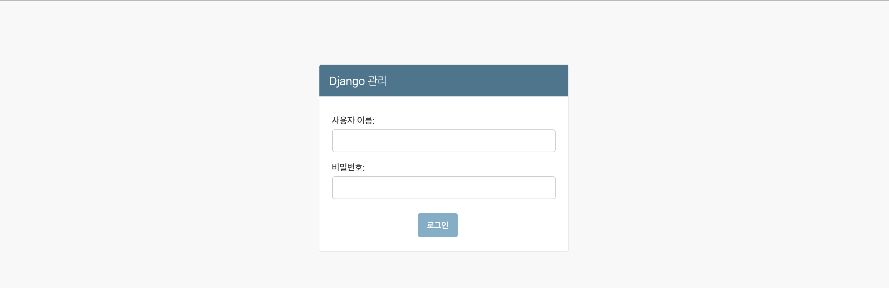
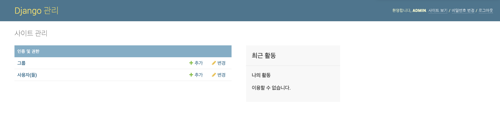
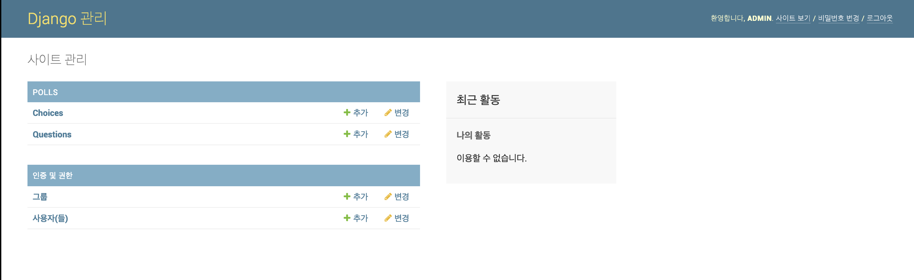

# Django Admin

Django 에서는 모델에 대한 관리용 인터페이스를 모두 자동으로 생성한다.

## 관리자 생성하기

```bash
$ python manage.py createsuperuser
```

관리 사이트에 로그인 할 수 있는 모든 권한을 가진 **슈퍼사용자(super user)**를 생성해준다.

```bash
python manage.py createsuperuser
사용자 이름 (leave blank to use 'jeongdaye'): admin
이메일 주소: admin@email.com
Password: 
Password (again): 
비밀번호가 너무 짧습니다. 최소 8 문자를 포함해야 합니다.
Bypass password validation and create user anyway? [y/N]: y
Superuser created successfully.
```

사용자 이름, 이메일 주소, 비밀번호를 각각 입력하여 계정을 생성해준다.

```
http://localhost:8000/admin/
```

그리고 나서 admin에 접속해보면 다음과 같이 관리자페이지가 뜨는 것을 볼 수 있다.



이때 관리자페이지 언어는 `mysite/settings.py` 에서 변경할 수 있다. 

```python
# translation이 기본으로 켜져있어서 지정언어로 표시된다.
LANGUAGE_CODE = 'ko'
```

생성한 superuser 계정으로 로그인을 하면 사이트 관리 페이지가 보입니다.



기본적으로 편집이 가능한 그룹, 사용자는 `django.contrib.auth` 모듈에서 제공해준다.

## Admin에서 App 관리하기

새로 생성한 app이 관리자 페이지에서 보이지 않는다면 `app/admin.py`에 추가해주면된다.

```python
# admin.py
from django.contrib import admin
from .models import Question
from .models import Choice

# Register your models here.
admin.site.register(Question)
admin.site.register(Choice)
```

추가 해준 뒤 다시 `http://localhost:8000/admin/` 에 접속하면 바뀐것을 확인할 수 있다.



관리자 페이지에서 직접 모델에 등록, 수정, 삭제, 조회를 할 수 있다.


## customizing admin page

추후에 추가할 것입니다.


## 참조페이지

- 장고걸스 : [https://tutorial.djangogirls.org/ko/django_admin/](https://tutorial.djangogirls.org/ko/django_admin/)
- 공식문서 : [https://docs.djangoproject.com/ko/2.1/intro/tutorial02/#introducing-the-django-admin](https://docs.djangoproject.com/ko/2.1/intro/tutorial02/#introducing-the-django-admin)
- 공식문서 - admin : [https://docs.djangoproject.com/en/2.0/ref/contrib/admin/](https://docs.djangoproject.com/en/2.0/ref/contrib/admin/)