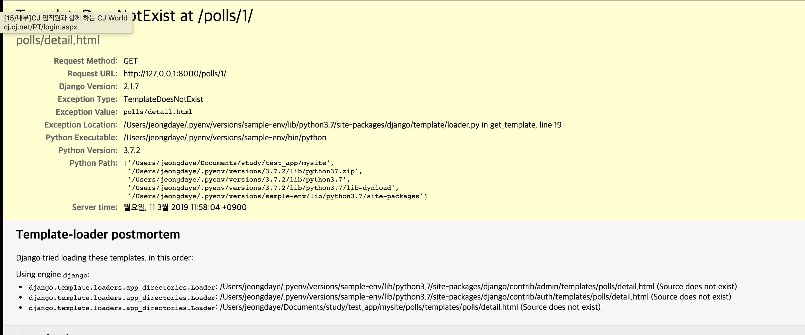

# Django Template & View & URL

## template과 view

앞선 [Django View & URL (2)](./2019-03-08-url.md)에서는 View에서 페이지의 디자인을 하드코딩 하고 있는 문제점이 있었다. 이제 template을 생성했으므로 view를 update해볼것이다.

```python
# polls/views.py
from django.http import HttpResponse
from django.template import loader
from .models import Question

def index(request):
	last_question_list = Question.objects.order_by('-pub_date')[:5]
	# polls/index.html 템플릿 가져오기
  template = loader.get_template('polls/index.html')
	# template에서 쓰이는 변수명과, python 객체를 연결하는 dictionary
  context = {
		'last_question_list': last_question_list,
	}
  # context 전달하기
	return HttpResponse(template.render(context,request))
```

### render()

template에 context를 전달해 표현한 결과를 HttpResponse객체와 함께 return해주는 구문은 자주쓰는 용법이다. Django는 이를 쉽게 표현할 수 있게 단축기능을 제공해준다.

```python
from django.shortcuts import render
from .models import Question

def index(request):
	last_question_list = Question.objects.order_by('-pub_date')[:5]
	context = {
		'last_question_list': last_question_list,
	}
	return render(request, 'polls/index.html', context)
```

`loader`와 `HttpResponse` 를 더 이상 import하지 않아도 된다.

```python
render(request, template_name, context=None, content_type=None, status=None, using=None)
```

render함수는 request, template_name을 첫번째, 두번째 인수로 받으며, 다음부터는 선택적(optional)인수로 받는다. render함수는 인수로 지정된 context로 표현된 template의 **HttpResponse**객체가 반환된다.

## 404 Error

```python
from django.shortcuts import render
from django.http import Http404

def detail(request, question_id):
	try:
		question = Question.objects.get(pk=question_id)
	except Question.DoesNotExist:
		raise Http404("Question does not exist")
	return render(request, 'polls/detail.html', {'question': question})
```

`http://127.0.0.1:8000/polls/1/` 로 접속해보면 아래와 같은 오류가 발생하는 것을 볼 수 있다.



템플릿이 존재하지 않는다는 오류이다.

`polls/templates/polls` 디렉토리 하위에 `detail.html` 템플릿을 생성해주고 난 후 새로고침을 하면 오류가 안나는 것을 확인 할 수 있다.

### get_object_or_404()

객체가 존재하지 않을 때 `get()`을 이용하여 Http404예외를 발생시키는 것은 자주 발생한다. 위의 `render()` 처럼 Django에서 단축기능을 제공해준다.

```python
from django.shortcuts import get_object_or_404, render

def detail(request, question_id):
	question = get_object_or_404(Question, pk=question_id)
	return render(request, 'polls/detail.html', {'question': question})
```

## URL

template에서 하드코딩된 url을 `` 을 사용하여 의존성을 제거할 수 있다.

```python
# urls.py
# the 'name' value as called by the  template tag
urlpatterns = [
    path('', views.index, name='index'),
    path('<int:question_id>/',views.detail, name='detail'),
    path('<int:question_id>/results/',views.results, name='results'),
    path('<int:question_id>/vote/',views.vote, name='vote'),
]
```

여기서 name을 template tag ``에서 호출할 때 부르는 이름이다.

```html
{# template #}

	<li><a href="/polls/{{question.id}}/">{{ question.question_text}}</a></li>

```

다음과 같이 하드코딩된 부분을 아래와 같이 변경할 수 있다.

```html
<li><a href="">{{ question.question_text }}</a></li>
```


하지만 project에 여러개의 app이 존재하고, 같은 path name을 가지고 있을 수 있다. **URLconf**에 namespace를 추가 함으로써 해결할 수 있다.

```python
# polls/urls.py
from django.urls import path

from . import views

app_name = 'polls'
urlpatterns = [
    path('', views.index, name='index'),
    path('<int:question_id>/',views.detail, name='detail'),
    path('<int:question_id>/results/',views.results, name='results'),
    path('<int:question_id>/vote/',views.vote, name='vote'),
]
```

```html
{# polls/index.html #}
<li><a href="">{{ question.question_text}}</a></li>
```


## 참조

- [Django shortcut functions](https://docs.djangoproject.com/ko/2.1/topics/http/shortcuts/#module-django.shortcuts)

- [Django tutorials](https://docs.djangoproject.com/ko/2.1/intro/tutorial03/)

