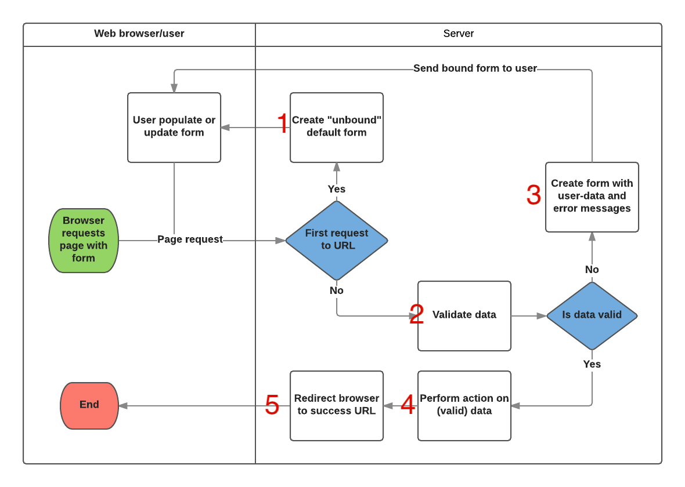

# Django Form

## HTML Form

Form은 데이터를 입력할 큰 틀을 만드는데 사용된다. 입력된 데이터를 한번에 서버로 전송하고, 전송한 데이터는 웹 서버가 처리해 결과에 따른 페이지를 보여준다.


```html
<form action = "#" accept-charset="utf-8" name = "" method = "get">
	...
</form>
```

- `action` : form 데이터를 보낼 URL을 지정한다.
- `enctype` : 파일을 넘길 때 주로 사용한다.
- `method` : form을 서버로 전송하는 http 방식을 지정한다. (GET/POST)
- `name` : form을 식별할 이름 지정
- `target` : action에서 지정한 스크립트 파일이 현재나 다른 위치에서 열리도록 한다.
- `accept-charset` : form 전송에 사용할 문자 인코딩 지정

## Django Form



장고의 가장 큰 장점 중 한가지 이다. Model 클래스와 유사하게 **Form 클래스**를 정의한다.

`Form` 클래스는 Django Form 관리 시스템의 핵심으로 다음과 같은 역할을 한다.



|                   | 설명                             |
| ----------------- | -------------------------------- |
| form.is_valid()   | 폼의 입력값이 올바른지 확인      |
| form.is_bound     | 사용자 입력값이 있는지 확인      |
| form.data         | 사용자가 입력한 폼 데이터        |
| form.cleaned_data | 검사를 통과한 폼 데이터          |
| form.as_p()       | `<p></p>` 태그로 폼 출력         |
| form.as_ul()      | `<ul></ul>` 태그로 폼 출력       |
| form.as_table()   | `<table></table>` 태그로 폼 출력 |

1. 입력 폼 생성 : `as_table()` ,`as_p()`, `as_ul()` 기본제공
2. 유효성 검증(**Validation**)
3. 검증에 통과한 값을 `dictionary type`으로 제공(`cleaned_data`)

### Form vs Model Form

```python
# app/forms.py
from django import forms
from .models import Post

# Form (일반 폼)
class PostForm(forms.Form):
	title = forms.CharField()
	content = forms.CharField(widget=forms.Textarea)

# Model Form (모델 폼)
class PostForm(forms.ModelForm):
	class Meta:
		model = Post
		fields = ['title', 'content']
```

- Form  : 직접 필드 정의, 위젯 설정이 필요하다
- Model Form : 모델과 필드를 지정하면 모델폼이 자동으로 field를 생성한다.
  - `class Meta` 는 폼을 만들기 위해서 어떤 모델이 쓰여야하는지 장고에 알려주는 구문이다.

#### Form Fields([공식문서 바로가기](https://docs.djangoproject.com/en/2.2/ref/forms/fields/))

Form fields는 HTML Form Fields를 파이썬 클래스화 한것이다.

### Validation 요효성 검사

기본적인 유효성 검사는 값의 유무이다. `forms.ValidationError` 로 예외발생 유무를 처리한다.

1. 해당 필드의 `clean_<fieldname>()` 메소드를 추가해 검증된 입력값을 반환하거나 옳지 않은경우 ValidationError를 발생시킬 수 있다.

```python
from django import forms
from django.core.exceptions import ValidationError

class PostForm(forms.Form):
	title = forms.CharField()
  
  def clean_title(self):
    title = self.cleaned_data['title']
    
    if(len(title) < 10):
      raise ValidationError(_('제목의 길이가 너무 짧습니다. 10글자이상 입력해주세요.'))
    return title
```

> `_()` 여기서 `_` 는 `gettext()` , `gettext_lazy()` 이다.
>
> [https://docs.djangoproject.com/en/2.2/topics/i18n/translation/](https://docs.djangoproject.com/en/2.2/topics/i18n/translation/)


**validators는 form보다 Model에 적용하는 것이 좋다.**

```python
# app/models.py
from django import forms
from django.db import models

# validation
def min_length_validator(value):
	if len(value)<3:
		raise forms.ValidationError('글자수가 너무 짧습니다. 3글자 이상 입력해주세요.')

# Create your models here.
class Marketing(models.Model):
    title = models.CharField(max_length=200, validators=[min_length_validator])
    str_date = models.DateTimeField()
    end_date = models.DateTimeField()
    ins_name = models.CharField(max_length=20)
    created_at = models.DateTimeField(auto_now_add=True) # 해당 레코드 생성시 현재 시간 자동저장
    mod_name = models.CharField(max_length=20)
    updated_at = models.DateTimeField(auto_now=True)    # 해당 레코드 생성시 수정 시간 자동저장

    def __str__(self):
        return '%s' % (self.title)
```

[공식문서](https://docs.djangoproject.com/en/2.2/ref/forms/validation/)에서 더 자세히 살펴볼 수 있다.

### View

#### 함수형뷰

```python
def post_new(request):
	if request.method == 'POST':
		form = MarketingForm(request.POST,request.FILES)

		# form의 모든 validators 유효성 검증 수행, 검증 성공한 값은 dictionary type으로 제공(form.cleaned_data)
		# 검증실패시 form.error에 오류 정보 저장
		if form.is_valide():
			mrkt = form.save()
			return redirect(mrkt)
	else:
		form = MarketingForm()
	return render(request, 'toast_grid/new.html', {'form': form,})

class IndexView(generic.TemplateView):
	template_name = "index.html"
```

#### FormView

```python
from django.shortcuts import render
from django.views import generic
from django.urls import reverse

from .models import Marketing
from .forms import MarketingForm

class FormView(generic.edit.FormView):
	form_class = MarketingForm #forms.py에서 지정한 MarketingForm
	template_name = 'toast_grid/new.html' # Template
	def get_success_url(self):
		return reverse('admin:index')
	def form_valid(self, form):
		form.save()
		return super().form_valid(form)
```

### Template

```html




<h1>New Page</h1>

<form action="" method="post">
	
	{{ form.as_table }}
	<input type="submit">
</form>


```

## 참조

- [https://developer.mozilla.org/ko/docs/Learn/Server-side/Django/Forms](<https://developer.mozilla.org/ko/docs/Learn/Server-side/Django/Forms>)
- [https://wayhome25.github.io/django/2017/05/06/django-form/](https://wayhome25.github.io/django/2017/05/06/django-form/)