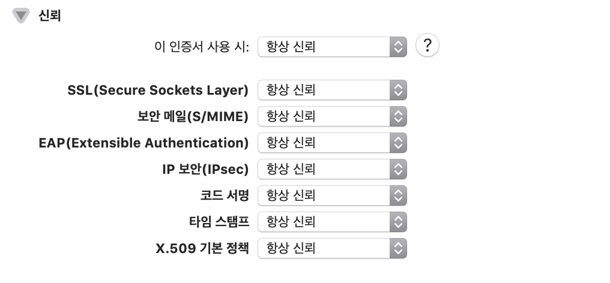

# Django OpenSSL 인증서 생성 & sslrunserver 환경설정

## INSTALL openssl

```
$ openssl version                                     
OpenSSL 1.0.2s  28 May 2019
```

version이 나오지않으면 설치가 되어있지 않은 것이므로 설치가 필요하다.

### homebrew로 설치하기

```
$ brew install openssl
```

## Key 생성하기

```
$ openssl genrsa 1024 > {{keyname}}.key
Generating RSA private key, 1024 bit long modulus
..................+++++
......+++++
e is 65537 (0x10001)
```


## Cert 파일 생성하기

```
$ openssl req -new -x509 -nodes -sha256 -days 365 -key {{keyname}}.key > {{certname}}.cert

You are about to be asked to enter information that will be incorporated
into your certificate request.
What you are about to enter is what is called a Distinguished Name or a DN.
There are quite a few fields but you can leave some blank
For some fields there will be a default value,
If you enter '.', the field will be left blank.
-----
Country Name (2 letter code) [AU]:
State or Province Name (full name) [Some-State]:
Locality Name (eg, city) []:
Organization Name (eg, company) [Internet Widgits Pty Ltd]:
Organizational Unit Name (eg, section) []:
Common Name (e.g. server FQDN or YOUR name) []:
Email Address []:
```

이때 `.key` 파일과 `.cert` 파일은 `manage.py` 파일과 같은 depth에 생성한다. 

인증서는 설치후에 키체인관리에서 이 인증서 사용 시 항상 신뢰로 변경해준다.




## Install django-sslserver

```
$ pip install django-sslserver
```

이때 외부 네트워크 접속이 자유롭지 못한 네트워크 (회사 네트워크 등)에서는 SSL 인증서 문제 등으로 pip를 통한 라이브러리 다운 및 설치가 되지 않을 수 있다.

```
WARNING: Retrying (Retry(total=4, connect=None, read=None, redirect=None, status=None)) after connection broken by 'SSLError(SSLCertVerificationError(1, '[SSL: CERTIFICATE_VERIFY_FAILED] certificate verify failed: unable to get local issuer certificate (_ssl.c:1056)'))': /simple/django-sslserver/
WARNING: Retrying (Retry(total=3, connect=None, read=None, redirect=None, status=None)) after connection broken by 'SSLError(SSLCertVerificationError(1, '[SSL: CERTIFICATE_VERIFY_FAILED] certificate verify failed: unable to get local issuer certificate (_ssl.c:1056)'))': /simple/django-sslserver/
WARNING: Retrying (Retry(total=2, connect=None, read=None, redirect=None, status=None)) after connection broken by 'SSLError(SSLCertVerificationError(1, '[SSL: CERTIFICATE_VERIFY_FAILED] certificate verify failed: unable to get local issuer certificate (_ssl.c:1056)'))': /simple/django-sslserver/
WARNING: Retrying (Retry(total=1, connect=None, read=None, redirect=None, status=None)) after connection broken by 'SSLError(SSLCertVerificationError(1, '[SSL: CERTIFICATE_VERIFY_FAILED] certificate verify failed: unable to get local issuer certificate (_ssl.c:1056)'))': /simple/django-sslserver/
WARNING: Retrying (Retry(total=0, connect=None, read=None, redirect=None, status=None)) after connection broken by 'SSLError(SSLCertVerificationError(1, '[SSL: CERTIFICATE_VERIFY_FAILED] certificate verify failed: unable to get local issuer certificate (_ssl.c:1056)'))': /simple/django-sslserver/
Could not fetch URL https://pypi.org/simple/django-sslserver/: There was a problem confirming the ssl certificate: HTTPSConnectionPool(host='pypi.org', port=443): Max retries exceeded with url: /simple/django-sslserver/ (Caused by SSLError(SSLCertVerificationError(1, '[SSL: CERTIFICATE_VERIFY_FAILED] certificate verify failed: unable to get local issuer certificate (_ssl.c:1056)'))) - skipping
ERROR: Could not find a version that satisfies the requirement django-sslserver (from versions: none)
ERROR: No matching distribution found for django-sslserver
Could not fetch URL https://pypi.org/simple/pip/: There was a problem confirming the ssl certificate: HTTPSConnectionPool(host='pypi.org', port=443): Max retries exceeded with url: /simple/pip/ (Caused by SSLError(SSLCertVerificationError(1, '[SSL: CERTIFICATE_VERIFY_FAILED] certificate verify failed: unable to get local issuer certificate (_ssl.c:1056)'))) - skipping
```

pip의 옵션 중 `--trusted-host` 옵션을 사용해 라이브러리를 설치하는 url을 옵션으로 지정 후 설치해주면된다.

```
$ pip --trusted-host pypi.python.org --trusted-host files.pythonhosted.org --trusted-host pypi.org install django-sslserver
```

매번 `--trusted-host` 옵션을 추가하기 귀찮은 경우에는  `.zshrc`에 alias 설정을 하면된다.

```
alias pip='pip --trusted-host pypi.org --trusted-host files.pythonhosted.org --trusted-host pypi.org'
```


## INSTALLED_APP

설치가 완료되면 Django 프로젝트 settings.py의 `INSTALLED_APP`에 추가해준다.

> 서버별로 환경설정을 분리한 경우에는 알맞게 추가해준다.(`settings/base.py`)

```python
 INSTALLED_APPS = [
 	...
    # django third-party-apps
    'sslserver',
	...
]
```


## runsslserver

```
$ python manage.py runsslserver --certificate {{certname}}.cert --key {{keyname}}.key

Watching for file changes with StatReloader
Validating models...

System check identified some issues:

January 14, 2020 - 15:03:43
Django version 2.2.6, using settings 'config.settings.development'
Starting development server at https://127.0.0.1:8000/
Using SSL certificate: django.cert
Using SSL key: django.key
Quit the server with CONTROL-C.
```

`https` 로 접속할 수 있는 것을 확인할 수 있다.


## 참고

- [https://chohyeonkeun.github.io/2019/05/31/190531-django-openssl/](https://chohyeonkeun.github.io/2019/05/31/190531-django-openssl/)
- [https://harryp.tistory.com/831](https://harryp.tistory.com/831)