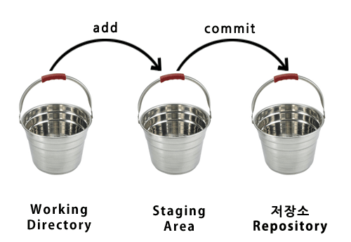
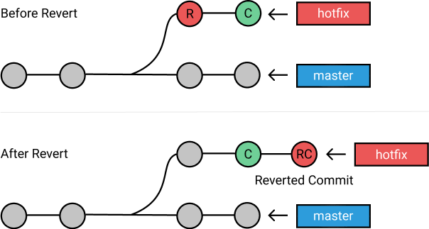

# Basic

### HELP

```console
$ git 명령어 --help
```
명령어에 대한 설명을 자세히 볼 수 있다.

### 기본설정

```console
$ git config
```
git의 기본설정을 변경할 수 있다.

```console
 git config --global user.name "이름"
 git config --global user.email "이메일주소"
```
각각의 버전은 누가 만든것인지 정보를 가지고 있어야하는데 위와 같이 username과 email을 설정할 수 있다. (`railsinstaller`설치 후 처음 입력한 정보!)

### 새로운 저장소 만들기

모든것은 **init**으로 부터 시작된다.

```console
$ git init
Initialized empty Git repository in /Users/dh0023/gittest/.git/

$ ls -al
total 0
drwxr-xr-x   3 dh0023  staff   102  3 23 17:08 .
drwxr-xr-x+ 34 dh0023  staff  1156  3 23 17:08 ..
drwxr-xr-x  10 dh0023  staff   340  3 23 17:08 .git
```
* `git init`을 하면 현재 디렉토리가 **버전관리의 저장소**가 되었다는 의미이다.
* `ls -al`을 하면 `.git` directory(폴더)가 생긴 것을 볼 수 있다.`.git` 폴더 안에서 버전관리가 이루어진다.

### 상태확인하기

```console
$ git status
On branch master

Initial commit

Untracked files:
  (use "git add <file>..." to include in what will be committed)

	test1.html
--------------------------

Changes to be committed:
  (use "git rm --cached <file>..." to unstage)

	new file:   test1.html
```
* **untracked files:**은 버전관리가 되지않고 있는 파일로서 새로 추가, 수정, 삭제 즉 변경된 파일이다.
버전관리가 되지않고 있는 파일,폴더는 <span style="color: red;">**붉은색**</span>으로 표시 된다.

* **new file:**은 버전관리에 새로 추가된 파일이며, <span style="color: green;">**초록색**</span>으로 표시된다.(`git add`명령어를 통해 추가)

### 추가

```console
$ git add 파일(폴더)명
$ git add test1.html

$ git add .
```
버전관리 목록에 추가해 주는 것이다.

* `git add .`은 변경된 모든 사항을 추가한다는 의미
* `add`명령어 후 `git status`를 해보면 **changed to be Committed:** 파일이 버전관리 되고 있는 것을 확인 할 수 있다.


### 확정

```console
$ git commit -m "first commit"
[master (root-commit) dc423a2] first commit
 1 file changed, 1 insertion(+)
 create mode 100644 test1.html
```
이때까지 변경된 것을 **확정**하는 것이다. `""`안에는 버전에 대한 설명을 간단히 적어준다.

```console
$ git commit --amend
[master c6ce442] first commit
 Date: Thu Mar 23 17:28:55 2017 +0900
 1 file changed, 1 insertion(+)
 create mode 100644 test1.html
```
**추가적인 설명**을 자세하게 적을 수 있다.




### 서버에 올리기

현재의 변경 내용은 아직 로컬 저장소의 HEAD 안에 머물고 있다. push명령어 이후에 변경내용이 서버에 적용된다.

```console
$ git push [리모트 저장소 이름] [브랜치 이름]
```

master 브랜치를 origin 서버에 올리려면 아래와 같이 하면된다.

```console
$ git push origin master
```

### 저장소 받아오기

```console
$ git clone /로컬/저장소/경로
```

### 취소

```console
$ git reset [돌아갈 버전]
$ git reset HEAD~1
```
* Reset은 **선택한 버전의 상태로 돌아가는 것, 버전을 지워버림**


```console
$ git revert [돌아갈 버전]
$ git revert HEAD ~1
```

* Revert는 **선택한 버전을 취소해서 그 이전 상태로 돌리는것**




`revert` 와 `reverse` 를 할때는 항상 주의해야한다.

### Branch 생성하기

* branch는 안전하게 격리된 상태에서 무언가를 만들 때 사용.

```console
$ git branch
*master
```
저장소를 새로 만들면  **master** branch(default)가 기본이다.

```console
$ git branch <브랜치명>
$ git branch exp
$ git branch
exp
*master
```
실험적인 작업을 해야하는경우나 **협업**을 할 때 사용.
exp branch가 생성된 것을 확인할 수 있다. *붙은 것이 현재 branch

- 이전 commit으로 branch를 생성

```console
$ git branch [특정 버전]
$ git branch  9da3066404c68a4e7f77a7ddb69beb4d2475e2dd
```

해당 commit에서 브랜치가 생성된다.

[git log에 대해 알아보기](./2019-01-09-git-log.md)

### 현재 Branch변경

```console
$ git checkout exp
*exp
master
```
현재 branch가 *exp로 바뀐것을 확인 할 수 있다.

### Branch 생성과 동시에 변경하기

```console
$ git checkout -b <브랜치명>
$ git checkout -b example1
$ git branch
*example1
master
```


### 데이터 가져오기(fetch)

fetch는 단순히 원격 저장소의 내용을 확인만 하고 로컬 데이터와 병합은 하고 싶지 않은 경우에 사용한다.

```console
$ git fetch [remote-name]
```
즉, local에는 없지만 remote 저장소에 있는 모든 데이터를 가져온다.


### Branch 병합

```console
$ git merge <branch명>
```
branch를 이용해 병합을 하면 git이 자동으로 commit을 해준다.

```console
$ git branch
example1
* master

$ git merge example1
```

#### Merge --squash

병합할 branch의 모든 commit을 하나로 합치고 싶을때 `--squash` 옵션을 지정하면된다.

```console
$ git merge --squash <branch명>
```

```
$ git merge --squash example1
```

### 갱신(pull)

```console
$ git pull
```
원격 저장소의 변경 내용이 로컬 작업 디렉토리에 받아지고(fetch), 병합(merge)된다.

### 충돌(conflict)
만약에 여러개의 branch가 서로 같은 것을 수정할 경우에 깃은 충돌을 나타내고 우리가 수정할 수 있도록 표시해준다.

### 협업

어떠한 작업을 하기전에 pull을 하는 것이 가장 좋다!
**`pull`->working->`commit`->`pull`->`push`**

### stash
아직 commit하지 않은 버전을 임시로 저장하는 것!
stash를 하면 임시로 저장된 후 마지막 버전상태로 돌아가고 삭제된다.

### tag(github에선 releases)
설명해주는 것! 과거의 특정한 버전에 대해서도 태그를 붙일 수 있다.

### ignore

`.gitignore`파일에 파일을 추가하면 git이 없는걸로 간주할 대상이 된다.(github에 올릴때도 안올라감!)
[ignore에 포함되어야할 목록](https://www.gitignore.io)

이 때 중요한 id, 비밀번호, key값이 설정된 파일은 따로 저장한 후 `.gitignore`에 추가해 원격저장소에 올리지 않는다.

### 참고

* [https://rogerdudler.github.io/git-guide/index.ko.html](
https://rogerdudler.github.io/git-guide/index.ko.html)
* [https://git-scm.com/book/ko](https://git-scm.com/book/ko)
* [생활코딩](https://opentutorials.org/course/2708)
* [http://marklodato.github.io/visual-git-guide/index-ko.html](http://marklodato.github.io/visual-git-guide/index-ko.html)
* [http://dogfeet.github.io/articles/2012/progit.html](http://dogfeet.github.io/articles/2012/progit.html)
* [https://backlog.com/git-tutorial/kr/stepup/stepup7_7.html](https://backlog.com/git-tutorial/kr/stepup/stepup7_7.html)
