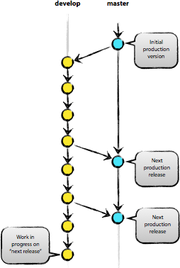
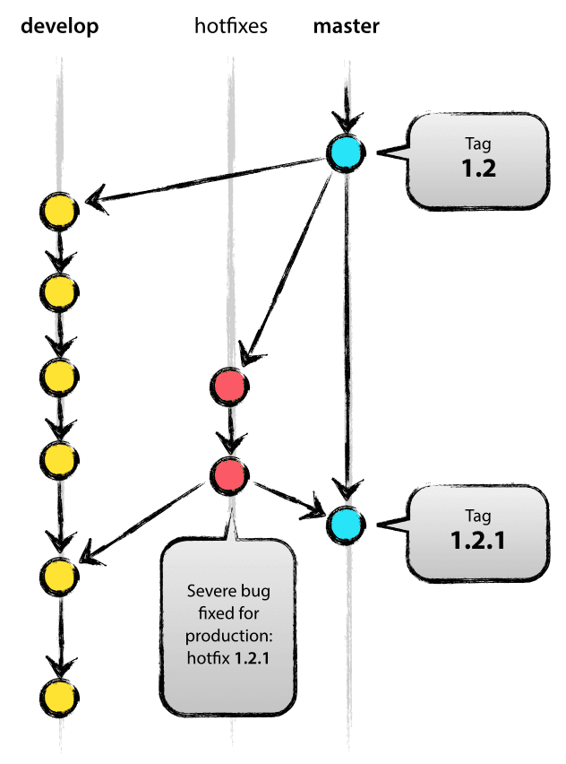

# Git-flow

git-flow는 Vincent Driessen의 branching model을 적용하여 고수준으로 저장소를 관리할 수 있도록 해주는 확장기능이다. branching model은 `feature` - `develop` - `release` - `hofixes` - `master` 단계로 branch를 누눠서 코드를 관리하는 전략이며, 사용자가 쉽게 접근하고 사용할 수 있도록 확장 기능(명령어)을 제공하는 것이다.

Git-flow에는 5가지 종류의 브랜치가 존재한다. 항상 유지되는 주요 브랜치들(master, develop)과 일정 기간 동안만 유지되는 보조 브랜치들(feature, release, hotfix)이 있다.


- master : 제품으로 출시될 수 있는 브랜치
- develop : 다음 출시 버전을 개발하는 브랜치
- feature : 기능을 개발하는 브랜치
- release : 이번 출시 버전을 준비하는 브랜치
- hotfix : 출시 버전에서 발생한 버그를 수정 하는 브랜치


## git-flow 시작하기

```bash
$ git flow init
```

## 주요 브랜치(main branches)



### master branch

깃에서의 기본 브랜치이다. 배포되었거나 배포 준비된 코드는 `origin/master` 에 두고 관리한다. `master` 브랜치에 merge한다는 것은 새로운 버전을 배포한다는 것을 의미한다.

### develop branch

다음에 배포하기 위해 개발하는 코드는 `origin/develop` 에서 관리한다. 프로젝트를 진행하는 개발자들이 함께 보며 업무를 진행하는 브랜치이다. `develop` 브랜치의 코드가 안정화되고, 배포할 준비가 되면 `master` 에 merge하고, 배포버전으로 태그를 단다.

`develop` 브랜치는 `master` 로부터 시작된 브랜치이다.


## 보조 브랜치(Supporting branches)

### feature branch


- 시작 브랜치 : `develop`
- 병합(merge) 대상 브랜치 : `develop`
- Branch naming 규칙 
  - `master`, `develop`, `release-*`, `hotfix-*` 을 제외한 어떠한 것
  - 우리는 일감번호-일감에대한간략한내용으로 생성하고 있다.

`feature` 브랜치는 배포하려고 하는 **기능을 개발하는 브랜치**이다. 기능을 개발하기 시작할 때는 언제 배포할 수 있을지 알 수 없다. `feature` 브랜치는 그 기능을 다 완성할 때까지 유지하고 있다가 다 완성되면.`develop` 브랜치로 merge한다.

#### feature branch 생성

```bash
$ git flow feature start <branch name>
```

`feature/branchname` 으로 생성되고, 자동으로 해당 branch로 checkout된다.

```bash
$ git checkout -b <branch name> develop
```

#### feature branch merge

```bash
$ git flow feature finish <branch name>
```

생성한 `feature` branch를 `develop` 브랜치에 merge한다. 그리고 feature 브랜치를 삭제하고, develop 브랜치로 전환한다.

```bash
$ git checkout develop
$ git merge --no-ff myfeature
$ git branch -d myfeature
```

#### feature branch publish

```bash
$ git flow feature publish <branch name>
```

해당 branch를 다른 개발자와 공동으로 개발하고 싶다면 원격 서버에 올려주면된다.

#### feature branch pull

```bash
$ git flow feature pull origin <branch name>
```

다른 개발자가 사용하는 브랜치를 가져오는 명령어이다.

### release branch


- 시작 브랜치 : `develop`
- 병합(merge) 대상 브랜치 : `develop`, `master`
- Branch naming 규칙 
  - `release-*`

`release` branch는 실제 배포할 상태가 된 경우에 생성하는 브랜치이다. 보통 release 점검을 위해 간단한 버그를 수정하는 작업 등의 목적으로 사용된다.

> 우리는 사용안하고 있다.

#### release branch create

```bash
$ git flow release start <version>
```

```bash
$ git flow release start v.0.0.1
```

release를 시작하면 `release/<version>` 의 이름을 갖는 새로운 branch를 하나 생성하여 checkout한다.

```bash
$ git checkout -b release-1.2 develop
 Switched to a new branch "release-1.2"
$ ./bump-version.sh 1.2
Files modified successfully, version bumped to 1.2.
$ git commit -a -m "Bumped version number to 1.2"
[release-1.2 74d9424] Bumped version number to 1.2
1 files changed, 1 insertions(+), 1 deletions(-)
```

#### release branch publish

release 브랜치를 생성한 후에는 commit을 허용하기 위해 publish 해주는 것이 현명하다.

```bash
$ git flow release publish <version>
```

#### release branch track

```bash
$ git flow release track <version>
```

다음과 같이 원격 `release` 브랜치의 변경을 추적할 수 있다.

#### release branch finish

release를 위한 점검이 끝난 경우에 release를 종료한다.

```bash
$ git flow release finish <version>
$ git push --tags
```

`release finish` 명령어가 실행되면 1. release 브랜치 코드를 master에 merge 2. release 이름으로 태그 등록 3. release를 develop branch에 재병합(back-merge) 4. release 브랜치삭제 순으로 진행된다.

```bash
$ git checkout master
Switched to branch 'master'
$ git merge --no-ff release-1.2
Merge made by recursive.
(Summary of changes)
$ git tag -a 1.2
```

```bash
$ git checkout develop
Switched to branch 'develop'
$ git merge --no-ff release-1.2
Merge made by recursive.
(Summary of changes)
```

```bash
$ git branch -d release-1.2
```

### hotfix branch



- 시작 브랜치 : `master`
- 병합(merge) 대상 브랜치 : `develop`, `master`
- Branch naming 규칙 
  - `hotix-*`

배포를 준비하고, 이미 배포한 제품이나 서비스의 버그를 즉각 대응(hotfix)해야할 때 사용하는 브랜치이다. 즉, 긴급 수정 브랜치이다.

#### hotfix branch start

```bash
$ git flow hotfix start VERSION [BASENAME]
```

여기서 version은 `hotfix` 이름을 지정한다. 선택적으로 basename으로 시작점을 지정할 수 있다.

```bash
$ git checkout -b hotfix-1.2.1 master
Switched to a new branch "hotfix-1.2.1"
$ ./bump-version.sh 1.2.1
Files modified successfully, version bumped to 1.2.1.
$ git commit -a -m "Bumped version number to 1.2.1"
[hotfix-1.2.1 41e61bb] Bumped version number to 1.2.1
1 files changed, 1 insertions(+), 1 deletions(-)
```

#### hotfix branch finish

```bash
$ git flow hotfix fisnish VERSION
```

핫픽스를 종료하면 핫픽스는 `develop` 및 `master` 브랜치로 merge된다. master 브랜치로의 merge 부분은 핫픽스 버전으로 tag된다.

```bash
$ git checkout master
Switched to branch 'master'
$ git merge --no-ff hotfix-1.2.1
Merge made by recursive.
(Summary of changes)
$ git tag -a 1.2.1
```

```bash
$ git checkout develop
Switched to branch 'develop'
$ git merge --no-ff hotfix-1.2.1
Merge made by recursive.
(Summary of changes)
```

```bash
$ git branch -d hotfix-1.2.1
Deleted branch hotfix-1.2.1 (was abbe5d6).
```


## git-flow vs gif-flow-avh

`gif-flow` 는 hotfix를 dev와 master에 각각 merge를 한다. 즉, 가지가 hot fix 하나에서 dev와 master branch로 나누어지는 형태이다.

`git-flow-avh` 는 hotfix가 dev branch로 merge되고, hotfix가 merge된 dev branch를 master branch에 merge하는 형태이다. (`hotfix` > `dev` > `master` 순서, `git-flow-avh`가 최신 버전이다.)

```bash
$ brew install git-flow-avh
```

### 참고자료

- [https://gist.github.com/ihoneymon/a28138ee5309c73e94f9](https://gist.github.com/ihoneymon/a28138ee5309c73e94f9)
- [http://woowabros.github.io/experience/2017/10/30/baemin-mobile-git-branch-strategy.html](http://woowabros.github.io/experience/2017/10/30/baemin-mobile-git-branch-strategy.html)
- [https://uroa.tistory.com/106](https://uroa.tistory.com/106)
- [git-flow vs git-flow-avh](https://88240.tistory.com/489)
- https://nesoy.github.io/articles/2018-09/Git-Flow
- [https://nvie.com/posts/a-successful-git-branching-model/](https://nvie.com/posts/a-successful-git-branching-model/)

