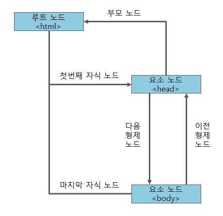

# Node 노드

DOM은 노드라고 불리는 계층적 단위에 정보를 저장하고 있다. DOM은 이러한 노드들을 정의하고, 그 사이의 관계를 설명해주는 역할을 한다.


HTML의 정보는 노드 트리에 저장되며, 노드 트리는 노드들의 집합으로 노드 간의 관계를 보여준다.

노드 트리는 최상위 레벨인 루트 노드(root node)로 부터 시작해, 가장 낮은 레벨인 text 노드까지 내려간다. JavaScript에서는 DOM을 이용하여 모든 노드에 접근할 수 있다.


## 노드의 종류

| **노드**                  | **설명**                                                     |
| ------------------------- | ------------------------------------------------------------ |
| 문서 노드(document node)  | HTML 문서 전체를 나타내는 노드                               |
| 요소 노드(element node)   | 모든 HTML 요소는 요소 노드이며, 속성 노드를 가질 수 있는 유일한 노드이다. |
| 속성 노드(attribute node) | 모든 HTML 요소의 속성은 속성 노드이며, 요소 노드에 관한 정보를 가지고 있다.하지만 해당 요소 노드의 자식 노드(child node)에는 포함되지 않는다. |
| 텍스트 노드(text node)    | HTML 문서의 모든 텍스트는 텍스트 노드이다.                   |
| 주석 노드(comment node)   | HTML 문서의 모든 주석은 주석 노드이다.                       |

### 노드간의 관계



[[tree 자료구조](https://dh00023.github.io/algorithm/ds/2018/05/11/algorithm-12/)] 를 참조하면 관계를 더 잘 이해할 수 있다.


### 노드로의 접근

1. `getElementsByTagName()` 메소드를 이용하는 방법
2. 노드간의 관계를 이용하여 접근하는 방법
   - parentNode : 부모 노드
   - childNodes : 자식 노드 리스트
   - firstChild : 첫 번째 자식 노드
   - lastChild : 마지막 자식 노드
   - nextSibling : 다음 형제 노드
   - previousSibling : 이전 형제 노드

### 노드에 대한 정보

- nodeName :  노드 고유의 이름을 저장한다. 읽기 전용 property(수정불가)

| 노드                      | 프로퍼티 값                 |
| ------------------------- | --------------------------- |
| 문서 노드(document node)  | #document                   |
| 요소 노드(element node)   | 태그 이름 (영문자로 대문자) |
| 속성 노드(attribute node) | 속성 이름                   |
| 텍스트 노드(text node)    | #text                       |

요소 노드의 nodeName property는 언제나 해당 HTML 요소의 태그 이름을 대문자로 저장한다.

```js
document.getElementById("document").innerHTML = document.childNodes[1].nodeName; // 두 번째 노드의 이름을 선택
//=> HTML

document.getElementById("html").innerHTML = document.childNodes[1].childNodes[0].nodeName; 
//=> HEAD
```

- nodeValue : 노드의 값을 저장한다.

| 노드                      | 프로퍼티 값        |
| ------------------------- | ------------------ |
| 요소 노드(element node)   | undefined          |
| 속성 노드(attribute node) | 해당 속성의 속성값 |
| 텍스트 노드(text node)    | 해당 텍스트 문자열 |

```js
var headingText = document.getElementById("heading").firstChild.nodeValue;

//innerHTML 대신에 firstChild.nodeValue를 해도 같은 결과 값을 얻을 수 있다.
document.getElementById("text").innerHTML = headingText;
document.getElementById("text").firstChild.nodeValue = headingText;
```

- nodeType : 노드 고유의 타입을 저장한다. 읽기전용(수정불가)

| 노드                      | 프로퍼티 값 |
| ------------------------- | ----------- |
| 요소 노드(element node)   | 1           |
| 속성 노드(attribute node) | 2           |
| 텍스트 노드(text node)    | 3           |
| 주석 노드(comment node)   | 8           |
| 문서 노드(document node)  | 9           |

```js
document.getElementById("document").innerHTML = document.nodeType; 
//=> 9
```


이 property들은 특별히 다른 인터페이스를 이용하지 않고도, 해당 노드의 정보에 직접 접근할 수 있는 방법을 제공한다.

