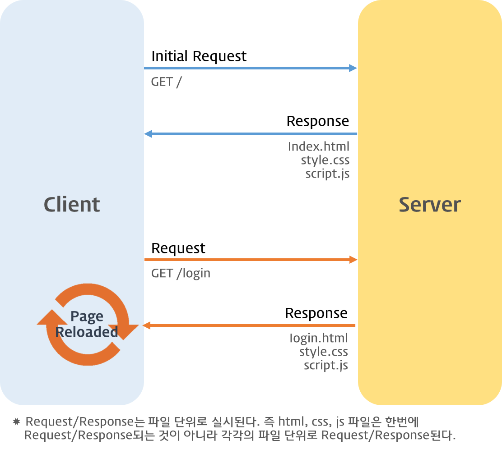

# AJAX


웹 브라우저에서 웹페이지를 요청하거나 링크 클릭시 화면 전환이 발생한다. 



서버와 브라우저와의 통신에 의한 것인데, 서버는 요청받은 페이지(HTML)를 반환한다. 이때 HTML에서 로드하는 CSS, JavaScript 파일들도 같이 반환된다. 클라이언트의 요청에 따라서 서버는 정적인 파일, 서버 사이드 프로그램이 만드는 파일, 데이터를 반환할 수도 있다. 서버로 부터 웹페이지가 반환되면 클라이언트(브라우저)는 이를 렌더링하여 화면에 표시한다.

### Ajax

Ajax는 **A**synchronous **J**avaScript **a**nd **X**ML의 약자로 JavaScript를 이용하여 비동기적(Asynchronous)으로 서버와 브라우저간의 데이터를 교환할 수 있는 통신방식이다.


즉, 서버로부터 웹페이지가 반환되면 하면 전체를 갱신하지 않고, 일부만을 갱신하는 방법이다.


Ajax의 동작원리는 Browser에서 서버로 보낼 Data를 Ajax Engine을 통해서 서버로 전송한다. 이때 Ajax Engine은 JavaScript를 통해 DOM을 사용하여 **XMLHttpRequest(XHR) 객체**로 데이터를 전달한다. 이 XHR을 이용해 서버에서 비동기 방식으로 데이터를 조회해 올 수 있는 것이다.

서버는 HTML, XML, JSON 등을 반환하는데 Ajax를 위한 데이터 형식은 **JSON**을 사용하는 것이 일반적이다.

### XMLHttpRequest 객체

XMLHttpRequest 객체는 웹 브라우저가 서버와 데이터를 교환할 때 사용한다. 웹 브라우저가 백그라운드에서 서버와 계속해서 통신할 수 있는 것은 XMLHttpRequest 객체를 사용하기 때문이다.

```js
var req = new XMLHttpRequest(); // 객체 생성
req.open('GET','data/test.json',true); // 비동기 방식으로 request open, 서버에 요청을 준비한다.
req.send(); // request 전송, 준비된 요청을 서버에 전달
```

- `open()` : 서버로 보낼 Ajax 요청의 형식 설정
  - 전달방식 : 요청을 전달할 방식 (GET, POST)
  - URL주소 : 요청을 처리할 서버의 파일 주소 전달
  - 동기여부 : 요청을 동기식으로 전달할지 비동기식으로 전달할지 여부
    - 비동기 true
    - 동기 false

```js
open(전달방식, url주소, 동기여부);
```

- `send()` : 작성된 Ajax요청을 서버로 전달

```js
// GET 방식
send(); 
// POST 방식
send(문자열);
```

> Ajax에서는 주로 POST 방식을 사용하여 요청을 전달한다.

```js
// XMLHttpRequest.readyStaty property 가 변경될 때마다 콜백함수(이벤트 핸들러) 호출
req.onreadystatechange = function(e){
  // readyStates는 XMLHttpRequest의 상태(state)를 반환한다.
  if(req.readyState===XMLHttpRequest.DONE){
    // status는 response 상태 코드를 반환힌다.
    if(req.status == 200){
      console.log(req.responseText);
    }else{
      console.log("Error");
    }
  }
}
```

`XMLHttpRequest.send()` 메소드를 통해 서버에 Request를 전송하면 서버는 Response를 반환해 주는데 언제 Response가 클라이언트에 도달할 지는 알 수 없다.

이때 `XMLHttpRequest.onreadystatechange` 는 Response가 클라이언트에 도달하여 발생된 이벤트를 감지하고 콜백함수를 실행하여 준다. 즉, req.onreadystatechange는 readyState property가 변경될 때마다 호출되는 EventHandler이다.

- `readyState` : Request에 변화가 발생한 경우에 readyState의 property가 변경된다. response가 클리이언트에 도달했는지를 추적할 수 있는 값이다.

| Value | State            | Description                                                  |
| ----- | ---------------- | ------------------------------------------------------------ |
| 0     | UNSENT           | XMLHttpRequest.open() 메소드 호출 이전<br>XMLHttpRequest 객체가 생성 |
| 1     | OPENED           | XMLHttpRequest.open() 메소드 호출 완료<br>open() 메소드가 성공적으로 실행 |
| 2     | HEADERS_RECEIVED | XMLHttpRequest.send() 메소드 호출 완료<br>모든 요청에 대한 응답이 도착 |
| 3     | LOADING          | 서버 응답 중(XMLHttpRequest.responseText 미완성 상태)<br>요청한 데이터를 처리 중인 경우 |
| 4     | DONE             | 서버 응답 완료                                               |

- status : 서버의 문서 상태를 나타낸다.
  - [상태 코드 참조](https://developer.mozilla.org/ko/docs/Web/HTTP/Status)
  - 200 (정상 응답)

```js
var xhr = new XMLHttpRequest(),
    method = "GET",
    url = "https://dh00023.github.io/";
xhr.open(method, url, true);
xhr.send();

// ajax요청을 중단해야하는 경우
if (OH_NOES_WE_NEED_TO_CANCEL_RIGHT_NOW_OR_ELSE) {
  xhr.abort();
}
```

- abort : ajax요청을 취소하거나 중단해야하는 경우에 사용한다.

## JSON

JSON(JavaScript Object Notation)은 JavaScript의 객체 리터럴과 매우 흡사하다. 하지만 JSON은 순수한 텍스트로 구성된 데이터이다.

> 리터럴 : 코드상에서 데이터를 표현하는 방식
>
> ```js
> // 객체 리터럴
> var obj = { p1 : 2, p2 : ‘2’ };
> ```

```js
{
    "key": value
}
```

**키는 반드시 큰따옴표(`""`)로 둘러싸야한다.** *(작은 따옴표(`'`) 불가)*

```json
{
    "name": "jimin",
    "gender": "female",
    "age": 25,
    "alive": true
}
```

#### JSON.stringify()

`JSON.stringify()` 메소드는 객체를 JSON 형식의 문자열로 변환한다.

```js
var obj = {
    name: "jimin",
    age: 25
};

var strObj = JSON.stringify(obj);
console.log(typeof strObj, strObj);
//=> string {"name":"jimin","age":25}

var arr = [1, 10, "a", false];

var strArray = JSON.stringify(arr);
console.log(typeof strArray, strArray);
//=> string [1,10,"a",false]
```

#### JSON.parse()

`JSON.parse()` 는 JSON 데이터를 가진 문자열을 객체로 변환한다.

서버로부터 브라우저로 전송된 JSON 데이터는 문자열이다. 이 문자열을 객체화해야하는데 이것을 **Deserializing(역직렬화)** 라 한다. JSON.parse() 를 사용해 문자열을 객체로 변환할 수 있다.

```js
// strObj
//=> string {"name":"jimin","age":25}
var obj = JSON.parse(strObj);

console.log(typeof obj, obj);
//=> object {name: "jimin", age: 25}
```


## JSONP

요청에 의해 웹페이지가 전달된 서버와 동일한 도메인의 서버로 전달된 데이터는 문제없이 처리할 수 있다. 하지만 보안상의 이유로 다른 도메인(http, https 포트가 다른 경우 포함)으로부터 요청(**CROSS DOMAIN**)은 제한된다. 이것을 **Same-origin policy** 동일출처원칙 이라한다.


#### 동일출처원칙 우회하는 방법

1. **Proxy**
2. **JSONP** : script 태그의 원본 주소에 대한 제약이 존재하지 않는것을 이용하여 다른 도메인의 서버에서 데이터를 수집하는 방법이다. 자신의 서버에 함수를 정의하고 다른 도메인의 서버에 얻고자 하는 데이터를 인수로 하는 함수 호출문을 로드하는 방법이다.


3. **Cross-Origin Resource Sharing** : HTTP 헤더에 추가적으로 정보를 추가하여 브라우저와 서버간 서로 통신해야한다는 사실을 인지하도록 하는 방법이다.

## jQuery Ajax

jQuery는 Ajax 요청과 응답을 위해 유용한 메소드들을 제공해준다.

### Low-Level Interface

```js
jQuery.ajax(url[,settings])
//=> jqXHR
jQuery.ajax([settings])
//=> jqXHR
```

여기서 `[]` 는 반복해서 사용할 수 있다는 의미이다.

settings는 **Ajax 요청 설정 정보**로 key,value의 쌍으로 이루어진 객체이다.

| settings      | Description                                                  | 비고                     |
| ------------- | ------------------------------------------------------------ | ------------------------ |
| url           | 요청이 전송될 url                                            |                          |
| method        | http 요청 방식 (**GET**/POST)                                | version added: 1.9.0     |
| type          | method의 alias (**GET**/POST)                                | 1.9.0 이전 버전에서 사용 |
| data          | 서버로 **전달**될 데이터                                     |                          |
| dataType      | 서버로부터 **반환**될 데이터의 type<br>default: Intelligent Guess (xml, json, jsonp, script, html, text) |                          |
| async         | 요청 시 동기화 여부(**TRUE**/FALSE)<br>기본은 비동기(asynchronous) 요청 |                          |
| timeout       | 요청 제한 시간. 제한 시간 안에 요청이 완료되지 않으면 요청을 취소하거나 error 콜백을 호출. |                          |
| jsonpCallback | JSONP 요청을 위한 콜백 함수 이름                             |                          |
| success       | 요청 **성공** 이벤트 핸들러                                  |                          |
| error         | 요청 **실패** 이벤트 핸들러                                  |                          |
| complete      | 요청 **완료** 이벤트 핸들러                                  |                          |
| cache         | 브라우저에 의해 요청되는 페이지를 캐시할 수 있다.(TRUE/FALSE) |                          |
| beforeSend    | http 요청 전에 발생하는 이벤트 핸들러                        |                          |
| global        | 전역함수 활성화 여부 설정                                    |                          |

```javascript
$.ajax({
    url: "data/data.json",
    dataType: "json"
})
.done(function(data){
	// HTTP 요청이 성공하면 데이터가 done 메소드로 전달
    console.log("success");
})
.fail(function(jqXHR,textStatus,errorThrown){
	// HTTP 요청이 실패하면 오류와 상태 정보가 fail() 메소드로 전달
    console.log("fail: ",jqXHR);
})
.always(function(data,textStatus,jqXHR){
	// HTTP 요청의 성공, 실패 여부에 상관없이 언제나 alwayw()메소드 실행
    console.log("always: ",data);
});
```

jqXHR은 jQuery HTTP Request로, 브라우저 XMLHttpRequest Object의 집합이다. data와 거의 비슷한 값을 지니고 있는데 추가적으로 통신 status 와 readyStatus 등을 보내준다. 

### Shorthand Method

#### jQuery.get()

HTTP GET request를 사용하여 서버로부터 데이터를 로드한다.

```js
jQuery.get(url, [,data][,success][,dataType])
// returns jqXHR
```

```js
$.get("data.html",function(data){
    $("#content").html(data);
});
```

#### jQuery.getJSON()

HTTP GET request를 사용하여 서버로부터 JSON-encoded 데이터를 로드한다.

```js
jQuery.getJSON(url[,data][,success])
// returns jqXHR
```

```js
$.getJSON("data.json",function(data){
    //...
});
```

#### jQuery.getScript()

HTTP GET request를 사용하여 서버로부터 JavaScript 파일을 로드한 후 실행한다.

```js
jQuery.getScript(url[,success])
// returns jqXHR
```

#### jQuery.post()

HTTP GET  request를 사용해 서버로부터 데이터를 로드한다.
```js
jQuery.post(url[,data][,success][,dataType])
// returns jqXHR
```

#### .load()

서버로부터 HTML 데이터를 로드하고 매치한다.

```js
.load(url,[,data][,complete])
// returns jQuery
```

```js
$("#content").load("data.html",function(){
  console.log("Load was performed");
});
```


## 참조페이지

- [https://joshua1988.github.io/web-development/javascript/promise-for-beginners/](https://joshua1988.github.io/web-development/javascript/promise-for-beginners/)
- [http://tcpschool.com/ajax/ajax_server_request](http://tcpschool.com/ajax/ajax_server_request)
- [http://www.nextree.co.kr/p4771/](http://www.nextree.co.kr/p4771/)
- https://poiemaweb.com/jquery-ajax-json
- [https://developer.mozilla.org/ko/docs/Web/Guide/AJAX/Getting_Started](https://developer.mozilla.org/ko/docs/Web/Guide/AJAX/Getting_Started)


