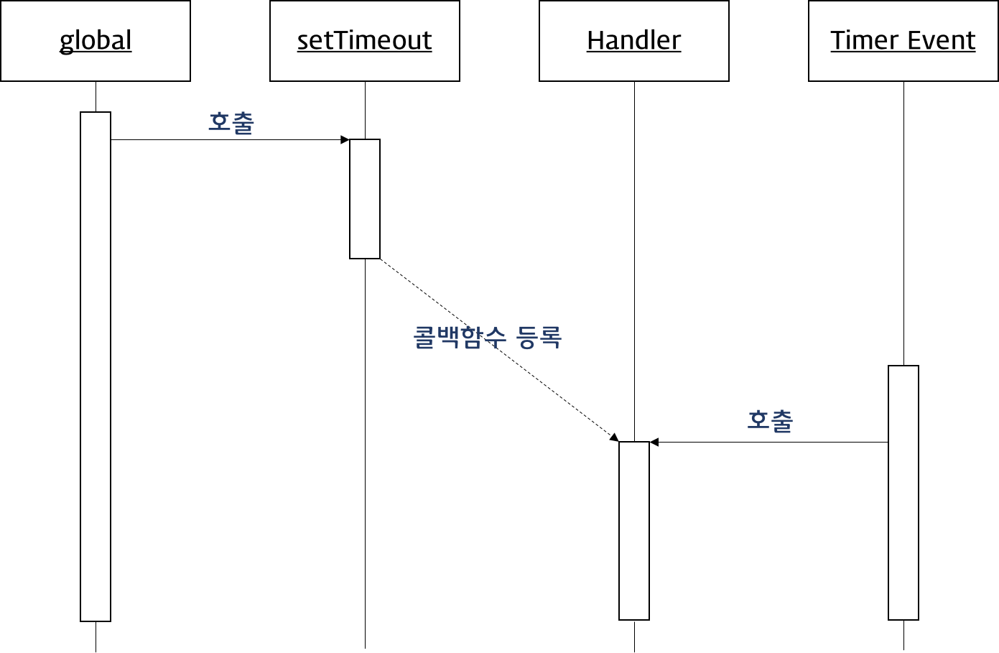

# Callback Function

콜백 함수는 함수를 명시적으로 호출하는 방식이 아니라 특정 이벤트가 발생했을 때 시스템에 의해 호출되는 함수이다.

콜백함수가 자주 사용되는 대표적인 예는 **이벤트 핸들러**이다.

```js
var button = document.getElementById('myButton');
button.addEventListener('click',function(){
  console.log('button clicked!');
});
```

JavaScript에서 함수는 First-class object이다. 그러므로 함수는 변수와 같이 사용할 수 있다.

> First-class object(일급 객체)란 생성, 대입, 연산, 인자 또는 반환값으로서의 전달 등 프로그래밍 언어의 기본적 조작을 제한없이 사용할 수 있는 대상을 의미한다.
>
> 1. 무명의 literal(리터럴)로 표현이 가능
> 2. 변수나 자료 구조(객체, 배열 등)에 저장할 수 있다.
> 3. 함수의 매개변수에 전달할 수 있다.
> 4. 반환값으로 사용할 수 있다.

```js
// 1, 2
var increase = function(num){
    return ++num;
}
var decrease = function(num){
    return --num;
}
var predicates = {increase, decrease};
// 3,4
function makeCounter(predicate){
    var num = 0;
    return function(){
        num = predicate(num);
        return num;
    }
}

var increaser = makeCounter(predicates.increase);
console.log(increaser());
//=> 1
console.log(increaser());
//=> 2
```


콜백 함수는 매개변수를 통해 전달되고 전달받은 함수의 내부에서 **어느 특정 시점**에 실행된다.

```js
setTimeout(function(){
    console.log('1초후 출력');
},1000);
```



콜백 함수는 주로 <a href="./2019-01-23-async.md/#async">비동기식 처리 모델</a>에서 사용된다. 콜백함수는 콜백 Queue에 들어가 있다가 해당 이벤트가 발생하면 호출된다. <!--콜백함수는 클로저(Closure)이므로 콜백 큐에 단독으로 존재하다가 호출되어도 콜백 함수를 전달받은 함수의 변수에 접근할 수 있다.-->

```js
function doSomething(){
    var name = 'crong';
    
    setTimeout(function(){
        console.log('My name is '+name);
    },3000);
}

doSomething();
//=> My name is crong
```


## jQuery ajax

```js
function getData(){
  var data;
  $.get('https://domain.com/products/1',function(response){
    data = response;
  });
  return data;
}

console.log(getData()); //=> undefined
```

여기서 `$.get` 이 ajax 통신을 하는 부분이다. 해당 url에 HTTP GET요청을 하는 코드이다.

해당 서버로 받아온 데이터는 `response` 인자에 담긴다. 

하지만 `getData()` 를 호출 했을때 결과가 undefined이다. 왜 그럴까?

`$.get()` 으로 데이터를 요청 후 결과를 받아오기 전에 `return data`를실행했기 때문이다.

이렇게 <u>**특정 로직의 실행이 끝날 때까지 기다려주지 않고 나머지 코드를 먼저 실행하는 것이 비동기 처리**</u> 이다.


이러한 문제점은 어떻게 해결해야할까?


### Callback function

```js
function getData(callbackFunc){
  $.get('https://domain.com/products/1',function(response){
    callbackFunc(response); // 서버에서 받은 데이터(response)를 callbackFunc()함수에 넘겨준다.
  });
}

getData(function(data){
  console.log(data); //$.get()의 response 값이 data에 전달된다.
});
```


<h3 id="hell">Callback hell 콜백지옥</h3>

콜백 지옥은 비동기 처리 로직을 위해 콜백 함수를 연속해서 사용할 때 발생하는 문제이다.

```js
$.get('url', function (response) {
	parseValue(response, function (id) {
		auth(id, function (result) {
			display(result, function (text) {
				console.log(text);
			});
		});
	});
});
```

웹서비스 개발시 서버에서 데이터를 받아와 화면에 그리기까지 인코딩, 사용자 인증 등등을 처리해야하는 경우가 있다. 이 모든 과정을 비동기로 처리하게 된다면 콜백함수안에 콜백을 호출하는 형식(콜백 중첩)의 구조가 된다. 이와 같은 코드 구조를 callback hell이라 한다.

Callback hell은 코드의 가독성을 나쁘게 하여 실수를 유발시킬 확률이 높아지며, **error 처리가 곤란**하다. 

### Callback hell 해결방법

```js
function parseValueDone(id) {
	auth(id, authDone);
}
function authDone(result) {
	display(result, displayDone);
}
function displayDone(text) {
	console.log(text);
}
$.get('url', function (response) {
	parseValue(response, parseValueDone);
});
```

 다음과 같이 구현하여 해결할 수 있다. 하지만  [Promise](./2019-01-23-promise.md) 나 `Async` 를 사용한다면 더 편하게 구현할 수 있다.


## 참조페이지

- [https://joshua1988.github.io/web-development/javascript/javascript-asynchronous-operation/](https://joshua1988.github.io/web-development/javascript/javascript-asynchronous-operation/)