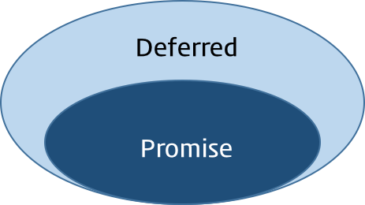
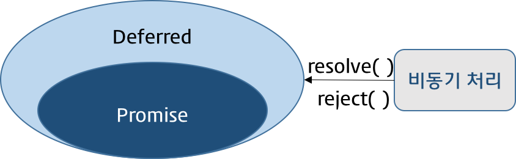
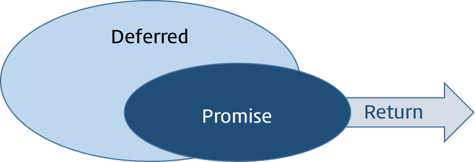

# $.Deferred

jQuery Deferred는 각각의 비동기식 처리에 [Promise](./2019-01-23-promise.md) 객체를 연계하여 그 상태를 전파하는 것이다. 즉, promise를 구현한 jQuery 객체이다.

jQuery Deferred에서 각각의 비동기 처리를 Deferred객체로 wrapping한다. Deferred 객체는 상태를 가지고 있으며, 이는 비동기식 처리의 상태가 변경되는 시점에 특정 함수(`resolve()`, `reject()`)를 호출하여 Deferred 객체에 상태를 부여한다.

| [state()](https://api.jquery.com/deferred.state/) | 설명      |
| ------------------------------------------------- | --------- |
| pending                                           | 처리중    |
| resolved                                          | 처리 성공 |
| rejected                                          | 처리 실패 |

일반적인 처리 순서는 다음과 같다.

1. `$.Deferred()` 로 Deferred객체 생성

   

2. 비동기 처리가 종료되면 Deferred 객체의 `resolve()` or `reject()` 로 Deferred 객체의 state변경

   

3. `promise()`로 Deferred 객체가 가지고 있는 Promise 객체를 반환한다. 반환된 객체는 Deferred 객체의  `resolve()` or `reject()` 를 더 이상 사용할 수 없게되어 비동기 처리 상태를 보장할 수 있게된다.



```js
// Promise 선언
var _deferred = function(param){
    var dfd = $.Deferred(); // 1. Deferred 객체 생성
    
    // 비동기처리
    setTimeout(function(){
        // 2. Deferred객체 state변경
        param ? dfd.resolve("resolved") : dfd.reject(new Error("Error"));
    },2000);
    
    return dfd.promise(); // 3. Promise 객체 return
}

//Promise 실행
_deferred(false)
    .done(function(data){
    	// resolve가 실행된 경우(성공)
    	console.log(data);
	})
    .fail(function(error){
    	// reject가 실행된 경우(실패)
    	console.error(error);
	})
    .always(function(){
    	console.log('always');
	});
```


### $.when()

연속된 복수의 비동기 처리를 **병렬**로 처리할 수 있다.

```js
$.when($.ajax(url),$.ajax(url2))
    .done(function(result, result2){
    	// ..
	})
    .fail(funtion(){
          console.log('rejected');
    });
```

병렬처리 대상인 Promise가 모두 성공하면 `$.when()` 은 resolved Promise를 반환하고 한개라도 실패하면 rejected Promise를 반환한다.

### $.Deferred 의 사용

다음과 같은 경우에 `$.Deferred` 를 사용하면 좋다.

1. 데이터 접근 : 데이터 접근 API들을 `$.Deferred` 로 구현하는 것은 보통 좋은 디자인이다. Deferred API인 `$.when` 과 `Deferred.pipe` 는 비동기 서브쿼리들을 동기화하고 체인으로 연결하는데 매우 강력하다.
2. UI 애니매이션 : `Deferred` 로 애니매이션 함수들을 감싸는 것은 코드의 복잡도를 감소시키고 유연성을 증가시킬 수 있다. (일반적인 wrapper 함수도 큰 도움이 될 수 있다.)
3. UI 컴포넌트 표시 : 애플리케이션이 별도의 UI를 보여줄 필요가 있을 때, Deferred로 캡슐화된 컴포넌트들의 라이프 사이클을 가지는 것은 타이밍을 더 잘 조절할 수 있게 된다.
4. 브라우저 비동기 API : 일반화 목적으로 브라우저 API 호출을 Deferred로 감싸는 것은 좋다.
5. 캐싱

## jqXHR

jQuery의 ajax 관련 함수들은 jQuery XMLHttpRequest(jqXHR) 객체를 반환하는데, 이 객체는 Deferred 객체와 유사하게 동작한다.

```js
var jqxhr = $.ajax('/example')
    .done(function(){
        alert("success");
	})
    .fail(function(){
        alert("fail");
	})
    .always(function(){
        alert("complete");
	});

jqxhr.always(function(){
    alert("second complete");
})
```


## 참조페이지

- [https://www.html5rocks.com/ko/tutorials/async/deferred/#toc-async-with-deferred](https://www.html5rocks.com/ko/tutorials/async/deferred/#toc-async-with-deferred)
- [https://poiemaweb.com/jquery-deferred](https://poiemaweb.com/jquery-deferred)

- [jQuery API](https://api.jquery.com/category/deferred-object/)


