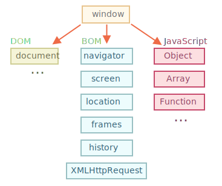

# Object model

자바스크립트를 이용해 브라우저의 객체화된 구성요소들을 제어할 수 있다. 이 객체들은 서로 계층적인 관계로 이루어져있으며 큰틀에서 **BOM**과 **DOM**으로 분류할 수 있다.



## BOM

BOM(Browser Object Model)은 웹브라우저의 창이나 프레임을 추상화하여 프로그래밍적으로 제어할 수 있도록 제공해주는 수단이다. `window` 객체의 프로퍼티와 메소드를 통해 제어할 수 있다. 

### window 객체

window 객체는 DOM을 포함한 브라우저의 창을 나타낸다. 자바스크립트의 모든 객체, 전역 함수, 전역 변수들은 자동으로  window객체의 프로퍼티가 된다. window객체의 메소드는 전역 함수이며, window 객체의 프로퍼티는 전역 변수가 된다. DOM의 요소들도 모두 window객체의 프로퍼티가 된다. ECMAScript의 global 객체는 호스트 환경에 따라 이름이 다르고, 역할이 다르다. 웹브라우저에서 window 객체는 ECMAScript의 전역객체이면서 동시에 웹브라우저의 창이나 프레임을 제어하는 역할을 한다.

### Location 객체

Location 객체는 문서의 주소와 관련된 객체로 window 객체의 프로퍼티이다. URL 관련 정보를 제공해준다.

```js
> location
ancestorOrigins: DOMStringList {length: 0}
assign: ƒ assign()
hash: ""
host: "display.cjmall.com"
hostname: "display.cjmall.com"
href: "http://display.cjmall.com/m/homeTab/main?hmtabMenuId=000002&rPIC=Oclock"
origin: "http://display.cjmall.com"
pathname: "/m/homeTab/main"
port: ""
protocol: "http:"
reload: ƒ reload()
replace: ƒ ()
search: "?hmtabMenuId=000002&rPIC=Oclock"
toString: ƒ toString()
valueOf: ƒ valueOf()
Symbol(Symbol.toPrimitive): undefined
__proto__: Location

```

| Location 객체 속성 |                    |
| ------------------ | ------------------ |
| href               | 웹사이트 전체 주소 |
| protocal           | 프로토콜           |
| hostname           | 호스트명           |
| pathname           | 해당 웹 문서 경로  |
| hash               | 해당 웹문서내 표식 |
|                    |                    |

### Navigator 객체

현 사용하고 있는 웹브라우저의 정보를 제공해주는 객체이다. 주로 호환성 문제를 해결하기 위해 브라우저의 종류, 버전을 파악하는데 사용한다.

```js
Navigator
appCodeName: "Mozilla"
appName: "Netscape"
appVersion: "5.0 (iPhone; CPU iPhone OS 11_0 like Mac OS X) AppleWebKit/604.1.38 (KHTML, like Gecko) Version/11.0 Mobile/15A372 Safari/604.1"
connection: NetworkInformation {onchange: null, effectiveType: "4g", rtt: 50, downlink: 10, saveData: false}
cookieEnabled: true
doNotTrack: null
geolocation: Geolocation {}
hardwareConcurrency: 4
language: "ko-KR"
languages: (4) ["ko-KR", "ko", "en-US", "en"]
maxTouchPoints: 1
mediaCapabilities: MediaCapabilities {}
mediaSession: MediaSession {metadata: null, playbackState: "none"}
mimeTypes: MimeTypeArray {length: 0}
onLine: true
permissions: Permissions {}
platform: "MacIntel"
plugins: PluginArray {length: 0}
product: "Gecko"
productSub: "20030107"
sendBeacon: ƒ sendBeacon()
userActivation: UserActivation {hasBeenActive: true, isActive: true}
userAgent: "Mozilla/5.0 (iPhone; CPU iPhone OS 11_0 like Mac OS X) AppleWebKit/604.1.38 (KHTML, like Gecko) Version/11.0 Mobile/15A372 Safari/604.1"
vendor: "Google Inc."
vendorSub: ""
webkitPersistentStorage: DeprecatedStorageQuota {}
webkitTemporaryStorage: DeprecatedStorageQuota {}
__proto__: Navigator
```

| Navigator 객체 속성 |                                                              |
| ------------------- | ------------------------------------------------------------ |
| appCodeName         | 웹브라우저 코드이름                                          |
| appName             | 웹브라우저명 (IE : Microsoft Internet Explorer, 파이어폭스, 크롬 : Nescape) |
| appVersion          | 웹브라우저 버전                                              |
| language            | 웹브라우저 사용언어                                          |
| platform            | 브라우저가 동작하고 있는 운영체제에 대한 정보                |
| userAgent           | 웹브라우저가 서버에 접속할 때 브라우저의 종류, 버전, 코드이름 등 서버에 전달되는 모든정보 |
| plugins             | 현재 시스템에 설치된 플러그인 정보                           |
| mimeTypes           | 웹브라우저에서 지원하는 MIME 형식에 대한 정보                |
|                     |                                                              |


## DOM

DOM(Document Object Model), 문서객체모델은 HTML문서나 XML문서에 접근하기 위한 일종의 인터페이스이다. 문서 내의 모든 요소의 목적과 특징을 정의하고, 각각의 요소에 접근하는 방법을 제공한다.


- DOM은 웹브라우저의 객체 지향 표현이며, 자바스크립트를 이용해 수정할 수 있다.
- DOM은 브라우저 환경에 따라 다르게 동작할 수 있다.

### DOM 요소 선택

- tag name을 이용한 선택

`getElementsByTagName` : tagname을 이용해 HTML요소 선택

```js
var selectedItem = document.getElementsByTagName("li"); //<li> 요소 선택
for(var i=0;i<selectedItem.length;i++){
  selectedItem.item(i).style.color="red";
}
```

`item()` 메소드는 해당 HTML 객체 집합에서 전달받은 인덱스에 해당하는 요소를 반환한다.

HTML 요소의 style property를 이용하면, 해당 요소의 CSS 스타일을 변경할 수 있다.

- id를 이용한 선택

`getElementById()` : 아이디를 이용하여 HTML 요소를 선택

```js
var selectedItem = document.getElementById("even");
selectedItem.styel.color = "red";
```

이때 해당 아이디를 가지고 있는 요소 중에서 첫 번째 요소 단 하나만을 선택한다. 그러므로 여러 요소를 선택하고 싶을 때는 tagname이나 class와 같은 다른 방법을 사용해야한다.

- Class를 이용한 선택

`getElementByClassName` :  클래스 이름을 이용하여 HTML 요소 선택

```js
var selectedItem = document.getElementByClassName("odd");
for(var i=0;i<selectedItem.length;i++){
  selectedItem.item(i).style.color="red";
}
```

- CSS selector를 이용한 선택

`querySelectorAll() ` :  CSS 선택자(아이디, 클래스, 속성, 속성값 등)를 이용하여 HTML요소 선택

```js
var selectedItem = document.querySelectorAll("li.odd");
for(var i=0;i<selectedItem.length;i++){
  selectedItem.item(i).style.color="red";
}
```

- HTML 객체 집합(object collection)을 이용한 선택

```js
var title = document.title; // <title> 요소를 선택함.

document.write(title);
```


### DOM 요소 내용 변경

DOM을 이용하여 DOM 요소의 내용(content)나 속성 값을 손쉽게 변경할 수 있다.

DOM 요소의 내용을 바꾸는 가장 쉬운 방법은 `innerHTML` property 이용하는 것이다. 또한, DOM 요소의 속성 이름을 이용하면 속성값을 바로 변경할 수 있다.

```js
var str = document.getElementById("text");
str.innerHTML = "문장바꾸기";
```

HTML 요소의 속성 이름을 이용하여 속성값을 변경할 수 있다.

```js
var link = document.getElementById("link");
str.href = "/javascript/intro";
link.innerHTML = "해당 요소의 내용 변경하기";
```


#### [DOM API 바로가기](http://tcpschool.com/ajax/ajax_basic_domApi)

### jQuery

jQuery는 DOM을 내부에 감추고 보다 쉽게 웹페이지를 조작할 수 있도록 돕는 도구

