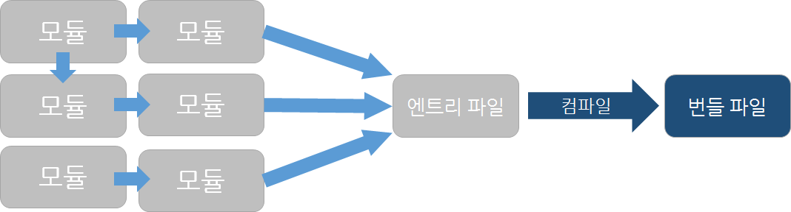

# Webpack

서버에서 처리하는 로직을 JavaScript로 구현하는 부분이 많아지면서 웹 서비스 개발에서 JavaScript로 작성하는 코드 양도 늘어났다.  하나의 파일로 관리하는데는 한계가 생겼으며, 여러개 파일을 브라우저에서 로딩하는 것은 그만큼 비용이 발생하며, 파일간 변수 충돌 위험성도 발생한다.

 [CommonJS](http://www.commonjs.org/)와 [AMD(Asynchronous Module Definition)](https://github.com/amdjs/amdjs-api/wiki/AMD) 스타일의 모듈 시스템을 사용하면 파일별로 모듈을 만들 수 있지만, 모듈로 만든 파일은 바로 웹 페이지에 넣어 브라우저에서 실행할 수 없다. webpack으로 컴파일하여 브라우저에서 실행할 수 있는 형태로 변경할 수 있다.


[webpack](https://webpack.js.org/)이란 현대 JavaScript Application의 Static Module Bundler이다. Webpack이 실행된다면 Dependencies Graph를 통해 필요한 형태의 하나 이상의 Bundle로 생성한다.

> **모듈 번들러**란 여러개의 나누어져 있는 파일들을 하나의 파일로 만들어주는 라이브러리를 말한다. 모듈 번들러 라이브러리에는 webpack, Parcel 등이 있다.
>
> 모듈 번들러는 여러개의 자바스크립트 파일을 하나의 파일로 묶어서 한번의 요청을 통해 가지고 올 수 있게하고, 최신 자바스크립트 문법을 브라우저에서 사용할 수 있게 해준다. 또한 모듈 번들러들은 자바스크립트 코드를 압축하고 최적화 할 수 있기 때문에 로딩 속도를 줄일 수 있다.
>
> 수 많은 자바스크립트 파일이 하나의 파일로 묶인다면, 초기 로딩 속도가 어마어마해질 수 있지만, 모듈 번들러는 이를 해결하기 위해 청크, 캐시, 코드 스플릿 개념을 도입했다.

쉽게 풀어 설명하면 **파일 간의 연관 관계를 파악해 하나의 자바스크립트 파일로 변환해 주는 변환 도구**이다.



**엔트리 파일은 다음 그림과 같이 서로 의존 관계가 있는 다양한 모듈을 사용하는 시작점이 되는 파일**이다. webpack에서 컴파일은 엔트리 파일을 시작으로 의존 관계에 있는 모듈을 엮어서 하나의 번들 파일을 만드는 작업이다. JavaScript를 사용하는 HTML 코드에서는 컴파일 결과로 만들어진 번들파일만 포함하면된다.


다음과 같이 엔트리 파일이 여러개인 경우 각각의 엔트리 파일마다 번들파일이 생성된다.

> Bundle이란?
>
> 소프트웨어 및 일부 하드웨어와 함께 작동하는데 필요한 모든 것을 포함하는 Package이다. 각각의 모듈들에 대해 의존성 관계를 파악하여 하나 또는 여러개의 그룹으로 볼 수 있다.

### 웹팩의 주요 속성

| 속성    | 설명                                                         |
| ------- | ------------------------------------------------------------ |
| entry   | 웹팩으로 빌드(변환)할 대상 파일을 지정하는 속성.<br>entry로 지정한 파일의 내용에는 전체 애플리케이션 로직과 필요 라이브러리를 로딩하는 로직이 들어간다. |
| output  | 웹팩으로 빌드한 결과물의 위치와 파일 이름 등 세부 옵션을 설정하는 속성 |
| loader  | 웹팩으로 빌드할 때 HTML, CSS, PNG 파일 등을 자바스크립트로 변환하기 위해 필요한 설정의 정의하는 속성 |
| plugin  | 웹팩으로 빌드하고 나온 결과물에 대해 추가 기능을 제공하는 속성<br>ex) 결과물의 사이즈를 줄이거나, 결과물을 기타 CSS, HTML 파일로 분리하는 기능 |
| resolve | 웹팩으로 빌드할 때 해당 파일이 어떻게 해석되는지 정의하는 속성<br>ex) 특정 라이브러리를 로딩할 때 버전은 어떤걸로할지, 파일 경로는 어디로 할지 정의 |


### webpack vs (Browsify, Grunt, Gulp)

- 크고 복잡하며 다양한 리소스들이 들어있는 프로젝트에는 webpack을 사용하는 것이 좋다.
- Grunt, Gulp는 오로지 리소스들에 대한 툴로 사용되며 dependency graph에 대한 개념이 없다.
- Browsify는 비슷한 도구이지만 속도면에서 webpack이 더 좋다.

## 실습

#### 모듈 정의

```js
module.exports = { message: 'webpack' };
```

다음과 같이 module.exports 속성에 외부에 배포할 모듈을 전달해 모듈을 정의한다.

#### 모듈 사용

```js
alert(require('./testmodule').message);
```

`testmodule.js` 파일을 `require()` 함수에 경로를 전달함으로써 모듈을 사용할 수 있다.

여러 모듈을 합치거나 중첩해서 모듈을 로딩할 수 있다.

```js
// hello.js
module.exports = 'Hello';
```

```js
// world.js
module.exports = 'World';
```

```js
// greeting.js
var greeting = require('./hello') + require('./world');
module.exports = greeting;
```

hello.js와 world.js를 합친 모듈인 greeting.js를 로딩해 브라우저에서 경고 메세지가 나타나게 구현할 수 있다.

```js
// app.js
alert(require('./greeting'));
```

모듈을 정의하고 모듈을 사용하도록 로딩하는 방법은 어렵지 않다. 다만 **모듈로 만든 파일은 바로 웹 페이지에 넣어 브라우저에서 실행할 수 없다. webpack으로 컴파일해 브라우저에서 실행할 수 있는 형태로 바꿔야한다.**

### webpack 이용하기

#### 설치

```bash
$ npm install webpack -g
```

#### 컴파일

```bash
$ webpack {엔트리 파일 경로} {번들 파일 경로}
$ webpack --watch {엔트리 파일 경로} {번들 파일 경로}
```

`--watch` 옵션을 사용하면 모듈 파일이 변경될 때마다 변경된 모듈을 자동으로 다시 컴파일한다.

#### 모듈의 스코프

컴파일 과정에서 각 모듈은 함수로 감싸진다.

```js
// greeting.js
var greeting = require('./hello.js') + require('./world.js');
module.exports = greeting;
```

여기서 greeting은 전역 변수이지만 webpack으로 모듈이 컴파일 된 후에는 지역 변수가 된다.

#### 설정 파일 사용

CLI(Command Line Interface)로 webpack을 실행해 컴파일할 때 엔트리 파일이 많거나 옵션이 많으면 입력하기가 불편하다. 설정 파일을 만들어 컴파일하면 이러한 불편함을 줄일 수 있다.

```js
// webpack.config.js
module.exports = {  
    context: __dirname + '/app', // 모듈 파일 폴더
    entry: { // 엔트리 파일 목록
        app: './app.js' 
    },
    output: {
        path: __dirname + '/dist', // 번들 파일 폴더
        filename: '[name].bundle.js' // 번들 파일 이름 규칙
    }
}
```

다음과 같이 `webpack.config.js` 파일을 작성해 저장한다. 

```bash
$ webpack
```

간단하게 위와 같이 명령어를 입력하면 컴파일이 실행되며, `--watch` 옵션으로 변경 사항을 자동으로 반영하려 할 때도 다음과 같이 명령어를 입력하면된다.

```bash
$ webpack --watch
```

#### loader

webpack의 loader는 다양한 리소스를 JavaScript에서 바로 사용할 수 있는 형태로 로딩하는 기능이다. loader는 webpack의 특징적인 기능이면서 강력한 도구로 만드는 기능이다.


다음과 같이 loader의 종류에 따라 다양한 형태의 결과를 얻을 수 있다. 

예를 들어, template 라이브러리인 [handlebars](https://handlebarsjs.com/) loader인 [handlebars-loader](https://github.com/pcardune/handlebars-loader) 를 사용하는 방법을 알아볼 것이다.

- handlebars 라이브러리가 설치된 환경에서 진행해야한다.

```bash
$ npm install handlebars-loader
```

handlebars-loader 설치가 완료되면 `webpack.config.js` 파일에 다음과 같이 로더 관련 설정을 추가한다.

```js
// webpack.config.js
module.exports = {  
    ...
    output: {
       ...
    },
    module: {
      loaders: [
        // 적용할 파일의 패턴과 적용할 로더 설정
        {
          test: /\-tmpl.html$/
          loader: 'handlebars'
        }
      ]
    }
}
```

`test-tmpl.html` 파일을 생성해준다.

```html
<div>{{greeting}}</div>
```

`require()` 함수로 템플릿 파일을 로딩한 결과는 `handlebars.compile()` 함수를 거쳐 반환된 결과로, 바로 데이터를 주입해 데이터와 결합된 html 코드를 얻을 수 있다.

```js
var testTmpl = require('./test-tmpl.html');
testTmpl({ greeting: 'Hello World'});
```


### 개발자 도구 연동

```js
// webpack.config.js
module.exports = {
  ...
  devtool: '#inline-source-map'
}
```

webpack을 사용할 때 브라우저에서 실행되는 코드는 webpack으로 컴파일된 코드이다. webpack의 소스 맵 설정을 사요하면 컴파일된 파일에서도 원래 파일 구조를 확인할 수 있다. 브라우저에서 웹 페이지를 열고 개발자 도구를 실행하면 코드를 작성할 대 파일구조를 볼 수 있고, 실제 작성한 코드에 접근할 수 있다. (**webpack://**) 도메인 아래에 모듈을 구성하는 파일 구조가 나타난다.

## 참조 페이지

- [웹팩의 기본 개념](http://jeonghwan-kim.github.io/js/2017/05/15/webpack.html)
- [Webpack이란?](https://nesoy.github.io/articles/2019-02/Webpack)
- [JavaScript 모듈화 도구, webpack](https://d2.naver.com/helloworld/0239818)

